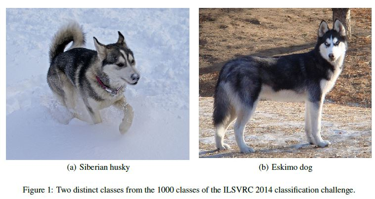
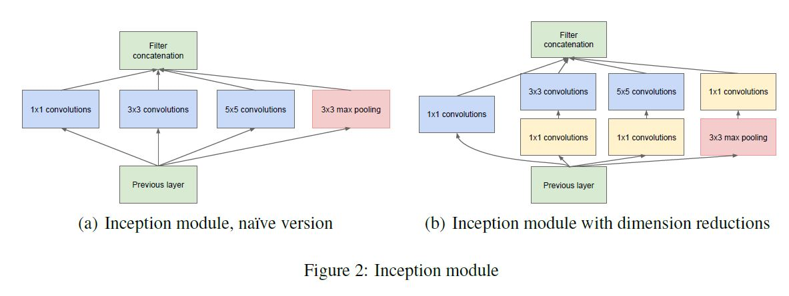
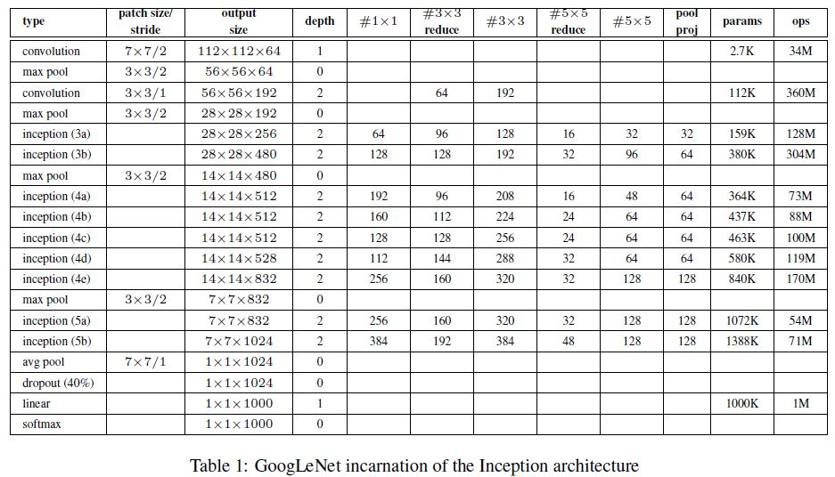
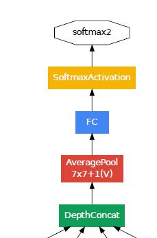
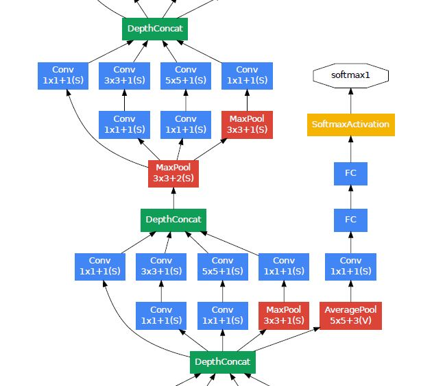
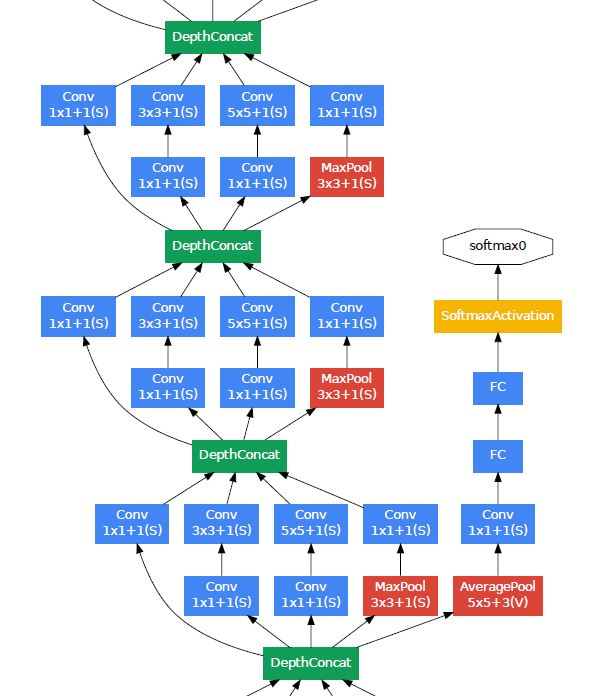
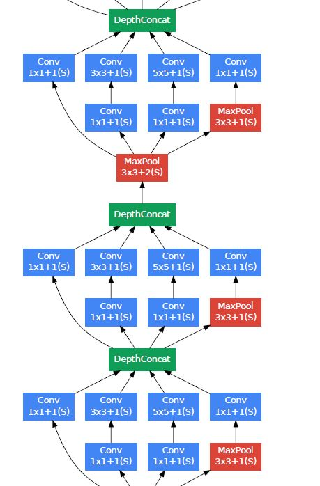
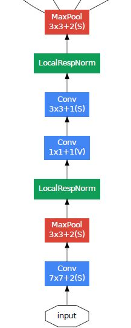
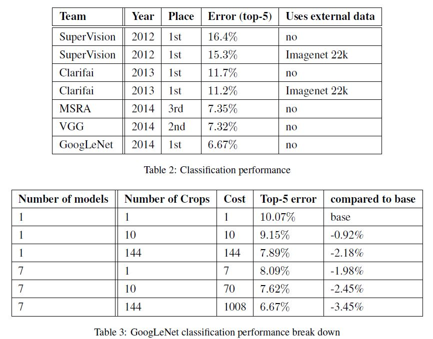
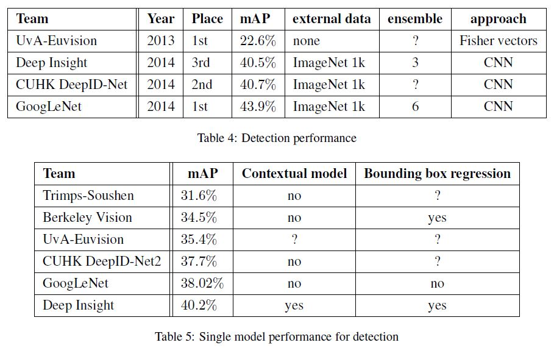

# Going deeper with convolutions

Christian Szegedy(Google Inc.), Wei Liu(University of North Carolina, Chapel Hill), 

Yangqing Jia(Google Inc.), Pierre Sermanet(Google Inc.), Scott Reed(University of Michigan), 

Dragomir Anguelov(Google Inc.), Dumitru Erhan(Google Inc.), Vincent Vanhoucke(Google Inc.),

Andrew Rabinovich(Google Inc.)

## Abstract

저자들은 2014년 ImageNet Large-Scale Visual Recognition Challenge 2014(ILSVRC14)에서 객체 분류 및 탐지 분야에 최공 성능을 보인 Inception이라는 Deep CNN 아키텍처를 제안했다. 아키텍처를 신중하게 디자인해서 컴퓨터가 계산하는 양에 큰 부담을 주지 않으면서 아키텍처의 깊이와 넓이를 늘리는 것을 가능하게 했다. ILSVRC14에서 선보인 구현체의 이름이 GoogLeNet인데 22개의 계층을 가지고 있다.

## Introduction

저자들이 주장하길 CNN 덕분에 객체 인식과 탐지 분야에 상당한 진보가 일어났다고 한다. 그런데 이것은 단순히 더 강한 컴퓨팅 파워나 더 많아진 데이터셋 때문이 아니고 주로 네트워크 아키텍처를 개선시키는 아이디어 혹은 알고리즘 같은 것들 때문이라고 한다. 새로운 데이터라고 할 게 없는게 ILSVRC 2014에서 분류나 탐지에 쓰인 데이터가 같은 데이터라고 한다. 저자들이 2014에 제출한 GoogLeNet은 2년전에 Krizhevsky 등이 우승을 차지 했을 때의 구현체보다 12배 적은 모델 파라미터를 사용하면서 더 정확하다고 한다. 특히 객체 탐지에서 얻은 결과는 모델이나 앙상블의 활용 덕분이 아니라 Girshick 등에 의해 고안된 R-CNN 알고리즘 덕분이라고 한다. 

저자들이 말하는 이 연구의 중요점은 모바일이나 임베디드에서의 효율성 - 전력이나 메모리 사용량 같은 -에서 중요성을 가지지 정확도를 좀 더 높이거나 하는데 있는게 아니라고 한다. 가장 주안점을 뒀던 점을 뒀던 부분은 추론 시에 곱하기-더하기 연산을 1.5 billion만큼으로 유지해서 단순히 학술적인 의미만 남기는 것이 아니라 실제 필드에서도 사용될 수 있도록 한 것이라고 한다. 

Inception이라는 이름은 영화 인셉션의 명대사인 "we need to go deeper"와 Lin 등이 제안했던 Network in network에서부터 착안된 것이라고 한다. 여기서 deep이라는 말은 Inception module에서 보여준 wide하게 용량을 늘리는 부분과 단순히 네트워크의 depth를 늘리는 것, 두 가지 관점이 담겨 있다. 

## Related Work

LeNet5는 표준적인 구조 양상을 띄고 있다. 컨볼루션 계층이 쌓여 있고 선택적으로 Contrast normalization(우리가 흔히 하는 평균을 0, 분산이 1인 정규분포를 따르는)나 Max pooling과, 완전 연결 계층들이 그 위에 쌓여 있다. 이런 디자인이 MNIST, CIFAR 혹은 ImageNet 분류 문제에서 최고의 성적을 냈다. 특히 ImageNet 같은 거대한 데이터셋에서는 계층의 숫자나 계층 자체에 대한 크기를 늘리면서 Dropout 같은 기법으로 과적합 문제를 해결하고는 했다고 한다. 

Max pooling 계층 때문에 공간 정보의 손실이 야기될 수 있다는 염려에도 불구하고 Krizhevsky 등의 Advances in Neural Information Processing Systems와 같은 CNN 아키텍처가 객체 위치 추정, 객체 탐지, 인간 포즈 추정 같은 분야에 성공적으로 적용되었다. Serre 등은 뇌과학자의 영장류 시각 피질 모델에 영감을 받아서, Inception 모듈과 유사하게 다양한 크기의 객체를 다루기 위해 각기 다른 크기의, 학습을 하지 않는 Gabor 필터들을 사용했다. 그러나 Inception 모듈은 전자와 다르게 학습이 가능하고 전체 네트워크에서 한 번만 등장하는 것이 아니라, 여러번 쓰여서 22 계층의 딥러닝 모델을 이룬다. 

Lin 등에 의해서 제안된 Network-in-Network에서는 신경망 네트워크의 표현력을 증대시키는데 초점을 맞췄다. 이걸 CNN에 적용할 때, 1x1 컨볼루션 계층과 ReLU를 적용한 방법과 동일하게 볼 수 있는데 이렇게 하면 CNN 파이프라인에 쉽게 합쳐질 수 있었다. 저자들이 말하는 1x1 컨볼루션의 두 가지 목적이 있는데 가장 주요한 이유는 계산상의 병목 현상-이 현상 때문에 네트워크의 크기가 제한될 수 있다-을 제거하기 위함이다. 이 연산으로 단순히 깊이를 늘리는것 뿐만 아니라 아주 약간의 성능 저하를 감수하고 넓이를 늘릴 수 있다. 

Girshick에 의해서 고안된 Regions with Convolutional Neural Networks는 전체적인 탐지 과정을 두 분으로 나눈다. 첫 번째로 카테고리에 상관 없이 객체가 있을법한 영역법한 픽셀 그룹과 색깔 같은 저차원의 신호들을 이용하는 것이고 두 번째로 이렇게 찾아낸 위치의 객체들의 카테고리를 확인하기 위한 CNN 분류기를 사용하는 것이다. 저자들도 비슷한 파이프라인은 탐지 작업을 위해서 차용했다. 

## Motivation and High Level Considerations

네트워크의 크기나 넓이를 늘리는 것은 두 가지 주요한 단점이 있다. 

큰 사이즈의 네트워크는 더 많은 모델 파라미터를 보유하게 되고 과적합하는 경향을 보인다. 특히 레이블링된 훈련셋의 숫자가 적을 때 더 그렇다. 이 점은 네트워크 성능에서 주요한 병목점이 될 수 있다. 아래 그림과 같이 레이블링을 하기 위해서 전문가가 필요한 상황에서는 레이블링을 하는 과정이 힘들고 번거로운 작업이 될 수 있다.

두번째로 일정하게 증가하는 네트워크 사이즈에 반해 컴퓨팅 자원의 사용이 급격하게 증가한다는 점이다. 예를 들어서 두 컨볼루션 계층이 연결되어 있다면, 필터의 숫자는 일정하게 증가하는데, 이를 연산하는 과정은 거의 두 배로 증가한다. 만약에 추가된 부분이 비효율적으로 사용된다면(대부분의 가중치가 0으로 수렴한다던지) 많은 잘못된 연산으로 낭비되고 있는 것이다. 그러므로 현업에서는 컴퓨팅 예산이 한정되어 있고 결과를 개선하는게 목적이라 할지라도 무분별하게 네트워크의 사이즈를 늘리는 것에 컴퓨팅 자원을 효율적으로 분배하는 것이 필요하다. 

위 두 가지 사항을 해결하는 근본적인 방법은 최종적으로 계층의 뉴런을 완전 연결하는 것에서 드문 드문 연결하는 것으로 바꾸는 것이다. Arora 등의 획기적인 성과로 인해 이런 방법이 확고한 이론적 뒷받침을 확보할 수 있었다. 이들의 연구 결과가 암시하는 바는 데이터 셋의 확률 분포가 아주 크고 딥하지만 드물게 연결되어 있는 신경망 네트워크에 의해서 표현될 수 있다면 마지막 계층의 활성화 함수의 상관 관계 통계 수치를 분석하고 높은 연관성이 있는 출력 뉴런 끼리 클러스터링을 함으로서 계층 마다 최적의 토폴로지를 구축할 수 있다는 것이다. 이 주장은 엄격한 수학적 증명이 필요하긴 하나, Hebbian 원칙처럼 - neurons that fire together, wire together - 그렇게 엄격하지 않아도 실제로 적용가능 한다는 점을 시사한다. 

균일하지 않은 희소 데이터 행렬에서의 숫자 연산에 대해서 당시에 컴퓨팅 인프라들은 비효율적이었다. 산술 연산은 100배 가까이 줄어들었을지 몰라도 Lookup에 의한 오버헤드나 캐시 미스가 지배적이므로 희소 행렬로 전환하는 것이 효용이 없어진다. 이런 격차(Dense vs Sparse)는 점점 더 벌어진다. 왜냐하면 CPU나 GPU 하드웨어의 세부사항을 이용하여 만든, 극도로 빠른 밀집 데이터 곱셉을 가능하게 하는, 점점 개선되고 튜닝되는 숫자 관련 라이브러리들 때문이다. 그리고 균일하지 않은 희소 모델은 좀 더 세련된 엔지니어링과 컴퓨팅 인프라를 필요로 한다. 대부분의 비전 머신러닝 시스템들은 컨볼루션의 장점을 활용해 공간과 관련된 도메인에서 희소성을 이용한다. 하지만 컨볼루션 또한 이전 계층에서의, 밀집 연결된 패치들의 집합으로 구현된다. ConvNet이 원래 학습 방법을 개선하고 대칭성을 깨트리기 위해 랜덤한 희소 연결 테이블을 사용했는데 이런 추세가 병렬 컴퓨팅을 최적화 하기 위해서 다시 완전 연결로 되돌아왔다. 구조의 균일함과 많은 필터 큰 배치 사이즈가 효율적인 밀집 연산을 활용 가능하게 한다. 

U¨mit V. C¸ atalyu¨rek이 연구한 On two-dimensional sparse matrix partitioning: Models, methods, and a recipe과 같은 희소 행렬 계산에 관한 문헌들에 의하면 희소 행렬을 상대적으로 밀집된 행렬로 클러스터링하면 희소 행렬 곱셈에서 괜찮은 성능을 낸다. 

Inception 아키텍처는 컴퓨터 비전 네트워크를 위한, Sanjeev Arora 등의 Provable bounds for learning some deep representations에서 암시하고 있는 희소한 구조를 근사하고, 밀집되어 있고 손쉽게 이용가능한 요소들에 의한 가설의 결과를 다뤄보는 네트워크 위상 구축 알고리즘의 가설 결과를 추정하는 첫 번째 저자의 케이스 스터디이다. 뭔가 추측에 근거한 일이긴 했지만 두번정도 정확한 토폴로지를 선택하고 프로세싱을 했을 때, Min Lin 등의 Network in network에 근거한 참조 아키텍처에 대해 약간의 시사점을 얻을 수 있었다고 한다. 그 후에 LR과 하이퍼 파라미터를 튜닝하고 훈련 방법을 새선한 후에 저자들은 Inception 아키텍처가 Dumitru Erhan등의 Scalable object detection using deep neural networks와 Ross B. Girshick 등의 Rich feature hierarchies for accurate object detection and semantic segmentation에서의 위치 추정과 객체 탐지의 기본 네트워크라는 맥락에서 특히 유용하다는 것을 확인했다. 대부분의 실험했던 아키텍처가 철저하게 테스트되었는데 최소한 지엽적인 최적화까지는 달성했다. 

## Architectural Details

Inception 아키텍처의 주요 아이디어는 어떻게 컨볼루션 비전 네트워크 안의 최적의 Local sparse 구조가 손쉽게 이용가능한 Dense 요소들에 의해 근사화 되고 다뤄질 수 있느냐 하는 것이다. 네트워크는 컨볼루션 블럭으로 구축되는데 최적의 로컬 구성물을 찾아서 공간적으로 반복하는 것이 필요하다.  Arora 등은 마지막 계층의 상관 관계 통계치를 분석하고 강한 상관 관계를 갖는 유닛들의 그룹으로 이 것들을 클러스터링 하는 계층 간의 구성 방법을 제시했다. 이런 클러스터들은 다음 계층의 유닛을 형성하고 이전 계층의 유닛에 연결되었다. 저자들은 이들이 제시한 방법에서 이전 계층의 각각의 유닛들이 입력 이미지의 어떤 지역에 대응되고 이 유닛들이 필터들로 그룹화된다고 생각했다. 즉, 입력에 가까운 층들의, 어느정도 관련성이 있는 유닛들은 이미지의 한 부분과 관련성이 깊은 것이다. 결국 어떤 한 지역과 연관성이 깊은 많은 클러스터이 만들어지고 이 클러스터들이 다음 계층의 1x1 컨볼루션에 의해 다뤄질 수 있다는 것이다. 그러나 좀 더 큰 패치들에 대한 컨볼루션에 의해 커버 될 수 있는 얼마 안되는 수의 공간적으로 분산된 클러스가 있을 것으로 예상될 수 있고 더 큰 영역 및 더 큰 영역에 대한 패치 수도 감소할 수 있다. 패치 정렬 문제를 피하기 위해서 저자들은 1x1, 3x3, 5x5 크기의 필터 사이즈만 사용했다. 각각 이런 필터들의 컨볼루션을 거치고 나서 출력이 합쳐져 다음 계층의 입력으로 들어가게 된다. 또 당시에는 Max pooling이 CNN에서 좋은 성능을 보여줬기 때문에 필터 말고도 Max pooling 연산을 따로 진행하여 출력을 합쳤다(아래 그림에서 a).

 

 Inception 모듈들이 서로가 서로의 위에 쌓임으로서 이것들의 출력 상관 통계는 다양해진다. 고수준의 추상적인 특징들이 고차원의 계층에서 잡아질수록 이 특징들의 공간적 농도(특징 맵 사이즈)가 줄어들게 되는데 고차원의 계층으로 갈수록 3x3, 5x5의 컨볼루션의 비중은 증가하게 된다.

한가지 a와 같은 버전의 문제점은 적은수의 5x5 컨볼루션이라 하더라도 나중에는 많은 수의 필터 때문에 연산이 힘들어진다는 것이다. 이런 문제는 풀링 계층이 추가되면서 더 심해진다. 출력의 필터 숫자는 필터들과 풀링 연산을 진행하고 난 후의 필터 숫자들의 총 합이 된다. 이렇게 되면 계층이 진행될수록 점점 출력 맵의 숫자가 증가하게 된다.  이런 아키텍처가 최적의 sparse structre를 커버할지 몰라도 몇 계층 못가서 이런 비효율성 때문에 컴퓨팅 연산량이 폭발해버릴 것이다. 

위와 같은 문제때문에 아키텍처에 적용할 두번째 아이디어를 도출했다. 컴퓨팅 연산이 너무 많아 질 때 이를 줄이기 위해서 차원 축소와 투영을 적용하는 것이다. 낮은 차원의 임베딩이라 할지라도 상대적으로 큰 이미지 패치에 대한 많은 정보를 담고 있을 수 있다. 그러나 임베딩은 빽빽하고 압축되어 있는 정보를 표현하고 이런 정보는 모델링 하기 어렵다. 저자들은 최대한 이런 표현들을 희소하게 연결하고 이 표현들이 한꺼번에 종합되야할 때만 신호들을 압축하기를 원했다. 이 말은 1x1 컨볼루션이 3x3, 5x5 컨볼루션 전에 차원 축소를 하기 위해서 사용된다는 뜻이다. 또 차원 축소 뿐만 아니라 ReLU 활성화 함수를 사용하는 이중적인 목적도 있었다(위 그림에서 b).

Inception 네트워크는 위와 같은 모듈이 쌓이고 쌓인 채로 구성되어 있고 가끔 Stride 2의 Max pooling 연산이 해상도를 반으로 줄이기 위해서 사용되었다. 기술적인 이유(훈련 간의 메모리 효율성 때문에)로 Inception 모듈을 고차원 계층에서만 사용하고 저차원 계층에서는 전통적인 컨볼루션으로 쌓았다. 

차원 축소 말고 다른 이점은 여러 크기의 필터를 사용하여 다양한 크기의 이미지를 처리하고 통합함으로서 다음 계층이 동시에 다른 크기의 특징을 추상화할 수 있게 한다는 점이다. 

Inception 모듈을 사용한 네트워크는 그렇지 않은 네트워크보다 정확도는 약간 떨어지나 2-3배 정도 속도가 더 빨랐다. 물론 주의 깊게 네트워크를 디자인하는 것이 필요하다. 

## GoogLeNet

GoogLeNet은 ILSVRC14대회에서 제출한 저자들의 Inception 아키텍처 구현체 이름이다.

Inception 모듈을 포함 모든 컨볼루션에는 ReLU 활성화 함수를 사용했다. 네트워크의 입력단에서는 224x224 크기의 RGB 채널에 mean subtraction을 적용한 이미지를 입력으로 받았다. #nxn은 nxn 필터를 적용한 컨볼루션 연산을 하기 전에 차원 축소를 위해서 진행했던 1x1 컨볼루션의 필터의 숫자이다. Inception 모듈의 Max pooling 연산을 하고 나서 했던 1x1 컨볼루션 연산의 필터의 숫자는 pool proj에 나와 있다. 

네트워크는 제한된 컴퓨팅 자원 환경을 갖춘 장비들, 특히 메모리 크기가 작은 장비들에서 추론이 가능하도록 효율성과 실용성을 고려하여 디자인되었다.  학습 가능한 파라미터가 있는 계층의 숫자가 22개이고 풀링 계층까지 합하면 27 계층이다. 네트워크 안의 총 계층의 숫자는 100개이다. 다만 네트워크의 계층의 숫자는 사용되는 머신러닝 인프라 시스템에 따라 달라질 수 있다. Average pooling을 사용하는 이유는 편의상 다른 레이블 셋에도 쉽게 이 네트워크를 미세조정하기 위함이다. 저자들은 Ap를 도입하는 것이 큰 부작용이 있을것이라고는 생각하지 않았다. Fc를 Ap로 바꿨을 때 Top-1 정확도가 0.6%정도 상승했다. 하지만 Ap로 바꿔도 Dropout은 제거할 수 없었다. 

네트워크의 용량이 커지면서 모든 계층으로 역전파를 하는 것에 대한 이슈 사항이 있었다. 이 대회에 제출했던 다른, 얕은 계층의 네트워크 중에 강한 성능을 보였던 네트워크에서 자자들이 얻었던 하나의 통찰은 네트워크의 중간 계층에서 만들어지는 특징들이 각자 특징이 있어야 한다는 것이었다. 그래서 GoogLeNet의 중간 계층에 추가적으로 여분의 분류기를 연결함으로서 이 분류기 부근에서 차별성 있는 특징들이 만들어지도록 하고 역전파 시에 경사 신호를 증가시키고 추가적인 규제를 추가했다. 4a와 4b Inception 모듈 출력 부분에 이런 추가적인 분류기들이 작은 컨볼루션 네트워크의 형태를 띄며 연결되었다. 훈련시에는 이 네트워크들에서의 손실이 0.3의 가중치 정도로 총 네트워크의 손실에 더해졌다. 추론시에는 이 분류기들은 버려졌다. 

위에서의 여분의 분류기를 포함한 추가적인 네트워크의 정확한 구조는 다음과 같다.

- Average pooling 레이어에서의 5x5 필터 크기와 stride3은 4a의 출력 크기를 4x4x512로 4b의 크기를 4x4x528로 만들었다.
- 1x1크기의 128개의 필터들이 차원 축소를 위해서 사용되었고 ReLU 활성화 함수가 사용되었다.
- 1024개의 유닛을 가진 Fc와 ReLU 활성화 함수가 사용되었다.
- 70%의 유닛을 버리는 Dropout 계층이 사용되었다.
- 훈련시에 1000개의 클래스를 분류하는 softmax 함수가 적용된 분류기가 사용되었는데 추론시에는 삭제되었다. 

|  |
| :-----------------------------------------------: |
|  |
|  |
|  |
|  |

## Training Methodology

전체적인 네트워크는 데이터 병렬 처리를 이용하는 DistBlief 분산 머신러닝 시스템을 사용하여 훈련되었다.  CPU 기반을 구현으로 했으나 GPU로 구현할 경우 일주일 내에 몇 개의  GPU로 훈련을 마칠 수 있다고 한다. 관건은 메모리 용량이다.  훈련 간에 비동기적인 Sgd에 모멘템 0.9, 8 에포크 마다 LR이 4%씩 감소한다. 추론 시에는 Polyak averaging이 최종 모델을 만들때 사용된다. 

대회가 진행되면서 이미지 샘플링을 하는 방법이 바뀌고 훈련과 관련된 여러가지 옵션, Dropout, LR의 하이퍼 파라미터 변경 등이 바뀌었기 때문에 가장 효율적인 방법으로 네트워크를 훈련하는 가이드를 제공하기는 어렵다고 한다.  Andrew G. Howard의 Some improvements on deep convolutional neural network based image classification에 영감을 받아서 어떤 모델은 상대적으로 작은 크기의 crop에서 다른 모델은 더 큰 crop에서 하는 방식으로 훈련되었다고 한다. 대회가 끝나고 이미지의 다양한 크기의 패치를 샘플링 하는 방법 중에 가장 효과적이었다고 하는 것은 이미지 크기 8~100%가 고르게 분포되어 있고 종횡비를 3/4 \~ 4/3에서 랜덤하게 선택하는 방법이라고 한다.  또 광도 왜곡을 적용해서 훈련 하는 것이 과적합을 해결하는데 어느정도 도움이 된다고 한다. 하이퍼 파라미터 변경에 랜덤한 보간법(Bilinear, area, nearest neighbor and cubic 을 동일 확률로)을 사용했기 때문에 저자들이 어떤 옵션이 최종 결과에 긍정적으로 영향을 주었는지 확실하게 말하기 어렵다고 한다. 

## ILSVRC 2014 Classification Challenge Setup and Results

ILSVRC 2014 분류 문제는 1000개의 카테고리 중 하나로 이미지를 분류하는 문제로 1.2 million 훈련 이미지, 50,000 검증, 100,000 이미지들이 테스트를 위해 존재한다. Top-1, Top-5 accuracy rate가 평가 척도이다. 

GoogLeNet의 경우 훈련을 위해서 특별히 사용한 외부 데이터는 없고 테스트 시에 높은 성능을 끌어 내기 위해서 몇가지 기술을 차용했다.

- 7가지 버전을 독립적으로 훈련시켰고, 이 버전들은 앙상블하여 예측을 수행했다. 훈련시 초기화 해야할 사항은 똑같은 설정으로 초기화하였고 LR 정책도 똑같이 설정했다. 차이점은 데이터를 샘플링하는 방법이다. 
- 테스트 시에 이미지 크롭을 할 때 4가지 크기로 진행했다. 넓이든 높이든 짧은 쪽을 기준으로 256, 288, 320, 352인 이미지를 이에 맞게 재조정하고, 가로가 넓은 이미지는 왼쪽, 가운데, 오른쪽 부분을 취하고 세로가 넓은 이미지는 위, 가운데, 아래를 취했다. 이렇게 취한 패치에 대해서 모서리와 가운데의 224x224 크기의 패치를 취했다. 그렇게 해서 이미지 당 총 4x3x6x2 = 144개의 패치를 만들었다. 
- 각 분류기의 결과의 여러 크롭된 패치들의 Softmax 확률을 평균내어 최종적으로 예측이 만들어졌다. 실험 시에 검증 데이터에 대해서, 크롭된 패치들에 Max pooling 적용하고 분류기별로 평균내기 같은 방법들을 사용해봤으나 단순 평균보다 오히려 성능이 안 좋았다. 

## ILSVRC 2014 Detection Challenge Setup and Results

ILSVRC 탐지 문제는 이미지 안에 200개의 클래스에 속해있는 객체 주변에 바운딩 박스를 만드는 것이다. 바운딩 박스가 정답과 50%이상 겹친다면 올바른 예측으로 판단된다(Jaccard index = IOU). 그 외의 박스는 false positive로 판단된다. 분류 문제와는 다르게 각 이미지는 객체가 많거나 없을 수 있고 크기가 큰 것부터 작은 것까지 다양하다. 결과는 mean average precision(mAP)로 나타난다. 

접근하는 방식은 R-CNN과 유사하지만 Inception 모듈이 지역 분류기 역할을 한다는 점에서 R-CNN보다 확대되었다고 볼 수 있다. 추가적으로 지역 후보 생성 단계에서 Selective Search와 multi-box 예측법을 결합한 방법이 바운딩 박스 재현율을 높이기 위해 사용되었다. false positive의 숫자를 줄이기 위해서 픽셀 그룹(superpixel) 크기를 두 배로 증가시켰다. 이렇게 함으로서 Selective Search 알고리즘을 통해 들어오는 지역 후보가 반으로 줄어든다. 또 multi-box를 통해 도출된 결과에서 200개의 지역 후보를 더하고(R-CNN에서서 사용되는 총 지역 후보의 60%정도의 양) coverage를 92%에서 93%로 늘린다. 그래서 증가된 coverage와 지역 후보의 숫자를 줄이는 것의 총체적인 효과는 단일 모델의 경우에 대해서 1%의 mAP 상승이다. 그리고 각 지역을 분류할때 ConvNets 6개의 앙상블을 사용했는데 정확도가 40%에서 43.9%로 증가했다. 이 연구에서는 시간이 부족하여 R-CNN과는 다르게 바운딩 박스 회귀를 적용하지 않았다. 

## Conclusions

이 연구에서는 Dense  building blocks으로 예상되는 최적의 sparse structure를 근사하는 것이 컴퓨터 비전을 위한 신경망을 개선시키는 실현 가능한 방법임을 보였다. 이 방법의 장점은 상대적으로 얇고 좁은 네트워크와 비교했을때 필요한 컴퓨팅 연산이 조금 증가하면서 결과적으로 상당한 질적 개선을 보였다는 것이다. 또 저자들의 탐지 작업에서는 context를 활용하거나 바운딩 박스 회귀 없이도 경쟁력있다는 것을 보였고 이것은 Inception 아키텍처의 강점에 대한 반증을 보인것과 같다.  저자들의 네트워크와 비슷한 용량이지만 훨씬 무거운 네트워크로도 유사한 결과를 얻을 수 있긴하지만 sparse 아키텍처로 연구 방향을 선회하는 것이 실현 가능하고 유용하다는 것을 보였다. 
