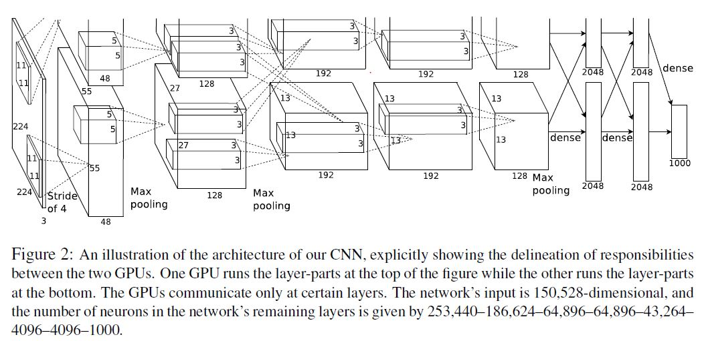
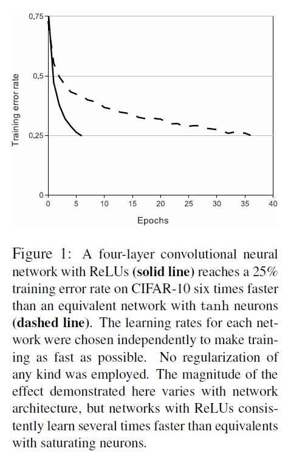
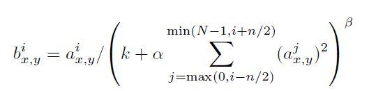
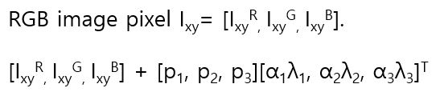
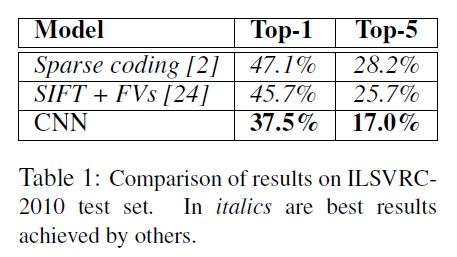
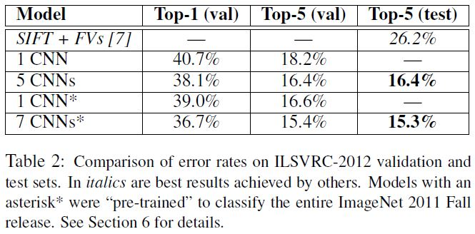
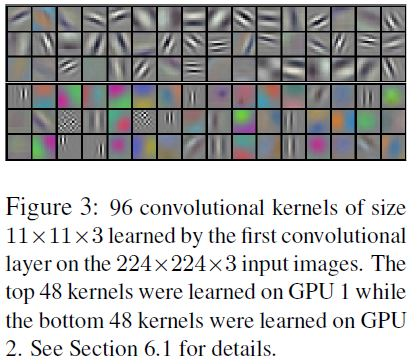
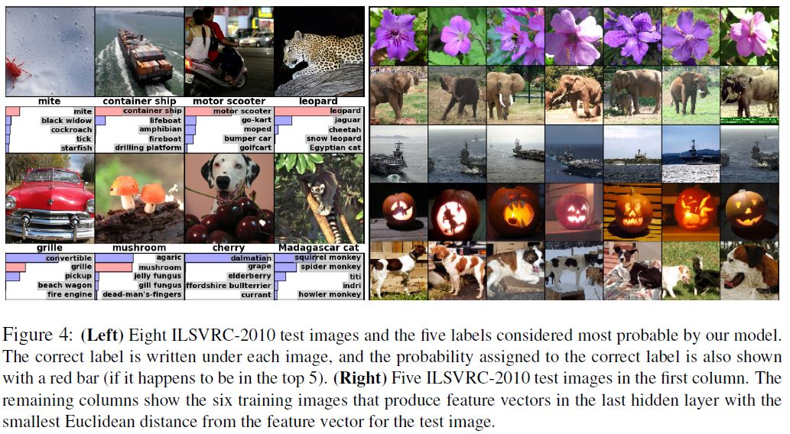

# ImageNet Classification with Deep Convolutional Neural Networks

Alex Krizhevsky(University of Toronto), Ilya Sutskever(University of Toronto),

Geoffrey E. Hinton(University of Toronto)

## Abstract

이 글의 저자들은 컨볼루션 신경망 네트워크를 당시 나름대로 깊고 크게 만들어서 ImageNet LSVRC-2010의 이미지 데이터를 분류하는 작업을 실시했다. 이 데이터는 1000개의 각기 다른 클래스에 1.2 million의 고 해상도 이미지들이었다.  테스트 데이터에서 Top-1과 Top-5의 Error rate이 37.5%, 17.0%로 당시 최고의 성능을 보여줬다. 신경망 네트워크의 경우 총 60 million의 모델 파라미터와 650,000개의 뉴런으로 구성되어 있고 이는 5개의 컨볼루션 계층(그 중에 몇개의 층은 Max-pooling 계층이 붙어 있다)과 3개의 완전 연결 계층 안에 들어 있으며, 마지막에는 1000가지 클래스를 분류할 수 있도록 Softmax 연산을 한다. 훈련을 더 빠르게 하기 위해서 non-saturating(Saturating이란 후술하겠지만 activation function의 변화량이 0이라서 역전파시에 업데이트가 되지 않는 현상을 말한다) 뉴런을 사용했고 컨볼루션 연산을 위해서 효율적인 GPU 아키텍처를 구현했다. 과적합 정도를 줄이기 위해서 Dropout이라는 규제 기법을 사용했다. ILSVRC-2012 대회에서는 이 모델을 변형하여 Top-5 테스트 Error rate 15.3%을 달성하여 우승했는데 준 우승의 Error rate는 26.2%였다. 

## Introduction

저자들은 서론에서는 객체 인식을 하는데 있어서 머신러닝 방법들이 필수가 되고 있다고 주장하면서 이를 위해서 데이터셋을 많이 모으고 강력한 모델(백본 네트워크)을 사용하고 과적합을 방지하기 위한 기술들을 사용했다고 하고 있다. 그러면서 단순한 인식은 레이블된 데이터의 수가 적어도 잘 동작할 수 있다고 했다. 그런데 실제 상황은 이와 다르다고 한다. 여러가지 변수(조명, 이미지에서 객체의 위치, 채도 등) 때문에 성능을 개선하려면 많은 데이터가 필요하다. 

- 상대적으로 적은 수의 데이터 - NORB, Caltech-101/256, and CIFAR-10/100, MNIST
- 위보다는 더 많은 수의 데이터 - LabelMe, ImageNet

수백만장의 이미지 안의 객체를 인식하려면 그에 걸맞는 큰 용량의 모델이 필요하다. 그런데 객체 인식의 엄청난 복잡성 때문에 ImageNet 데이터만 해도 쉽지 않은 일이다. 이를 해결하기 위한 여러가지 방법 중 하나로 CNN이 있다. CNN은 깊이 혹은 넓이를 조절해서 모델의 용량을 조절할 수 있고 실사 이미지에 대해서 강력하고 잘 동작한다.  그래서 같은 크기의 표준적인 순전파 신경망과 비교했을 때 훨씬 적은 노드 간의 연결과 파라미터 숫자로 모델을 쉽게 훈련시킬 수 있고 이론적으로 최고 성능은 아주 약간 전자에 비해서 떨어진다. 이런 효율성에도 불과하고 원래 컨볼루션 연산은 고 해상도 이미지에 적용하기에는 너무 무겁다. 다행히 2D 컨볼루션 연산에 최적화된 GPU 아키텍처 구현 방법이 있어서 아주 고 해상도의 이미지를 다루는 고중량의 CNN을 충분히 이용할 수 있었다. 그리고 ImageNet에는 큰 과적합없이 훈련할 수 있을만큼 충분한 레이블 된 이미지들이 있다. 

저자들이 주장하는 이 논문이 기여한 바는 다음과 같다 : 

- 당시에는 크다고 할 수 있는 크기의 CNN을 통해서 ISVRC-2010, 2012 대회에서 ImageNet 데이터셋으로 가장 좋은 결과를 도출했다. 

- CNN에 필요한 여러 연산들을 위한, 고도로 최적화된 GPU 이용 방법을 구현하여 공개했다. 

  [Google Code - cuda-convnet](https://code.google.com/archive/p/cuda-convnet/)

- Section 3에서 서술한, 성능을 끌어올리고 훈련 시간을 단축시키는데 도움이 되는, 당시에는 새롭게 도입된 기법들
- Section 4에서 서술한, 많은 양의 데이터와 큰 용량의 모델에서 심각하게 대두되는 과적합을 방지하기위한 기술들
- 5개의 컨볼루션 계층과 3개의 계층으로 구성되어 있는 아키텍처. 여기서 컨볼루션 계층을 하나라도 제거 했을 때 성능 저하를 불러옴.

서론에서 끝으로 네트워크의 사이즈는 GPU의 가용한 메모리 용량과 훈련을 진행하고자 하는 시간에 달렸다고 하면서 이 연구에서는 GTX 580 3GB GPU 두개로 5\~6일을 훈련시켰다고 했다. 이들이 주장하길 미래에 더 많은 데이터셋과 더 빠른 GPU들이 있다면 저자들이 제시한 이 방법론이 더 개선할 여지가 있다고 했다. 

## The Dataset

 ImageNet 데이터셋은 대략 22,000개의 클래스에 15 million의 고해상도 이미지들이 속해 있는 형태로 구성되어 있다. 이 이미지들은 웹에서 수집되거나 Amazon의 Mechanical Turk 크라우 소싱 툴로 사람에 의해 직접 레이블링 되었다. 2010년부터 Pascal Visual Object Challenge의 일환으로 매해 ImageNet Large-Scale Visual Recognition Challenge(ILSVRC)라고 하는 대회가 개최되었다. ILSVRC에서는 ImageNet 중의 일부 데이터를 사용했는데 1,000개의 카테고리별로 1,000장의 이미지가 사용되었다. 총, 1.2 million 훈련 이미지와 50,000의 검증 이미지 그리고 150,000의 테스트 이미지가 사용되었다. 

ILSVRC-2010은 ILSVRC 중에서 유일하게 테스트 셋 이미지를 사용할 수 있었기 때문에 저자들이 대부분의 실험을 이 데이터셋에서 수행했다고 한다. Section 6에서는 테스트 셋을 사용할 수 없는 ILSSVRC-2012에서 모델을 돌린 결과를 서술했다. ImageNet에서는 Top-1, Top-5 Error rate의 두 가지 평가 척도를 사용했다. 

ImageNet의 데이터셋의 해상도는 다양한데 반해 여기서는 입력 이미지의 크기가 고정되어야 하므로 이미지의 높이와 넓이 중에서 짧은 쪽이 256크기가 되도록 이미지를 조정하고 256 x 256 크기의 이미지 패치를 잘라내어 사용했다. 원본 이미지에 대해 각 픽셀의 평균을 빼는 것을 말고는 특별한 전처리를 하지 않았기 때문에 (중앙(평균)을 기준으로 분포한)  원본 픽셀의 RGB 값으로 훈련시킨것과 다름없다. 

## The Architecture

네트워크는 전체적으로 8개의 학습 가능한 계층들로 구성되어 있다. 다음에 서술되는 네트워크의 특징들은 중요도 순으로 나열되어 있다.

### ReLU Nonlinearity

뉴런의 아웃풋 f(특정 Threshold 이상이면 1 아니면 0)를 입력 x에 대한 함수로 만드는 가장 표준적인 방법은 f(x) = tanh(x) (쌍곡탄젠트 - Hyperbolic tangent)나 f(x) = 1/(1 + e^-x) (시그모이드 함수 - Sigmoid)이다. 그런데 이런 Saturating nonlinearity들은(두 활성화 함수 모두 x의 범위를 벗어나면 변화율이 0이 되어 역전파시 가중치 업데이트가 되지 않는다) f(x) = max(0, x)(ReLU - Rectified Linear Unit)와 같은 non-saturating nonlinearity보다 훈련 시 경사 하강법을 진행할 때 속도가 느리다.  위의 Figure1을 보면 Deep CNN에 ReLU를 적용했을 때, 그렇지 않은 경우보다 훈련 시 속도가 몇 배 더 빠르다는 것을 알 수 있다. 

### Training on Multiple GPUs

이 연구에서 사용한 하나의 GTX 350 GPU는 3GB 메모리 사이즈였기 때문에 네트워크의 용량이 커지는 것에 제약이 있었다. ImageNet의 1.2 million이나 되는 데이터셋을 하나의 GPU에서만 처리하는 것은 힘들었기 때문에 전체 네트워크를 두 부분으로 나누어 두 개의 GPU로 병렬적으로 처리하도록 구현했다. 이게 가능했던 이유는 이 GPU가 호스트의 메모리를 거치지 않고 상호 간의 메모리에 직접 읽고 쓰는 것이 가능했기 때문이다. 이런 병렬 구조에서 커널의 절반씩을 각 GPU에 할당해서 처리하도록 했다. 그런데 모든 계층에서 상호 간에 데이터를 주고 받은 것이 아니라 특정 계층에서만 이 작업을 수행했다(Figure2 참조). 이렇게 하는 것은 교차 검증시에 문제가 될 수는 있으나, GPU가 감당할 수 있을만큼 정확하게 계산량을 조절하는 것을 가능하게 했다.  두 GPU는 독립적이지 않은데 하나의 GPU로 훈련한 컨볼루션 계층의 절반과 비교했을 때 Top-1, Top-5 Error rate를 각각 1.7%, 1.2%씩 낮췄고 훈련 시간도 약간 줄어 들었다. 

### Local Response Normalization

ReLU는 양수의 방향으로는 입력의 값을 그대로 사용한다. 그렇기 때문에 컨볼루션이나 풀링 연산 시에 매우 높은 수치의 픽셀 값이 주변의 픽셀에 영향을 미치게 된다. 이를 방지하기 위해서 ActivationMap의 같은 위치에 있는 픽셀끼리는 정규화를 해준다. 이것이 LRN이며 사람의 시각 시스템에서 측면 억제(Lateral inhibition)라는 경향에 영감을 받아 구현되었다.  지금은 많이 사용되지는 않는다.  [Taegu - LRN이란 무엇인가?(feat. AlexNet)](https://taeguu.tistory.com/29)

### Overlapping Pooling

CNN에서 풀링 계층은 같은 커널 맵(특징 맵) 안의 이웃한 그룹의 뉴런들의 출력을 요약하는 것이다(Max pooling 연산을 생각해보면 이해하기 쉽다). 이 논문이 작성되기 전에는 이웃한 풀링 유닛들이 겹쳐지지 않았다. 하나의 풀링 계층은 s 픽셀만큼 떨어져있는 풀링 유닛들의 격자로 구성되어 있다고 볼 수 있다. 그리고 각 풀링 유닛은 z x z 사이즈의 픽셀들에 대한 정보를 요약한다. 만약에 s = z라면 풀링 유닛들이 겹치지 않는 풀링 연산을 하는 것이고 s < z라면 풀링 유닛들이 겹쳐지는 풀링 연산을 하게 된다. 여기서는 s = 2, z = 3으로 설정하여 Top-1과 Top-5 Error rate가 s = z = 2일때보다 각각 0.4%, 0.3%씩 줄었다. 저자들은 훈련 시에 풀링 유닛들을 겹쳐서 연산을 진행할 때 약간 과적합을 방지하는데 도움이 되는 것을 확인했다. 

### Overall Architecture

전체 네트워크는 Figure2에 나와 있는대로 5개의 컨볼루션 계층과 3개의 완전 연결계층으로 이루어져 있고 마지막 완전 연결 계층의 출력은 1000개의 클래스에 대한 확률과 같은 분포를 만들어 내는 Softmax의 입력으로 들어간다. 네트워크는 다중 로지스틱 회귀 값을 최적화하는데 목적을 두는데 이는 예측 분포 하에 예측과 실제 레이블 값이 맞는 훈련 케이스의 로그 확률의 평균을 극대화하는 것과 같다. 

2, 4, 5번째 컨볼루션 계층은 정확히 같은 GPU에 있는 바로 이전 층에서의 커널맵을 입력으로 받는다. 3번째 컨볼루션 계층은 두 GPU에서 커널맵을 입력으로 받는다. 완전 연결 계층 또한 두 GPU에서의 출력을 입력을 받는다. 위에서 설명한 Response-normalization 계층은 1, 2번째 컨볼루션 계층 뒤어 붙고 Max 풀링 계층은 Response-normalization 계층과 5번째 컨볼루션 계층 뒤에 붙는다. ReLU 비선형 함수는 모든 컨볼루션 계층과 완전 연결 계층의 출력에 적용된다. 그 외에 커널 사이즈, 스트라이드, 출력 커널 맵 등에 대한 정보는 Figure2의 설명을 참조.

## Reducing Overfitting

여기서의 신경망 네트워크는 60 million의 모델 파라미터를 가진다. 이렇게 많은 파라미터를 과적합 없이 학습시키는 것은 거의 불가능하므로 저자들은 이를 해결하기 위한 두 가지 주요 방법을 사용했다.

### Data Augmentation

가장 쉬운 방법은 레이블을 보존하는 이미지 변환 방법을 통해 원본이미지를 변환시켜 인공적으로 더 많은 데이터를 확보하는 것이다. 특히 변환에 필요한 연산이 아주 적은 방법으로 원본 이미지에서 새로운 이미지를 만들어냈고, 만들어 낸 이미지는 디스크에 저장될 필요가 없었다. 저장하지 않아도 되는 이유는 새로 이미지를 만들어낼 때는 CPU에서 Python 코드로 작업을 수행하고 그 동안 GPU에서는 이미 만들어진 이전 이미지 배치로 훈련을 진행하기 때문이다. 

첫 번째 유형의 데이터 어그멘테이션은 이미지의 평행이동과 가로로 뒤집는 것이다. 원본 256 x 256 사이즈의 이미지에서 랜덤으로 224 x 224 크기의 패치들을 추출해 내고 이것과 가로로 뒤집은 패치들로 네트워크를 훈련시킨다. 물론 상호간의 정보의 의존성이 높긴 하나 이렇게 함으로서 2048배 많은 데이터로 훈련이 가능했다. 이렇게 하지 않으면 과적합 때문에 네트워크의 사이즈를 필연적으로 줄여야만 한다. 테스트 시에는 5개의 패치(원본 이미지에서 네 부분의 구석과 정중앙에서의 패치)와 이것들을 뒤집은 패치를 Softmax 연산을 통해서 결과를 도출하여 평균을 냈다. 

두 번째 유형의 데이터는 훈련 데이터의 RGB 채널들의 강도를 바꾸는 것이다. 특히 ImageNet 훈련 세트의 RGB 픽셀 값들에 PCA를 수행해, 평균 0과 표준편차 0.1을 따르는 가우시안 분포에서의 랜덤한 변수와 고윳값을 곱한 것에 대응하는 값에 비례하는 크기를 갖는 주요 성분들의 배수를 각 훈련 이미지에 더했다. 

여기서 pi와 λi는 RGB 픽셀 값들의 3 x 3짜리 공분산 행렬의 i번째 고유벡터와 고유값이고 αi는 위에서 언급한 가우시안 분포를 따르는 랜덤 변수이다. 각 αi는 특정 이미지의 모든 픽셀에 대해 해당 이미지가 훈련에 사용되는 동안 한번만 생성되며, 이미지가 다시 훈련에 재사용될 때 다시 생성된다. 이런 방법은 실사 이미지의 중요한 특징 중 하나를 근사적으로 잡아낸다. 이 중요한 특징이란 물체의 정체성이 색상의 변화나 빛의 강도의 변화와는 상관없이 불변한다는 것이다. 이 방법으로 Top-1 Error rate을 1% 넘게 줄일 수 있었다. 

### Dropout

여러 모델의 예측값을 합치는 것은 테스트 에러를 줄이는데 효과적이긴 하지만 여기서 사용되는 CNN은 하나를 훈련하는데에만 며칠이 걸리기 때문에 여러개의 네트워크를 훈련시켜서 결과를 뽑아내는 것이 힘들다. 그런데 Dropout이라는 기법을 사용하면 이런 방법을 사용할 때 2배만큼의 리소스만큼만 더 소요된다. 이 기법은 각 히든 계층의 출력을 50%의 확률로 0으로 만든다. 그렇기 때문에 순전파와 역전파에 아무런 기여를 하지 않는다. 이것은 네트워크가 매번 입력이 들어올때마다 다른 구조의 모델이 작업을 수행하여 결과를 내놓는 것과 유사하다. 그런데 이 모델들은 같은 가중치를 공유한다. 그래서 이 기술은 뉴런들의 상호 적응을 방지하기 때문에 어떤 뉴런은 다른 뉴런의 존재 여부에 독립적으로 동작한다. 결과적으로 각기 다른 뉴런들이 협업하여 이미지의 도드라진 특징을 학습할 수 있게 된다. 테스트 시에는 모든 뉴런을 사용하지만 출력에 0.5를 곱한다. 이는 Dropout으로 인해 생성된 많은 모델들의 예측 분포의 기하 평균을 취하는 그럴듯한 근사치라고 할 수 있다. 저자들의 연구에서는 1, 2번째 완전 연결 계층에서 사용했다. Dropout없이는 중대한 과적합이 발생했다. Dropout을 사용하면 특정 결과 값(손실 혹은 정확도)으로 수렴하는데 2배의 반복이 더 필요하다. 

## Results

첫번째 행은 각자 다른 특징에서 훈련시킨 6개의 sparse-coding 모델로부터 예측 값의 평균을 구한 Test Error rate를 나타낸다. 두번째 행은 두가지 타입의 Densely-sampled 특징들에서 연산을 진행하여 출력된 Fisher Vectors로 훈련시킨 2개의 분류기의 평균을 내어 Test Error rate을 구한것이다. 

ILSVRC-2012에서는 Test set 레이블이 공개적으로 가용불가이기 때문에 모든 결과를 도출할 수는 없었다. 16.6%의 경우 하나의 CNN과 추가적인 컨볼루션 계층을 추가하여 전체 ImageNet Fall 2011 데이터셋에서 훈련시키고 ILSVRC-2012 데이터셋에서 미세 조정한것의 Error rate이다. 앞서 계속적으로 언급한 5개의 컨볼루션 계층을 가진 CNN 2개를 ImageNet Fall 2011 데이터로 훈련시키고 ILSVRC-2012로 예측한 값을 평균낸 것의 Error rate가 15.3%이다. 

마지막으로 10,184개의 클래스와 그에 속하는 8.9 million 이미지들로 구성되어 있는 ImageNet Fall 2009에서 모델을 돌렸을 때 Error rate는 다음과 같다. 이 데이터셋에서는 관습적으로 전체 이미지의 절반을 훈련으로, 나머지 절반을 테스트로 사용했다. 테스트 셋으로 구성되어 있던 데이터가 없었기 때문에 저자들이 실험을 할 때는 그 이전 연구자들이 데이터 비율을 나눌때와 다를수 밖에 없었지만 이것이 눈에 띄게 영향을 주지는 않았다고 한다. 원래의 CNN에서 컨볼루션 계층+풀링계층 뒤에 컨볼루션 계층을 하나 더 추가해서 테스트한 결과는 Top-1, Top-5 Error rate이 각각 67.4%, 40.9% 였다고 한다. 이 데이터에서 가장 좋았던 결과는 78.1%, 60.9%였다. 

### Qualitative Evaluations

위 그림은 입력을 두 경로로 받는 계층들에 의해 학습된 컨볼루션 커널들을 보여준다.  네트워크는 다양한 frequency- and orientation-selective 커널들과 다양한 colored blob들을 학습했다. Overall Architecture에서 두 GPU에서 각각 제한적으로 연결된 것을 고려하면 GPU1의 커널은 색상을 크게 고려하지 않은 것으로 보이고 GPU2의 커널은 색상 위주로 고려한 것으로 보인다. 이런 특질은 매번 프로세스를 시작하면 발생하며 그 어떤 가중치 랜덤 초기화와 무관 하다. 

위 그림의 왼쪽 패널을 보면 8장의 테스트 이미지에 대한 Top-5 예측값을 계산하면서 네트워크가 무엇을 학습하는지 추측이 가능하다. 왼쪽 상단의 진드기 같이 물체가 이미지 중앙에서 벗어났는데도 인식이 가능하다. 대부분의 결과는 그럴듯 하게 나왔는데 grille, cherry 같은 이미지들은 사진의 어느쪽에 초점을 맞춰야 하는지에 대한 애매함이 보인다. 

네트워크가 학습한 시각적 지식을 알아보는 또 다른 방법은 4096 차원의, 네트워크의 마지막 히든 계층에서 이미지를 추론했을때의 특징 활성화 부분을 살펴보는 것이다. 만약에 두 이미지를 통해 만들어낸 특징 활성화 벡터가 유클리디안 거리로 큰 차이가 없다면 신경망 네트워크가 그것들을 유사한 것으로 판단했음을 알 수 있다. Figure4에서는 5개의 테스트 세트와 훈련 데이터 중에서, 이 테스트 세트와 유사하다고 네트워크가 판단한 6개의 이미지들을 나타낸다. 한가지 알아야할 점은 픽셀 단위에서는 이 훈련 세트들이 L2 관점에서는 첫 번째 열의 테스트 이미지와 가깝지 않다는 것이다. 예를 들어서 강아지와 코끼리는 각기 다른 자세를 보여주고 있다. 

4096 차원의 두개의 특징 벡터와 실제값 벡터들 사이의 유클리디안 거리를 측정해서 유사도를 계산하는 것은 그다지 효율적이지는 않지만, 이런 벡터들을 짧은 바이너리 코드로 압축하기 위해서 Auto-encoder를 훈련시키는 것은 효율적일 수 있다. 이것은 이미지 레이블을 사용하지 않고 모서리들이 유사한 패턴을 가지는 이미지들을 조회하기 떄문에 Auto-encoder를 원래 픽셀에 적용하는 것보다는 더 나은 이미지 조회 방법을 만들어 내야 한다. 

## Discussion

저자들은 순수하게 지도 학습을 사용해서 크고 깊은 컨볼루션 네트워크를 생성해서 매우 도전적인 데이터넷에 대해 신기록을 세우는 수준의 결과를 보여줬다. 그들이 주장하기 컨볼루션 계층 중 하나라도 제거하면 성능이 떨어질 수 있다고 한다. 그래서 네트워크의 깊이가 결과를 내는데 중요하다고 한다.

저자들은 레이블이 지정된 데이터의 양을 늘릴 필요없이 네트워크의 크기를 늘리는데 충분한 컴퓨팅 파워를 얻게 될 때 비지도 학습 기반의 pre-training 기법들을 사용하지 않는 것이 도움이 될 것이라고 생각했다. 저자들이 제시한 방법으로 네트워크를 크고 깊게 만드는 것을 효율적으로 할 수 있게 되었지만 그들은 인간의 시각 시스템을 따라 가기에는 멀다고 생각했다. 또, 정적인 이미지에서는 놓칠 수 있는 유용한 정보들을 뽑아낼 수 있도록 동영상에서 이런 네트워크를 사용해보고 싶다고 하면서 논문을 마무리 한다. 