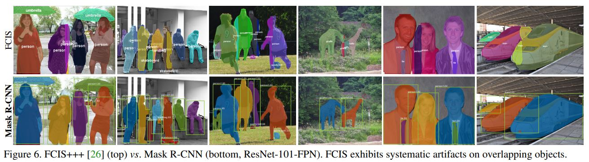

# Mask R-CNN

Kaiming He, Georgia Gkioxari, Piotr Dollar, Ross Girshick (Facebook AI Research (FAIR))

## Abstract

저자들은 Object detection을 통한 박스에서 Instance segmentation을 수행하는 프레임워크를 제안했다. Faster R-CNN을 확장한 개념인 Mask R-CNN은 바운딩 박스 예측 수행하는 브랜치에 병렬적인 브랜치를 하나 더 추가한다. 추가된 브랜치는 Object의 픽셀 mask를 예측하는 작업을 수행한다. 기존의 Faster R-CNN의 완전히 바꾸는 것이 아니라 Classification 브랜치와 Bounding box regression 브랜치를 이용하여 기능을 추가하는 개념이기 때문에 구현하기 쉽고 속도도 Faster R-CNN과 비교해서 큰 차이가 나지 않는다(5 FPS). 저자들은 Mask R-CNN으로 Human pose estimation도 수행하는 모델을 만들기도 했다. 저자들은 COCO 형식의 Challenge에서 Instance segmentation, Object detection, Person keypoint detection 부분에서 결과를 보여줬다. 

코드:  [facebookresearch - Detectron](https://github.com/facebookresearch/Detectron)

## Introduction

서론에서 밝히는 저자들의 연구 목적은 Instance segmentation을 위한 프레임워크를 개발하는 것이었다. Instance segmentation이 어려운 이유는 이미지 내의 객체를 정확하게 탐지해야 하며 동시에 각 객체를 구분할 수 있어야 한다(똑같은 클래스라도 다른 객체인 경우). 이를 위해서 Instance segmentation의 기본적인 접근 방법은 Object detection에서 객체를 분류하고 Bounding box로 위치를 표시하는 특징과 Semantic segmentation에서 각 객체 인스턴스에 상관 없이 카테고리별로 각 픽셀을 분류하는 특징을 결합하는 것이었다. 

Mask R-CNN에서는 Fast R-CNN에서 각 ROI마다 기존의 Classification과 Bounding box regression을 수행하는 동시에 픽셀의 Segmentation masks 예측하는 작업을 병렬적으로 수행한다. Mask 브랜치는 FCN이며 Pixel-to-Pixel의 방식으로 Segmentation mask를 예측한다. 이 FCN의 사이즈가 작기 때문에 이 브랜치에서 추가적으로 발생하는 Overhead가 적다. 

원래 Faster R-CNN에서는 네트워크의 입력과 출력 간의 Pixel-to-Pixel alignment를 수행하지 않는다. 이것은 ROI Pooling이 Feature extraction을 위해서 Coarse spatial quantization을 어떻게 수행하지를 보면 명확해진다. Instance segmentation에 맞지 않는 이런 연산 방식을 대체하기 위해서 저자들은 ROIAlign이라고 하는 정확한 Spatial location을 보존하고 Quantization이 없는 연산을 소개했다. ROIAlign으로 인해서 Mask accuracy가 결과적으로 10%에서 50%까지 개선되었다. 또 저자들은 Mask에 대해서 Multi class 중에 하나를 고르는 방식이 아니라 각 Class가 있는지 없는지를 예측하는 Binary mask를 예측했다. 이게 가능한 이유는 ROI의 Classification 브랜치에서 이미 객체에 대한 클래스 예측을 수행하기 때문이다. FCN에서는 Segmentation과 Classification을 동시에 수행했는데 저자들은 브랜치를 나눠서 Segmentation과 Classification을 분리했다. 

[Taeoh Kim - PR-057: Mask R-CNN](https://www.youtube.com/watch?v=RtSZALC9DlU)

Mask R-CNN으로 개발한 모델은 GPU에서 하나의 프레임을 처리하는데 200ms가 걸렸고 8-GPU로 COCO 데이터셋으로 훈련시키는데 하루에서 이틀 정도가 걸렸다고 한다. 

## Related Work

### R-CNN

R-CNN 계열 알고리즘은 객체 탐지를 위한 Bounding box를 위해서 지역 후보(ROI)를 생성하고 각 ROI마다 Convolutional network 작업을 수행한다. ROI Pooling 계층을 통해서 속도와 정확도가 개선되었다. Faster R-CNN은 FCN인 RPN을 학습 시켜서 ROI를 생성하는 Attention mechanism으로 Fast R-CNN을 개선시켰다. 

### Instance Segmentation

본문 참조

## Mask R-CNN

Mask R-CNN에서 Mask 브랜치는 다른 두 브랜치와는 다르게 객체의 Finer spatial layout을 필요로 한다. 이를 위해서 Pixel-Pixel alignment가 추가되었다. 

#### Faster R-CNN

Faster R-CNN에서 첫 번째 Stage는 Region Proposal Network로 Bounding box candidate를 제안한다. 두 번째 Stage는 ROI Pool 연산으로 각 ROI에서 특징을 추출해서 Classification과 Bounding-box regression을 수행한다. 두 단계에서 사용되는 특징은 공유될 수 있다. 

#### Mask R-CNN

Mask R-CNN에서는 Faster R-CNN의 두 단계를 그대로 가져왔다. 다만 두 번째 Stage에서 Class과 Box offset을 예측하는것과 동시에 ROI에 대한 Binary mask도 출력한다. 

훈련 간에 각 ROI에 대한 Multi-task Loss는 다음과 같이 계산한다.

Classification Loss와 Bounding-box Loss는 기존과 유사하다. Mask 브랜치는 각 ROI에 대해서 Km^2 차원의 결과를 출력한다. 이것은 m x m 해상도에 대한 K개 클래스에 대한 Binary mask 정보이다. 이를 위해서 픽셀 당 시그모이드 함수를 적용하기 때문에 Mask Loss는 평균 이진 크로스 엔트로피 Loss로 정의된다. k GT 클래스와 관련된 ROI에 대하서만 Mask Loss가 정의된다. 다른 Mask는 Loss에 기여하지 않는다. 

[Taeoh Kim - PR-057: Mask R-CNN](https://www.youtube.com/watch?v=RtSZALC9DlU)

이때 Mask Loss는 클래스 간의 Competition으로 정의되는 것이 아니고 모든 클래스에 대해서 해당 클래스에 대한  객체인가 아닌가를 조사하게 된다. 이게 가능한 이유는 Classification 브랜치에서 이미 해당 박스에 대한 분류를 수행하기 때문이다. 

#### Mask Representation

Mask는 객체의 Spatial layout 정보를 인코딩한다. Classification 브랜치나 Box regression 브랜치에서 완전 연결 계층에 의해서 필연적으로 정보가 짧은 출력 벡터로 Collapsed되는 것과 달리 Mask 브랜치에서는 컨볼루션 계층만 존재하므로 Pixel-to-Piexel의 Correspondence가 가능하다. 

특히 Mask R-CNN에서는 각 ROI에 FCN을 이용하여 m x m mask를 예측한다. 이것은 Mask 브랜치의 각 계층이 Object spatial layout을 벡터로 변환할 필요 없이 m x m 형태로 유지할 수 있도록 한다(벡터로 변환하면 Spatial layout이 다 깨져버림). 완전 연결 계층에 의존하는 다른 방법들과 비교해서 더 적은 파라미터로 예측을 수행하고 더 정확히 예측할 수 있다. 

이런 Pixel-to-Pixel 작업은 입력과 출력 간의 Spatial correspondence가 잘 매칭되도록 ROI를 작은 크기의 Feature map으로서 유지되도록 하는 것을 요구한다. 그래서 저자들은 ROI Align을 고안하게 되었다. 

#### ROI Align

ROI Pool 연산은 각 ROI에서 작은 크기의 Feature map을 추출하는 잘 알려진 연산이다. ROI Pool에서는 먼저 각 ROI의 부동 소수점  값을 Feature map의 개별 단위로 양자화 한다. 그리고 나서 Spatial bin으로 나눠지고 각 bin은 (주로 Max pooling으로)집계된다. 양자화는 연속 좌표 값인 x에 대해서 [x/16]를 계산하는데 16은 Feature map Stride이고 [.]은 Rounding 함수이다. 이런 양자화에는 ROI와 추출된 특징간의 잘못된 매칭이 있을 수 밖에 없다. Classification에서는 큰 문제가 되지 않을지 모르지만 Pixel mask를 예측하는데는 부정적인 영향을 끼친다. 이것을 해결하기 위해서 저자들은 ROI Align을 고안해냈다. 아이디어는 간단한데 ROI나 Bin 내에서 양자화를 하지 않는 것이다([x/16] 대신에 x/16 적용). Bilinear interpolation을 적용해서 각 ROI bin 내에서 정확한 입력 특징 값을 계산하고 Max 혹은 Average pooling으로 집계한다. 

저자들은 ROI Align을 ROI Warp 연산과도 비교했다. ROI Warp는 Alignment 이슈를 간과하고 ROI Pool과 같이 양자화를 적용한 형태로 구현되었다. 그래서 ROI Warp가 Bilinear resampling을 적용한다하더라도 ROI Pool과 비슷한 결과를 보이게 된다. 

ROI Pooling에서는 RPN에서 ROI의 픽셀 값이 부동 소수점 값으로 되어 있는데 ROI Pool에서 이 부동 소수점을 반올림 한다. 

또 bin으로 나눌때 정확한 영역으로 나누지 않기 때문에 입력과 달리 Align이 되지 않는다. 

ROI Align에서는 정확하게 구역을 나누려고 한다. 

더 정확하게 나누기 위해서 각 셀을 다시 2x2로 나누는데 이때 각 셀을 Subcell이라고 한다. 

이때 값을 할당하기 위해서 위와 같이 각 Subcell의 영역을 구역이 차지하고 있는 가중치에 비례하여 값을 할당한다. 

각 Subcell에 값이 할당되고 나서 각 Cell에 대하여 Max pooling을 수행한다. 

[Taeoh Kim - PR-057: Mask R-CNN](https://www.youtube.com/watch?v=RtSZALC9DlU)

#### Network Architecture

저자들은 다양한 Architecture로 Mask R-CNN을 구현했다. 정확하게는 (1) 전체 이미지에 대해서 특징을 추출하는 Backbone을 다르게 했고 (2) Classification, Box regression, Mask prediction을 수행하는 네트워크 Head를 다르게 했다. 

Backbone에 대해서는 ResNet과 ResNeXt의 깊이 50, 101을 사용했다. 원래 Faster R-CNN + ResNet에서는 마지막 컨볼루션 계층인 4번째 Stage에서의 Feature map으로 RPN과 Fast R-CNN Detector가 연산을 수행하는데 저자들은 이를 C4라고 칭했다(ResNet-50-C4).

저자들은 또 FPN으로 구현하기도 했다. Faster R-CNN + FPN은 각기 다른 단계의 Feature pyramid에 특징을 추출한다. 이것 빼고 나머지는 Vanilla ResNet과 동일하다. 

Head는 다음의 Figure 4와 같다. 

 

ResNet-C4 Backbone에 붙는 Head의 경우 ResNet의 5번째 단계를 포함한다(9번째 계층인 res5). 여기서 계산이 집중된다. FPN에 대해서는 Backbone이 이미 res5를 포함하고 있기 때문에 더 적은 수의 필터를 가진다. 

### Implementation Details

#### Training

Fast R-CNN에서처럼 ROI는 GT box와 IOU가 적어도 0.5이상이면 Positive 그렇지 않으면 Negative가 된다. Mask Loss는 Positive ROI에서만 계산된다. Mask target은 ROI와 GT mask 간의 교차점이다. 

이미지는 크기가 재조정되어 짧은쪽이 800 픽셀이 되도록 했다. 미니 배치 사이즈는 GPU당 2장의 이미지이고 각 이미지는 N개의 ROI를 샘플링한다. 그래서 Positive와 Negative의 비율이 1:3이 되도록 한다. N은 C4 Backbone에서는 64이고 FPN에서는 512이다. 8 GPU로 훈련 시켰다. 160k iteration 동안은 Learning rate 0.02이 훈련 시켰고 120k iteration에서 10배 감소 시켰다. Weight decay 0.0001과 Momentum 0.9를 적용했다. ResNeXt에서는 GPU당 1장의 이미지로 훈련시켰고 같은 Iteration 만큼 훈련시키되 Learning rate는 0.01부터 시작한다. 

RPN은 앵커 박스는 5 Scale과 3 Aspect ratio 옵션이 있다. 편의상 RPN은 의도하지 않는 이상 Mask R-CNN과 특징을 공유하지 않으면서 따로 훈련되었다.  그렇긴 하지만 RPN과 Mask R-CNN은 같은 Backbone을 사용하므로 특징을 공유할 수 있다. 

#### Inference

테스트 시에 Proposal 숫자는 C4 Backbone의 경우 300, FPN은 1000이다. Box prediction 브랜치에서는 NMS를 수행한다. 그리고 나서 Mask 브랜치가 100개의 가장 높은 Scoring의 Detection box에 적용된다. 이런 과정이 훈련때와는 다르지만 추론 속도를 높이고 정확도를 개선한다(숫자가 더 적지만 더 정확한 ROI 덕분에). Mask 브랜치는 ROI당 K개의 Mask를 예측할 수 있지만 Classification 브랜치에서 예측한 클래스인 k에 대한 k번째 Mask만 사용했다. m x m의 부동 소수점 Mask 출력은 ROI 크기로 재조정되고 0.5의 Threshold로 이진화 된다. Mask R-CNN이 Top 100의 Detection 박스에 대해서 계산하기 때문에 원래의 Faster R-CNN보다 약간의 Overhead(보통 ~20%)가 있다. 

## Experiments: Instance Segmentation

저자들은 COCO 데이터 셋으로 Ablation study를 진행하면서 여러 SOTA 알고리즘과 Mask R-CNN을 비교했다. COCO 평가 지표로 결과를 제시했는데 여기에는 AP50 AP75 AP_S, AP_M, AP_L이 포함되어 있다. 특별히 언급하지 않는 이상 여기서 AP는 Mask IOU를 의미한다. 80k 훈련 이미지와 35k의 검증 셋일부를 합쳐서 훈련 시켰고(trainval135k) Ablation study에서 결과는 남은 검증 셋 5k로 평가했다(minival). 또 test-dev 셋으로도 검증했다. 

### Main Results

저자들은 아래 Table 1과 같이 Mask R-CNN과 다른 Instance segmentation의 결과를 비교했다. 

위의 Figure 6에서는 Mask R-CNN baseline과 FCIS+++의 결과를 비교해서 보여주고 있다. FCIS+++의 경우 인스턴스 끼리 겹치는 영역에서 Systematic artifact가 보인다. 이런 것 때문에 Instance segmentation이 어렵다고 한다. Mask R-CNN의 경우 이런 Artifact가 보이지 않는다. 

### Ablation Experiments

저자들은 Mask R-CNN에 대해서 Ablation study를 실시했는데 이는 아래 Table 2에 나와 있다.

#### Architecture

Table 2a에서는 다양한 아키텍처에서 구현된 Mask R-CNN의 성능을 보여주는데 깊을 수록 더 좋은 결과가 나왔고(50 vs 101) 더 발전된 형태의 아키텍처에서 성능이 좋았다(FPN, ResNeXt). 

#### Multinomial vs Independent Masks

저자들은 Classification, Box regression 브랜치에서 나온 결과를 이용해서 Mask 브랜치에서 예측을 수행하는 것의 이점을 확인하기 위해서 Table 2b와 같이 Pixel마다 Softmax와 Multinomial Loss(주로 FCN에서 사용되는 개념)를 적용해서 성능을 비교했다. 이는 Mask prediction과 Class prediction을 합쳐서 수행하는 것인데 총 AP가 5.5 정도 차이가 난다. 이것으로 저자들의 가정이 맞다는 것을 확인할 수 있다. 

#### Class-Specific vs Class-Agnostic Masks

Mask R-CNN의 구현체는 Class-specific한 Mask를 예측한다. 클래스당  하나의 m x m mask를 예측한다. 저자들이 확인한 결과 Class-specific과 Class-agnostic mask가 거의 성능이 유사했다(agnostic-29.7 vs specific-30.3). 

#### ROI Align

ROI Align을 적용한 결과는 Table 2c에 나와 있다. 이 실험은 ResNet-50-C4 Backbone으로 수행했다(Stride 16). 결과적으로 ROI Align은 ROI Pool보다 AP가 3 포인트 더 개선되었다(특히 AP75). ROI Align에 Max 혹은 Average pool 여부는 중요하지 않기 때문에 저자들은 Average pool을 적용했다고 하다.  

추가적으로 MNC에서 제안한 ROI Warp를 적용해서도 성능을 비교했다. 앞서 언급한 것처럼 ROI Warp에서도 여전히 Quantization을 적용하기 때문에 입력에 대한 Alignment 상태가 깨지게 된다. Table 2c에서 보는 것처럼 ROI Warp는 ROI Pool과 비슷하며 ROI Align보다 성능이 못하다. 저자들이 말하기 핵심은 적절한 Alignment라고 한다. 

그리고 저자들은 ROI Align을 ResNet-50-c5 Backbone에 적용한 결과를 비교했다(Stride가 16에서 32로 커짐). Figure 4의  오른쪽과 같은 Head를 사용했는데 이는 res5 Head를 이용할 수 없기 때문이다. Table 2d를 보면 ROI Align이 Mask AP를 많이 개선한 것을 볼 수 있다(특히 Mask AP75). 주목할 점은 Stride-32 C5 Feature가 Stride-16 c4 Feature보다 더 정확하다는 점이다. 

마지막으로 FPN에서 ROI Align은 1.5 Mask AP, 0.5 Box AP만큼 개선시켰다.  결론은 Detection과 같이 Finer alignment가 필요한 상황에서는 ROI Align이 좋다는 것이다. 

#### Mask Branch

Segmentation은 Pixel-to-Pixel task이기 때문에 저자들은 FCN을 사용해서 Mask의 Spatial layout을  활용했다.  Table 2e에서는 ResNet-50-FPN Backbone에 Multi-layer perceptron과 Fully convolutional Network를 적용했을때 결과를 나타낸다. FCN이 MLP보다 Mask AP가 2.1 더 높다. 

### Bounding Box Detection Results

저자들은 Table 3와 같이 Mask R-CNN과 당시 SOTA 알고리즘들을 COCO Bounding box object detection으로 비교했다. 이 경우에 훈련은 Mask 브랜치까지 훈련되었더라도 추론 시에 Mask 브랜치의 출력은 무시했다. 

Table 3의 Faster R-CNN, ROI Align이라고 되어 있는 모델은 Mask 브랜치 없이 훈련시킨 Mask R-CNN이다(ROI Pool 대신 ROI Align을 적용한 Faster R-CNN 모델). 이 모델은 Mask R-CNN 모델의 결과와 0.9포인트 나는데 이로서 알 수 있는 점은 Multi-task 훈련으로 이만큼 성능이 더 개선될 수 있다는 점이다. 

Mask R-CNN 모델에서 Mask 브랜치와 Box regression 브랜치의 AP는 크게 차이 나지 않는다(Table 1의 Mask는 37.1, Table 3의 Box는 39.8로 2.7 포인트 차이).

### Timing

#### Inference

저자들은 Faster R-CNN에서의 4-step 훈련 방식을 따라서 RPN과 Mask R-CNN 사이에 Base network에서 추출된 특징을 공유하는 ResNet-101-FPN 모델을 훈련시킨 바 있다. Nvidia Tesla M40 GPU에서 이미지 한 장을 처리하는데 195ms가 걸린다(CPU로 출력결과를 원래 입력 Resolution으로 복구하는데 15ms가 더 걸린다). 그러면서 RPN과 Mask R-CNN 사이에 특징을 공유하지 않는 버전과 통계적으로 같은 Mask AP를 보인다. Figure 4의 왼쪽과 같이 ResNet-101-C4 방식으로도 수행해봤는데 ~400ms가 걸린다. 

#### Training

ResNet-50-FPN 모델을 COCO trainval135k 데이터셋으로 훈련시킬때 동기화된 8-GPU로는 32시간이 걸린다(미니 배치 사이즈 16당 0.72s가 걸리는 셈). 그리고 ResNet-101-FPN으로는 44시간이 걸린다. 

## Mask R-CNN for Human Pose Estimation

본문 참조

