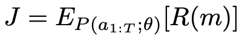

# MnasFPN : Learning Latency-aware Pyramid Architecture for Object Detection on Mobile Devices

Bo Chen, Golnaz Ghiasi, Hanxiao Liu, Tsung-Yi Lin, Dmitry Kalenichenko, Hartwig Adam, Quoc V. Le(Google Research)

## Abstract

저자들이 주장하길 리소스에 대한 제약사항이 있는 환경 하에서 괜찮은 모델의 아키텍처를 탐색하는 연구가 많이 이뤄졌지만 온디바이스 환경에서의 Object detection을 위한 디자인은 대부분 수동적으로 이뤄졌다고 한다. 이에 대한 몇가지 시도는 수행되었으나 모바일 친화적이지 않은 Search space 위주이거나 온디바이스 Latency가 반영되지 않거나 하는 문제가 있었다. 저자들은 MnasFPN이라고 하는, Detection head를 위한 모바일 친화적인 Search space를 제안했다. 그리고 이를 Latency를 인식하는 아키텍처 Search와 합쳐서 Object detection 모델을 만들었다. Ablation study에서는 성능 향상의 주요 원인이 저자들의 Search space의 혁신성에서 비롯된다는 것을 보여줬다. 

## Introduction

모바일 환경에 배치할 모델을 위한 아키텍처를 디자인 하는 것은 쉽지 않다. 왜냐하면 모델의 용량과 정확도 사이에 면밀한 Trade-off를 잘 조절해야 하고 디바이스가 모델이 사용하는 연산을 지원하는가 혹은 연산이 디바이스 친화적(연산을 빠르게 잘 수행)인가를 고려해야하기 때문이다. Neural architecture search는 이런 디자인 과정을 자동화하는 프레임워크를 제공했다. 여기서 강화학습 기반의 Controller는 유저가 지정한 Search space 하에 빠르고 정확한 모델을 만들어 내는 법을 학습한다. 그런데 NAS 연구는 Search 알고리즘을 개선하는데 집중하는데 반해 Search space를 디자인하는 작업은 성능에 큰 영향을 끼침에도 불구하고 연구가 비교적 덜 수행되었다고 한다. 

모바일과 서버 기반의 Image classification을 위한 NAS 관련 연구는 큰 진보를 이뤄낸 반면 Object detection 관련해서는 상대적으로 적은 시도가 이뤄졌다고 한다. 그 이유 중 어느정도는 Backbone과 관련해서 Detection head의 Search space에서의 복잡성 때문이다. Backbone에서는 연속적으로 이미지의 특징을 추출하게 되는데 이때 특징이 점점 미세해진다. Object detection과 Image classification에서의 이미지 추출 과정은 유사하다. 그러므로 원래 NAS 방식의 연구들은 Classification feature extractor를 Detection에 맞게 재조정하거나 Detection head는 고정시켜놓고 Backbone을 탐색하거나 하는 방식이었다. Backbone은 계층의 연속이기 때문에 이때의 Search space는 연속적일수 밖에 없다. 이에 반해 Detection head는 연속적이지 않을 가능성이 크다. 여기서는 특징들을 합치거나 여러 크기에 맞춰 다시 만들어내거나 할 수 있다. 이렇게 하는 이유는 Class 예측이나 객체의 위치 추정을 더 잘 하게 하기 위해서이다. 그러므로 이때의 Search space는 어떤 특징을 합칠 것인가(Fuse) 얼마나 자주, 어떤 순서로 특징들을 합칠 것인가 하는 과정을 포함한다. 이것을 NAS 방식 아키텍처로 해결하는 것은 어렵다는 것을 몇몇 연구가 입증했다.

한가지 예외는 NAS-FPN인데 Detection head의 비연속적인 Search space 문제를 다룬 첫 번째 NAS 논문이다. 이 연구에서는 정확도 만을 위해 최적화를 수행했고 SOTA 성능을 보였다. 그리고 수동적으로 NAS-FPNLite라고 하는 원본과 다른 변경 버전을 디자인해서 모바일에서 괜찮은 성능을 보여줬다. 그러나 NAS-FPNLite는 세 부분에서 한계를 가진다.

- 아키텍처를 만들어내는 탐색 과정이 연산 복잡성이나 온디바이스에서의 지연율에 의해서 주도되지 않았다. 
- 모바일에 맞게 수동적으로 아키텍처가 조정되었기 때문에 더 최적화가 가능할 여지가 남아있다.
- 원본 NAS-FPN search space는 모바일에서의 사용을 위한 모델을 만들어 내는 목적이 아니었다. 

저자들이 말하길 MnasFPN에서는 위의 이슈들을 다룬다고 한다. 구체적으로 이 Search space에서는 Depthwise 컨볼루션이 최적화 되어 있어서 모바일에 알맞다고 하고, Inverted residual block 개념을 Search space에 다시 도입해서 모바일 CPU 환경에서 Detection head에 효율적이라는 것을 증명했다고 주장한다. 저자들은 온디바이스에서 지연율이 주도하는 Search space에서 NAS를 수행했다. 

그래서 저자들이 주장하는 저자들이 기여하는 바는 다음과 같다. 

- 모바일 친화적인 Detection head를 위한 Search space
- Object detection을 위한 지연율 인식 탐색을 첫번째로 수행
- SSDLite, NAS-FPNLite를 능가한 Detection head 아키텍처

## Related Work

### Mobile Object Detection Models

대부분의, 모바일에서의 Detection 모델은 전문가에 의해서 수동적으로 구축된다. SSDLite는 Light-weight detection head 아키텍처로 유명한 모델 중 하나이다. 이 모델에서는 모바일에서의 연산 부담을 줄이기 위해서 SSD head의 3x3 컨볼루션을 Separable 컨볼루션으로 바꿨다. 이 방법은 NAS-FPN을 모바일에 탑재하기 위해 만든 NAS-FPNLite에도 적용되었다. SSDLite와 NAS-FPNLite는 MobileNetV3와 같은 Backbone과 쌍을 이룰수 있다. 

### Architecture Search for Mobile Models

저자들의 NAS 탐색 방법은 온디바이스에서 측정되는 Latency signal에 의해서 작업이 진행된다. Latency 인식 NAS 방법은 이 연구 이전에 NetAdapt와 AMC에서 Pre-trained된 모델의 채널 차원을 학습하기 위해 사용되었다. 이때 Look-up table(LUT)이 네트워크의 각 부분들의 지연율의 합에 근거하여 종단간의 지연율을 효율적으로 측정하기 위해 사용되었다. 이 아이디어는 MnasNet에서 NAS 프레임워크를 사용해서 Generic 아키텍처 파라미터를 탐색하기 위한 용도로 확장되었다. 이때 강화학습 기반의 Controller는 각종 아키텍처의 지연율과 정확도를 관찰하고나서 효율적인 아키텍처를 만들어내는 법을 학습한다. 이 프레임워크는 MobileNetV3와도 결합되었다. 

MnasNet 스타일의 탐색방법은 리소스 사용이 제한되는 연구자들에게는 그림의 떡이었다. 그러므로 NAS 연구 결과들의 비대한 몸집에도 불구하고 이 문제를 어느정도 해소하고자 탐색 효율성을 개선하는 방법쪽으로 초점이 맞춰졌다. 이 방법들은 하이퍼네트워크와 가중치 공유를 사용해서 탐색 효율성을 올리는 아이디어를 이용했다. 모바일에서의 Classification의 성공에도 불구하고 이런 탐색 방법들은 리소스가 제약되어 있는 상황에서 연속적이지 않은 Search space로까지 크게 확장되어 본적이 없다. 이런 이유로 저자들이 말하길 Mobile에서 Object detection 모델은 보기 힘들다고 한다. 

### Architecture Search for Object Detection

Object detection에서의 아키텍처 탐색의 비연속성이라는 특성때문에 Object detection에서의 NAS는 상당히 제한적이었다. 

NAS-FPN은 Detection head Search 문제를 다루는 선구자격 연구이다. 이 연구에서는 FPN에 근거해서 아주 중요한 Search space를 제안한 바 있다. 저자들의 연구도 NAS-FPN에 영감을 받았지만 목적이 좀 더 모바일 친화적인 Search space에 있다는 차이점은 있다. 

다른 선구자격 연구는 Auto-Deeplab이 있다. 여기서는 NAS search를 Semantic segmentation 문제에서 다뤘다. 저자들의 연구도 서로 다른 해상도의 연결 패턴을 학습하는, 유사한 문제에 직면했다. 

DetNAS는 Detection body를 탐색하는 것의 효율성을 개선시키는데 초점을 맞췄다. 이 연구에서는 탐색 동안 모든 샘플링된 아키첵처의 ImageNet pretraining의 필요성에 의해서 촉발된 관리하기 힘든 연산량 문제를 다뤘다. 저자들의 연구는 Body보다는 Head에만 관심을 뒀다. 

NAS-FCOS에서는 Object detection을 위한 탐색 과정의 속도를 높이기 위해서 Detection head에까지 가중치 공유 개념을 확장한 바 있다. NAS-FPN과 유사하게 Detection head를 위한 Search space는 모두 컨볼루션으로 이루어져 있으나, 모바일이 대상이 아니었다. 저자들의 연구는 이들의 연구에 보충적으로, 저자들의 모바일 친화적인 Search space에 근거한 Latency-aware 탐색은 그들의 가중치 공유 탐색 전략을 더 가속화 할 수 있다. 

모바일쪽에서 Object detection 아키텍처는 거의 주요 타겟으로서 최적화되지는 않는다. 그보다는 Classification을 목적으로 한 가벼운 Backbone과 미리 훈련시킨 Detection head로 구성된다. 저자들은 모바일에서의 모델 배치를 위한 Object detection용 아키텍처 최적화를 직접적으로 수행한다고 한다.  

## MnasFPN

저자들이 말하는 MnasFPN은 저자들이 제안하는 Search space와 NAS를 통해서 찾은 아키텍처 군을 의미한다. NAS-FPN(Lite)와 MnasFPN 모두 Feature extractor backbone과 반복적으로 쓰일수 있어서, 존재하는 Feature들의 쌍을 병합해서 새로운 Feature를 재귀적으로 만들어낼수 있는 Cell 구조로부터 Detection 네트워크를 구축한다. 각 Cell은 각기 다른 해상도의 Feature들을 써서 입력과 같은 해상도 수준의 Feature들을 출력한다. 그렇기 때문에 Cell 구조는 반복적으로 적용될 수 있다. 하나의 Cell은 Block들의 집합이다. 각 Block은 해상도가 다를 수 있는 두 Feature map을 Intermediate feature로 병합시키는데 Separable 컨볼루션으로 작업이 수행된다. MnasFPN은 NAS-FPN(Lite)와 Block 수준에서 차이 점이 있다. 

### Generalized Inverted Residual Block(IRB)

Inverted Residual block(IRB)는 NAS search space 관련 연구에서 흔히 사용되는 Block 아키텍처로 알려져 있다. IRB의 핵심 안점은 메모리에 부담을 덜어내기 위해서 낮은 차원의(채널) Feature로 연산을 수행하고 나서 Depthwise 컨볼루션으로 차원을 다시 확장 시키는 것이다. 저자들은 이에 착안해서 NAS-FPN search space에 IRB 같은 디자인을 적용하는 것을 고려했다. 여기서 주요 문제이자 혁신이라고 할 수 있는 점은 NAS-FPN 블럭 안에 비선형성 구조를 개선시키는데 있다. 

### Expandable intermediate features

NAS-FPN에서는 모든 Feature map이 의도적으로 C개의 같은 채널 수를 공유한다. 이와 비교해서 MnasFPN은 Intermediate feature size F라는, 좀 더 융통성을 부여했다. 이 F는 탐색하는 동안 값이 바뀌면서 C와는 독립적이다. F와 C를 조절하면서 Intermediate feature는 확장의 역할을 하거나(채널 수가 많아지거나) 병목 현상(채널 수가 적어지거나)의 역할을 한다. 1x1 컨볼루션이 필요에 의해서 입력 Feature 채널 수를 C에서 F로 바꿀때 적용될 수 있다. 

### Learn-able block count

NAS-FPN에서 각 셀당 블럭의 수는 미리 정의되어 있다. 이것은 Feature 재활용 매카니즘 때문이다. 만약에 블럭이 Cell의 출력에 사용되지 않으며 이 블럭의 Intermediate feature는, 같은 해상도와 크기를 가지는 출력 Feature에 더해지게 될 것이다. MnasFPN에서는 이와 반대로 Intermediate feature가 출력 Feature와 채널 사이즈가 다른 경우가 많다(F와 C). 결과적으로 사용되지 않는 블럭은 자주 버려지게 되고 Latency-accuracy trade-off를 결정하는데 유연성을 더할 수 있다. 

### Cell-wide residuals

Feature 간의 연결이 점점 더 얇아지면서 저자들이 알아 낸 사실은 같은 해상도의 모든 입력과 출력 쌍 사이에 Residual을 추가하면 정보의 흐름을 증강시키는데 도움이 된다는 것이다 IRB와 비슷하게 저자들은 Intermediate feature에 ReLU 비성형을 더했지만 출력 Feature에는 적용하지 않았다. 왜냐하면 Input/output feature 채널 사이즈 C는 의도적으로 메모리에 부담을 덜기 위해서 작게 설정되었기 때문이다. 정보를 잃을 수도 있는 비선형성 연산은 불필요하게 정보 흐름을 더 죽이는 결과를 가져올 수도 있을 것이다. 

Figure 1을 보면 IRB와 비슷한, 입력과 출력 Feature 사이의 연결된 경로를 확인할 수 있다.

## Experiments

저자들은 COCO object detection으로 실험을 실시했고 Latency-aware search와 Search space의 각 요소들의 효율성을 알아보기 위한 Ablation study를 수행했다. 

### Search Experiments and Models

저자들은 아래와 같이 실험을 실시했는데 여기서 모든 Search space에서는 Cell 마다 5개의 블럭을 허용했다. 

- MnasFPN: Figure 1에 나와 있음.
- NAS-FPNLite: NAS-FPN을 가볍게 만든 모델로서 Head의 모든 컨볼루션을 Separable 컨볼루션으로 대체했다. 이 모델들은 Latency-sensitive NAS를 통해 탐색되지 않은 유일한 모델들이다(3.3절 참고). 
- NAS-FPNLite-S: 모든 컨볼루션을 Separable 컨볼루션으로 대체한, NAS-FPN search space를 탐색한다. NAS-FPNLite와 차이점은 모델 구축 후에 이런 대체를 한 것이 아니고 애초에 Search space에서 대체를 한 뒤에 모델 구축 과정을 탐색하는 것이다. 
- No-Exand: 중간 과정에서의 모든 Feature들에 대해서 F = C를 강제해서 MnasFPN에서 Expansion 부분만 제거한 실험이다. 이 실험으로 알 수 있는 것은 IRB에서 Expansion의 영향력을 알아볼수 있다는 것이다. 
- Conn-Search: 블럭마다의 2개에서 D>= 2 사이의 서로 다른 입력(Feature map)을 합병하는 것을 용인한다.  단, 합병 연산은 덧셈만 가능하다. 

### Experimental Setup

저자들은 여기서 모든 Detection model을 같은 설정과 하이퍼 파라미터로 훈련시켰고 Ablation study는 5k COCO val2017 데이터셋에서 수행되었다. 최종 비교 결과는 COCO test-dev 데이터셋으로 평가되었다. 

#### Training setup

- COCO val2017: 각 모델은 150 epochs 혹은 277k steps 동안 훈련되었고 배치 사이즈는 64로 COCO train2017 데이터셋으로 훈련시켰다. 훈련은 8 Replicas로 동기화되었다. LR은 다음과 같은 스케쥴을 따랐다. 0부터 0.04까지 첫번째 에폭동안 선형적으로 증가하다가 이후부터는 값을 고정시켰다. 120 epoch과 140 epoch에서 각각 0.1까지 급격하게 줄었다. 훈련의 안정성을 위해서 Gradient-norm clipping을 10 epoch에서 적용했고 Ablation study에서는 MobileNetV2를 Backbone으로 사용한 모델을 ImageNet 데이터셋으로 Pre-training시켰다. 
- COCO test-dev: 각 모델은 100k steps동안 처음부터(Pre training 없이) 훈련시켰고 32의 동기화된 Replicas로 배치 사이즈 1024로 훈련시켰다. LR은 4부터 0까지 Decayed되는 Cosine 스케쥴링을 적용했다. 단 처음 2k steps 동안은 Linear warmup phase를 적용했다. 경쟁력을 보장하기 위해서 COCO train2017과 val2017 데이터셋을 훈련 셋으로 병합했다. 

모든 훈련과 평가는 320x320 크기의 입력 이미지를 사용했다. 또 Drop-block이나 Auto-augmentation이나 하이퍼 파라미터 튜닝을 적용하지 않았는데 이는 비교 연구에서 특정 유형의 모델을 선호하는 것을 피해서, 각종 문헌의 기존 결과와 공평하게 비교하기 위함이다. 

#### Timing setup

모든 Timing은 Pixel 1 디바이스에서 TensorflowLite의 Latency benchmarker를 사용해서 배치 사이즈 1의 Single-thread로 수행되었다. MobileNetV2의 관행을 따라서 각 Detection model은 TensorflowLite flatbuffer format으로 변경되어 NMS를 수행하기 바로 직전의 Box와 Class prediction 값을 출력한다. 

#### Architecture Search Setup

저자들은 MNASNet에서 사용된 Controller setup을 따랐다. Controller는 10K의 자식 모델을 샘플링하는데 TPUv2 디바이스에서 각각 1시간까지 걸리기도 한다. 모델을 훈련시키기 위해서 저자들은 COCO train2017 데이터셋을 임의로 111k-search-train 데이터셋과 7k-seach-val 데이터셋으로 나눴다. 저자들은 20 epochs동안은 배치 사이즈 64로 search-train 셋으로 훈련시키고 search-val 셋으로 mAP 척도로 모델을 평가했다. LR은 첫 번째 Epoch동안 0부터 0.4로 선형적으로 증가하고 Step-wise precedure를 따라 Epoch 16에서 0.1로 Decay시킨다. 저자들은 320x320 해상도의 이미지로 Proxy task로 훈련을 수행해서 Proxy task와 Main task의 측정된 Latency가 동일하도록 했다. 
