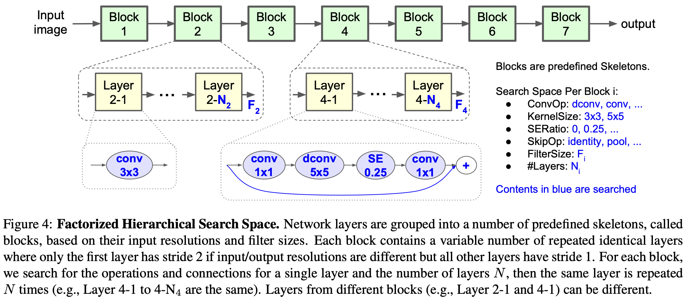
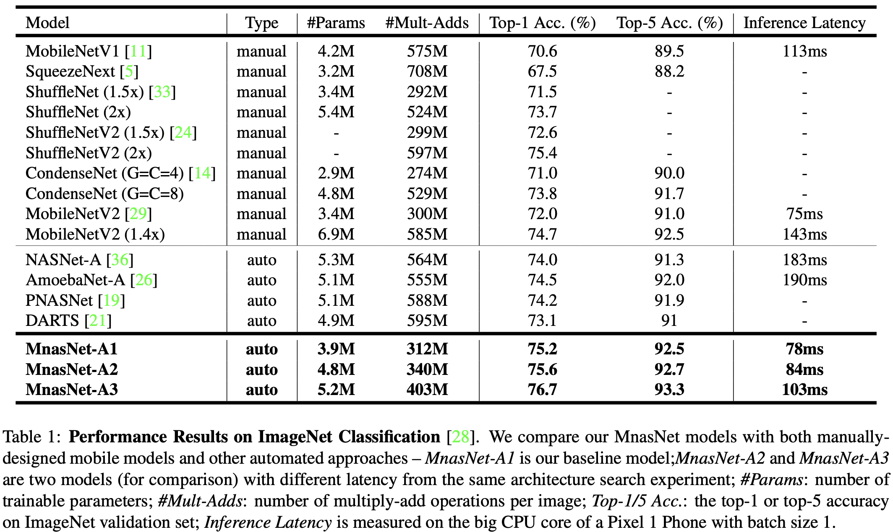
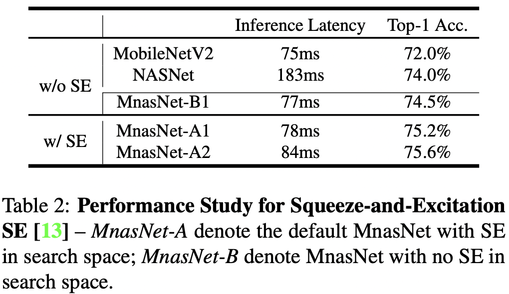
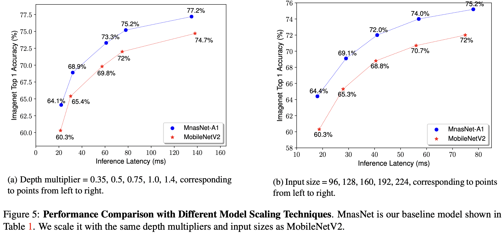
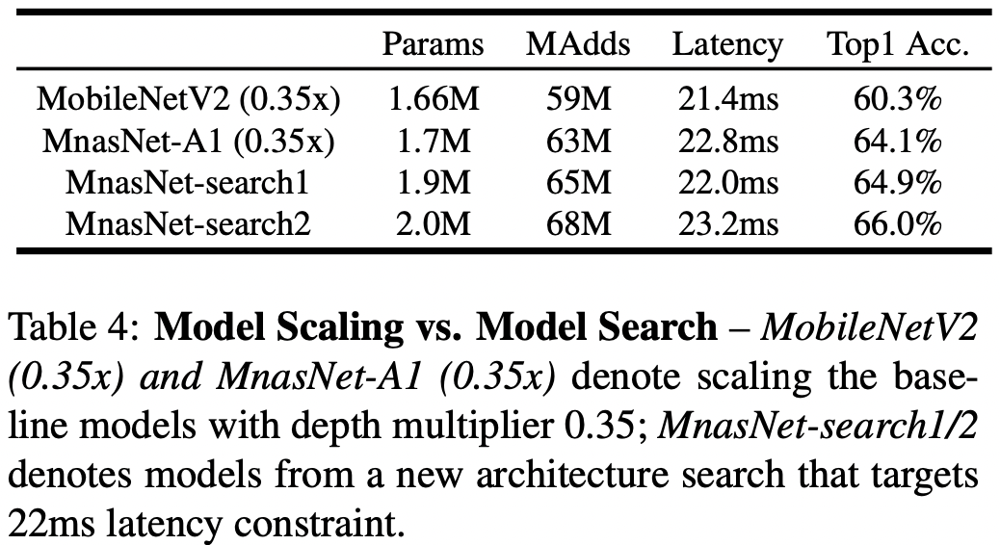
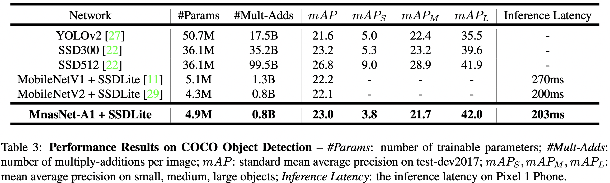
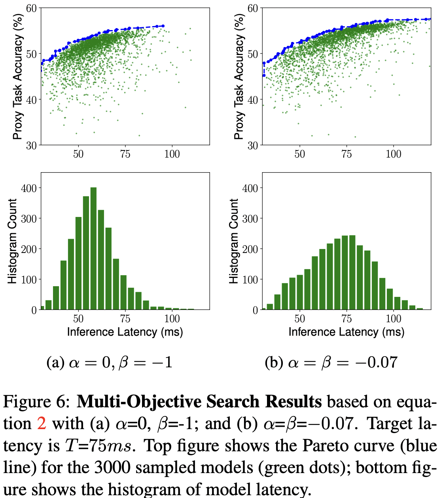
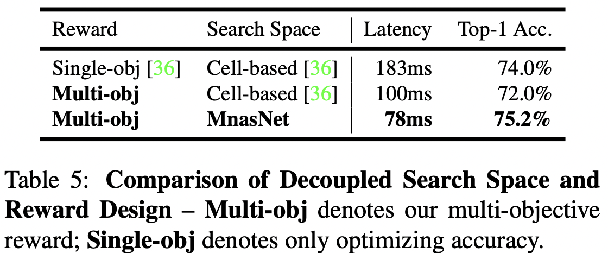
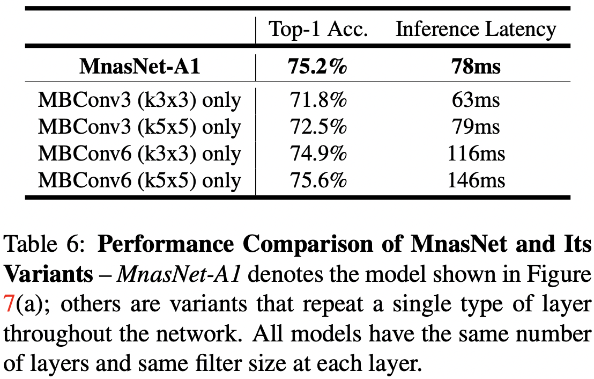

# MnasNet: Platform-Aware Neural Architecture Search for Mobile

Mingxing Tan(Google Brain), Bo Chen(Google Inc.), Ruoming Pang(Google Brain), Vijay Vasudevan(Google Brain), Mark Sandler(Google Inc.), Andrew Howard(Google Inc.), Quoc V. Le(Google Brain)

## Abstract

Mobile을 위한 CNN을 디자인하는 일은 어렵다. 왜냐하면 용량이 작으면서 빨라야하고 그러면서 정확해야하기 때문이다. 많은 아키텍처 옵션이 있을때 속도와 정확도 사이의 Tradeoff를 수동적으로 결정하는 것이 어렵다. 이 연구에서 저자들은 자동으로 모바일을 위한 신경망 네트워크 아키텍처 탐색 방법을 제안한다(Mobile Neural Architecture Search, 이하 MNAS). 이때 모델의 Latency를 명시적으로 모델 성능 향상의 주요 목표에 포함시켜서 정확도와 Latency 사이의 좋은 Trade-off를 달성하는 모델을 찾게 된다. 이 연구 이전에는 Latency가 다른 항목으로 간접적으로 대체되어 평가되었다(FLOPs 등). 그러나 여기에서는 모델을 직접 디바이스에서 구동시켜서 실제 Inference Latency를 측정하게 된다. 또, 모델의 유연성과 탐색 공간 사이의 균형점을 찾기 위해서 저자들은 Factorized hierarchical search space라는 개념을 제안한다. 이 개념을 통해서 네트워크의 각 계층마다 탐색을 수행하므로 계층의 다양성을 확보하게 된다. Latency를 측정한 디바이스 모델은 Pixel phone이다. 

[tensorflow-tpu-models-offical-mnasnet](https://github.com/tensorflow/tpu/tree/master/models/official/mnasnet)

## Introduction

CNN 모델이 점점 깊어지고 넓어지며 용량이 커지면서 속도가 더 느려지고 많은 계산량을 필요로 한다. 이런 한계점은 Resource가 제한적인 플랫폼, 예를 들어 모바일이나 임베디드 시스템에서 최신 모델을 배포하는 것을 어렵게 한다. 이런 문제점을 극복하기 위해서 네트워크의 깊이를 줄이거나 Depthwise 컨볼루션 혹은 Group 컨볼루션 같이 상대적으로 계산량이 더 적은 연산을 활용하는 방법으로 CNN 모델을 개선시키거나 디자인하는 연구들이 수행되었다. 그러나 Resource 제한적인 모바일 환경에서 모델을 디자인하는 것은 여전히 어려운 일인데 정확도와 Resource 사용 효율성 사이의 Trade-off를 결정하는 과정에서 아주 큰 디자인 공간을 탐색해야 하기 때문이다. 

초록에서 언급한대로 저자들은 모바일 CNN 모델을 디자인하기 위해 NAS를 활용하는, 자동화된 방법을 제안했다. 

Figure 1은 저자들이 제안한 방법을 나타낸 것이다. 기존 연구와 차이라고 한다면 실제 모바일 Latency를 고려한 Multi-objective reward라는 점과 Search space가 다르다는 점이다. 저자들이 문제를 해결하려는 접근 방식은 두가지 주요 아이디어에 기초한다. 

- 아키텍처 디자인 문제를 CNN 모델의 정확도와 추론 Latency를 모두 고려하는 Multi-objective 최적화 문제로 정형화 한다. FLOPs를 Inference latency의 Proxy로 설정한 기존 연구와는 다르게 저자들은 실제 디바이스에서 모델을 구동했을때 Latency를 측정했다. 이는 FLOPs가 정확한 Proxy가 될 수 없다는 저자들의 관찰에 기반한다(예를 들어 MobileNet, NASNet은 비슷한 FLOPs를 보이지만 Latency는 상당히 다르다. Table 1참고).
-  두번째로 기존 연구와는 Search space가 다르다는 점이다. 기존 연구에서는 몇가지 구조의 Cell을 네트워크 전체에 걸쳐 몇번 반복해서 쌓는 방식으로 Pyramid network를 구성한다. 이는 Search 과정을 단순화 할 수는 있으나, 계산적 효율성을 위해서 중요한 계층의 다양성을 저해한다. 이 문제를 해결하기 위해서 저자들은 Factorized hierachical search space라는 개념을 제안했다. 이 개념으로 각 계층은 구조적으로 다를 수 있지만 네트워크의 유연성과 Search space 크기 간의 균형을 잘 잡을 수 있다. 

저자들은 저자들이 제안한 방식을 ImageNet classification과 COCO object detection에서 적용해봤다. 

저자들이 주장하는 이 연구의 기여점을 요약하자면 다음과 같다. 

- 정확도와 모바일에서의 실제 Latency를 고려하는 Multi-objective NAS 최적화 개념을 도입.
- 네트워크의 유연성과 Search space size 간의 균형점을 잘 조절 가능하게 하도록 계층의 다양성을 보장하는 Factorized hierachical search space를 도입.
- 보통의 디바이스 환경(Pixel phone)에서 ImageNet classification과 COCO object detection의 SOTA 수준 성능을 입증. 

## Related Work

CNN 모델의 Resource 효율성을 개선하기 위한 접근 방식으로는 다음과 같은 것들이 있다. 

- Weight 값들이나/과 CNN 모델의 Baseline의 Activation을 낮은 Bit 표현으로 양자화한다. 
- FLOPs 혹은 Latency 같은 Platform-aware 평가 척도에 근거하여 덜 중요한 필터들을 잘라낸다.

그러나 이런 방법들은 Baseline model에 의존적이고 CNN operation의 Novel composition에 대해서 학습하는 것에 집중하지 않는다. 

다른 접근 방식으로는 직접적으로, 수동으로 모바일에서 효율적인 모바일 아키텍처를 고안해내는 방식이 있다. SqueezeNet은 1x1 컨볼루션을 쓰고 필터 크기를 줄여서 모델의 연산량과 파라미터 수를 줄였다. MobileNet은 연산 밀도를 최소화 하기위해서 집중적으로 Depthwise separable 컨볼루션을 썼다. ShuffleNet에서는 Group 컨볼루션과 Channel shuffle을 활용했다. Condensenet은 계층 간의 Group 컨볼루션을 연결하는 법을 학습시킨다. MobileNetV2는 Inverted residual와 Linear bottleneck을 사용했다. 그러나 아주 방대한 크기의 Search space를 생각한다면 이런 수동적으로 구축하는 모델들은 엄청난 인간의 노동력을 필요로 할 것이다. 

그리고 NAS를 활용해서 모델 디자인 과정을 자동화하는 연구 시도들이 있다. 이런 접근 방식들은 주로 강화학습, Evolutionary search, Differentiable search 등에 근거한다. 이런 방식들이 몇 가지 탐색된 Cell 구조를 반복적으로 쌓아 모바일에 맞는 크기의 모델들을 만들어낼수는 있어도 저자들이 주장하길 이런 방법들은 Mobile platform의 제약 사항들을 Search process 혹은 Search space에 포함시키지는 못한다고 한다. 저자들의 방법들과 상당히 가까운 MONAS, DPP-Net, RNAS, Pareto-NASH도 CNN 아키텍처를 탐색하는  동안 모델 크기나 정확도와 같이 Multiple objective를 최적화 하려는 시도를 했지만 저자들이 말하길 이들의 Search process는 CIFAR 같은 크기가 작은 Task에서나 최적화를 시도했다고 한다. 이와 반대로 저자들이 주장하는 점은 이 연구가 실제 모바일 Latency 제약 사항을 Target으로 하고 비교적 더 큰 Task에 집중했다는 것이다.   

## Problem Formulation

저자들은 아키텍처 디자인 문제를, 높은 정확도와 낮은 지연율을 보이는 CNN 모델을 찾는 것을 목적으로 하는 Multi-objective search로 정형화 했다. 저자들은 실제 모바이스에서 모델의 Latency를 측정하여 Objective에 포함시켰는데 모바일의 하드웨어/소프트웨어적 다양성으로 인해 Latency를 측정하기 어렵다는 문제에 직면하기도 했다. 

모델 m에 대해서 m의 대상 Task에서의 정확도를 ACC(m), 대상 모바일 플랫폼에서의 추론 지연율을 LAT(m)이라고 하고 T를 대상 지연율(목표 지연율)이라고 가정했을때, 한 가지 목표 설정 방법은 T를 제한사항으로 하고 이 지연율 조건 하에 ACC를 극대화 하는 방향으로 설정하는 것이다. 

그러나 저자들이 말하길 이런 접근 방법은 한가지 척도만 극대화하고, 또 Multiple Pareto optimal solution을 제공하지 않는 문제가 있다고 한다. Pareto optimal하다고 할 수 있는 모델은 지연율을 증가시키지 않으면서 가장 높은 정확도를 보이거나 정확도를 감소시키지 않으면서 가장 낮은 지연율을 보일 수 있어야 한다. 저자들이 원하는 것은 한번의 Architecture search에서 Multiple Pareto-optimal solution을 찾는 것이었다. 

이를 위한 여러가지 방식이 있겠지만 저자들은 그 중에서 직접 저자들이 고안한 Weighted product method를 Pareto optimal solution을 근사화 하기 위한 방법으로 사용했다. 그 목적은 아래와 같다. 

| Goal                                                         | W                                                            |
| ------------------------------------------------------------ | ------------------------------------------------------------ |
|  |  |

위에서 α, β는 Application 마다 다른 상수이다. 저자들의 경험으로 α, β를 고르는 규칙에 따르면 각기 다른 정확도-지연율 Trade-off 하에서도 Pareto-optimal solution이 유사한 Reward를 가질수 있다고 한다. 예를 들어서 저자들은 경험적으로 5%의 정확도 향상이 2배 지연율 상승을 동반한다는 것을 관측했다. 두 가지 모델이 있다고 가정 했을때 

- M1 - 지연율 l, 정확도 a
- M2 - 지연율 2l, 정확도 a(1 + 5%)

저자들의 규칙에 따르면 두 모델은 비슷한 Reward를 가지므로 

1. Reward(M1) = a*(l/T)^β
2. Reward(M2) = a(1 + 5%)*(2l/T)^β
3. a\*(l/T)^β ≈ a(1 + 5%)*(2l/T)^β
4. β ≈ -0.07

이므로 저자들은 모든 실험에서 특별히 언급하지 않는 이상 α = β = -0.07로 설정했다. 

Figure 3은 (α, β)에 따른 Objective function을 보여준다. 위의 그래프는 지연율이 T보다 작을 경우에는 정확도만을 Objective value로 사용하고 T보다 클때에는 급격하게 Objective value가 패널틸르 받아서 모델이 Latency 제약을 침범하지 않도록 유도하게 한다. 아래 그래프에서는 T를 느슷한 제약사항으로 해서 Smooth하게 Objective value가 지연율에 따라 조정되는 것을 확인할 수 있다. 

## Mobile Neural Architecture Search

### Factorized Hierarchical Search Space

NAS에서 잘 설계된 Search space는 매우 중요한데 이 연구 이전의 기존 연구 대부분이 몇가지 복잡한 Cell을 단순히 반복해서 쌓는 방식으로 아키텍처를 만들었다. 이렇게 되면 계층의 다양성이 없어져서 좋은 성능을 내기 힘들다고 주장한다. 

저자들은 Factorized hierarchical search space라는 개념을 고안해냈다. CNN 모델을 여러 고유의 블럭으로 나누고 각 블럭마다 개별적으로 연산의 종류, 연결 방법들을 탐색한다. 이렇게 되면 다른 블럭의 다른 계층 아키텍처를 만들 수 있다. 저자들은 직감적으로 정확도와 지연율의 Trade-off를 잘 조절하기 위해서는 입력과 출력의 모양에 근거해서 가장 좋은 연산 방법을 찾아낼 필요가 있음을 이해했다. 예를 들어서 CNN의 초기 단계에서는 많은 양의 데이터를 처리하기 때문에 추론시 지연율에 관해서는 후기 단계보다 영향력이 더 크다. 저자들은 Depthwise separable 컨볼루션을 사용했다. Depthwise separable 컨볼루션 커널은 (K, K, M, N)의 네 개의 튜플로 나타냈는데 (H, W, M)의 입력을 (H, W, N)의 출력을 변환시킨다. 이때 (H, W)는 입력 해상도의 크기이고 M, N은 각각 입력과 출력 필터의 차원 수이다. 이때 총 Multiply-add의 수는 다음과 같다. 

여기서 만약에 전체 연산량에 제한이 있다면 커널 크기 K와 차원 수 N을 균형감 있게 잘 조절할 필요가 있다. 예를 들어서 커널 크기 K를 크게 해서 Receptive field의 크기를 늘린다면 동시에 해당 계층이나 다른 계층의 필터 차원 수 N을 줄여서 균형을 맞출 필요가 있다. 

Figure 4는 저자들의 Search space의 기본 구조를 보여준다. 저자들은 CNN 모델을 미리 정의된 블럭의 열로 나눠놓고 입력 해상도를 점점 줄이고 필터 차원 수를 점점 늘렸다. 각 블럭은 동일한 계층들의 리스트인데 이때 연산의 종류나 연결 방법은 블럭마다 Sub search space에서 결정한다. 구체적으로 블럭 i의 Sub search space는 다음의 옵션에서 선택하게 된다. 

- 컨볼루션 연산의 종류: 보통의 컨볼루션(conv), Depthwise 컨볼루션(dconv), Mobile inverted bottleneck conv
- 컨볼루션 커널 사이즈 K: 3x3, 5x5
- Squeeze-and-excitation 비율: 0, 0.25
-  Skip 연산의 종류: Pooling, Identity residual, No skip
- 출력 필터 크기 Fi
- 블럭 Ni 마다의 계층의 숫자

예를 들어서 Figure 4의 블럭 4의 각 계층은 Inverted bottleneck 5x5 컨볼루션과 Identity residual skip path의 구조가 N4만큼 반복되는 것을 확인할 수 있다. 저자들은 모든 Search 옵션을 MobileNetV2를 참고해서 이진화 했다. 각 블럭에서의 계층의 숫자를 MobileNetV2에 근거해서 {0, +1, -1}의 옵션으로 탐색했고 계층마다의 필터 크기를 MobileNetV2에서의 크기 보다 {0.75, 1.0, 1.25}배의 옵션으로 탐색했다. 

저자들은 Factorized hierarchical search space는 총 Search space의 크기와 계층의 다양성의 균형을 맞추다는 확실한 장점이 있다고 주장한다. 예를 들어서 네트워크를 B개의 블럭으로 나눴고 각 블럭은 S 크기의 Sub search space와 평균적으로 블럭마다 N개의 계층이 있다고 가정할때, 총 Search space 크기는 S^B가 되는데해 반해 평범한 계층마다의 Search space의 크기는 S^(B*N)이 된다고 한다. 

### Search Algorithm

저자들은 저자들의 Multi-objective search 문제에 맞는 Pareto optimal solution을 찾기 위해서 강화 학습을 적용하는 접근 방식을 사용했다. 강화학습을 사용한 이유는 구현하기 편리하고 Reward를 Customize하기 쉽기 때문이다. 

구체적으로 저자들은 Search space의 각 CNN 모델을 토큰들의 리스트로 매핑했다. 이 토큰들은 파라미터 θ에 근거한 강화학습 Agent에서 행동 a1:T들의 열에 의해서 결정되었다. 저자들의 목적은 기대되는 Reward를 극대화 하는 것이다. 

여기서 m은 행동 a1:T에 의해서 결정된 샘플링된 모델이고 R(m)은 Equation 2(위에서 표의 Goal의 식)에 의해서 정의되는 Objective value이다. 

Figure 1과 같이 Search 프레임워크는 세 부분으로 구성된다. RNN 기반의 Controller, 모델의 정확도를 얻기 위한 Trainer, Latency를 측정하기 위한 모바일 기반의 Inference engine. 저자들은 Controller를 훈련시키기 위해서 잘 알려진 Sample-eval-update를 따랐다. 각 Step에서 Controller는 이것은 현재 파라미터 θ에 근거해서 자식 모델 배치를 샘플링한다. 이때 RNN으로부터의 Softmax logits에 근거한 토클들의 열을 예측한다. 각 샘플링된 모델에 대해서 저자들은 Target task에서 훈련시키고 정확도 ACC(m)을 얻고 디모바일 디바이스에서 모델을 구동해서 Inference Latency LAT(m)을 얻는다. 그런 다음 Equation 2(위의 표에서 Goal)의 식으로 Reward 값 R(m)을 계산한다. 각 Step의 마지막에는 Controller의 파라미터 θ들이 Proximal Policy Optimization을 사용한 Equation 5(바로 위의 식) 의해서 정의되는, 예산된 Reward를 극대화 하는 방향으로 업데이트 된다. Sample-eval-update loop는 파라미터 θ들이 어느 값들로 수렴하거나 Step의 최대치에 다다를때까지 반복적으로 수행된다. 

## Experimental Setup

ImageNet이나 COCO 같은 용량이 큰 데이터셋으로 탐색을 수행하는 것은 비용이 비싼데, 각 모델의 성능이 수렴하기까지 며칠이 걸릴지 모르기 때무이다. 기존의 연구들이 CIFAR 10같은 용량이 작은 데이터셋으로 탐색을 수행했는데 저자들은 이런 Small proxy가 실은 유효하지 않다고 주장한다. 왜냐하면 모델 Latency를 제대로 고려하려면 결국 모델의 크기를 키워야 하기 때문이다. 저자들은 그래서 용량이 큰 데이터셋으로 직접 탐색을 수행하는 대신 훨씬 적은 Step 동안 탐색을 수행했다. 저자들은 ImageNet 훈련 셋에서 50K 이미지를 임의로 골라서 검증 셋으로 정했다. 정확도가 확실히 저자들의 Search space으로 개선되었다는 것을 보장하기 위해서 비효율적이긴 하지만 NASNet에서와 같은 RNN controller를 사용했다. 각 아키텍처 탐색은 64개의 TPUv2로 4.5일이 걸렸다. 훈련 과정 동안 저자들은 각 샘플링된 모델은 Single-thread Pixel 1 환경에서 구동해서 Latency를 측정했다. 종합적으로 Controller는 탐색하는 동안 8K의 모델을 샘플링했다. 하지만 15개의 성능이 좋은 모델만 ImageNet으로 탐색 했고 1개의 모델만 COCO로 탐색했다. 

ImageNet으로 훈련할때는 RMSProp optimizer에 Decay 0.9, momentum 0.9를 적용했고 Batch norm을 모든 컨볼루션 계층 뒤에 Momentum 0.99, Weight decay 1e-5로 더했다. Dropout은 Rate 0.2로 마지막 계층에 적용했다. LR은 0부터 0.256까지 첫 5 epochs동안 증가시켰고 그 후에 2.4 epochs 마다 0.97씩 Decayed 시켰다. 배치 크기는 4K이고 이미지 크기를 224x224로 조정했다. COCO 훈련에서는 저자들의 모델은 SSD dectector에 포함시켰고 MobileNetV2와 같은 셋팅으로 적용했으며 입력 크기는 320x320이다. 

## Results

### ImageNet Classification Performance

Table 1은 ImageNet에서 각 모델의 성능을 보여준다. 저자들은 Target Latency T를 75ms로 설정했고 위의 테이블의 Goal 식의 α = β = -0.07로 정했다. 그리고 난 다음 같은 탐색 환경에서 다른 Latency-accuracy의 Trade-off를 보이는 가장 성능이 좋은 모델 3개를 골랐다. 

저자들은 Squeeze-and-excitation에 관해서 SE를 적용했을때와 안 했을때의 성능 결과를 아래 Table 2에 나타냈다. 

### Model Scaling Performance

개발자들은 자주 Accuracy-latency 혹은 Model size를 Trade 하기 위해서 모델의 크기를 줄이거나 늘리거나 한다. 한 가지 흔히 쓰는 방법은 Depth multiplier를 사용해서 Filter 크기를 조정하는 것이다. 다른 방법은 네트워크의 변경 없이 입력 이미지 크기를 줄이는 것이다. 

Figure 5는 모델 크기 조절 방법을 MnasNet과 MobileNetV2에 적용했을때의 성능을 그래프로 나타낸 것이다. 

모델의 크기를 조절하는 것에다가, 저자들의 방식은 Latency target에 맞춰 새로운 아키텍처를 탐색하는 것도 가능하다. 저자들의 방식은 Baseline model의 크기를 줄이거나 이런 Latency 제약 사항에 들어맞는 새로운 모델을 찾는다. 아래의 Table 4를 이 두 가지 방식을 비교한다. 공정한 비교를 위해서 224x224로 같은 이미지 사이즈를 적용했다. 

### COCO Object Detection Performance

COCO object detection을 위해서 저자들은 Table 2의 MnasNet 모델을 SSDLite의 Feature extractor로서 사용했다. 

Table 3는 COCO에서의 MnasNet 모델의 성능을 보여준다. 저자들은 저자들의 모델을 COCO trainval35k로 훈련시켰고 test-dev2017으로 평가해서 결과를 COCO 서버에 보냈다고 한다. 

## Ablation Study and Discussion

여기서 저자들은 Latency 제약과 Search space의 영향에 대해서 알아봤다. 그리고 MnasNet 아키텍처와 계층 다양성의 중요함에 대해서 알아봤다. 

### Soft vs. Hard Latency Constraint

저자들의 Multi-objective search 방법에서 Reward를 계산하는 식에서 α, β를 다르게 설정함으로서 Hard 하거나 Soft한 Latency 제약사항을 알아볼 수 있다. 

Figure 6은 α, β에 따른 Multi-objective search의 결과를 보여준다. α = 0, β = -1일때는 Latency는 Hard한 제약 사항으로 취급되므로 Controller가 Latency 패널티를 피하기 위해서 좀 더 빠른 모델에 집중하는 경향을 볼 수 있다. α = β = -0.07일때는 Latency가 Soft 제약사항으로 취급되어 넓은 범위의 Latency로 모델을 탐색한다. 이때 Target Latency인 75ms에 가깝게 모델을 샘플링하긴 하지만 40ms보다 더 작거나 110ms보다 더 큰 모델도 탐색하긴 한다. 이 점은 Table 1에서 보여준과 같은 Single architecture search에서의 Pareto curve에서 여러 모델을 뽑을 수 있게 한다.

### Disentangling Search Space and Reward

저자들은 저자들 연구의 두 가지 핵심 기여 사항인 Multi-objective reward와 New search space의 영향을 따로 분리해서 확인하고자 했다. 

Table 5는 이 요소들의 적용했을때의 성능을 보여준다. NASNet에서 시작해서 저자들은 먼저 NASNet에서의 Cell 기반의 Search space를 적용했다. 그리고 저자들의 Multiple-object reward를 사용해서 단순히 Latency 제약 요소를 추가했다. 그 결과 정확도와 지연율을 바꿔서 좀 더 빠른 모델을 만들었다. 그리고 나서 저자들의 Multi-objective reward 개념과 New factorized serach space 개념을 적용했더니 더 정확하고 낮은 지연율을 가진 모델을 만들었다. 

### MnasNet Architecture and Layer Diversity

Figure 7(a)는 저자들의 방법을 적용해서 찾은 MnasNet-A1 모델을 나타낸다. 네트워크 전체에 걸쳐서 다양한 계층으로 구성되어 있는 것을 확인할 수 있다. 한 가지 흥미로운 점은 저자들의 MnasNet이 3x3, 5x5 컨볼루션을 사용했다는 것인데 이는 이전의 모델들이 3x3 컨볼루션만 사용한 것과는 다른 양상이다(VGG 참고). 

계층 다양성의 영향을 확인하기 위해서 저자들은 Table 6에서 MnasNet과 이것의 변형 모델을 비교했다. 변형 모델은 오직 한 타입의 계층만 반복해서 쌓은 것이다(Kernel size, Expansion ratio 고정). 

 

원래의 MnasNet 모델이 더 좋은 Trade-off를 보인 것으로, 리소스 제약사항이 있는 CNN 모델에서 계층의 다양성의 중요성을 보여주는 결과이다. 

## Conclusion

이 연구에서 저자들은, 강화 학습을 사용하여 리소스를 효율적으로 사용하는 모바일 CNN 모델을 디자인하기 위한 자동화된 NAS 방법을 제안했다. 저자들의 연구의 주요 골자는 Search space에 실제 모바일에서의 Latency 정보를 포함하는 것과 최상의 Trade-off를 보이는 Mobile 모델을 찾기 위한 Factorized hierachical search space 개념이다. 저자들의 방식으로 ImageNet classification이나 COCO object detection에서 SOTA의 결과를 보였다. 또 MnasNet 아키텍처는 계층 다양성의 중요성에 대해서도 상기 시켜줬다. 
