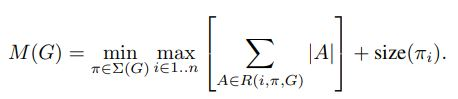
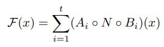

# MobileNetV2: Inverted Residuals and Linear Bottlenecks

Mark Sandler, Andrew Howard, Menglong Zhu, Andrey Zhmoginov, Liang-Chieh Chen(Google Inc.)

## Abstract

저자들은 MobileNetV2라는 모바일에 특화된 새로운 아키텍처를 발표했다. 그리고 Object Detection에서의 성능을 보여주기 위해서 MobileNetV2를 SSD에 적용한 새로운 프레임워크인 SSDLite를 발표했다. 또 모바일용 Semantic segmentation에서 성능을 보여주기 위해서 본래의 DeepLabv3보다 용량이 줄어든 형태인 Mobile DeepLabv3를 발표했다. MobileNetV2는 ResNet에서, Pointwise convolution 후에 Regular convolution 수행하고 다시 Pointwise convolution을 수행하면서 첫 번째 Pointwise convolution의 입력 Feature map과 두 번째 Pointwise convolution의 출력 Feature map을 더하는 Bottleneck 구조에 기초하고 있다(이때 Bottleneck 또한 ResNet에서 Bottleneck이 아니라 MobileNetV1의 Width multiplier로 각 계층의 입력과 출력 채널 수가 줄어든 형태이다). 특히 Bottleneck 구조에서 Regular convolution이 아니라 가벼운 Depthwise convolution을 적용했다. 연구 하면서 저자들이 알아낸 사항 중 하나는 이렇게 얇아진 계층에서는 비선형성을 제거하는 것이 중요한데 그 이유는 이미 얇아진 상태에서 비선형성으로 정보가 손실되면 모델의 표현이 더 줄어들기 때문이다.  저자들의 연구 접근 방식으로 비선형성과 모델 표현력의 상관 관계를 구분해서 살펴볼 수 있게되었다.

## Introduction

신경망 구조가 이미지 인식 분야에서 놀라운 성능을 보여주긴 했지만 아주 많은 양의 리소스나 시간을 필요로 하므로 모바일과 임베디드 시스템 같이 제한적인 환경에서는 적용하기 어려웠다. 본 연구 목적은 이런 환경에서 정확도는 유지하면서 연산량을 줄여서 신경망 네트워크를 적용할 수 있게 하는 것이었다. 이 연구 논문의 핵심은 Inverted residual with linear bottleneck이다. 저차원으로 압축되어 있는 입력 특징을 먼저 높은 차원으로 확장 시키고 Lightweight depthwise convolution 연산을 수행한다. 그런다음에 Linear convolution으로 고차원을 다시 저차원으로 Projection시킨다. 이 연구에서 제안한 모델은 쉽게 구현 가능하고 연산 중간에 쓰는 많은 텐서 양을 줄여서 메모리의 부하를 줄인다. 또 소프트웨어적으로 캐시 메모리를 사용해서 메인 메모리에 많은 접근이 일어나지 않도록한다. 

## Related Work

정확도와 속도 사이의 최적의 균형을 이루기 위한 깊은 신경망 네트워크에 대한 연구는 활발히 이루어지고 있다. 아키텍처 자체에 대한 연구, 훈련 알고리즘 개선에 대한 연구가 이뤄져서 초기 신경망 디자인에 큰 개선을 가져왔다. 대표적으로 AlexNet, VGGNet, GooLeNet, ResNet이 있다. 또 하이퍼 파라미터 최적화 라던지 다양한 네트워크 Pruning 방법들, Connectivity learning에 대한 연구도 이뤄졌다. 또 네트워크 내부의 Convolution 블럭들을 연결하는 구조에 대한 연구도 많이 수행되었다. Genetic 알고리즘, 강화 학습을 아키텍처 연구에 적용하기도 했다. 그런데 결론적으로 성능이 좋은 아키텍처는 굉장히 복잡하다는 단점이 있다. 그래서 이 연구에서는 어떻게 하면 신경망을 간단하게 디자인할 수 있을까에 관심을 두었다. 또, 이 연구는 MobileNetV1의 후행연구이다.  

## Preliminaries, discussion and intuition

### Depthwise Separable Convolutions

Depthwise separable convolution은 Regular convolution을 두 개의 별개의 Convolution의 분해하는 것이다. 첫 번째 Convolution은 Depthwise convolution으로 입력 채널마다 단일 Convolution 필터를 적용하여 필터링을 수행한다. 두 번째 Convolution은 Pointwise convolution으로 1x1 Convolution을 적용하여 입력 채널들 간의 선형 결합으로 새로운 특징을 출력한다. Standard convolution은 h_i x w_i x d_i의 입력 텐서 L_i를 받아서 Convolution  kernel인 K ∈ R^(kxkxd_ixd_j)를 적용한다. 그리고 나서 h_i x w_i x d_j 차원의 출력 텐서 L_j를 출력한다. 따라서 Standard convolution 계층의 연산량은 아래와 같다.

Depthwise separable convolution은 Standard convolution과 거의 같은 작업을 수행하면서 연산량은 아래와 같다.

(Depthwise convolution에서 입력 채널마다 1개의 커널이 할당되므로 di = 1이라서 k x k x di = k^2이고 Pointwise convolution에서는 k=1이므로 k x k x dj = dj이다.) Standard convolution과 비교했을 때 k^2xdj/(k^2 + dj) 만큼 연산량이 줄어드는데 거의 커널의 사이즈 k에 의해서 좌우된다. MobileNetV2에서 k=3이므로 8배에서 9배 정도 Standard convolution보다 연산량이 적으면서 약간의 정확도 하락이 있다. 

### Linear Bottlenecks

깊은 신경망 네트워크에 L_i 입력 텐서를 받는 n개의 계층이 있다. 저자들은 이 L_i가 h_i x w_i개의 픽셀의 d_i 차원으로 이루어진 Container라고 한다. 저자들은 계층의 출력(활성화 함수를 거친)이 Manifold of interest를 구성한다고 했다(Manifold of interest란 이미지 특성의 차원에서 추출한 이미지 특성이 차지하는 영역을 뜻한다). 

[ markov's Blog - 손실 압축과 매니폴드 학습](https://markov.tistory.com/39)

많은 연구에서, 신경망에서의 Manifold of interest는 저차원 부분공간에 임베딩될 수 있다고 가정되어왔다(고차원에서의 특징 공간을 저차원에서 표현 가능하다는 뜻). 즉, 깊은 Convolution 계층에서 d 채널의 각 픽셀들의 정보는 사실상 어떤 Manifold 안에 인코딩 되어 있고 이를 저차원 부분 공간으로 임베딩 할 수 있다는 말이다(주의할 점은 부분공간의 차원과 선형 변환을 통해서 임베딩 될 수 있는 Manifold의 차원수는 다르다는 것이다). 언뜻보기에는 그냥 차원 수를 줄이면 될 것처럼 보이고 실제로 MobileNetV1에서는 Width multiplier를 통해서 연산량과 정확도의 Trade off를 효율적으로 조절했다. 이런 직관을 따라서 Width multiplier로 Manifold of interest가 전체 공간을 Span할때까지 Activation 공간의 차원을 줄일 수 있다. 

그런데 이런 직관은 깊은 CNN이 ReLU 같은 비선형 활성화 함수를 수행하기 때문에 잘 맞지 않는다. 보통의 경우 만약에 ReLU 연산 결과가 Non-zero volume S를 출력한다면 S로 매핑되는 점들은 입력의 선형 변환 B 연산을 통해서 얻을 수 있으므로 전체 출력 차원에 대응되는 입력 공간의 부분은 선형 변환에 의해서 제한된다는 말이 된다. 즉, 딥러닝 네트워크는 출력 도메인의 0이 아닌 볼륨 부분에서만 선형 분류기의 힘을 갖는다는 말이다.  

만약에 ReLU가 채널을 붕괴시키면 필수불가결로 그 채널에서의 정보는 손실될 수 밖에 없다. 그렇지만 만약에 아주 많은 채널이 있다면 다른 채널에서 정보가 보존될 가능성이 있으므로 Activation manifold가 구축될 수 있다. 

[AiRLab. Research Blog - MobileNetV2](https://blog.airlab.re.kr/2019/07/mobilenetv2)

저자들은 아래와 같이 입력 Manifold가 입력 특징 공간을 ReLU 변환에 의해서 고차원 공간의 저차원 Manifold로 임베딩 하고 나서 원래대로 복원했을 때 채널수가 적으면 정보가 많이 손실되지만 채널수가 많으면 그런대로 잘 복원하는 것을 보여줬다. 

요약하자면 Manifold of interest가 고차원 Activation 공간의 저차원 부분 공간에 있을때의 요구사항은 다음과 같다. 

- Manifold of interest가 ReLU 변환 이후에 Non-zero volume으로 남아있을때 이것은 선형 변환에 해당한다. 
- ReLU가 입력 Manifold에 관한 정보를 완전하게 보존하는 경우는 입력 Manifold가 입력 특징 공간의 저차원 서브 공간에 있을때 이다. 

위 두가지 시사점을 바탕으로 저자들은, 현존하는 신경망 아키텍처를 최적화하는 방향에 대한 통찰을 얻게 되었다. Manifold of interest가 저차원 공간에 있다고 가정하고 Convolution 블럭 안에 Linear bottleneck 계층들을 삽입하는 것이다. Linear 계층이 중요한 이유를 저자들은 실험을 통해서 경험적으로 알아내었는데, 비선형성이 너무 많은 정보를 파괴하는 것을 막는다. 저자들은 Bottlenect 안의 비선형 계층이 성능을 해친다는 가정을 세웠고 실험을 통해 이를 검증했다. 

### Inverted residuals

언뜻 보기에 Bottleneck 블럭과 Residual 블럭이, 각 블럭이 입력, 몇몇의 Bottleneck 그리고 Expansion으로 이루어졌다는 것에 의해 비슷해 보인다. 그러나 Bottleneck은 모든 필요한 정보를 담고 있고 Expansion Layer는 단지 텐서에 비선형 연산을 수행한다는 사실에, 저자들은  Bottleneck 블럭 사이에 직접적으로 Shortcut을 적용하도록 구현했다. 

저자들이 Shortcut을 적용하기로 한 계기는 ResNet에서와 마찬가지로 모든 계층에 그래디언트가 (소실 혹은 폭파 없이) 골고루 전파 될 수 있도록 하기 위함이었다. 그렇지만 저자들이 고안한 Inverted 디자인이 메모리 사용에서 더 효율적이고 본 연구의 실험에서도 더 좋은 성능을 냈다. 

#### Running time and parameter count for bottleneck convolution

블럭의 입력 Feature map 사이즈가 h x w이고 Expansion factor가 t이며 Kernel 사이즈가 k이고 입력 채널 크기가 d'이고 출력 채널 크기가 d"일때 이 블럭의 총 Multi add 숫자는 h x w x d' x t(d' + k^2 + d")이다. Depthwise separable convolution의 연산량과 비교했을때 여분의 1x1 Convolution이 추가되어 있다. 그렇긴 하지만 Expansion factor t에 의해서 입력과 출력 차원수가 더 줄어들 수 있다. Table 3에서 저자들은 MobileNetV1, V2와 ShuffleNet에서 각 해상도별로 필요한 크기를 비교했다.

### Information flow interpretation

저자들인 말하는 본 연구의 아키텍처의 성질 중 하나는 블럭의(Bottleneck layers) 입력과 출력 도메인이 분리된다는 것과 입력을 출력으로 바꿀때 추가되는 비선형 변환 함수가 있다는 것이다. 전자는 각 계층에서 모델의 Capacity라고 볼 수 있고 후자는 Expressiveness라고 볼 수 있다. 이는 본래의 Convolution과 Separable Convolution의 Expressiveness와 Capacity가 엉켜 있다는 것과는 대조적이다. 특히 저자들이 고안한 블럭의 경우 깊이가 0일때 Shortcut connection 덕분이 Convolution이 Identity function이 된다. Expansion ratio가 1보다 작을때 이것은 Classical한 Residual convolution block이 된다. 하지만 저자들은 실험에서 Expansion ratio가 1보다 큰 것이 더 유용함을 보였다. 이런 해석이 저자들로 하여금 모델의 Capacity와 Expressiveness를 구별해서 보게했다. 

## Model Architecture

앞서 언급한대로 MobileNetV2의 기본 블럭은 Residual 개념이 적용된 Bottleneck Depth separable convolution이다. 이 구조는 Table 1에 자세하게 나와 있다. 가장 처음에 32개의 커널을 가진 원래의 Convolution이 있고 그 뒤로 Table 2에서 나와 있는 것과 같이 19개의 Residual Bottleneck 계층들이 있다. 저자들은 ReLU6를 비선형 함수로 사용했는데 Low precision computation에도 강인하기 때문이다. 3x3 커널을 사용했고 훈련 간에는 Dropout과 Batch normalization을 적용했다. 첫 번째 계층을 제외하고는 Expansion rate 상수를 전체 네트워크에 적용했다. 실험적으로 이 값이 5에서 10일때는 성능이 거의 동일하다는 것을 확인했다. 상대적으로 작은 네트워크에는 이 값이 작은 게 좋고 큰 네트워크에는 이 값이 큰 게 좋다. 저자들은 실험에서 이 값을 6으로 설정했다. 예를 들어서 64 채널의 입력을 받고 128 채널을 출력하는 Bottleneck이라면 중간 Expansion 계층의 채널의 64 x 6 = 384이다. 

### Trade-off hyperparameters

저자들은 MobileNetV1과 같이 도메인에 따른 Accuracy나  Performance Trade-off를 조절할 수 있도록 입력 이미지 Resolution과 Width multiplier를 조절 가능한 하이퍼 파마리터로 설정했다. 저자들이 본 연구에서 주로 사용한 설정은 Width multiplier 1, 224 x 224이다. 이때 연산량은 300 million의 Multiply-adds이고 파라미터 수는 3.4 million이다. 저자들은 입력 Resolution을 96에서 224까지, Width multiplier를 0.35에서 1.4까지 설정해서 성능을 실험했다. 연산량은 7에서 585M 정도로 나왔고 모델 사이즈는 1.7 에서 6.9M의 파라미터 수가 나왔다. MobileNetV1 때와 다른 점은 Width multiplier가 1보다 작을 경우 마지막 Convolution 계층에는 적용하지 않았는데 이는 크기가 작은 모델에서는 성능이 개선되는 효과를 보였다. 

## Implementation Notes

### Memory efficient inference

Inverted residual bottleneck 계층은 특히 모바일 애플리케이션에 중요한, 효율적인 메모리 사용을 가능하게 한다. Tensorflow나 Caffe로 구현한 구현체의 경우에 Directed acyclic computer hypergraph G를 구축한다. 연산을 나타내는 엣지와 중간 연산 결과를 나타내는 텐서로 이루어져 있다. 이때 게싼은 메모리에 있어야할 텐서의 총량을 최소화 하기 위해서 스케쥴링된다. 대부분의 경우 합리적인 연산 순서인 G의 Summation을 찾게 되고 그 중에서 다음을 최소화 하는 순서를 고른다. 

R(i, π, G)는 중간 계산 결과인 텐서의 리스트이고 각 노드에 연결되어 있다. |A|는 텐서 A의 크기이고 size(i)는 Operation i를 수행하는데 내부적으로 필요한 메모리의 총량이다. Residual connection과 같이 중요하지 않은 병렬 구조만 있는 그래프에서는 오직 한가지의 실현 가능한 계산 순서만이 있다. 그렇기 때문에 그래프 G를 계산할때 추론 과정ㅇ에서 필요한 메모리의 한계와 총량은 다음과 같이 나타낼 수 있다. 

이것은 메모리의 총량이 단순히, 모든 연산의 관련된 입력과 출력의 총 크기를 극대화 하는 것을 의미한다. 만약에 하나의 Bottleneck residual 블럭을 하나의 단일 연산으로 취급한다면 메모리 총 사용량은 Bottleneck의 내부로 들어가는 텐서보다는(입력 텐서) Bottleneck 자체의 텐서의 크기에 의해 좌우된다. 

### Bottleneck Residual Block

Figure 3b에 나와 있는 Bottleneck 블럭 Operation F(x)는 다음과 같이 표현 가능하다. 

| Linear transformation                                        | Non-linear per-channel transformation                        | Linear transformation                                        |
| ------------------------------------------------------------ | ------------------------------------------------------------ | ------------------------------------------------------------ |
|  |  |  |

본 연구에서 N은 다음과 같다.

|x|는 입력의 크기고 |y|는 출력의 크기라고 할 때, F(x)를 계산하는 필요한 메모리 량은 다음과 같다.

Inner tensor I는 t개의, 크기가 n/t인 텐서들의 Concatenation이고 F(x)는 다음과 같다. 

훈련 시간 동안 매 타임 마다 크기가 n/t인 Intermediate 블럭 하나만이 메모리에 있어도 연산이 가능하도록 저자들이 구현했고 F(x)는 이를 Summation 한 것이다. n = t라면 매 타임마다 Intermediate representation 중 하나의 채널만이 메모리에 유지된다. 저자들이 이런 방법을 고안해 낸 것은 두 가지 제약조건 때문이다.

- 비선형성이나 Depthwise 같은 Inner transformation이 채널 단위로 수행된다.
- 채널 단위가 아닌, 연속적인 연산들이 상당한 비중을 차지한다. 

단 기존의 신경망에서는 이런 구현이 성능 상에 큰 이점을 보지는 못한다.  주의할 점은 F(x)를 계산하는데 필요한 Multiply-add 연산량이 t-way split으로 구현해도 t와는 상관이 없다는 것이다. 또 저자들은 하나의 행렬 곱 연산을 몇개의 작은 연산(t-way split)으로 대체하면 증가하는 캐시 미스때문에 오히려 런타임 성능이 떨어지는 것을 발견했다. 저자들은 경험에 의해서 t가 2-5 정도가 적당하다는 것을 알았다.  

