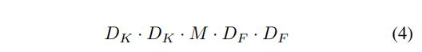
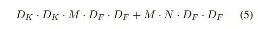
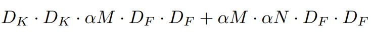
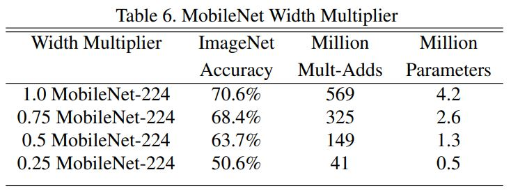

# MobileNets: Efficient Convolutional Neural Networks for Mobile Vision

Andrew G. Howard, Menglong Zhu, Bo Chen, Dmitry Kalenichenko, Weijun Wang,

Tobias Weyand, Marco Andreetto, Hartwig Adam(Google Inc.)

## Abstract

저자들은 MobileNet이라고 하는 모바일과 임베디드 비전 애플리케이션을 위한 아키텍처를 발표했다. 특징으로는 Depthwise separable convolution으로 가볍고 능률적인 DNN을 구축한다는 것이다. 또 Latency와 Accuracy간의 Trade off를 설정하는 두 개의 Global hyperparameter가 존재한다. 이 두개의 파라미터로 사용자는 각 도메인에 맞게 모델의 크기를 조절가능하다고 한다. 

## Introduction

CNN은 AlexNet이 ILSVRC 2012에서 우승하면서 컴퓨터 비전 분야에서는 대중화 되었다. 연구들의 경향이, 높은 정확도를 달성하기 위해서 깊고 복잡한 모델을 만드는 쪽으로 이어져왔다. 그러나 이런 방향의 발전이 꼭 네트워크를 효율적이라고 할 수는 없는데 로봇공학, 자율주행차, 증강 현실 같은 분야에서는 제한된 플랫폼 안에서 정해진 시간 안에 작업을 수행해야 하기 때문이다. 

이 연구에서 저자들은 이에 맞는 효율적인 네트워크 아키텍처와 아키텍처를 구축하는데 사용되는 두 개의 Hyper-parameter를 설명했다. 

## Prior Work

많은 연구에서 작고 효율적인 신경망 네트워크를 만드려는 시도가 있었다. 이런 연구들은 훈련된 네트워크를 압축하거나 직접적으로 작은 네트워크를 훈련시키는, 두 가지 방향으로 나눌 수 있다. MobileNet은 네트워크 Latency를 최적하면서도 작은 모델을 만들어내는데 초점을 두었다. 저자들에 따르면 작은 모델을 만드는데 관심 있는 많은 모델들이 사이즈에만 관심을 두고 속도는 고려하지 않는다고 한다. 

MobileNet은 주로 Depthwise separable convolution으로 만들어지고 처음의 몇개의 계층에 대해서만 연산량을 줄이기 위해서 Inception model을 사용한다.  Flattened network는 Fully factorized convolution으로 구축되었고 극도의 Factorized network의 잠재력을 보여줬다고 한다(J. Jin, A. Dundar, and E. Culurciello. Flattened convolutional neural networks for feedforward acceleration. arXiv preprint arXiv:1412.5474, 2014.). 이와는 별개로 Factorized Network에서는 Factorized convolution 뿐만 아니라 위상적(Topological) 연결 방법도 도입했다고 한다(M. Wang, B. Liu, and H. Foroosh. Factorized convolutional neural networks. arXiv preprint arXiv:1608.04337, 2016.). Xception에서는 Inception V3 네트워크를 능가하기 위해서 어떻게 Depthwise separable filter들의 규모를 확대하는지를 보여줬고 Squeezenet에서는 아주 작은 네트워크를 디자인 위해서 Bottlenetck 접근법을 사용했다. 네트워크 연산량을 줄이기 위한 다른 접근법으로는 Structured transform network와 Deep fried convnet이 있다. 

작은 네트워크를 위한 다른 방법으로는 훈련시킨 네트워크를 축소하고 분해하고 압축하는 것이다. Product quantization에 근거한 Compression, Hashing, Pruning, Vector quantization, Huffman coding이 많은 문헌 연구에서 제안된 바 있다. 거기다 다양한 네트워크 분해 방법이 훈련된 모델의 속도를 높이기 위해서 제안되었다. Distillation은 작은 네트워크를 가르치기 위해서 큰 네트워크를 사용하는 것이다. 또 다른 방법으로는 Low bit network가 있다. 

## MobileNet Architecture

### Depthwise Separable Convolution

MobileNet은 Depthwise separable convolution을 사용하는데 이 컨볼루션은 Standard convolution을 Depthwise convolution과 Pointwise convolution으로 분해한다. Depthwise convolution은 입력 채널 하나당 한 개의 필터를 매칭한다. Depthwise convolution의 출력을 Pointwise convolution을 통해 결합한다. Standard convolution 같은 경우에는 이런 과정을 한 번에 처리한다. 이렇게 두 단계로 나누는 것은 모델 사이즈와 연산량을 급격하게 줄이는 효과가 있다.

| Standard Convolution Filters                                 | Depthwise Convolutional Filters                              | Pointwise convolution                                        |
| ------------------------------------------------------------ | ------------------------------------------------------------ | ------------------------------------------------------------ |
|  |  |  |

Standard convolution은 DF x DF x M의 Feature map을 입력으로 받아서 DG x DG x N의 Feature map을 출력으로 내놓는다. DF와 DG는 각각 입력과 출력 Feature map의 너비와 높이이고 M, N은 채널 수 이다. 이때 컨볼루션 연산은 DK x DK x M x N으로 나타낼 수 있는데 DK의 너비와 높이를 가진 커널이 입력 채널 수 M만큼 그룹을 이루고 이 그룹이 N만큼 존재한다. 

저자들에 의하면 커널 K, 입력 F, 출력 G에 대해서 Stride 1, No padding으로 했을때 다음과 같은 식이 성립한다. 

그러므로 Standard convolution의 연산량은 다음과 같다.

MobileNet에서는 Depthwise separable convolution으로 출력 채널 수와 커널 사이즈가 맞물려 있는 것을 분해한다. Standard convolution은 커널에 근거하여 이미지 특징을 필터링하고 이 특징들을 결합해서 새로운 특징을 만들어내는 효과가 일어나는데 필터링과 결합 과정을 Depthwise separable convolution으로 두 단계로 분해 할 수 있는 것이다. 이렇게 하면 연산량을 크게 감소할 수 있게 된다.  Depthwise separable convolution은 앞에서 언급한 것처럼 Depthwise convolution과 Pointwise convolution으로 구성되어 있다. MobileNet에서는 두 계층 모두에 ReLU 비선형성과 Batch normalization을 적용했다. 

입력 채널당 하나의 필터를 매칭하는 Depthwise convolution은 다음과 같이 나타낼 수 있다. 

K_hat은 DK x DK x M 크기의 커널이다. m번째 필터는 입력 F의 m번째 채널에 적용되어 출력 G의 m번째 채널을 만들어 내는데 사용된다. Depthwise convolution의 연산량은 다음과 같다. 

채널마다 다른 필터가 적용되기 때문에 새로운 특징을 만들어 내기 위해서 출력을 합치는 작업을 따로 진행해야 한다. 그래서 Pointwise convolution을 수행한다. Depthwise separable convolution의 연산량은 다음과 같이 계산한다.

이렇게 하면 Standard convolution과 비교해서 다음과 같은 양만큼 연산량을 줄일 수 있게 된다. 

MobileNet에서는 3x3짜리 Depthwise separable convolution을 사용했으므로 본래의 컨볼루션보다 8-9배 적은 연산량을 가지면서 아주 적은 정도의 성능 하락을 보인다. 

### Network Structure and Training

MobileNet은 첫 번째 계층만 원래의 Convolution이고 나머지는 Deptheise separable convolution으로 구축되었다. 

위의 첫번째 계층을 제외한 모든 Convolution 계층에는 아래와 같이 Batch normalization과 ReLU를 적용했다. 

Down sampling은 첫 번째 계층과 Depth wise convolution의 Stride에 의해서 조절되었다. 마지막에 Average pooling은 Spatial resolution을 1로 줄여버린다. Depthwise와 Pointwise를 별개의 계층으로 쳤을때 MobileNet은 28개의 계층으로 이루어져 있다. 

저자들이 말하기 단순히 적은 수의 Mult-Adds 연산만이 중요한 것이 아니라 이 연산들이 어떻게 효율적으로 구현되는지가 중요하다고 한다. 예를 들어서 정형화 되어 있지 않은 희소 행렬 연산은 보통 매우 높은 수준의 희소 정도가 아니면 밀집 행렬보다 빠르지 않다. 이 연구에서의 모델 구조는 거의 모든 연산을 밀집한 Pointwise convolution으로 수행한다고 하는데 이는 Highly optimized general matrix mulitply(GEMM) function 덕분이라고 한다. GEMM은 최적화된 선형 대수 알고리즘 중 하나이다. MobileNet은 95%의 연산 시간을 Pointwise convolution에 쓰고 있는데 전체 파라미터 수의 75%가 여기에 속해 있다. 그 다음에 추가적인 파라미터는 거의 완전 연결 계층에 속해 있다. 

MobileNet 모델은 RMSprop optimizer strategy로 Asynchronous gradient descent로 훈련되었다. 그러나 용량이 큰 모델을 훈련시킬때와는 달리 더 적은 Regularization과 Data augmentation을 적용했는데 MobileNet같이 작은 모델은 과적합 같은 문제에 덜 민감하기 때문이다. 또, Inception V3와 같이 Side head, Label smoothing, 이미지 크롭의 사이즈를 제한함으로써 이미지 왜곡 정도를 줄이는 기법 등을 적용하지 않았다. 또 Depthwise convolution 계층의 필터에는 거의 Weight decay를 사용하지 않는 것이 중요하다 왜냐하면 채널마다 하나의 필터가 할당되기 때문에 보통의 컨볼루션 필터와 비교했을때 파라미터 수가 적기 때문이다. 

### Width Multiplier: Thinner Models

이미 MobileNet 모델 자체가 충분히 작고 Latency가 작긴 하지만 어떤 경우에는 모델이 좀 더 작고 빨라야 하는 경우도 있다. 이런 경우를 대비해서 저자들은 Width multiplier 라고 불리우는 α 파라미터를 도입했다. 이 파라미터의 역할은 모든 계층에 균일하게 적용해서 네트워크를 전체적으로 얇게 만드는 것이다. 

예를 들어서 어떤 계층과 α 있을 때 입력 채널 수는 αM이 되고 출력 채널 수는 αN이 된다. 따라서 α를 적용한 Depthwise separable convolution의 연산량은 다음과 같다. 

α 는 (0, 1]의 수를 갖는데 보통 1, 0.75, 0.5, 0.25로 셋팅된다 1일때는 보통의 MobileNet이고 1보다 작을 때는 크기가 줄어든 MobileNet이 된다. Width multiplier의 효과는 거의 α^2만큼 모델 파라미터의 수와 연산량을 줄이는것이다. Width multiplier를 적용하면 사용 목적에 맞게 Accuracy, Latency, Size 간의 Trade off를 결정할 수 있다. 또 From scratch부터 훈련시킬 필요가 있는 모델에도 적용 가능하다. 

## Experiments

### Model Choices

저자들은 MobileNet에서 Depthwise separable convolution으로 구축했을 때와 원래의 Convolution으로 구축했을때를 비교했다. 

Table 4를 보면 Depthwise separable covolution이 정확도가 1% 밖에 안떨어지면서 많은 양의 Mult-adds와 모델 파라미터 수를 줄이는 것을 확인할 수 있다. 

다음으로 Width multiplier로 얇아진 모델의 결과와 계층을 줄여 짧아진 모델의 결과를 비교했다. 모델을 짧게 만들기 위해서 Table 1에서 Feature map 크기가 14 x 14 x 512인 Separable 필터의 5개의 계층을 제거했다. 

Table 5를 보면 연산량과 파라미터 수는 비슷하면서 얇아진 모델의 정확도가 약 3% 더 정확하다는 것을 볼 수 있다.

### Model Shrinking Hyper-parameters

Table 6을 보면 α = 0.25일때 아키텍처가 너무 작아지기 전까지는 연산량과 파라미터가 줄어들면서 정확도가 Smoothly 떨어지는 것을 알 수 있다. 

Table 7을 보면 Resolution multiploier에 의해서 입력 Resolution이 감소될때 Smoothly 정확도와 연산량이 떨어지는 것을 볼 수 있다.

Figure 4는 Width multiplier α 가 {1, 0.75, 0.5, 0.25}의 원소 일때, Resolution이 {224, 192, 160, 128}일때의 16가지 경우의 모델의 정확도와 연산의 관계를 보여준다. α = 0.25일때 매우 작은 모델때 확 달라지는 것 빼고는 log linear의 형태를 보인다. 

Figure 5는 Width multiplier α 가 {1, 0.75, 0.5, 0.25}의 원소 일때, Resolution이 {224, 192, 160, 128}일때의 16가지 경우의 모델의 정확도와 파라미터 수의 관계를 보여준다.

Table 8은 α = 1, Resolution 224의 MobileNet과 GooleNet 그리고 VGG16를 비교한 표이다. MobileNet이 거의 VGG16만큼 정확하면서 32배 정도 작으면서 27배 연산량이 적은 것을 알 수 있다. 또 거의 GoogleNet보다 더 정확하면서 더 크기가 작고 2.5배 연산량이 적은 것을 확인할 수 있다. 

Table 9는 α = 0.5에 Resolution 160과 다른 모델을 비교한 표이다. 얇아진 MobileNet은 AlexNet보다 4% 정도 정확하면서 45배 더 작고 9.4배 적은 연산량을 보인다. 또 같은 크기일때 4% Squeezenet보다 정확하고 22배 연산량이 더 적다. 

### Fine Grained Recognition

저자들은 Fine grained recognition을 위해서 Stanford Dogs 데이터셋으로 MobileNet을 훈련시켰다. 저자들은 Noisy가 있는 웹 데이터로 먼저 모델을 학습시키고 Stanford Dogs 데이터셋으로 Fine tuning시켰다. 

Table 10을 보면 MobileNet이 줄어든 연산량과 모델 크기와 함께 최고의 성능을 보임을 확인할 수 있다. 
