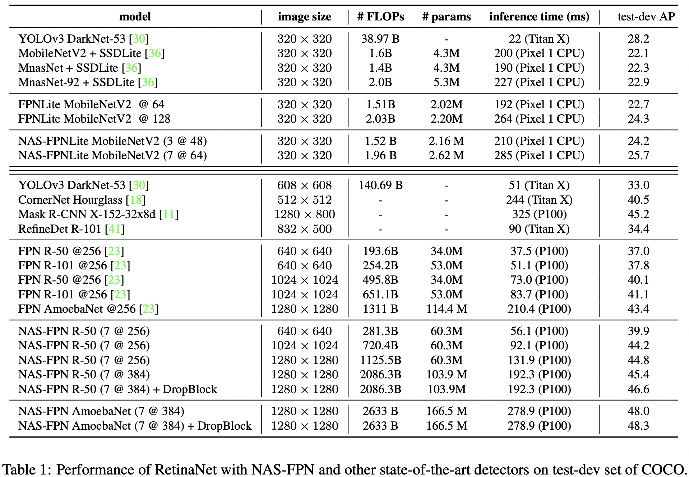
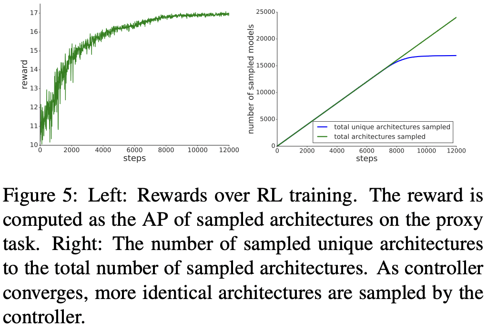
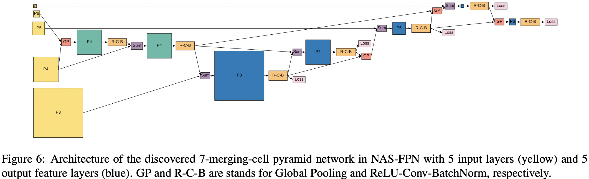
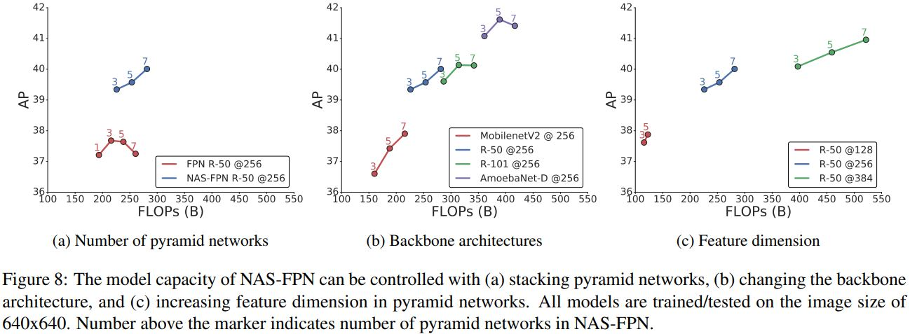
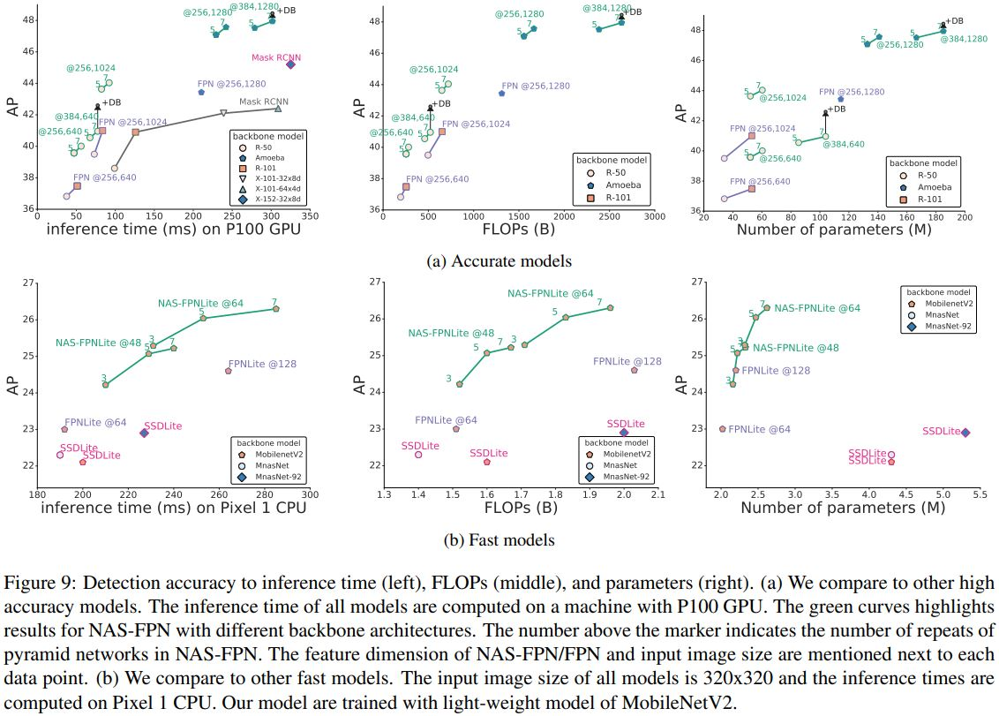

# NAS-FPN: Learning Scalable Feature Pyramid Architecture for Object Detection

Golnaz Ghaisi, Tsung-Yi Lin, Ruoming Pang, Quoc V. Le(Google Brain)

## Abstract

저자들은 수동으로 컨볼루션 아키텍처를 찾는 것 대신에 Object detection을 위한 아키텍처를 Neural Architecture Search를 도입해서 자동으로 찾는 것을 연구 목표로 했다. 이때 모든 Scale에 대해서 연결 경로를 만드는 Scalable search space에서 아키텍처를 찾았다. 저자들이 발견한 NAS_FPN이라고 하는 아키텍처는 Top-down, Bottom-up 연결 경로가 있어서 Feature scale에 상관없이 Fusion을 수행할 수 있도록 했다. 저자들은 RetinaNet 프레임워크에서 여러 Backbone 네트워크를 쓴 NAS-FPN으로 괄목할만한 Accuracy와 Latency tradeoff를 달성했다. 

## Introduction

Object detection에서 좋은 성능을 내기 위해서 Pyramidal feature representation이라고 하는, 이미지를 여러 계층의, 다양한 크기로 다루는 방법이 많이 쓰였다. 그 중 FPN은 Object detection을 위한 Pyramidal feature representation을 만들어 내는데 대표적인 아키텍처 중 하나이다. FPN에서는 Backbone에서의 두 가지 인접한 계층의 Feature hierarchy를 결합하는것을 연속해서 수행하는 Feature pyramid를 구축한다. 이때 결합은 Top-down, Lateral connection 연산으로 수행한다. Semantically strong하지만 낮은 해상도를 가진 High-level feature들이 Up sampling 되어서 더 높은 해상도의 Feature들과 결합되면 Semantically strong하면서 높은 해상도를 지니는 Feature가 만들어진다. 그런데 저자들이 말하길 FPN은 최적의 디자인이 아닐 수 있다고 한다. PANet에서는 FPN에 추가적인 Bottom-up pathway를 추가하여 높은 레벨의 낮은 해상도 특징을 개선시켰다. 그 밖의 많은 연구에서 크기에 상관없이 Feature를 결합하는 방법을 제안했다. 

그런데 이런 Feature pyramid architecture를 디자인하는 것의 문제는 아주 큰 Design space에 있다. 다른 크기의 Feature를 결합하기 위한 경로를 조사하는 경우의 수는 계층의 숫자가 늘어날수록 지수함수적으로 증가한다. Neural Architecture Search 알고리즘에서는 아주 큰 Seach space에서 Image classification에 최적화된 아키텍처를 자동으로, 효율적인 방법으로 찾는 방법을 제안했다. Zoph 등의 연구에서는 Modularized architecture을 제안했는데 이 아키텍처들은 반복해서 쌓여져 Scalable한 더 큰 아키텍처가 될 수 있다. Zoph 등의 연구에 영감을 받아 저자들은 Pyramidal representation을 생성하는 Scalable한 아키텍처의 Search space를 고안해냈다. 저자들의 연구의 핵심은 Multiscale feature representation을 만드는 가능한 모든 Cross-scale connection을 조사하는 Seach space를 디자인하는 것이다. 저자들은, Search 과정 중에 입력 방식과 출력 방식이 동일하여 지속적으로 입력과 출력이 Search 과정 중에 재활용될 수 있는 Atomic 아키텍처를 발견하는 것을 목표로 했다. Modular search space(Search 과정이 전체적으로 통합되어 있는 것이 아니고 Module화 되어 있어서 원하는 Search 수만큼 수행 가능)는 Pyramidal architecture를 찾는 과정의 복잡도를 조절 가능하게 한다. 이 방법의 또 다른 이점은 Object detection의 결과를 언제든(Search 중간 과정에라도) 도출해낼수 있다는 것이다. 

저자들이 주장하길 NAS-FPN은 Object detection architecture를 구축하는데 큰 유연함을 제공한다고 한다. 일단 다양한 Backbone 모델에도 잘 적용되고 속도가 중요한 모바일에서의 모델이나 정확도가 중요한 모델를 취사 선택할 수 있도록 속도와 정확도 간의 Trade off를 제공한다. 

## Related Works

### Architecture for Pyramidal Representations

Computer vision 분야에서는 모델의 성능을 높이기 위해서 다양한 Scale의 Feature를 사용한다. 그러나 깊이가 깊은 모델의 경우 이미지의 해상도를 다르게 해서 각각 입력으로 넣어 모델은 훈련시키는 방법은 큰 계산적 부담이 된다. 그래서 여러 연구에서는 모델 내에서 다른 Scale을 가지는 계층을 서로 연결시켜서 여러 Scale의 Feature를 사용하는 방법을 사용한다. 이런 방법의 장점은 저단계의 고해상도의 Feature를 이용해서 이미지 내 객체에 대한 정확한 정보를, 모델의 성능을 개선하는데 쓸 수 있다는 것이다. 이 분야가 활발하게 연구가 진행되긴해도 대부분의 Cross-scale connection을 포함하는 아키텍처의 디자인은 Backbone에 비해서 얕은 경향이 있다. 저자들은 Pyramidal representation을 위해서 아키텍처를 수동으로 디자인하는것 대신에 Scalable search space와 Neural Architecture Search 알고리즘을 혼합한 개념을 사용해서 Pyramidal architeture의 Search시의 방대한 Search space를 극복할 수 있게 했다. 저자들은 Search를 통해서 여러번 반복할 수 있는 아키텍처를 찾는 방법을 고안했다. 그래서 저자들의 아키텍처는 훈련 중간에도 결과를 낼 수 있다(Early exit). 

### Neural Architecture Search

저자들의 연구는 Neural Architecture Search와 깊은 관련이 있다. Zoph 등의 연구는 NASNet이라고 하는 네트워크를 얻기 위한 Cell(혹은 계층)을 디자인 하기 위해 RL을 수행하는 Controller RNN을 사용한다. 저자들 역시 이 연구에서 RL controller를 사용한다. 그러나 차이점이 있다면 다음과 같다. 

- 저자들의 방법의 출력은 Multiscale feature이다. 
- 저자들의 방법은 구체적인 Cross-scale connection을 찾는다.

저자들의 이 연구가 Publication될때까지 저자들이 말하길 NAS를 Object detection에 적용한 것은 저자들의 연구가 처음이라고 한다. 

## Method

저자들은 간단하면서 효율적이라는 이유로 RetinaNet 프레임워크를 Baseline으로 사용했다. RetinaNet은 두 가지 중요부분이 있는데 하나는 Backbone network이고 다른 하나는 Feature pyramid network이다. 저자들의 연구 목적은 RetinaNet 프레임워크에서 더 좋은 FPN을 찾는 것이다. 

더 좋은 FPN을 찾기 위해서 저자들은 NAS를 사용했다. NAS는 RL을 사용해서 주어진 Search space에서 사장 좋은 모델 아키텍처를 선택하기 위한 Controller를 훈련시킨다. Controller는 Search space 안에서 자식 모델의 정확도를 자신의 파라미터를 업데이트 하기 위한 Reward signal로서 사용한다. 여러 시행착오를 거치면서 Controller는 더 좋은 아키텍처를 만드는 방법을 학습한다. 여러 연구에서 확인된 것처럼 Search space는 성공적인 아키텍처 Search를 위해서 중요한 역할을 한다. 

저자들은 Feature pyramid representation을 위한 FPN의 Search space를 디자인했는데 이때 현실적으로 가능한 Search를 위해서 Search 동안에 FPN을 N번만큼 반복하게 강제하여 더 큰 구조로 병합시켰다. 저자들은 이 Feature pyramid architecture를 NAS-FPN이라고 부른다. 

### Architecture Search Space

저자들의 Search space에서 Feature pyramid network는 여러개의 Merging cell로 구성되어 있다. Merging cell은 여러 입력 계층에서의 Feature를 하나의 Representation으로 결합한다. 

#### Feature Pyramid Network

Feature pyramid network는 여러 Feature 크기의 계층을 입력으로 받고 결합하여 같은 Feature 크기를 갖는 계층을 출력한다. 저자들은 RenitaNet의 방식을 따라서 각 Feature 계층 그룹의 마지막 계층을 FPN의 첫 번째 네트워크의 입력으로 받는다. 첫번째 FPN의 출력은 다음 FPN의 입력으로 들어간다. 여기서 {C3, C4, C5, C6, C7} 5개 Scale의 입력 Feature를 사용하는데 가각 원본 Scale에 비해 Stride가 {8, 16, 32, 64, 128} 픽셀이다. C6, C7은 C5에 단순히 Stride 2, 4를 각각 적용한 Max pooling을 통해서 만들어낸다. Backbone에서 이렇게 도출된 Input feature들은 여러 개의, Cross-scale connection 개념을 적용한, Merging cell로 구성된 Pyramid network의 입력으로 들어간다. Pyramid network는 여러 Scale의 Feature representation인 {P3, P4, P5, P6, P7}을 출력한다. Pyramid network의 입력과 출력은 동일한 Scale의 Feature 계층이기 때문에 여기서 FPN 아키텍처는 반복적으로 쌓일수 있다. 저자들이 말하길 Pyramid network가 반복되는 숫자를 조절하는 방법이 Detection speed와 Accuracy의 Trade off를 결정하는 단순한 방법이라고 한다. 

#### Merging cell

Cross-scale connection은 Semantically strong한 High-level feature와 High resolution의 Low-level feature를 결합하여 모델의 성능을 높인다. 

저자들은 Merging cell이라고 하는 저자들의 연구에서 FPN의 기초적인 Building block을 제안했다. Meging cell은 어떤 두 입력 Feature 계층을 하나의 출력 Feature 계층으로 병합한다. 각 Megring cell은 어떤 임의의 두 입력 Feature 계층을 받아서 Precessing operation을 적용하고 원하는 Scale의 출력 Featuer 계층으로 두 입력 계층을 합친다. FPN은 N개의 서로 다른 Merging cell로 구성되어 있는데 N 값은 Search 과정 중에 주어져야 한다. Merging cell에서 모든 Feature 계층은 같은 숫자의 Filter를 가진다(채널 수가 같다). 

어떻게 Merging cell을 구축할 것인가는 Controller RNN이 결정한다. RNN controller는 두 개의 Candidate feature 계층을 선택하고, 해상도가 다른 두 Feature 계층을 어떤 방식으로 결합할 것인가와 관련된 Binary operation도 선택한다. 각 Merging cell은 4개의 Prediction step으로 연산을 수행하는데 이때 각기 다른 Softmax classifier로 연산을 수행한다. 

1. 후보군 중에 Feature 계층 hi을 선택한다.
2. 비복원추출 방식으로 후보군에서 Feature 계층 hj를 선택한다. 
3. 출력 Feature 해상도를 선택한다. 
4. hi, hj를 결합한 Binary opeartion 방식을 선택하고 3에서 선택한 해상도로 Feature layer를 하나 출력한다. 

Binary operation 방식으로 저자들은 Sum, Global pooling이라는 두 가지 방식을 디자인했다.

 

이 연산에는 특별히 학습가능한 파라미터를 더하지 않았다. Sum operation은 두 Feature를 결합하는데 흔히 다른 연구에서도 쓰이는 방법이고 Global pooling operation은 저자들이 디자인한 연산이다. 저자들은 Pyramid Attention Network라는 논문의 방식을 따르는데 차이점은 원래 디자인에서 컨볼루션 계층을 제거하는 부분을 제외한 것이다. 입력 Feature 계층은 Binary operation 적용 전에 필요하다면 Max pooling이나 Nearest neighbor upsampling 연산을 통해서 출력 해상도로 조정된다. Merged feature 계층 뒤에는 ReLU와 3x3 컨볼루션 그리고 Batch normalization 계층을 통과시킨다. 

Pyramid network으로 들어가는 입력 Feature 계층은 각 Merging cell의 입력 후보군의 초기 리스트를 구성한다. Step 5에서는 새롭게 만들어진 Feature 계층이 입력 후보군 리스트에 추가되고 다음 Merging cell을 위한 새로운 후보가 된다. 아키텍처 Search 중에는 같은 해상도를 가진 후보 Feature가 여럿 있을 수 있다. 찾아진 아키텍처의 계산적 부담을 덜기 위해서 저자들은 Step 3에서 Intermediate merging cell을 위한 Stride 8 feature을 선택하는 것을 막았다. Merging cell를 구성하는 마지막 단계에서는 가장 최근에 구성된 Merging cell 5개가 출력 Feature pyramid {P3, P4, P5, P6, P7}을 위해서 디자인된다. Output feature level의 순서는 Controller에 의해 예측된다. 각 Output feature layer는 Output feature pyramid가 완전하게 만들어질때까지 Step 1, 2, 4를 반복하여 만들어진다. 저자들은 어떤 출력 계층에도 연결되지 않은 모든 Feature 계층을 모아서 해당 해상도에 대응하는 출력 계층으로 그들을 더했다. 

### Deeply supervised Anytime Object Detection

NAS-FPN을 Scaling할때 여러 Pyramid network를 쌓는 방식으로 구현하는 것의 이점은 Feature pyramid representation이 어떤 형태의 Pyramid network의 출력에서도 얻어질 수 있다는 것이다. 이 특징은 Early exit에 의해 도출되는 Detection result에서 결과를 뽑아내는 Anytime detection을 가능하게 한다. 즉 저자들은 Intermidiate pyramid network에 Classifier와 Box regression head를 붙여서 Deep supervision 방식으로 훈련시킬 수 있다. 추론시에는 모델은 모든 Pyramid network에서의 순전파를 마칠 필요가 없다. 대신에 어떤 형태의 Pyramid network 출력에서라도 순전파를 멈추고 탐지 결과를 도출해낼 수 있다. 이런 특성은 연산 Resource나 Latency가 중요 이슈인 상황에 유용할 수 있고 Detection 결과를 만들어내는데 할당되는 Resource가 동적으로 결정되는 상황에서 하나의 솔루션이 될 수 있다. 

## Experiments

저자들은 NAS-FPN 아키텍처를 발견하기 위한 RNN controller를 학습하기 위한 NAS에 관한 실험을 수행했다. 그리고 나서 발견된 NAS-FPN이 Backbone과 Image size와 상관 없이 성능이 준수하다는 것을 입증했다고 주장한다. NAS-FPN의 용량은 Pyramid network에서 쌓이는 계층의 수나 Feature dimension(channel)의 수를 조절하면 쉽게 조정할 수 있다. 

### Implementation Details

저자들은 오픈소스 RetinaNet 구현체를 실험에 사용했다. 이 모델은 여러 TPU로 64 이미지를 한 배치로 해서 훈련시켰다. 훈련 중에는 출력 이미지 사이즈가 원본 이미지의 [0.8, 1.2]의 비율로 랜덤하게 적용되도록 Multiscale 훈련을 시켰다. 모든 컨볼루션 계층 뒤에는 Batch normalization 계층이 붙는다. Focal loss를 위한 하이퍼파라미터로는 α=0.25,  γ=1.5으로 설정했다. Weight decay 0.001, Momentum 0.9이고 50 epochs 동안 훈련시켰다. 초기 LR은 30 epochs 동안 0.08이고 30, 40 epoch 때 0.1씩 Decayed된다. 실험에 DropBlock을 적용할때는 150 epochs동안 훈련시켰고 120, 140 epoch때 각각 Decayed된다. Step-wise lr schedule은 1280x1280 이미지 사이즈의 AmoebaNet backbone의 저자들의 모델에서는 훈련이 안정적이지 않았기 때문에 이때는 Cosine lr schedule을 적용했다. 대부분의 실험에서 모델은 COCO train2017셋에서 훈련시켰고 COCO val2017셋에서 검증되었다. Table1에서는 test-dev으로 테스트했을때 Accuracy를 나타낸다. 

### Architecture Search for NAS-FPN

#### Proxy task

RNN controller의 훈련 시간을 단축시키기 위해서 저자들은 Proxy task라고 하는 실제 훈련시간보다는 짧지만 실제 task와 관련이있는 방법이 필요했다. Proxy task는 좋은 FPN 아키텍처를 확인하기 위한 Search 중에 사용될수 있다. 저자들이 떠올린 방법은 단순히 대상 Task의 훈련 과정을 줄이고 그것을 Proxy task로서 사용하는 것이었다. 저자들은 RetinaNet의 성능 수렴이 일어나도록 50 epochs동안 훈련을 진행한 것과 달리 Proxy task에서는 10 epochs동안만 훈련을 진행했다. 그리고 속도를 높이기 위해서 입력 크기가 512x512인 ResNet-10의 상대적으로 작은 Backbone 아키텍처를 사용했다. 이 방법을 적용했을때 Proxy task 훈련시간은 TPU들에서 1시간이었다. Proxy task에서는 Pyramid network는 3번 반복된다. 초기 LR은 8 epochs동안은 0.08이고 8 epoch에서는 0.1의 계수배로 Decayed된다. COCO train2017에서 7329장의 임의로 선택한 이미지를 검증 셋으로 썼는데 RNN controller의 Rewards를 얻기 위한 이미지로 사용했다. 

####  Controller

저자들의 RNN controller는 Proximal Policy Optimization 알고리즘으로 훈련시켰다. Controller는 다른 아키텍처의 자식 네트워크를 샘플로 뽑는다. 이 아키텍처들은 Worker들의 Pool을 사용해서 Proxy task로 훈련시켰다. Workqueue는 이 실험에서는 100개의 TPU로 구성되어 있다. 미리 검증셋으로 잡아 놓은 데이터셋에서의 AP 척도의 Detection accuracy는 Controller를 업데이트 하기 위한 Reward로서 사용된다. 

Figure 5의 왼쪽은 훈련 Iteration에 따른 샘플로 뽑힌 아키텍처들의 AP를 보여준다. 그래프를 보면 Controller가 점점 더 좋은 아키텍처를 만들어내는 것을 확인할 수 있다. Figure 6의 오른쪽은 Step에 따른 총 샘플로 뽑힌 아키텍처의 숫자와 RNN controller에 의해 만들어진 하나뿐인 아키텍처의 총 숫자를 나타낸다. 하나뿐인 아키텍처의 숫자는 8000 step 이후로 수렴하는 것을 확인할 수 있다. 저자들은 RL 훈련 과정 중에 샘플로 뽑힌 아키텍처들 중에서 가장 높은 AP를 보인 아키텍처를 모든 실험 중에 사용했다. 아 아키텍처는 8000 step에서 샘플로 뽑혔고 그 이후로 여러번 Step에서 샘플로 뽑혔다. 아래 Figure 6는 이 아키텍처를 보여준다. 

 

#### Discovered feature pyramid architectures

Figure 7(b-f)는 RL 훈련 중에 점진적으로 Higher reward를 보이는 NAS-FPN을 그린 것이다. 저자들이 발견한 사실은 RNN controller가 빠른 시간에 중요한 Cross-scale connection을 만들 수 있다는 것이다. 예를 들어서 이 Controller는 High resolution 입력과 출력 Feature 계층 사이의 경로를 발견했는데 이는 작은 객체를 탐지하기 위해서 중요한 HIgh resolution feature을 만들어낸다. Controller에 의한 성능이 수렴되면서(Figure 5의 왼쪽) Controller는 Figure 7a(원래의 FPN 구조)과는 다르게 여러개의 Top-down, Bottom-up 경로를 가진 아키텍처를 발견하게 된다. 또 성능이 수렴하면서 Feature를 다시 사용하는 방법도 학습하게 된다. 후보군에서 임의로 두 개의 입력 계층을 뽑는 것 대신에 Controller는 한번 계산된 Feature representation을 다시 사용하기 위해서 새롭게 생성된 계층으로 경로를 구축하는 방법을 학습한다.  

### Scalable Feature Pyramid Architecture

R-50, 5 @ 256은 ResNet-50 Backbone, 5 Stacked NAS-FPN pyramid networks, 256 feature dimension을 뜻한다. 

#### Stacking pyramid networks

저자들의 방법은 작은 아키텍처를 여러번 쌓으면 더 큰 아키텍처를 만들 수 있다는 특징이 있다(작은 빌딩 블록을 쌓아 더 큰 블록으로). 

Figure 8a를 보면 원본 FPN을 많이 쌓는다고 성능이 꼭 개선되는 것은 아닌 반면 NAS-FPN은 쌓을수록 성능이 개선되는 것을 확인할 수 있다. 저자들이 말하길 이는 저자들의 Search 알고리즘이 수동으로는 찾기 힘든, 성능을 개선시키는 아키텍처를 찾아낼수 있는 능력이 있음을 보여주는 것이라고 한다. 그림에서는 Proxy task로 3개만 쌓았지만 7개까지 성능이 개선되었다고 한다. 

#### Adopting different backbone architecture

저자들은 Accuracy와 Speed의 Tradeoff를 결정하기 위한 방법으로 Backbone 네트워크를 변경해보는 방법이 있다고 한다. NAS-FPN은 Proxy task 때문에 ResNet-10 Backbone으로 Search를 수행하긴 했지만 다른 Backbone에서도 Search를 수행할 수 있다고 한다.  Figure 8b가 그 결과를 보여준다. 

#### Adjusting feature dimension of feature pyramid networks

Figure 8c를 보면 NAS-FPN의 Feature dimension을 다르게 했을때의 성능 변화를 알 수 있다(ResNet-50 backbone). Feature dimension을 증가시키면 Detection 성능은 개선되지만 그것이 꼭 효율적인 방법으로 성능을 개선하는 것은 아닌 것으로 나타났다. R-50, 7 @ 256은 R-50 3 @ 384와 비슷한 AP를 보이지만 훨씬 적은 FLOPs를 가진다. Feature dimension을 증가시키면 Model regularization 기술을 적용할 필요가 있다. 그래서 저자들은 DropBlock을 적용했다. 

#### Architectures for high detection accuracy

저자들은 정확하면서도 효율적인 모델을 구축하는 방법을 연구했다. Figure 9a를 보면 NAS-FPN R-50 5 @ 256 모델이 R-101 FPN 모델과 비슷한 FLOPs를 가지면서도 2.5 AP가 더 높은 것은 볼 수 있다.  이는 FPN에서 높은 용량을 가진 Backbone으로 바꾸는 것보다 NAS-FPN으로 FPN을 대체하는것이 더 효율적이라는 것을 의미한다. NAS-FPN을 적용하고 나서 더 높은 정확도를 원하면 무거운 Backbone을 쓰거나 더 높은 Feature dimension을 적용하는 것이 답이 될 수 있다. 

