# Network In Network

Min Lin(Graduate School for Integrative Sciences and Engineering, Department of Electronic & Computer Engineering National University of Singapore, Singapore),

Qiang Chen(Department of Electronic & Computer Engineering National University of Singapore, Singapore),

Shuicheng Yan(Department of Electronic & Computer Engineering National University of Singapore, Singapore)

## Abstract

저자들이 이번 연구에서 주목한 점은 수용체 영역에서 각 입력 이미지에 대한 패치들의 변별력을 모델 차원에서 증가시킬 수 있는가이다. 보통 CNN에서는 커널이 이미지를 Convolve하고나서 이 출력을 비선형 활성화 함수를 거쳐 출력한다. 이렇게 하는 것 대신에 저자들은 수용체 영역 부분에서 여러 층의 퍼셉트론을 활용하여 CNN의 커널과 비슷하게 작동하면서 좀 더 유의미한 특징을 잡아내기를 의도했다.  또 이런 방식을 통해 출력되어 나온 특징맵에 Global Average pooling 기법을 적용하고자 했다. Gap는 저자들에 따르면 Fully connected layer의 stack보다 해석하기 쉽고 과적합 하는 경향이 상대적으로 더 작다고 한다. 이렇게 구현한 네트워크를 CIFAR-10, 100, SVHN, MNIST 데이터셋에서 테스트했다고 한다. 

## Introduction

CNN에서의 필터는 Generalized linear model(GLM)이라고 할 수 있는데 비선형 활성화 함수를 거치기는 하지만 저자들은 이런 방식은 추상화 정도가 낮은 수준이라고 주장한다. 비록 GLM에 의해 정의되는 분리 평면 위에 모든 샘플이 있다면, 그래서 선형적으로 분리가 가능하다면 GLM은 괜찮은 수준의 추상화를 할 수 있지만 데이터는 보통 비선형적인 매니폴드 위에 존재하기 때문에 선형적으로 구별이 안된다고 말한다. 그래서 자자들은 GLM을 Micro network로 대체하고 특별히 여러 계층의 퍼셉트론을 쌓아서 이 Micro network를 구성했다고 한다. Micro network는 A universal function approximator이다. 네트워크는 역전파에 의해서 훈련이 가능하다. 

이 논문에서 비교하고자 하는 최종적인, 전통적인 CNN과 mlpconv 네트워크 구조는 다음과 같다.

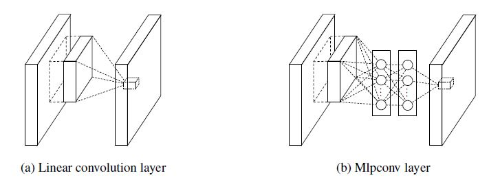

둘 다 입력 데이터를 슬라이딩 하는 수용체 영역과 출력 특징 벡터를 맵핑한다. 후자의 경우, 여러 Fully connected 계층 + 비선형 활성화 함수 블록이 쌓아져 있는 MLP로 구성되어 있다. MLP는 전자의 커널과 같이 모든 입력 데이터 패치에 대한 연산을 할 때 공유된다. 이러한 MLP이 모여있는 작은 네트워크를 저자들은 Network In Network라고 부른다. 

전통적인 CNN에서 분류 작업을 위해서 Fc를 활용했던것과는 달리, 여기서는 마지막 mlconv 계층에서 출력된 특징맵을 GAP를 통해서 공간적(채널별로)인 특징맵 값의 평균을 낸다. 그리고 이것을 카테고리의 Confidence로 삼는다. 전통적인 CNN은 Fc가 블랙 박스의 역할을 하기 때문에 어떻게 카테고리별 정보가 컨볼루션 계층으로 전파되는지 해석하기 어렵다. 하지만 저자들이 주장하길 GAP은 특징맵과 카테고리 사이의 대응을 강제하기 때문에 더 유의미하게 해석이 가능하다고 한다. 그리고 과적합 가능성 경향이 더 많고 그렇기 때문에 과하게 Dropout에 의존하는 전자와 달리 후자는 전체 네트워크의 과적합을 방지하는 규제의 역할도 겸한다고 한다.  

## Convolutional Neural Networks

전통적인 방식의 CNN의 비선형 함수로 ReLU를 사용할 때 특징 맵은 다음과 같이 계산된다. 

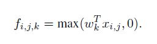

i, j는 특징 맵에서의 픽셀 인덱스이고, x_i_j는 i, j를 중앙점으로 하는 입력 패치이며 k는 특징맵의 채널 인덱스를 의미한다. 

전통적인 컨볼루션 연산은 입력 이미지의 요소들의 선형적으로 구별 가능할 때는 충분하다고 한다(선). 그런데 좋은 추상화에 기여하는 특징은 보통 비선형을 포함하고 있다(그래서 비선형 활성화 함수수를 통해 비선형성 추가). 이를 위해서 전통적인 CNN은 필터를 매우 많이 해서 가능한 특징들을 모두 탐사하려고 한다. 그래서 많은 필터 수에 의한 탐사는 다음 계층에게(특히 고수준의 추상화를 진행하는 계층) 부담이 될 수 있다. 그래서 저자들이 생각한 것은 깊은 계층에서 특징 맵의 패치들을 결합하여 추상화를 진행하기 전에 각 입력 특징맵의 패치 수준에서 더 좋은 추상화로 이득을 보자는 것이었다.   

Maxout(연결된 뉴런 중 큰 값을 취해서 비선형성을 확보) 네트워크는 

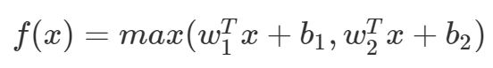

Affine 특징 맵(활성화 함수 적용 없이, 직접적으로 연속된 컨볼루션을 통해 나온 특징 맵)에 Maximum 풀링 연산을 통해서 특징 맵의 수를 줄일 수 있다. Maximization은  Piecewise linear approximator를 만들 수 있고(아래 그림을 보면 여러 하위 함수의 그룹으로 정해진 함수가 있는데 이 함수 도메인은 특정 간격의 하위 도메인에 적용된다. 연결된 뉴런 중 큰 값을 취하는 특징 때문인듯) 

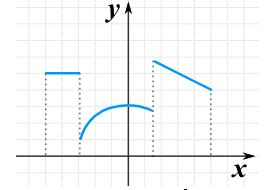

이런 특징 때문에 Convex function들을 근사하는 것이 가능하다.

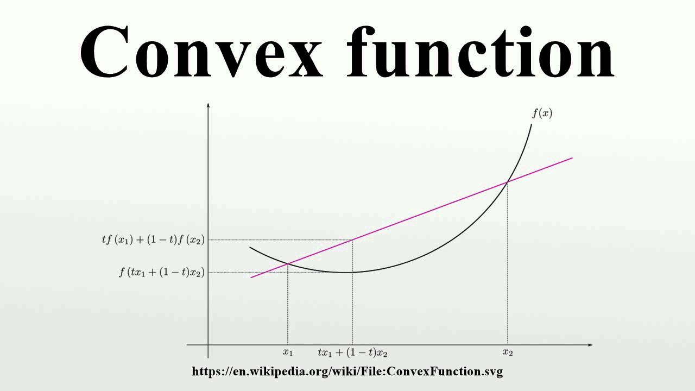

결과적으로 전통적인 컨볼루션 계층에서 특징들의 선형적인 구별만이 가능했다면 Maxout 네트워크는 Convex적인 특징들을 처리할 수 있다. 

그러나 이런 Maxout 네트워크는 입력 안에 Convex적인 특징들이 존재한다는 가정이 필요하다. 그런데 꼭 특징들이 이럴 필요는 없다. 그래서 저자들은 Network In Network에서 입력 특징에 대해 보다 복잡하고 추상적으로 처리할 수 있도록 의도했다. 

작은 네트워크를 사용하여 입력을 슬라이딩 하는 방법은 이 연구 전에도 있었으나 모두 특정한 도메인에 적용하거나 한 계층에서만 사용했다. 저자들은 이 NIN이 CNN에 도입되어 로컬 패치의 추상화를 좀 더 잘하기를 기대한다고 했다. 

## Network In Network

### MLP Convolution Layers

입력 특징들의 분포에 대한 어떤 사전 정보 없이 이 특징들에 대한 추상적인 특징들을 잘 잡아낼 수 있는 Universal function approximator가 바람직하다. Radial basis network와 Multilayer perceptron이 잘 알려진 두 가지 Universal function approximator였는데 저자들은 후자를 선택했다. 그 이유는 첫번째로 역전파를 통해 학습하는 CNN과 일맥상통할 수 있고 이 개념 자체가 특징을 재사용(계층 간의 특징을 전달)하는 깊은 모델이 될 수 있기 때문이다. mlpconv라고 이름 붙인 이유는 GLM(필터를 Convolve하여 특징을 추출하는) GLM 대신에 MLP가 대신하여 Convolve하기를 바라는 마음에서이다.   mlpconv 계층에서 계산은 다음과 같이 이뤄진다.

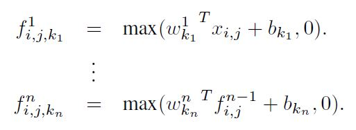

여기서 n은 multilayer perceptron에서의 계층의 숫자이다. ReLU가 활성화 함수로 사용되었다. 밑에 식은 일반적인 컨볼루션 계층에서 단계별 Cross channel(모든 채널을 하나로 묶어 슬라이딩)  parametric 풀링을 하는 것이라고 볼 수 있다. 각 풀링 계층은 입력 특징 맵에 대해 가중화된 선형 recombination을 수행하고 나서 ReLU를 거친다. 이런 방법이 계층 마다 수행되는데 이는 채널을 넘어서, 복잡한 정보에 대한 학습을 가능하게 한다. 

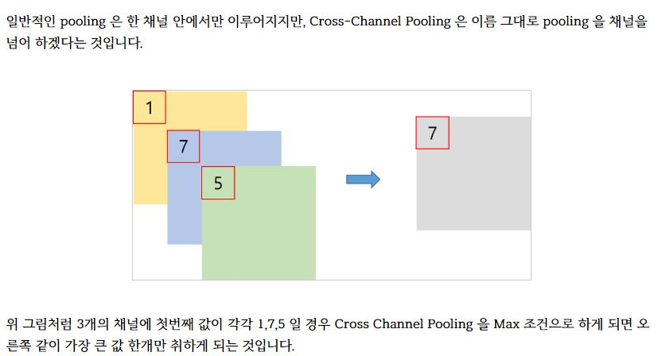

[빛나는 나무 - 딥러닝 용어 정리, Cross Channel Pooling 설명](https://light-tree.tistory.com/147)

Cross channel parametric 풀링 계층은 컨볼루션에서 1x1 컨볼루션 커널과 똑같은 효과를 낸다. 

### Comparison to maxout layers

maxout 계층은 여러 affine 특징 맵에 대해서 다음의 max 풀링 연산을 실시한다.

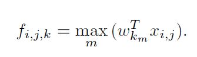

Maxout 연산은 어떤 Convex function이라도 모델링 할 수 있는 Piecewise linear function을 구성한다. Convex function에서는 특정 한계치 이하의 함수 값을 갖는 샘플들이 Convex 셋을 이룬다. 그러므로 maxout은 각 로컬 패치의 Convex function들을 근사함으로서 Convex 셋 안에 있는 샘플들 위한 특징을 구별하는 초평면을 구성하는 능력을 가지게 된다. Mlpconv 계층은 Convex function approximator가 Universal function approximator로 바뀌었다는 점에서 maxout 계층과 다르고 좀 더 다양한 분포를 이루는 특징들을 모델링하는 능력을 갖는다. 

### Global Average Pooling

전통적인 CNN에서 Fc는 과적합하는 경향이 있어서 Dropout을 규제로 사용한다. 저자들은 마지막 mlpconv 계층에서의 각 분류 작업의 카테고리에 해당하는 특징 맵을 생산하는 GAP를 제안했다. GAP는 각 특징 맵의 평균을 취해서 소프트맥스 계층의 입력으로 넣는다. 장점은 특징맵과 카테고리 간의 대응을 강제해서 컨볼루션 구조에 좀 더 맞기 떄문에 특징 맵을 카테고리 Confience 맵으로 해석하기 쉽다는 점이 있다. 또, 학습시킬 파라미터가 없기 때문에 과적합의 위험이 없다. 마지막으로 공간 정보를 축약하기 때문에 입력 이미지의 공간적 이동(x, y축 이동, 회전 등)에 강인하다(상관없이 특징을 뽑아낼 수 있음).

### Network In Network Structure

NIN은 mlpconv 계층 위에 GAP 계층과 목표 손실 계층이 쌓여 있는 구조이다. mlpconv 계층 사이에 Sub-sampling 계층이 들어갈 수 있다. 각 mlpconv 계층은 여기서 3개 계층의 퍼셉트론이지만 네트워크 구조는 특정 목적에 맞게 변경 가능하다.

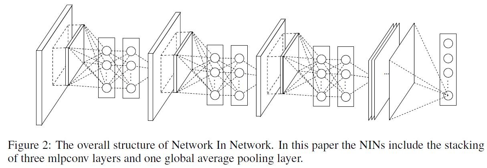

## Experiments

### Overview

저자들은 이 네트워크를 CIFAR-10, 100, SVHN, MNIST에서 평가했다. 실험에 쓰인 네트워크는 3개의 mlpconv 계층이 쌓인 형태이고 각 mlpconv 계층의 뒷부분에는 max 풀링 계층이 추가되어 입력 데이털르 2배로 줄이는 역할을 한다. 마지막 mlpconv 계층을 제외하고 모든 계층의 출력에는 규제로서 Dropout이 적용되었다. 그리고 네트워크 마지막에는 Fc를 대체하여 Gap가 적용되었다. 또 다른 규제로 Alex Krizhevsky 등의 연구에서 적용했던 Weight decay를 적용했다. 이 네트워크 Krizhevsky에서 개발한 super fast cuda-convent 코드에서 구현되었다. 데이터셋을 전처리하고 훈련셋과 검증셋으로 나누는 방법은 Goodfellow 등의 연구를 따랐다. 

또 훈련 과정에서의 여러 절차들은 Krizhevsky 등의 연구를 참고했는데 가중치와 Lr의 초기값을 수동적으로 적절하게 설정했다. 128 사이즈의 배치를 사용했다. 훈련은 훈련 셋에서의 정확도가 개선되지 않을때가지 지속되었고 Lr은 10의 배수로 감소되었다. 이런 절차는 Lr이 초기값의 1/10이 될때까지 반복되었다.

### CIFAR-10

CIFAR-10 데이터셋은 50,000장의 훈련 실사 이미지와 10,000 테스트 실사 이미지의 10 클래스로 구성되어 있다. 각 이미지는 RGB 3채널이고 32x32 크기이다. 여기서 저자들은 Goodfellow 등이 했던 것처럼 Global contrast 정규화와 ZCA 화이트닝을 적용했다. 특별히 훈련셋의 마지막 10,000장의 이미지를 검증셋으로 사용했다고 한다. 

각 mlpconv 계층의 출력되는 특징 맵의 수는 maxout 네트워크에서 썼던 숫자와 동일하게 설정했다. Local receptrive field size(커널 사이즈와 비슷한 개념), Weight decay 하이퍼 파라미터는 검증 셋을 통해서 튜닝했다. 그래서 이 하이퍼파라미터들이 고정되면 네트워크를 다시 훈련시켰다.

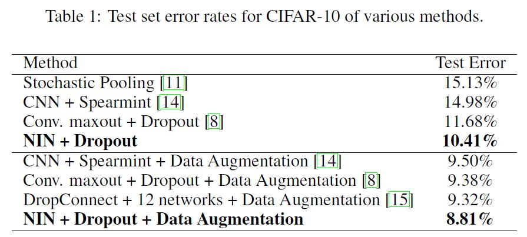

저자들이 실험을 하다가 발견한 사실은 mlpconv 사이에 Dropout을 적용하면 테스트 에러가 20% 이상 감소한다는 것이다. 

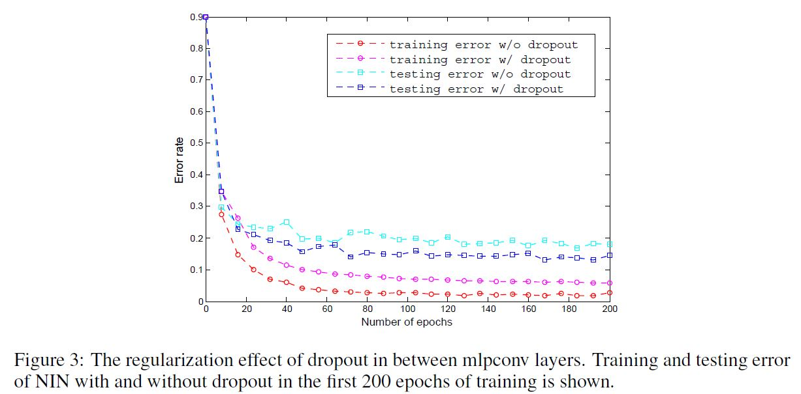

(위에서 w/o는 without, w는 with)

CIFAR-10 데이터셋으로 Translation, Horizontal flipping 데이터 어그멘테이션을 적용하여 모델을 평가했더니 테스트 에러가 8.81%가 나왔다고 한다.

### CIFAR-100

CIFAR-100 데이터셋이 10과 다른점은 100개의 클래스가 있다는 점이다. 각 클래스의 이미지의 수는 10의 각 클래스의 1/10이다. 저자들은 10에서 썼던 모델을 그대로 사용하되 마지막 mlpconv 계층의 출력이 100개의 특징 맵이 되도록 했다.

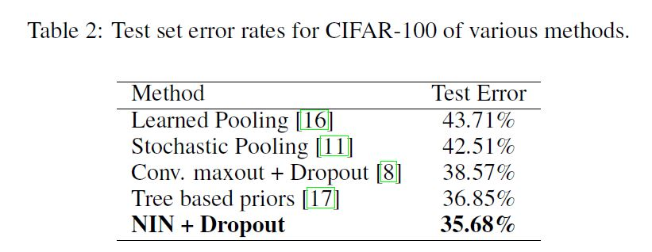

### Street View House Numbers

SVHN 데이터셋은 원본 이미지의 크기가 630, 420이고 MINIST-like 이미지의 크기는 32x32의 컬러 이미지이다. 이 데이터 셋은 훈련 셋, 테스트 셋, 그 밖의 셋으로 나눠진다. 목적은 이미지 중앙에 있는 숫자를 분류하는 것이다. 훈련 셋에서 클래스마다 400장의 이미지를, 그 밖의 셋에서 클래스마다 200장의 이미지를 뽑아서 검증셋으로 사용하고 나머지 훈련 셋과 그 밖의 셋의 이미지는 훈련 용으로 사용되었다. 검증 셋은 하이퍼 파라미터 셋팅을 위해서만 사용되었고 모델 훈련 용으로는 사용하지 않았다. 데이터 전처리는 Local contrast 정규화를 적용했고 CIFAR-10에서와 같이 네트워크 구성이나 옵션을 적용했다. 

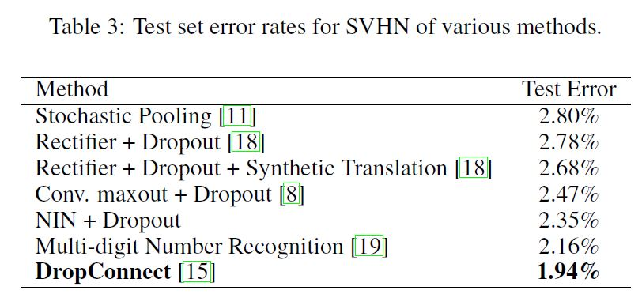