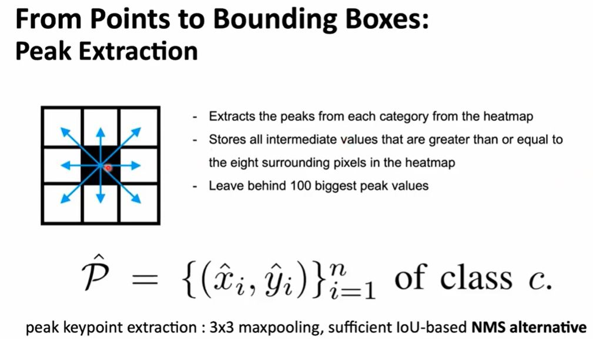

# Objects as Points

Xingyi Zhou(UT Austin), Dequan Wang(UC Berkeley), Philipp Krahenbuhl(UT Austin)

## Abstract

이 논문 전의 Object Detection이 수행되는 방식은 객체를 축에 따라 정렬된 박스로 보고 객체가 있을 법한 많은 위치의 리스트를 열거해놓고 각각을 분류하는 방식이었다. 저자들은 이런 방식이 시간 낭비이고 비효율적이며 별도의 후처리가 필요하다고 주장했다. 저자들이 제안한 방식은 객체를 단일한 점으로 보는 방식이었다. 이때 점은 바운딩 박스의 중심 좌표이다. 저자들은 Keypoint estimation으로 중심 좌표를 찾고 회귀를 각 Task의 Property에 대해서 수행했다. 예를 들어 박스의 크기, 3차원에서의 위치, 방향 그리고 객체의 포즈도 있다. 저자들은 End-to-End 방식의 아키텍처인 CenterNet을 제안했다. CenterNet은 MS COCO 데이터셋에서 28.1% AP에서는 142 FPS, 37.4% AP에서는 52 FPS, 45.1% AP의 Multi-scale test에서는 1.4 FPS의 성능을 보였다. 

## Introduction

앞서 언급했듯이 이 연구 이전의 SOTA Object detection 알고리즘들은 각 객체를, 이 객체를 둘러싸고 있는 축 정렬된 박스로 나타냈다. 그리고 나서 아주 많은 양의 박스 후보들에 대해서 분류 작업을 수행하여 Object detection을 수행했다. 각 박스에 대해서는 어떤 특정 클래스의 객체인지 그냥 배경인지로 분류했다. One stage 알고리즘들은 이미지 내 모든 위치에 Anchor 박스라고 하는 후보 박스를 모두 순회한다. Two stage 알고리즘들은 Backbone에서 추출한 이미지 특징으로 연산을 수행해서 객체가 포함되어 있을 법한 박스를 만들어 내고 그 박스 위주로 분류를 수행한다. 이런 알고리즘들은 NMS라고 하는 후 처리 작업을 수행해서 같은 객체에 연관 되어 있는 박스들의 IOU를 계산해서 상당 수의 겹친 박스를 제거한다. 이런 후처리 작업은 미분 하기 힘들기 때문에 훈련시키기 힘들다. 따라서 End-to-End 방식으로 모델을 훈련시키는 것이 어렵다. 그럼에도 불구하고 Two-stage 방식은 뛰어난 성능을 보였다. Sliding window 방식의 알고리즘들은 가능한 모든 이미지 내의 위치와 차원을 순회해야 한다는 점에서 시간 낭비가 있다. 

저자들은 객체를 바운딩 박스의 중심좌표로 표현하는 방식의 알고리즘을 제안했다. 

각 Task의 property들, 예를 들어 객체 크기, 차원, 3D 깊이나 차원, 객체의 방향, 포즈 같은 것들은 중심 위치의 이미지 특징으로 부터 직접적으로 회귀를 수행해서 구한다. 이렇게 되면 Object detection을 Standard keypoint estimation 문제로 볼 수 있다. 입력 이미지를 먼저 FCN에 넣으면 하나의 Heatmap을 출력한다. 이 Heatmap의 Peak가 Object의 중심점이 된다. 각 Peak의 이미지 특징들로 객체를 둘러싼 바운딩 박스의 Height와 Weight를 예측한다. 모델은 Standard dense supervised learning으로 학습시킨다. 추론 과정에서는 NMS와 같은 후속 처리 없이 Single-network forward-pass로 수행된다. 

저자들은 이 연구에서 제안한 방법으로 2D Object detection 이외에 다른 작업도 수행할 수 있다고 했다. 

CenterNet으로 매우 빠른 작업을 수행할 수 있다고 한다. 

[xingyizhou - CenterNet](https://github.com/xingyizhou/CenterNet)

## Related work

### Object detection by region classification 

RCNN 계열의 알고리즘들은 객체가 들어있을 법한 지역 후보들을의 집합을 만들어서 그 부분에 대해서 Deep network로 Detection을 수행한다. 이런 방법은 느리고 저 차원적인 방법이다. 

### Object detection with implicit anchors

Faster R-CNN의 미리 정의된 바운딩 박스인 Anchor로 이미지 특징 격자의 각 셀에서 객체가 있거나 없음으로 분류한다. 이때 GT와 IOU > 0.7이면 Foreground, < 0.3 이면 Background로 분류한다. 각 Region proposal에 대해서는 후에 다시 한번 Multi-class classification을 수행한다. One-stage detector들도 기본적으로 Anchor에 의존한다. 

저자들의 방법은 Anchor 기반의 One-stage 방법과 관련 있다. 중심 좌표는 아래 Figure 3과 같이 하나의 모양이 없는 Anchor로 볼 수 있다. 

차이점은 첫번째로, CenterNet은 Anchor를 객체의 위치에 따라 할당하지 Box overlap으로 할당하지 않는다. 그러므로 Foreground, Background로 분류하기 위한 Threshold가 필요 없다. 두 번째로, 객체당 하나의 Positive anchor만이 존재한다. 그러므로 NMS를 할 필요가 없다. 단지 Heatmap에서 Peak를 뽑아내고 그 Peak를 중심으로 각 Task에 필요한 Property를 계산해낸다. 세 번째로 다른 Object detector들보다 Resolution(예를 들어 Stride 16)이 더 크다(Stride 4). 이런 점은 여러 모양의 Anchor로 조사할 필요를 없앤다. 

### Object detection by keypoint estimation

Object detection에 keypoint estimation을 사용한 사례는 아래와 같다. 

- H. Law and J. Deng. Cornernet: Detecting objects as paired keypoints. In ECCV, 2018.

  

CornerNet에서는 두 바운딩 박스 코너를 Keypoint로서 탐지한다.

- X. Zhou, J. Zhuo, and P. Krahenb ¨ uhl. Bottom-up object detection by grouping extreme and center points. In CVPR, 2019.

  

ExtremeNet에서는 Top, Left, Bottom, Right의 가장 바깥쪽 부분과 중심 점을 탐지한다.

[Jiyang Kang - PR-241: Objects as Points](https://www.youtube.com/watch?v=mDdpwe2xsT4)

두 방법 모두 Robust keypoint estimation network를 구축하기는 하나, CenterNet과 차이가 있다면 위의 두 방법은 Keypoint detection 후에 각 점을 그룹핑 하는 단계가 있다는 것이다. 이 단계로 속도가 느려진다. CenterNet에는 단순히 객체 당 중심 좌표 하나만을 추출하므로 그룹핑이나 후속 처리 과정이 필요 없다. 

### Monocular 3D object detection

- Deep3DBox는 R-CNN 스타일의 프레임워크인데 먼저 2D로 객체를 탐지하고 탐지한 객체를 3D estimation 네트워크로 입력한다. 
- 3D RCNN은 Faster R-CNN 다음에 3D project을 수행하는 head를 더 추가한다. 
- Deep Manta는 다양한 Task를 수행할 수 있도록 훈련되 coarse-to-fine Faster R-CNN을 사용한다. 

저자들이 제안하는 방법은 Deep3DBox나 3DRCNN과 유사하다. 

## Preliminary

[Jiyang Kang - PR-241: Objects as Points](https://www.youtube.com/watch?v=mDdpwe2xsT4)

예측 결과인 Keypoint heatmap의 차원이 W/R x H/R x C인 이유는 Stride가 R이기 때문에 R에 한번 Window를 옮겨서 연산을 수행하기 때문이다. 이를 C만큼 수행하는데 예를 들어서 Human pose estimation에서 Human joints를 위해서 C=17이고 Object detection에서 Object category를 위해서 C=80이다. 

저자들은 입력 이미지를 넣어서 Keypoint heatmap을 예측해 내기 위해서 Fully-convolutional encoder-decoder network를 사용한다. 이때 네트워크는 Hourglass network, ResNet, DLA를 사용한다. 

저자들은 keypoint prediction network를 훈련 시킬때 다음의 연구를 따른다. 

- H. Law and J. Deng. Cornernet: Detecting objects as paired keypoints. In ECCV, 2018.

2차원에 해당하는 클래스 c의 각 GT Keypoint p에 대해서 컨볼루션 연산 등을 통해서 floor value of p / R을 구한다. 그런 다음 아래와 같은 Gaussian kernel Y_xyc를 사용해서 Heatmap에 모든 GT Keypoint를 블러링한다. 이렇게 하는 이유는 만약에 딱 점이 한 개라면 Loss가 커서 제대로 학습이 되지 않기 때문이다. 

σ_p는 Object size-adaptive standard deviation이다.  만약에 두 가우시안 커널이 같은 클래스에 겹칠 경우에 Element-wise maximum 연산을 수행한다. 

α, β는 Focal loss에서의 하이퍼 파라미터이다. N은 이미지 I에 있는 Keypoint의 갯수인데 N으로 정규화해서 모든 Positive focal loss instance가 1이 되도록 한다. 저자들은 모든 실험에서 α = 2,  β = 4로 설정했다. Output stride에 의해서 발생하는 Discretization 오류(Stride를 4로 했는데 꼭 Resolution이 4로 나눠 떨어지라는 보장이 없다)를 상쇄하기 위해서 저자들은 추가적으로 다음과 같이 각 중심점 마다 Local offset을 예측한다. 

모든 클래스는 같은 Offset prediction 값을 공유한다. 이 Offset은 다음과 같은 L1 loss로 훈련시킨다. 

## Objects as Points

위에서 Pk는 중심 좌표로서 아래와 같다.

앞서 Y_hat으로 중심좌표를 예측한 일과 더불어 수행해야 할 작업은 Object size를 구하는 일이다. 위에서 Size에 대한 Loss를 구할 때 예측된 Object size의 차원은 다음과 같다. 

Scale에 대한 정규화는 수행하지 않았고 Raw pixel coordinate를 직접적으로 사용하지 않았다고 한다. 전체적인 훈련 목표는 다음의 Loss를 최대한 줄이는 것이다. 

저자들은 Size loss에 대한 비중을 0.1로 두었고 Offset loss에 대한 비중을 1로 두었다. 결국 단일 네트워크로 Keypoints Y_hat, Offset O_hat, Size S_hat을 구하게 된다. 

네트워크는 각 위치마다 총 C + 4 출력 크기만큼의 값을 예측하게 된다. Backbone 네트워크는 Fully-convolutional network이고 모든 Task의 서브 브랜치가 공유한다. 각 브랜치의 입력으로 들어가기 전에 Backbone에서 추출된 특징들은 3 x 3 컨볼루션 + ReLU + 1 X 1 컨볼루션 계층을 통과 한다. 

#### From points to bounding boxes

추론 시에는 먼저 각 카테고리별 Heatmap에서 Peak들을 뽑아낸다. 그리고 각 Peak의 8방향으로 인접해 있는 값과 크거나 같은 모든 범위를 찾아내어 Top 100 peak만 남기고 모두 지운다. 

이것은 3x3 maxpooling으로 한 번에 수행 가능하고, NMS를 수행하는 것과 같은 효과를 낸다. 

그렇게 구한 좌표들로 바운딩 박스를 만들어 내는데 Offset과 Size loss로 최적화 한다. 

### 3D detection

본문 참조

### Human pose estimation

본문 참조
