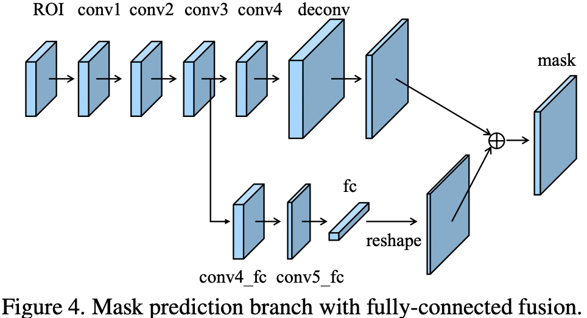
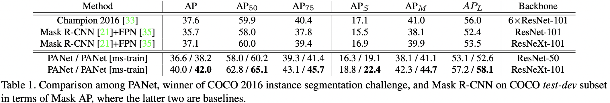
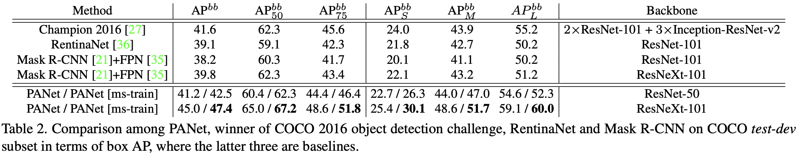
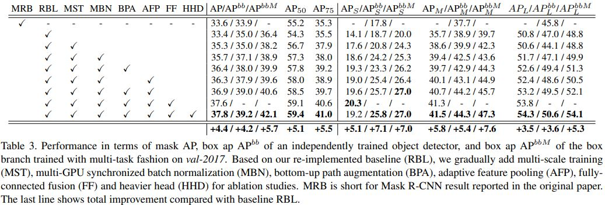

# Path_Aggregation_Network_for_Instance_Segmentation

Shu Liu(The Chinese University of Hong Kong),

Lu Qi(The Chinese University of Hong Kong),

Haifang Qin(Peking University),

Jianping Shi(SenseTime Research),

YouTu Lab, Tencent

## Abstract

저자들은 Path Aggregation Network(PANet)을 통해서 Proposal 기반의 Instance segmentation 모델에서 정보가 잘 전파될 수 있도록 하는 것을 목표로 했다. 특히 전체적으로 낮은 단계에 있는 비교적 이미지 내 객체 위치 정보가 정확한 특징을 Shortcut을 통해서 가장 높은 단계에 있는 특징에 빠르게 전파할 수 있도록 했다. 그리고 Adaptive feature pooling이라는 개념을 도입하여 모든 단계에 있는 특징들이(Feature extraction 단계를 통해 추출된 해상도가 다른 특징들) Proposal subnetworks에 직접적으로 잘 전파될 수 있도록 했다. 마지막으로 Mask prediction을 위해서 추가적인 브랜치가 추가되었다. 이 브랜치에서는 각 Proposal의 여러 부분을 캡처한다.  

[ShuLiu1993-PANet](https://github.com/ShuLiu1993/PANet)

## Introduction

CNN의 출현과 발전에 힙 입어서 여러 Instance segmentation framework들이 등장하게 되었는데 저자들은 그 중에서 Mask R-CNN에 특히 관심이 있었던 듯 하다. 그뿐만이 아니라 Mask prediction을 위한 FCN이라던지 모델의 높은 정확도를 위해서 네트워크 내에서 여러 해상도의 특징들을 사용하는 FPN에도 관심이 있었다.  

데이터에 관해서는 COCO, Cityscapes, MVD 등에 관심을 가진듯 하다. 

모델 구조와 관련해서는 Residual connection, Dense connection을 통해서 Information flow를 위한 Shortcut이라던지 Propagation을 상대적으로 더 쉽게 한다던지 하는 방법에 관심이 있었다. 또 Split-transform-merge strategy를 통해서 병렬적인 경로를 만들어서 Information flow를 유연하고 다양하게 하는 방법도 유익하다고 했다. 

### Our Findings

저자들이 주장하길 Mask R-CNN은 좀 더 개선될 여지가 있다고 한다. 특히 저차원과 고차원 사이의 깊이가 깊으면, 객체의 정확한 위치 정보를 담고 있는 저차원의 정보들이 고차원의 특징에 전달되기가 어렵다고 한다. 그리고 각 Proposal의 경우 한 가지 Feature level에서 모아진 Feature grid에 근거해서 예측이 수행되는데 이 Feature들이 할당되는 것도 경험적으로 할당되는 것이기 때문에 어떤 Level에서 버려진 특징들이 최종 예측에는 도움이 될 수 있다는 것이 저자들의 주장이다. 이렇게 되면 Mask prediction의 경우 다양한 정보를 얻게 될 기회를 잃게 된다. 

### Our Contributions

저자들은 Figure 1과 같이 PANet이라고 하는 Instance segmentation을 위한 아키텍처를 발표했다.  

우선 Backbone 때문에 길어질 수 있는 정보 흐름을 짧게 할수 있게 하고, 저차원 단계의 위치 정보를 잘 활용하기 위해서 Bottom-up path augmentation이라는 개념을 창안했다. 

그리고 각 FPN의 각 단계의 Proposal들과 Feature들이 예측 시에 나눠서 할당되기 때문에 발생할 수 있는 정보 손실을 줄이기 위해서 Adaptive feature pooling이라는 것을 만들었다. 여기서는 임의로 Feature들을 나누는 것 대신에 각 Proposal을 위한 모든 단계의 Feature들을 모은다. 

마지막으로 각 Proposal를 여러 관점으로 보고 해석하기 위해서 Mask prediction 브랜치에서, 완전 연결 계층을 추가했다. Mask R-CNN에서 FCN으로만 Mask prediction을 수행한 것과는 대조적으로 FCN 경로와 병렬적으로 완전 연결 계층 경로를 추가했다. 이렇게 두 경로에서의 결과를 Fusing했더니 정보 다양성이 향상되서 Mask prediction 결과가 더 좋아졌다고 한다. 

설명한 요소 중 앞의 두 가지 요소는 Object detection, Instance segmentation 수행시에 공유된다고 한다. 

## Related Work

### Instance Segmentation

Instance segmentation에는 두 가지 계보가 있다고 한다. 첫째는 Proposal 기반의 방법인데 이 방법은 Object detection과 강한 연관성이 있다. 

다른 하나는 Segmentation 기반의 방법이다. 여기에는 특수하게 설계한 Transformation이나 Instance boundaries가 있고 Instance mask는 Predicted transformation 결과에서 디코딩된다. 

그밖의 다른 연구 결과도 있는데 본문 참조. 

### Multi-level Features

여러 계층이나 단계에서의 Feature들을 이용하는 방법과 관련된 여러 연구들은 본문 참조. 여기서 저자들은 FPN을 기본으로 삼고 발전시켜나갔다고 한다. 

ION에서는 여러 계층에서의 Feature grid들을 Concatenation했다고 하는데 이 연산 과정 중에서 Normalization, Concatenation, Dimension reduction이 현실적으로 계산 가능한 Feature들을 만들어내기 위해 필요했다고 한다. 그러나 저자들의 방법에서는 이보다는 더 간단하다고 한다. 

또 아래 연구에서도 각 Proposal을 위한 여러 곳에서의 Feature grid를 Fusing하기도 했는데

- S. Ren, K. He, R. B. Girshick, X. Zhang, and J. Sun. Object detection networks on convolutional feature maps. PAMI, 2017.

이 방법에서는 입력 이미지의 크기를 다르게 한 뒤에 Feature map을 뽑아냈고 Input image pyramid에서 Feature selection을 하는 연산을 개선하기 위해서 Feature fusion을 수행했다고 한다. 그러나 저자들의 방법은 단일 크기의 입력으로 네트워크 내의 Feature hierarachy 안에 모든 Feature level에서의 정보를 활용하는데 목적을 둔 것에 차이점이 잇다고 한다. End-to-End training도 가능하다. 

### Larger Context Region

여러 해상도에서의 특징들에서 Context information 예측에 사용하는 방법과 관련된 연구는 본문 참조.  저자들의 Mask branch에서의 예측 또한 Global information을 이용할 수 있게 하지만 그 방법은 다르다. 

## Framework

저자들의 연구로 이끌어낸 성능 향상은 CNN의 구조(아키텍처)와는 상관 없다고 한다. 

### Bottom-up Path Augmentation

#### Motivation

보통 상위 단계의 계층에서의 뉴런들은 전체 객체에 반응하는 경향이 강하고 다른 단계의 뉴런들은 그보다는 좀 더 국소적인 Texture나 Pattern들에 반응하는 경향이 있다. 이 점은 Semantiacally strong한 특징들을 전파하기 위한 Top-down 경로를 추가할 필요성과 FPN에서와 같이, 분류 능력을 적절한 수준으로 올릴 수 있도록 사용되는 모든 특징들을 강화할 필요성을 시사한다.

저자들의 프레임워크도 Edge나 Instance의 부분에 대한 강한 반응은 Instance의 위치 정보를 잘 찾았다는 강한 신호라는 사실에 기반하여, 저차원 단계의 패턴들에 대한 강한 반응을 전파시킴으로서 전체 특징 Hierarchy의 위치 추정 능력을 강화하고자 했다.  이를 위해서 저자들은 저차원 단계와 가장 고차원 단계를 연결하는 Lateral connection 경로를 하나 구축했다. 그렇기 때문에 10 계층 내외로 구성되어 있는 Shortcut이라는 것이 존재하게 된다(Figure 1의 초록색 점선). 이에 반해서 FPN에서 CNN에서는 100 계층 이상을 지날 수 있는 긴 경로를 구축했다(Figure 1의 빨간색 점선). 

즉, 저차원 단계의 특징 정보들이 최종 예측에 덜 반영되는 문제를 해결하기 위한 방법이 필요한데 빨간색 점선의 경우 Backbone의 계층이 너무 많아서 가장 최상층의 계층에 정보를 전달하려면 그만큼 긴 경로를 통과해야하고 초록색 점선은 10개 미만의 계층 피라미드를 새로 구축해서 짧은 경로로 정보를 전달할 수 있게 하자는 것이다. 

### Augmented Bottom-up Structure

저자들은 우선 Bottom-up path augmentation이라는 개념을 고안했다. 저자들은 FPN에서와 같이 같은 네트워크 내에 같은 Feature map 사이즈를 가지는 계층들을 묶어서 Stage라고 했다. 여기서 각 Feature level은 하나의 Stage에 대응된다. 저자들은 ResNet을 기본 Backbone으로 사용했고 FPN에 의해서 만드러지는 Feature level을 각각 {P2, P3, P4, P5}라고 표기했다. 저자들이 고안한 Augmented path는 가장 낮은 단계의 level인 P2부터 점차 P5까지 접근해간다(Figure 1(b)). P2에서 P5까지 해상도가 2배씩 줄어든다. 저자들은 {P2, P3, P4, P5}에 대응되는 새롭게 만들어낸 Feature map들을 {N2, N3, N4, N5}라고 나타냈다. 여기서 N2는 아무런 연산도 하지 않은 P2 그대로이다. 

Figure 2와 같이 각 블록들은 높은 해상도의 Feature map Ni와 그보다는 좀 더 낮은 해상도의 Feature map Pi+1을 받아서 Lateral connection을 통해서 새로운 Feature map인 Ni+1을 생성해낸다. 이때 Ni는 3x3 크기의 Stride 2인 컨볼루션 계층을 통과시켜서 Feature map의 크기를 줄인다. 합쳐진 Feature map은 또 다른 3x3 컨볼루션 계층으로 처리하여 Ni+1의 Feature map을 만들어낸다. 이런 과정이 반복되며 P5에 접근한 뒤에 끝나게 된다. 이 과정에서의 모든 Feature map의 채널 수는 256으로 동일하다. 모든 컨볼루션 계층은 ReLU를 적용한다. 그러고 난 다음에 각 Proposal을 위한 Feature grid가 새로운 Feature map인 {N2, N3, N4, N5}에서 모아진다. 

### Adaptive Feature Pooling

#### Motivation

FPN에서는 Proposal들이 크기에 따라서 각 Feature level에 할당된다. 이로 인해서 크기가 작은 Proposal들은 낮은 Feature level에, 크기가 높은 Proposal들은 높은 Feature level에 할당되게 된다. 이는 간단하고 효율적이지만 최적의 결과를 만들어내지 않는다. 예를 들어서 10 픽셀 차이 나는 두 Proposal은 다른 Level에 할당되지만 사실은 거의 크기가 유사하다. 

게다가 Feature들의 중요도와 그들이 속해있는 Level은 상관이 없을지도 모른다. 높은 level의 Feature들은 큰 Receptive field에 의해서 생성되고 풍부한 Context 정보를 담고 있다. 크기가 작은 Proposal들이 이런 Feature들에 접근 가능하게 하면 예측을 더 잘 할 수 있도록 유용한 Context 정보들을 이용할 수 있을 것이다. 마찬가지로 낮은 level의 Feature들은 미세한 디테일 정보와 높은 정확도의 위치정보를 포함한다. 크기가 큰 Proposal들이 이런 Feature들에 접근가능하게 하는 것도 이점이 있다. 그래서 저자들은 각 Proposal를 위한 모든 leveldml Feature들을 모아서 예측을 위해서 이들을 합치는 개념을 제안했다. 저자들은 이를 Adaptive feature pooling이라고 부른다. 

저자들은 Adaptive feature pooling으로 모은 각기 다른 level의 특징들의 비율을 분석했다. 저자들은 Feature들을 합칠때 Max 연산을 이용했다. 이는 네트워크가 알아서 유용한 정보를 요소별로 매칭해서 선택할 수 있도록 한다. 저자들은 원래 FPN에서 Proposal들이 할당되었던 level에 근거하여 이들을 네 개의 그룹으로 묶었다. 각 Proposal 집합에 대해서 저자들은 각 Level로부터 선택된 Feature들의 비율을 계산했다. 표기상 Level1-4는 낮은-높은 level을 의마한다. 

Figure 3에서 파란선은 FPN에서  level1에 할당되었던 크기가 작은 Proposal들을 나타낸다. 거의 70%에 해당하는 Feature들이 다른 level에서 선택된 것을 확인할 수있다. 이는 여러 level에서 모은 Feature들이 정확한 예측을 하는데 도움이 될 것이라는 점을 시사한다. 이는 Bottom-up path augmentation을 디자인 하는 것에 큰 정당성을 부여한다. 

#### Adaptive Feature Pooling Structure

Adaptive Feature Pooling는 Figure 1(c)에 나와 있다. 

먼저 각 Proposal을 Figure 1(b)에서 어두운 회색 영역으로 묘사되어 있는 것이 각기 다른 level에 매핑한다. 그리고 Mask R-CNN에서처럼 ROIAlign이, 각 level에서의 Feature들을 모으기 위해서 사용된다. 그 다음 Fusion operation(요소별 곱셉 혹은 덧셈)이 각기 다른 level의 Feature grid들을 합치기 위해서 수행된다. 

그 다음의 서브 네트워크에서 합쳐진 Feature grid들이 하나의 파라미터 계층을 독립적으로 거치게 되는데 이 다음에 Fusion operation이 수행되게 되는 것이다(위 그림에서 fc1).  이는 네트워크가 Feature들을 조정하는 것을 가능하게 한다. 예를 들어서 두 개의 fc 계층이 FPN의 Box 브랜치에 있다고 하면 Fusion 연산은 첫 번째 fc 계층 후에 수행된다.  Mask R-CNN에서는 네 개의 연속적인 컨볼루션 계층이 Mask 브랜치에서 사용되기 때문에 저자들은 Fusion 연산을 첫 번째와 두 번째 컨볼루션 계층 사이에서 수행하도록 했다. 합쳐진  Feature grid는 분류, 박스 회귀, 마스크 예측과 같은 작업을 위한 각 Proposal의 Featuer grid로서 사용된다. 

저자들은 디자인 시에 입력 이미지 피라미드의 각기 다른 Feature map을 사용하는 것 대신에 네트워크 내에서 Feature hierarchy로 부터 정보를 합칠 수 있도록 초점을 뒀다. 이것은 L2 정규화, Concatenation, Dimension reduction이 필요한 다른 방법과 비교했을때 더 단순하다고 한다. 

### Fully-connected Fusion

#### Motivation

fc-layers와 FCN은 Instance segmentaion과 Mask proposal prediction에 사용된다. 저자들이 말하길 이 둘은 작동 방식이 다르다고 한다. FCN은 각 픽셀에 대한 예측을 수행하는데 이미지 내의 모든 위치에 대해서 Local receptive field의 파라미터가 공유된다. 이에 반해 fc-layers는 위치에 민감하기 때문에 각기 다른 위치에 대해 예측을 수행하려면 다양한 파라미터가 필요하다. 그래서 각 위치에 맞게 조정할수 있는 능력이 있다. 또한 각 위치에 대한 예측은 전체 Proposal의 Global information으로 만들어진다. 이것은 객체를 구별하고 같은 객체에 속하는 부분은 부분끼리 알아보는데 도움이 된다. 저자들은 이 두가지 타입의 계층을 섞어서 Mask prediction을 수행했다고 한다. 

#### Mask Prediction Structure

Mask 브랜치는 각 Proposal을 위한 Pooled feature grid를 입력으로 받아 연산을 수행한다. 

주요 경로는 작은 FCN인데 4개의 연속적인 컨볼루션 계층과 1개의 디컨볼루션 계층으로 구성되어 있다. 각 컨볼루션 계층은 256채널의 3x3 필터를 가진다. 디컨볼루션 계층은 2배로 해상도를 키운다. 여기서는 각 클래스에 대한 Binary classification을 픽셀마다 수행한다. 그렇기 때문에 Mask R-CNN과 같이 Segmentataion과 Classification을 분리해서 수행하게 된다.  저자들은 여기에 더해서  conv3부터 fc 계층까지의 짧은 경로를 추가했다. 이 경로에는 두 개의 3x3 짜리 컨볼루션 층이 있는데 두 번째 계층은 연산 부담을 줄이기 위해서 채널 수를 줄인다. 

완전 연결 계층은 클래스 상관 없이 배경/전경을 구분하기 위해서 쓰인다. Mask 크기가 28x28이기 때문에 완전 연결 계층은 784x1x1짜리 벡터를 만들어낸다. 이 벡터가 FCN에서 만들어 지는 Mask와 동일한 크기로 모양이 바뀐다. 최종 예측 값은 FCN에서의 각 클래스에 대한 Mask prediction과 완전 연결 계층에 의한 배경/전경 예측을 합쳐져 얻는다. 이때 완전 연결 계층은 여러개 보다는 1개만을 사용해서 중간의 공간 정보가 없어지는 문제를 방지한다. 

## Experiments

저자들은 저자들의 방법을 COCO, Cityscapes, MVD 데이터 셋으로 평가했다. 포괄적인 Ablation study는 COCO 데이터셋으로 수행했다. 또 COCO 2017 Instance Segmentation, Object Detection Challenge에서 결과를 냈다. 

### Implementation Details

저자들은 Mask R-CNN과 FPN을 Caffe에 기반하여 저자들의 방법에 맞게 다시 구현해냈다. 저자들은 아래의 연구에서의 Image centric training 이라는 개념을 차용했다. 

- R. Girshick. Fast R-CNN. In *ICCV*, 2015

각 이미지에 대해서 512개의 ROI를 Positive-Negative 비율 1:3으로 샘플링한다. Weight decay 0.0001, Momentum 0.9로 설정한다. 다른 하이퍼파라미터는 데이터 셋마다 다르게 설정했다고 한다. 그리고 Mask R-CNN과 같이 Proposal들은 모델 네트워크와 독립적으로 훈련된 RPN에서 생성했다. Backbone은 Object detection/Instance segmentatoin에서 공유되지 않는다. 

### Experiments on COCO

#### Dataset and Metrics

저자들은 저자들의 모델을 train-2017의 부분집합 셋으로 훈련시켰고 Ablation study를 위한 결과는 val-2017 부분집합으로 평가했다. 그리고 다른 모델과의 비교를 위해서 test-dev로 모델을 평가했다. 

Metric은 COCO의 표준 평가 척도를 따라서 AP, AP50, AP75, APs, APm, APL를 구했다. 저자들의 모델은 Object detection, Instance segmentation 둘 다 수행할 수 있다. 그중에서 Object detection만을 수행하는 Detector를 하나 따로 훈련시켰다. 그래서 최종적으로 저자들은 Mask AP, 독립적으로 훈련시킨 Detector의 Box ap인 AP^bb, 둘 다 수행하는 모델의 Box ap인 AP^bbM로 성능을 평가했다. 

#### Hyper-parameters

훈련 과정에서는 한 배치에 16개의 이미지를 묶었다. 이미지들의 짧은 부분과 긴 부분은 특별히 언급하지 않는 이상 각각 800, 1000이다. Instance segmentation에서는 120k 동안에는 Lr을 0.02로, 남은 40k 동안은 0.002로 했다. Object detection은 저자들의 모델에서 Mask 브랜치를 없는 형태로 구현했다. 이때 60k 동안은 Lr을 0.02로 나머지 20k는 0.002로 했다. 모든 모델 파라미터는 미리 훈련된 Mask R-CNN과 FPN에서 가져왔고 Fine-tuning은 하지 않았다. 

#### Instance Segmentation Results

저자들은 PANet의 성능을 비교하기 위해서 test-dev 셋을 사용하되 Multi-scale traning을 했을때와 안 했을 때를 구분해서 평가했다. 

#### Object Detection Results

Mask R-CNN에서와 유사한 방법으로 저자들은 Bounding box results를 Box 브랜치에서의 결과를 토대로 평가했다. 

#### Component Ablation Studies

저자들은 Bottom-up path augmentation, Adaptive feature pooling, Fully-connected fusion, Multi-scale training, Multi-GPU synchronized batch normalization, Heavier head의 중요도를 알아보는 연구를 수행했다.  Multi-scale training의 경우 가장 긴 부분을 1,400까지로 하고 나머지 부분을 400에서 1,400까지로 했다. 저자들은 모든 GPU에 걸친 하나의 배치 안의 모든 샘플들의 평균과 표준편차를 계산했다. 또 훈련 중에는 어떤 파라미터도 고정시키지 않았다. Multi-GPU synchronized batch normalization 적용시에는 새롭게 추가한 계층의 뒤에 항상 Batch normalization을 적용했다. Heavier head는 두 개의 완전 연결 계층을 사용하는 것 대신에 4개의 3x3크기의 연속적인 컨볼루션 계층을 사용했다. 이때 이 head는 Box classification과 Box regression 브랜치에서 공유해서 사용한다. 

Baseline에서 시작해서 각 요소들을 하나씩 추가하는 방식으로 수행한 Ablation study는 val-2017 데이터셋으로 수행했다. 

ResNet-50을 기본 아키텍처로 사용했다. 저자들은 성능을 Mask AP, Object detection만 수행하는 모델의 Box ap인 AP^bb, Object detection, Instance segmentation 등 다중 작업을 한꺼번에 수행하는 모델의 Box ap인 AP^bbM으로 평가했다. 

- Re-implemented Baseline: 저자들의 방법을 적용한 Mask R-CNN은 원래 버전과 유사한 성능을 보였고 Object detector는 오히려 좋은 성능을 보였다. 
- Multi-scale Training & Multi-GPU Sync. BN: 이 두 기술은 네트워크의 성능 수렴이 더 잘 이뤄질 수 있도록 했고 일반화 능력을 향상시켰다. 
- Bottom-up Path Augmentation: Adaptive feature pooling의 유무와 상관없이 이 개념을 적용하면 그렇지 않을때보다 Mask AP와 Box ap AP^bb가 각각 0.6, 0.9 정도 더 개선되었다. 특히 크기가 큰 객체에 대한 성능 향상 효과가 컸다. 이것은 Lower feature level에서의 정보의 유용성을 입증하는 것이다. 
- Adaptive Feature Pooling: Bottom-up path augmentation의 유무와 상관 없이 Adaptive pooling은 성능을 향상시킨다. 모든 크기에서 전반적으로 향상되었는데 이는 다른 Stage에서의 Feature들을 사용하는 것이 최종 예측을 하는데 도움이 된다는 것을 보여주는 것이다. 
- Fully-connected Fusion: Fully-connected fusion은 Mask를 더 잘 예측하는 것에 목적이 있다. Mask AP를 0.7정도 향상시켰으며 모든 객체 크기에 대해서 성능이 향상되었다. 
- Heavier Head: Heavier head는 Multi-task로 학습시킨 모델의 바운딩 박스와 관련된 Box ap AP^bbM을 향상시켰다. Mask AP나 Object detection만을 위한 모델의 Box AP에서는 그 정도가 미미했다. 

PANet에서의 이 모든 요소들을 합치면 Mask AP는 기본 네트워크보다 4.4정도 향상되고 Object detector의 Box AP는 4.2정도 향상된다. 특히 작거나 중간 크기의 객체들에 대해서 효과가 컸다. 성능 향상의 절반 정도는 Multi-scale training과 Multi-GPU sync. BN에서 기인했다. 
