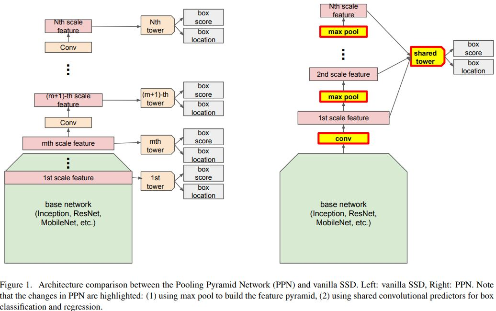
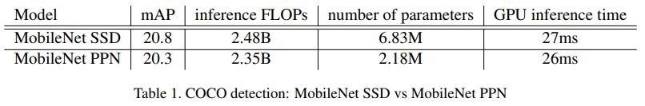

# Pooling Pyramid Network for Object Detection

Pengchong Jin, Vivek Rathod, Xiangxin Zhu(Google AI Perception)

## Abstract

저자들은 SSD 계열의 Detector들의 성능은 유지하면서 모델의 크기를 획기적으로 줄이는 방법을 제시했다. SSD에서는 각 Feature map마다 Head가 존재해서 예측을 수행했다면 여기서는 하나의 Head가 모든 Feature map에서 예측을 수행한다. 그리고 Down sampling 간에 Convolution 계층을 Max pooling 계층으로 대체한다. 이런 방법은 본래의 SSD와 비교했을때 다음과 같은 장점을 갖는다. 

- Scale간의 Score miscalibration을 방지한다. 
- 하나의 Predictor가 훈련 데이터를 다각도(Scale)로 본다. 따라서 본래의 SSD의 Predictor 수만큼 용량을 줄일 수 있다. 
- 컨볼루션 계층에 들어가는 용량을 줄일 수 있다.

## Introduction

SSD계열 Detector들은 각기 다른 Scale의 Feature map이 있고 이 Feature map으로 Predictor들이 Box와 Class score를 만들어낸다. 그런데 데이터 Scale의 분포가 한쪽으로 치우쳐져 있을때와 같은 경우에 이런 구조는 문제가 된다. 다수의 큰 Object와 소수의 작은 Object들이 있을 경우에 이 작은 Object들을 탐지하기 위해서 리소스를 낭비하게 될 것이다. 또 같은 클래스인데도 불구하고 Scale에 대해서 Score miscalibration이 일어날 수 있다. 또 각 Predictor들은 자기가 맡은 크기만 담당하기 때문에 이미 충분히 작은 데이터 크기를 더 작게 나눈다(수가 적은, Smaller 데이터 셋을 또 Feature map 크기 별로 나눈다는 의미). 저자들은 Object appearance가 Scale invariant하다고 가정하고 하나의 Predictor가 모든 데이터를 보는 방법이 더 효율적이라고 주장했다. 

## Pooling Pyramid Network(PPN)

### Shared Box Predictor

Vanilla SSD에서 각 Box predictor들이 할당된 GT 박스의 부분으로 학습되기 때문에 훈련 간에 각 Predictor이 보는 Positive와 Negative example들의 수가 다르다. 그래서 이런 데이터 불균형 문제 때문에 각 Predictor들이 도출하는 Score의 범위가 다르고 이 Score를 기반으로 처리하는 NMS 같은 Postprocessing에서 이 Score들을 사용하기 어렵게 만든다. 저자들이 디자인한 PPN은 모든 크기의 Feature map을 하나의 Box predictor가 담당하기 때문에 GT 박스 Scale의 불균형 문제가 있어도 Miscalibration이나 예측 Score의 불안정성을 줄인다. 

### Max Pooling Pyramid

저자들은 Multi-scale feature pyramid 구조를 구축하기 위해서 Max pooling 연산을 이용했다. Vanilla SSD에서는 추가적인 컨볼루션 연산과 FPN으로 이를 구축했다는 점에서 차이가 있다. Max pooling 연산을 통해서 Down sampling을 수행한 이유는 크게 두 가지이다. 첫째로 컨볼루션과 달리 Max pooling 연산에서는 학습하는 과정이 없기 때문에 연산을 수행하고 난 뒤의 결과들이 같은 Embedding space에 존재하는 것을 보장한다. 그리고 이는 Shared box predictor를 훈련시키는데 더 효율적이다. 둘째로 추가적인 Addition이나 Multiplication 연산이 없기 때문에 추론 시에 계산 속도가 빠르다. 이는 지연율이 중요한 Application에 적합하다. 

### Overall Architecture

전체적인 구조는 그림 1의 오른쪽과 같다. Backbone 네트워크에 추가적으로 Pointwise convolution 계층이 더해질 수 있다. 이는 Channel Dimension을 조정하기 위함이다. 그리고 Feature map의 크기가 1 x 1이 될때까지 Stride 2의 Max pooling 연산 계층을 추가한다. Predictor들은 중간 출력 Feature map에서 Classification score와 Box의 Location offset을 만들어낸다. 각 Pooling 연산 후에 Predictor의 제일 처음에 Shared 컨볼루션이 추가될 수 있는데 Prediction에 사용되는 Feature를 만들어 내기 위함이다. 

## Experiments

저자들은 COCO 탐지 데이터셋으로 PPN과 Vanilla SSD의 성능을 비교했다. 아키텍처는 입력 크기 300x300의 MobileNetv1을 사용했다. 자세한 구현 사항은 본문 참조. SSD에서와 같은 Anchor 디자인을 적용했고 Box regression을 위해서 Smooth l1 loss을 적용했으며 Box classification을 위해서 α=0.25, γ=2의 Focal Loss를 적용했다. ImageNet 데이터셋에서 Pre-trained된 MobileNetv1아키텍처를 사용했다. 실험은 Nvidia GeForce GTX TITAN X 그래픽 카드로 수행했다. Table 1을 보면 비슷한 성능을 보이면서 파라미터수가 3배 적은 것을 확인할 수 있다.

