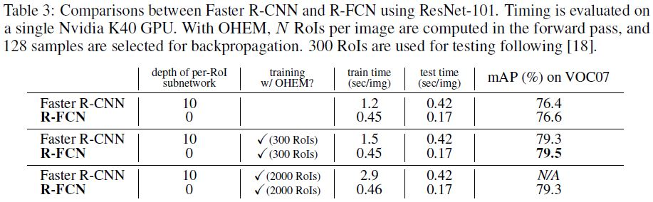
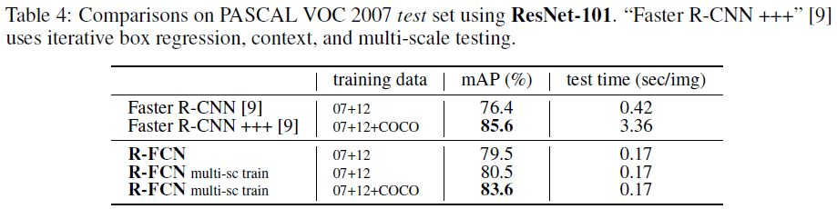

# R-FCN: Object Detection via Region-based Fully Convolutional Networks

Jifeng Dai, Kaiming He, Jian Sun(Microsoft Research), Yi Li(Tsinghua University)

## Introduction

Two stage 계열 Object Detection 알고리즘들은 ROI Pooling 계층에 의해서 두 부분의 나눠진다. 

- ROI와 상관 없이 연산 결과를 공유하는 Fully convolutional subnetwork.
- 연산을 공유하지 않고 ROI마다 연산을 수행하는 ROI-wise subnetwork.

Two stage Object Detection 알고리즘 네트워크에서 Classification 서브 네트워크는 Spatial Pooling 계층과 몇 개의 완전 연결 계층으로 구성되었다. 

그런데 점점 네트워크의 모든 계층이 전부 컨볼루션 계층으로 이루어진 모델들이 나타나기 시작했다. 비유자하자면 Object detection 네트워크에서 ROI마다 수행하는 서브 네트워크에 완전 연결계층 같은 Hidden 계층이 없어지고 모든 컨볼루션 계층이 공유되는 그런 네트워크이다. 그렇지만 본 연구에서 조사한 바에 따르면 이런 단순한 해결책은 Classification 정확도에 비해 Detection 정확도가 현저히 떨어진다.  이를 해결하기 위해서 ResNet 논문에서는 Faster R-CNN detector가 두 컨볼루션 계층들의 집합 사이에 삽입되었는데 이게 정확도는 개선하지만 공유되지 않는 ROI 마다의 계산 때문에 속도가 느렸다. 

저자들은 이것이 Classification에서의 Translation invariance와 Object detection에서의 Translation variance의 간극 때문이라고 주장했다. Classification에서는 이미지 내 객체의 위치가 바뀌거나 회전하거나 해도 그 객체라고 분류하지만 Object detection에서는 위치 추정까지 하기 때문에 Translation에 민감하다. 저자들은 깊은 층의 컨볼루션 계층은 이런 Translation에 덜 민감하다고 가정했다. ResNet detection에서는 컨볼루션 계층 사이에 ROI Pooling 계층을 삽입해서 Translation invariance 함을 약화시켯다. 그러나 이런 접근 법은 ROI 마다 연산을 수행하기 때문에 훈련과 테스트 간의 효율성을 저하시킨다. 

본 연구에서 저자들은 Region-based Fully Convolutional Network라고 하는 Object detection을 위한 Framework를 개발했다. R-FCN은 FCN와 같이 모든 계층이 컨볼루션 계층이고 연산이 공유된다(한 번에 모든 연산이 수행됨). FCN에서 Translation variance를 고려하게 하기 위해서 저자들은 FCN의 출력으로서 특별한 컨볼루션 계층들을 사용해서 Position-sensitive score map이라고 하는 것을 구축했다. 각 Score map은 객체의 각 부분의 위치 정보를 상대적인 위치로 나타내서 인코딩했다(예를 들어서 객체의 왼쪽). 이런 FCN 최상위층에는 Position-sensitive ROI pooling 계층을 추가해서 Score map들로부터의 정보를, 파라미터 없는 계층으로(컨볼루션, 완전 연결 계층과 같은 계층 말고) 처리했다. 전체적인 아키텍처는 종단 간 학습이 가능하다. 모든 학습 가능한 계층은 전체 이미지에 대해서 연산을 수행하고 연산 결과는 공유되면서 Object detection에 필요한 공간 정보를 인코딩한다. 

ResNet-101 아키텍처를 Backbone으로 사용했을때 R-FCN은 PASCAL VOC 2007 데이터셋에서 83.6% mAP의 성능을 보였고 2012 셋에서는 82.0%의 성능을 보였다. 이 모델은 테스트 시에 이미지 한 장을 처리하는데 170ms 라는 시간이 소요되었는데 이는 ResNet-101에 Faster R-CNN을 적용한 모델보다 2.5에서 20배 더 빠른 속도이다. 이 연구의 핵심 아이디어는 Translation invariance/variance간의 딜레마를 해결하고 ResNet 같은 아키텍처가 완전 컨볼루션 계층으로도 Object detection 모델로 사용될 수 있음을 보이는 것이다. 

## Our approach

### Overview

저자들은 R-CNN을 따라서 유명한 Two-stage object detection 알고리즘 전략을 도입했다.

- Region Proposal
- Region classification

저자들의 연구에서도 Region Proposal Network로 지역 후보들을 추출한다. RPN도 Fully convolutional 아키텍처이다. 아래와 같이 RPN과 R-FCN은 Base network에서 추출한 특징을 공유한다. 

R-FCN에서는 생성된 지역 후보를 카테고리와 배경으로 분류하는 작업을 수행한다. R-FCN에서 모든 학습 가능한 계층은 컨볼루션 계층이고 전체 이미지에 대해서 연산을 수행한다. 이 아키텍처에서의 마지막 계층은 연달아 있는 k^2 크기의 Position-sensitive score map을 생성하므로, C개의 카테고리와 배경에 대해서 k^2(C+1) 차원의 결과를 출력한다. 연달아 있는 이 k^2 크기의 Score map들은 k x k 격자에서 각 상대적인 위치에 대응된다. 예를 들어서 3x3일 경우 9개의 Score map은 각 카테고리에 대한 {top-left, top-center, ..., bottom-right}에 대한 정보를 인코딩한다. R-FCN은 Position-sensitive ROI Pooling 계층으로 끝난다. 이 계층에서는 마지막 컨볼루션 계층에서의 출력을 집계해서 각 ROI에 대해 점수를 매긴다. Position-sensitive ROI 계층은 Selective pooling 연산을 수행하고 k x k개의 각 bin들은 k x k의 Score map 중에서 오직 하나의 Score map에서의 반응만 집계한다. 종단간 훈련간에 이 ROI 계층은 마지막 컨볼루션 계층이 Specialized position-sensitive score map을 학습하도록 한다. 

[Jonathan Hui - Understanding Region-based Fully Convolutional Networks (R-FCN) for object detection](https://jonathan-hui.medium.com/understanding-region-based-fully-convolutional-networks-r-fcn-for-object-detection-828316f07c99)

예를 들어서 이미지 안에 5x5 Feature map 안에 객체가 들어있다고 가정하자. 여기서 이 Feature map을 3x3의 격자로 나눈다. 여기서 객체의 Top-left에만 반응하는 Feature map있다고 할때 오른쪽과 같은 Feature map이 만들어 질 것이다. 3 x 3 = 9이므로 한 개의 5x5 Feature map에서는 다음과 같이 9개의 새로운 Feature map이 만들어질 수 있다. 이를 Position-sensitive score map이라고 한다. 이렇게 부르는 이유는 각 Feature map이 객체의 부분적인 위치를 탐지하기(Score하기) 때문이다.

예를 들어 다음의 그림에서 빨간색 점선 박스를 생성된 ROI라고 했을때 이 ROI를 3 x 3의 격자로 나누면 각 Position-sensitive score map과 ROI 격자의 각 셀이 매칭되어 ROI 격자의 각 셀이 원래 객체의 각 부분을 얼마나 포함하고 있는지 알 수 있다. 그리고 그 정도를 3 x 3 vote array에 저장할 수 있다. 

이렇게 Score map과 ROI들을 Vote array로 매핑하는 과정을 Position-sensitive ROI-pool이라고 한다. 

예를 들어서 위의 그림에서 Top-left score map과 ROI Top-left 부분을 매핑했을때 60%정도의 부분만 포함되므로 Vote array의 Top-left는 0.6이 된다.  모든 Position-sensitive ROI pool의 값들을 계산하고 나서 Vote array의 요소 값들의 평균을 구하면 그 값이 클래스에 대한 Score가 된다. 

이를 C개의 클래스와 1개의 배경에 대해서 수행하면 (C+1) x 3 x 3의 Score map이 생성된다. 그리고 나서 class에 대한 class score를 예측하고나서 Softmax를 적용하면 각 클래스에 대한 확률 분포를 출력할 수 있게 된다. 

### Backbone architecture

R-FCN의 구현체는 ResNet-101로 구현했지만 다른 아키텍처도 가능하다고 한다. ResNet-101은 100개의 컨볼루션 계층에 Global average pooling과 1000개 클래스를 분류할 수 있는 완전 연결 계층으로 이루어져 있다. 여기서 저자들은 Global average pooling과 완전 연결계층을 제거하고 Feature map을 계산하기 위해 오직 컨볼루션 계층만 사용했다. ResNet은 ImageNet에서 미리 훈련된 모델을 사용했다. ResNet-101 모델의 마지막 컨볼루션 블럭의 채널 차원이 2048이므로 저자들은 임의의 값으로 초기화된, 1x1 컨볼루션을 수행하는, 1024 차원의 컨볼루션을 붙여서 출력 채널수를 줄였다. 그리고 나서 k^2(C+1) 차원(출력 채널 차원 수)의 컨볼루션 계층을 Score map을 생성하기 위해 더했다.  

### Position-sensitive score maps & Position-sensitive ROI pooling

명시적으로 위치와 관련된 정보를 각 ROI에 인코딩하기 위해서 ROI를 k x k bins로 나눈다. 그러므로 만약에 ROI 상자의 크기가 w x h라면 각 상자의 크기는 거의 w/k x h/k와 같다. 여기서는 마지막 컨볼루션 계층이 각 카테고리에 대해서 k^2 score map을 생성한다. (i, j)째 bin(0 <= i, j <= k-1)에서는 (i, j)번째 Score map에서의 Pool 연산만 진행하는 Position-sensitive ROI pooling 연산을 다음과 같이 수행한다. 

r_c(i, j)는 c번째 카테고리에 대한 (i, j)번째 빈에서의 Pooled response이다. z_i,j,c는 k^2(C + 1)개의 score map 중에서 하나의 Score map이고 (x0, y0)는 ROI의 Top-left 코너를 나타낸다. n은 bin 안에 있는 픽셀 수를 나타낸다. 그리고 Θ는 네트워크 안에 있는 모든 학습 가능한 파라미터를 뜻한다. (i, j)번째 bin은 다음과 같은 공간에 걸쳐 있다. 

Position-sensitive ROI pooling 연산은 Figure 1에서 묘사되어 있는데 각 색깔은 (i, j)의 쌍을 나타낸다. 여기서는 Average pooling 연산을 수행했지만 Max pooling 연산도 가능하다.  그 다음으로 k^2 Position-sensitive score는 각 RoI에 대해서 각 클래스인지 아닌지를 결정한다. 이 논문에서는 단순히 Score들을 평균낸 값으로 결정해서 각 ROI 마다 다음과 같디 (C + 1) 차원의 벡터를 만든다. 

그리고 Softmax 함수를 적용해서 카테고리에 대한 확률 분포를 만들어 낸다.

이 결과는 훈련간 Cross entropy 손실을 계산하거나 추론 시에 ROI들의 순위를 매기는데 사용된다. 

바운딩 박스 회귀는 R CNN과 비슷한 방법으로 수행한다. 위에서의 k^2(C + 1)와 관계 없이 저자들은 4K^2차원(출력 채널 차원 수)의 컨볼루션 계층을 바운딩 박스 회귀를 위해 추가했다. Position-sensitive ROI Pooling이 계층의 출력 map들에 적용되고, 각 ROI에 대해 4k^2 차원의 벡터를 만들어낸다.  이 벡터들의 평균 값이 집계되어서 4차원의 벡터가 만들어진다. 이 4차원 벡터는 바운딩 박스와 관련된 t = (t_x, t_y, t_w, t_h) 값이다. 여기서는 클래스와 상관 없는 바운딩 박스 회귀를 수행했지만 클래스와 관련 있는 바운딩 박스 회귀도 가능하다(4k^2C 차원).

Position-sensitive score map은 FCN에서 Instance semantic segmentation을 수행한 것에 영감을 받았다. 여기에 저자들은 Object detection을 위해 학습이 가능한 Score map 개념을 도입해서 Positive-sensitive ROI Pooling layer를 추가했다. ROI 계층 후에 학습이 가능한 계층은 없기 때문에 R CNN 계열과 비교해서 Region wise computation이 없기 때문에 훈련과 추론 간의 속도가 빠르다. 

### Training

R FCN에서 손실 함수는 각 ROI에 대한 Cross entropy 손실과 Box regression 손실을 합친 것이다.

여기서 c*는 ROI의 GT label이다(배경은 0). 

L_cls는 Categorical crossentropy이고 L_reg는 Smooth L1 손실이다. t\*는 GT 상자의 값을 나타낸다. [c\* > 0]의 경우 t 상자가 t* 박스를 담당하면 1이고 그렇지 않으면 0이 된다. λ는 손실 간의 비중을 조절하는 파라미터인데 여기서는 1로 설정했다. 저자들은 GT와 IOU가 적어도 0.5 이상인 ROI들을 Positive로 그렇지 않으면 Negative로 설정했다.

저자들에 의하면 ROI에 수행하는 연산량이 거의 무시할 정도이기 때문에 Online hard example mining을 쉽게 적용할 수 있게 한다고 한다. 이미지당 N개의 Proposal이 있다고 가정할 때, 순전파시에 N Proposal의 손실을 평가한다. 그리고 나서 Positive와 Negative의 손실 값에 따라 정렬하고 B개의 가장 높은 손실을 보이는 ROI를 선택한다. 역전파는 선택된 B개의 ROI를 대상으로 수행된다. ROI에 수행하는 연산량이 거의 무시할 수 있을 정도 이기 때문에 순전파 시간은 N에 영향을 받지 않는다.

저자들은 Weight decay 0.0005, Momentum 0.9를 적용했고 기본적으로는 Single scale의 이미지로 훈련시켰다. 이때 이미지는 짧은 쪽이 600 pixel이 되도록 크기가 재조정되었다. 각 GPU는 1개의 이미지에서 B=128의 ROI를 역전파를 위해서 선택했다. 8개의 GPU를 사용했기 때문에 효율적인 미니 배치 사이즈는 8의 배수이다. R FCN은 20K 미니 배치동안 Learning rate 0.001로 10K 미니 배치동안은 0.001로 해서 VOC 데이터로 Fine tuning 했다. Figure 2처럼 RPN과 이미지 특징을 공유하기 위해서 Faster R CNN에서의 4-step alternating training 방법을 적용했다(RPN과 R FCN 사이).

### Inference

Figure 2에서와 같이 RPN과 R-FCN은 Base network에서 계산한 이미지 특징을 공유한다(Single scale 짧은 쪽 600 pixel). 그러고 나서 RPN은 ROI를 제안하고 R-FCN에서는 ROI를 보고 Category-wise score를 계산하고 Bounding box 회귀를 수행한다. 추론 시에는 300 ROI를 평가한다. NMS는 Threshold 0.3으로 수행한다. 

### À trous and stride

R FCN에서는 FCN과 같이 ResNet-101의 최종 입력과 conv5 출력 사이의 Stride를 32에서 16으로 줄여서 Score map의 Resolution을 증가시킨다. conv4(Stride = 16) 이전의 모든 계층은 바뀌지 않고 conv5 블럭의 Stride=2인 연산들은 Stride=1로 바꾼다. 그리고 conv5 블럭의 모든 커볼루션 필터들은 줄어든 Stride 덕분에 Hole algorithm(À trous 알고리즘)을 적용할 수 있게 된다. RPN은 conv4 블럭에서 출력된 특징맵으로 계산하기 때문에 À trous 알고리즘의 영향을 받지 않는다. 아래의 Table은 R FCN(k x k = 7 x 7, Hard example mining 없음)에 À trous 알고리즘에 대한 Ablation 결과를 보여주는데 À trous 알고리즘에 의해서 mAP 2.6 포인트 상승 한 것을 확인할 수 있다. 

### Visualization

아래의 Figure 3, 4는 k x k = 3 x 3 일때 R FCN의해서 학습된 Position-sensitive score map을 시각화 한 것이다.

## Related Work

R-CNN은 Deep network에 Region proposal 개념을 도입했을 때 효율적일 수 있음을 보였다. R-CNN은 크롭되거나 워프된 Region에 CNN 연산을 수행하는데 이때 각 Region 사이에 연산은 공유되지 않는다. SPPnet, Fast R-CNN, Faster R-CNN에서는, 한 브랜치에서는 전체 이미지에 대해 공유되는 연산을 수행하고 다른 브랜치에서는 각 Region마다 연산을 수행하므로 Semi-convolutional하다. 

Object detection 중에는 Fully convolutional model이라고 할 만한 알고리즘들이 있다. OverFeat은 공유되는 CNN Feature map에 여러 크기의 Window들을 슬라이딩해서 객체를 탐지한다. 이와 비슷하긴 하지만 Fast R-CNN에서는 슬라이딩 하는 Window가 Region proposal로 대체된다. 이때 단일 크기의 슬라이딩 윈도우의 역할을 단일 컨볼루션 계층이 대신하는 것으로 생각할 수 있다. Faster R-CNN에서의 RPN은 여러 크기의 앵커 박스와 관련된 Bounding box를 예측하는 Fully convolutional detector이다. 원래의 RPN은 클래스에 상관 없이 예측을 수행하지만 클래스와 상관이 있도록 하는 버전도 가능하므로 본 연구에서 저자들은 이를 검증했다. 

## Experiments

### Experiments on PASCAL VOC

저자들은 20개의 카테고리가 있는 PASCAL VOC 데이터로 실험을 수행했다. VOC 2007 + 2012 trainval 셋으로 모델을 훈련시켰고 VOC 2007 테스트 셋으로 검증했다. Object detection 정확도는 mAP로 측정했다. 

#### Comparisons with Other Fully Convolutional Strategies

저자들은 다음과 같이 ResNet-101 베이스의 거의 Convolutional한 모델들(ROI당 수행하는, 하나의 Classifier 역할의 완전 연결 계층)을 조사했다.

- Naïve Faster R-CNN: 서론에서 언급한 것처럼 공유되는 Feature map을 만들어 내기 위해서 ResNet-101의 모든 계층이 컨볼루션 계층이다. Conv5 블럭 다음(마지막 컨볼루션 계층)에 ROI Pooling 계층을 덧붙였다. 그리고 각 ROI에서 분류 작업을 수행하는 21-class 완전 연결 계층이 추가된다. à trous trick이 적용되었다.
- Class-specific RPN: 여기서는 Faster R-CNN을 거의 따르지만 RPN에서 클래스와 상관 없이 분류 작업을 수행하는 것 대신(객체인지 아닌지) 21개의 클래스에 대해서 분류를 수행하는 컨볼루션 Classifier 계층이 대체된다. 역시 마찬가지지로 ResNet-101의 Conv5 블럭의 위에 덧붙였고 à trous trick을 적용했다.
- R-FCN without position-sensitivity: k = 1로 셋팅해서 Position-sensitivity를 제거한 경우이다. 이때는 각 ROI에 Global pooling을 적용한 것과 같은 경우이다. 

그림 2에서 Naïve Faster R-CNN이 원래의 Faster R-CNN(Table 3 참고)보다 급격하게 성능이 떨어지는 것을 확인할 수 있다. 원래의 R-CNN은 Conv5 블럭 이후가 아니고 Conv4와 Conv5 블럭 사이에 ROI Pooling 계층을 삽입하는데 이는 Faster R-CNN에서는 계층 간에 ROI Pooling 계층을 삽입해서 공간 정보를 Respecting 하는 것이 중요한 것임을 알 수 있는 대목이다. 

Class-specific RPN은 Dense sliding window를 Proposal로서 사용하는 Fast R-CNN의 특이 케이스인데 상당한 성능 하락을 보인다.

원래의 R-FCN은 표준  Faster R-CNN과 성능이 유사하다. 이는 Position-sensitivity 전략이 ROI Pooling 계층 후에 학습 계층 없이도 객체의 공간 정보를 인코딩하는 것을 잘 해낸다는 것을 알 수 있는 대목이다. k=1일때는 ROI 안에서 공간 정보를 캐치할 수 없다. naïve Faster R-CNNㅇ의 경우는 ROI Pooling의 Resolution이 1x1일때의 결과가 나오긴 하지만 성능이 상당히 하락한다. 

#### Comparison with Faster R-CNN Using ResNet-101

다음으로 저자들은 표준 Faster R-CNN + ResNet-101 모델과 성능을 비교했다. R-FCN의 경우 k x k = 7x7을 적용했다. 

Faster R-CNN에서 Subnetwork의 층이 10개인 모델에서 성능과 R-FCN의 성능이 비슷하지만 R-FCN은 거의 Region당 연산하느라 발생하는 Cost가 없다. 테스트 시에 300 ROI를 조사할때 Faster R-CNN은 2.5배 더 느리다. R-FCN이 훈련시에도 더 빠르다. 거기다 OHEM 시에 발생하는 Cost도 R-FCN은 거의 없다. 2000ROI를 조사할때는 R-FCN이 6배 정도 더 빠르다. 그렇지만 2000 ROI가 성능 향상에 크게 기여를 못하므로 저자들은 이 논문에서 300 ROI를 조사했다. 

저자들은 훈련 간 이미지의 크기를 다르게 해서 이미지의 크기가 각 Itration 마다 랜덤으로 {400, 500, 600, 700, 800} pixel이 되도록 해서 훈련시키고 테스트 시에는 600 pixel로 훈련하는 실험을 진행했다. 이때 mAP 80.5%였다. 추가적으로 모델을 MS COCO trainval 세트에서 훈련시키고 PASCAL VOC 셋으로 Fine-tuning 했다. 

이때 R-FCN의 mAP는 Faster R-CNN +++의 성능과 유사하다. 그런데 Faster R-CNN +++이 Iterative box regression, context, multi-scale testing을 포함하면서 R-FCN보다 속도가 약 20배 느려진다. 이런 결과 추세는 Table 5에서도 확인할 수 있다.

#### On the Impact of Depth

저자들은 ResNet의 깊이에 따른 R-FCN의 성능을 확인했는데 50에서 101로 늘렸을때는 성능이 향상되지만 152에는 그다지 개선되지 않았다.

#### On the Impact of Region Proposals

저자들은 ROI를 생성하는데 여러 방법들을 적용하는 실험을 진행했다. 

### Experiments on MS COCO

다음으로 저자들은 80개의 카테고리를 가진 MS COCO 데이터셋에서 평가를 실시했다. 실험 데이터는 80K 훈련 셋, 40K 검증 셋, 20K 테스트 셋으로 구성되어 있다. Learning rate는 90k 동안은 0.001로, 30k는 0.0001로 설정했고 배치 사이즈는 8이다. 저자들은 Faster R-CNN에서의 4-step alternating training을 5-step으로 확장했다(RPN training step을 한 번 더 수행하고 멈춤). Feature가 공유될때 이 데이터셋에서 5-step training은 정확도를 조금 향상시켰다. 저자들은 또 2-step training을 수행했는데 비교적 좋은 정확도를 보이긴 했지만 Feature는 공유되지 않는다. 

Single-scale으로 훈련된 R-FCN baseline은 Faster R-CNN baseline의 정확도와 견줄만한데 테스트 시에 속도가 2.5배 더 빠르다. 눈 여겨볼만한 점은 R-FCN이 작은 물체에 대한 탐지 성능이 더 낫다는 것이다. COCO의 객체의 사이즈 범위가 넓다는 것을 고려하여 저자들은 R-FCN을 Multi-scale 테스팅을 실시 했다. 테스트 크기는 {200, 400, 600, 800, 1000}이다. 이때 결과는 MS COCO 2015 Competition에서 1등을 차지한 Faster R-CNN +++ with ResNet-101와 근접했다. 성능이 근접함에도 불구하고 R-FCN은 특별한 개념 추가 없이도(No bells and whistles) 훈련과 테스트 시에 속도가 빠르다. 

## Conclusion and Future Work

저자들은 Region-based Fully Convolutional Networks라고 하는 Object detection 프레임워크를 발표했다. 모든 네트워크는 컨볼루션 계층으로 이루어져 있고 종단 간 학습이 가능하며 통합되어 있기 때문에 속도가 다른 Two stage 알고리즘보다 빠르다. 

