# Recent Advances in Deep Learning for Object Detection

Xiongwei Wu(School of Information System, Singapore Management University),

Doyen Sahoo(School of Information System, Singapore Management University),

Steven C.H. Hoi(School of Information System, Singapore Management University, Salesforce Research Asia)

arXiv: 1908.03673v1

## 0. Abstract

객체 탐지는 주어진 이미지 안의 특정 타겟 클래스의 객체의 정확한 위치를 찾아내어 그에 부합하는 클래스 레이블을 부여하는 것을 목적으로 한다. 최근에 딥러닝 기반 객체 분류가 큰 성공을 거두어 객체 탐지에서도 딥러닝을 사용하는 방법이 활발하게 연구 되었다. 이 연구에서는 현재 존재하는 객체 탐지 프레임워크를 시스템적으로 분석하고 다음과 같은 부분을 조사했다. 1) Detection components 2) Learning strategies 3) Application & benchmarks. 또한 탐지 성능에 영향을 주는 여러 요소들에 대해서도 다루었다(Detector architectures, Feature learning, Proposal generation, Sampling strategies, etc.). 마지막에서는 딥러닝 기반의 객체 탐지 연구가 나아가야할 방향에 대해 다루었다.

Keywords: Object Detection, Deep Learning, Deep Convolutional Neural Networks

## 1. Introduction

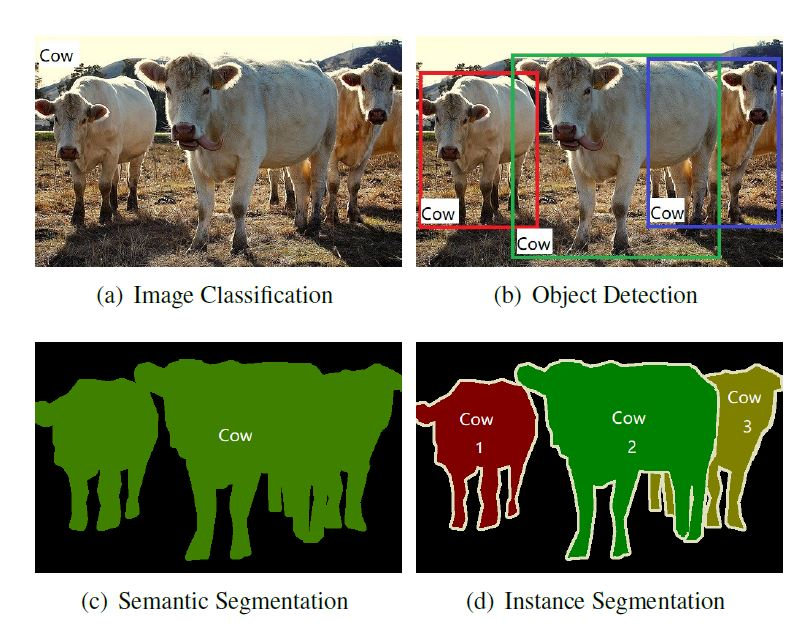

(a)와 같은 **Image classification **은 주어진 이미지 안에서 객체를 어떤 카테고리로 분류하는 데에 목적이 있다.

(b)와 같은 **Object detection** 은 카테고리 분류 뿐만 아니라 바운딩 박스로 객체의 위치를 예측하는 작업도 포함한다.

(c)와 같은 **Semantic segmentation** 은 Object detection과 같이 객체를 분류하는 것이 아니라 픽셀 단위로 분류를 진행함으로서 같은 카테고리의 다른 객체를 구별하지 않는다. 

(d)왁 같은 **Instance Segmentation** 은 (b)와 (c)의 개념이 합쳐진다. 이미지 안의 객체들에 대해서 픽셀 단위로 마스킹을 하되, 각각 다르게 분류한다.  (b)에서 바운딩 박스로 Localization 하는 것 대신에 픽셀로 Localization을 한다. 

딥러닝 이전의 객체 탐지 파이프 라인은 세가지 단계로 이루어졌다.

1. Proposal generation -  이 단계에서는 이미지 안에서 객체를 탐지하고 있을만한 위치를 찾는다. 이 위치를 **Regions of interest(ROI)** 라고 한다. 가장 직관적인 방법은 전체 이미지를 슬라이딩 윈도우 방식으로 스캔하는 것인데 다양한 크기의, 각기 다른 가로 세로 비율을 가진 객체들의 정보를 획득하기 위해서 입력 이미지들은 각기 다른 크기로 조정되고 다양한 크기의 윈도우가 이미지를 스캔하기 위해 사용된다.
2. Feature vector extraction - 이 단계에서는 이미지의 각 위치에서 슬라이딩 윈도우를 통해 고정된 크기의 특징 벡터들이 얻어진다. 이 벡터들은 각 지역의 특징 정보를 포함하고 있다. 또한 이 벡터들은 조도, 회전, 크기 변화에 큰 영향을 받지 않는다는 것을 보여준 SIFT(Scale Invariant Feature Transform), Haar, HOG(Histogram of Gradients), SURF(Speeded Up Robust Features) 같은 low-level visual descriptors에 의해 인코딩된다.
3. Region classification - 이 단계에서 지역 분류기들은 관심 지역을 레이블링하는 법을 배운다. 여기에는 SVM(Support Vector machines)가 적은 훈련 세트에도 좋은 성능을 보여서 사용되었다. 특별히 bagging, cascade learning, adaboost 같은 분류 기술들이 탐지 정확도를 개선하기 위해서 이 단계에서 사용되었다.

이런 방법들은 Pascal VOC 데이터 셋에서 인상적인 결과를 달성했다. 

 DPMs는 deformable loss로여러 모델들을 통합하고 학습한다. 그리고 각각의 훈련을 위해 그 안에 잠재되어 있는 SVM으로 심각하게 부정적인 포인트들을 캐낸다. 

그러나 위의 방법들은 다음과 같은 이유에 의해서 한계점을 보였다.

- Proposal generation 과정 중에서, 엄청나게 많은 수의 불필요한 제안들이 생성되었고 이는 분류 과정에서 많은 수의 false positive들을 낳았다. 게다가 윈도우 크기는 수동적으로 경험에 의해서 디자인되었기 때문에 실제 객체에 잘 들어 맞지 않았다.
- Feature descriptor들은 low level visual cues 기반으로 사람이 직접 만들어야 했기 때문에 복잡한 문맥에서는 대표격이라고 할 수 있는 정보들을 잡아내는데 어려움이 있었다.
- 탐지 파이프라인의 각 단계들은 각자 따로 디자인되고 최적화 되었기 때문에 전체 시스템 관점에서의 최적화를 달성하기 어려웠다. 

깊은 컨볼루션 신경망이 이미지 분류에서 큰 성공을 일으키고 객체 탐지 영역에서도 딥러닝 기반의 기술들이 주목할만한 진보를 달성했다.  특히 앞선 전통적인 방법들을 월등히 능가했다.  

한가지의 이미지 분류를 위한 계층적이고 공간 불변의(이미지가 변형되어도 그 이미지로 인식하는 것 - e.g. 고양이 사진을 90도 만큼 회전해도 그 고양이 사진으로 인식) 모델을 구축하기 위한 시도는 Fukushima에 의해 제안된 neocognitron이다. 그러나 이 방법은 지도 학습을 위한 효율적인 최적화 기술이 부재했다. 

이 모델을 기반으로 하여 Lecun 등은 CNN을, 역전파를 통한 SGD(Stochastic gradient descent) 으로 최적화했고 숫자 인식에서 경쟁력 있는 성능을 보여줬다. 

그러나 DCNN은 그 후에 SVM에게 주도권을 내줬는데 그 이유로 다음과 같은 이유들이 있었다.

- 주석이 달린(레이블링 된) 데이터의 부족이 과적합을 일으킴.
- 제한적인 컴퓨팅 자원들(성능 부족).
- SVM와 비교했을 때 이론적 뒷받침이 부족.

2009년에 Jia 등이 획득한 ImageNet이라는 1.2M의 고화질의  주석이 달린 데이터를  대량으로 획득한 덕에 딥러닝 모델을 훈련하는 것이 가능해졌고 GPU 클러스터등의 병렬처리 컴퓨팅시스템의 발전했다. 이로 인해 2012년에 Krizhevsky 등은 ImageNet 데이터 셋으로 크고 깊은 CNN 모델을 훈련시킬 수 있었고 ILSVRC(Large Scale Visual Recognition Challenge)에서 다른 방법들과 비교했을때 상당한 개선 사항을 보여줬다. 

딥러닝(CNN) 기반의 기술이 기존의 방법들과 비교했을 때 가지는 장점은 다음과 같다.

- 훈련 데이터의 저차원 픽셀 단위부터 고차원 의미 정보까지의 계층적 특징 표현들을 자동으로 생성해낸다. 그리고 복잡한 문맥에서도 보다 차별적인 표현 역량을 보여준다. 
- 더 많은 데이터가 있을 때 기존의 방법들은 개선의 여지를 보여줄 수 없는데 반해 딥러닝 기반 기술들은 더 나은 특징 표현을 가능하게 한다.
- 시작부터 끝까지 종단간의 최적화를 가능하게 한다.

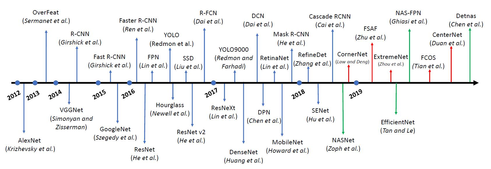

현재의 딥러닝 기반 객체 탐지 프레임워크들은 크게 두 가지 범주로 나눌 수 있다.

- R-CNN(Region-based CNN)과 그 아종들과 같은 Two-stage 그룹 - 2단계 탐지기들은 제안 생성기를 통해 제안 세트들을 만들어 내고 각각의 제안들에서 특징들을 추출해낸다. 그리고 나서 제안된 지역들의 카테고리를 분류기를 통해 예측한다.  2단계 탐지기들은 보통 1단계 탐지기들보다 더 좋은 탐지 성능을 보인다.
- YOLO(You only look once)와 그 아종들과 같은 One-stage 그룹 - 1단계 탐지기들은 지역 분류 단계 없이 특징 맵의 각 지역들의 객체들에 대해 곧바로 분류 작업을 수행한다.  1단계 탐지기들은 시간적인 측면에서 효율적이므로 실시간 객체 탐지에 이용 가능하다.

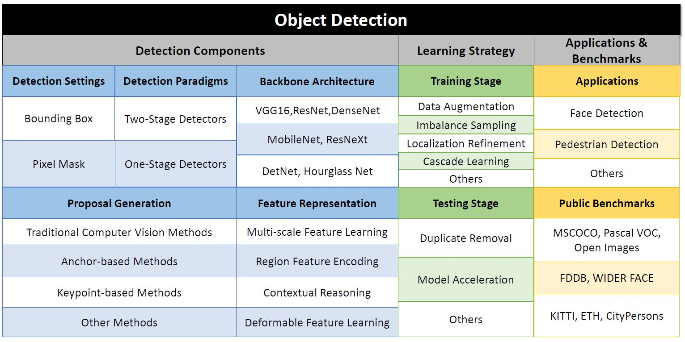

## 2. Problem Settings

객체 탐지는 객체 분류와 같은 인식 과정과 위치 회귀와 같은 위치 측정 과정을 포함한다. 하나의 객체 탐지기는 이미지 안에서 배경으로부터 특정 타겟 클래스의 객체를 구별할 필요가 있다. 또한 각 객체의 카테고리와 위치를 정확하게 맞춰야 한다. 바운딩 박스나 픽셀 마스크가 이런 타겟 객체의 위치를 측정하기 위해서 예측된다.

예를 들어 우리가 N개의, 주석이 달린 이미지 {x1, x2, …, xN}을 가지고 있다고 가정하자. i번째 이미지 xi에는 C라는 카테고리 집합 중에 하나의 카테고리에 속하는 Mi 개의 객체들이 존재한다. 

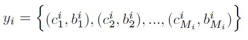

각각의 c(i, j)는 카테고리 집합 C의 원소이고 i번째 이미지의 j번째 객체의 카테고리를 나타낸다. b(i, j)는 i번째 이미지 xi의 j번째 객체의 바운딩 박스 혹은 픽셀 마스크를 나타낸다. 탐지기 f는 θ에 의해서 매개변수화 된다. xi 이미지의 예측 값 yi_pred는 yi와 같은 형식을 갖는다.

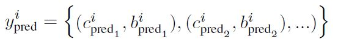

손실 함수 *ℓ* 탐지기를 최적화 하기 위해 다음과 같이 세팅된다.

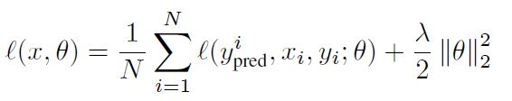

Softmax loss, focal loss 같은 손실 함수들은 탐지기의 최종 성능에 영향을 끼친다. 

위치 측정의 질을 평가 하기 위해서 객체들과 예측 값들 사이의 **Intersection-over-union(IoU)** 라는 계량법이 사용된다. 

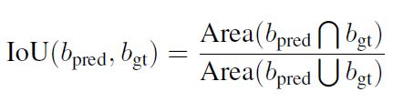

b_gt는 바운딩 박스 혹은 픽셀 마스크의 실제 값을 나타낸다.  IoU의 한계값 Ω은 예측 값이 객체를 밀접하게 덮는지 결정하기 위해서 세팅된다.  객체 탐지에서는 예측 값이 성공적으로 위치 측정을 했는지를 다음과 같이 나타낸다.

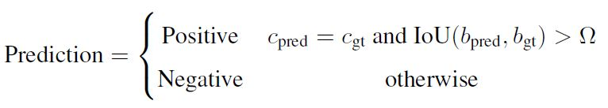

일반적인 객체 탐지 문제에서 카테고리 예측을 평가하기 위해서 mean average precision(mAP)가 사용된다. 

탐지 정확도와 더불어 추론 시간도 중요한 요소 중에 하나이다. 추론 시간을 평가 하기 위한 단위로 **Frame per second(FPS)** - (1초당 얼마나 많은 이미지들의 처리가 이루어지는 지)가 사용된다. 보통 20 FPS이면 실시간 탐지기로 여겨 진다.

## 3. Detection Components

### 3.1 Detection Settings

- Vanilla object detection(bbox-level localization) - 객체의 위치를 사각형 바운딩 박스로 측정한다. 따라서 바운딩 박스 주석이 필요하고 평가시에는 예측 바운딩 박스 영역과 실제 바운딩 박스 영역 사이의 IoU가 성능을 측정하기 위해 계산된다. 
- Instance segmentation은 바운딩 박스와는 전혀 다르게 세팅이 되는데 사각형 바운딩 박스 대신 픽셀 단위로 각각의 의미적 객체들은 마킹한다. 정확한 픽셀 레벨의 예측을 위해서 Instance segmentation은 (픽셀에 대해) 공간적으로 잘못 할당되는 것에 민감하므로 더 정확한 공간 정보 처리를 요구한다. 평가는 픽셀 마킹에 대해 IoU 계산이 이루어진다는 것을 제외하고는 바운딩 박스에서의 형식과 동일하다.

### 3.2 Detection Paradigms

|                     | Advantage                                                | Disadvantage                |
| ------------------- | -------------------------------------------------------- | --------------------------- |
| Two-stage detectors | 상대적으로 높은 탐지 성능                                | 추론 속도가 낮다            |
| One-stage detectors | 실시간 객체 탐지에 사용가능할  정도로  높은 추론 속도 | 상대적으로 빈약한 탐지 성능 |

#### 3.2.1 Two-stage Detectors

1.  Proposal generation - 이 단계에서 탐지기는 객체를 포함하고 있을 만한 지역을 확인한다. 높은 재현율(Recall)로 지역을 제시함으로서 이미지 안의 모든 객체들이 적어도 하나쯤은 각 지역에 포함되도록 한다.
2. Making predictions for these proposals - 이 단계에서는 딥러닝 기반 모델이 이 지역들에 대해 레이블링을 한다. 지역은 미리 정의된 레이블 중 하나이거나 배경이라는 레이블이 달린다. 추가적으로 지역 생성기(추천기)에 의해서 제안된 원래의 측정된 위치가 조정될 수 있다. 

다음은 주요 Two-stage 탐지기들이다.

- R-CNN - R-CNN은 2014년에 Girshick 등에 의해 제안된 최초의 Two-stage 탐지기 중 하나이다. 기존의 전통적인 방법의 탐기지 중 하나인 SegDPM가 VOC2010에 40.4%의 mAP를 보였다면 R-CNN은 53.7%의 개선된 성능을 보였다.  R-CNN은 다음과 같은 3단계의 처리 과정을 가진다.

  1.  Selective Search에 의해서 거의 2,000개의 지역들 생성. 이 중에서 배경임을 쉽게 알 수 있는 지역들은 버려짐.
  2. 각 지역들이 어떤 고정된 크기로 잘려지거나 조정되고나서 DCNN에 의해서 하나의 특징 벡터(예를 들어서 4,096 크기)로 인코딩된다. 
  3. one-vs-all SVM 분류기에 의해서 레이블링되고 바운딩 박스 회귀 처리기들이  원래의 지역들이 실제 객체에서 딱 맞도록  입력으로 들어온 인코딩된 특징들을 사용하는 법을 배운다. 

  딥러닝 신경망이 전통적인 특징 디스크럽터들과 다른 점은 신경망의 각 계층에서 다른 크기의 정보를 잡아내고 계층적인 특징들을 생산해내어 분류 작업을 위한 강인하고 차별적인 특징들을 생산한다는 것이다. 

  R-CNN에서는 전이 학습의 이점을 활용하기 위해서 ImageNet 데이터셋으로 미리 학습된 컨볼루션 계층의 가중치들로 CNN의 가중치를 초기화 한다.  그리고 나서 탐지 작업을 위해 완전 연결 계층만 재 학습된다. 그 다음 전체 시스템이 종단 간으로 미세 조정된다. 전이 학습을 이용함으로서 컨볼루션 모델을 학습시키기 전에 쉽게 확인할 수 있는 부정적인 지역들(배경)을 제거함으로서 분류 성능을 개선시키고 학습 시간을 줄일 수 있다.

  R-CNN은 2가지의 치명적인 단점을 가지고 있다.

  1.  각 지역의 추출된 특징들이 지역마다 개별적으로 추출되고 지역마다 공유되지 않기 때문에 반복적인 계산을 해야하고 이는 훈련과 테스트 하는데 엄청난 시간 낭비를 초래한다. 
  2. R-CNN의 각 3가지 과정들이 유기적으로 연결되어 있지 않으므로 시스템 종단간의 최적화를 할 수 없어 시스템 전체적인 최적의 솔루션을 얻기 어렵다.
  3. Selective Search가 저차원 수준의 시각 정보에 의지하기 때문에 복잡한 문맥에서 높은 질의 지역을 생산하기 어렵다
  4. GPU의 이점을 활용하기 어렵다.

- SPP-net - R-CNN의 성능을 가속화하고 특징들을 좀 더 잘 추출하기 위해서 He 등은 Spatial pyramid matching(SPM)에서 영감을 얻은 SPP-net을 제안했다. 각 제안 지역들을 자르고 CNN 모델에 입력으로 넣는 대신에 SPP-net에서는 DCNN에 의해서 전체 이미지에 대한 특징 맵을 계산하고 Spatial Pyramid Pooling(SPP) 계층에 의해서 고정된 크기의 특징 맵에 대한 특징 벡터를 추출해낸다. SPP는 다양한 크기의 N by N 격자로 특징 맵을 나누고 나서 격자의 각 칸에 대하여 풀링을 수행하고 나서 특징 벡터에게 전달한다. 이렇게 전달된 특징 벡터들은 각 지역에 대한 시각 정보를 위해 연결된다(Concatenated). 만들어진 특징 맵들은 지역에 대한 SVM 분류기와 바운딩 박스 회귀 조정기에 전달된다. R-CNN과 비교하면 이미지들이나 이미지의 각 지역들이 크기 자체가 조정되는 일 없이 다양한 크기와 가로세로 비율로 처리가 될 수 잇으므로 정보 손실이나 원치 않는 기하학적 왜곡이 덜 발생된다. SPP-net도 다음과 같은 단점을 가진다.

  1.  시스템의 각 단계들이 여전히 나누어져 있고, 따라서 종단간의 최적화를 진행할 수 없다.
  2.  추출된 특징들을 저장하기 위한 캐시 메모리가 필요하다.
  3.  SPP 층이 컨볼루션 층에 역전파를 하지 않으므로 SPP 이전 층의 모델 파라미터는 동결된다. 이것은 결과적으로 딥러닝 중추 구조(DCNN)의 학습 능력을 제한한다. 

- Fast R-CNN - Girshick 등이 제안한 Fast R-CNN은 SPP-net의 단점을 커버하는 멀티 태스크 학습 탐지기이다. Fast R-CNN은 역시 전체 이미지에서 특징 맵을 계산하고 그 특징 맵에서 고정된 크기의 지역 특징들을 추출한다. SPP-net과는 다르게 지역 특징들을 추출하는 ROI Pooling을 사용한다. ROI Pooling은 SPP의 특수한 경우로서 SPP가 다양한 크기의 N by N 격자를 만들어 냈다면 이와는 반대로 한 가지 크기의 N by N 격자를 만들어내고(특징 맵이 고정된 갯수로 분할됨) 컨볼루션 커널에 역전파를 한다. 특징 추출 이후에 특징 벡터들은 일련의 완전 연결 계층을 거쳐 두 가지 병렬로 연결된(분류 계층(cls), 회귀 계층(reg)) 출력 층으로 전달된다. 분류 계층에서는 C+1(C가지의 클래스와 배경 클래스) 클래스에 관한 소프트맥스 확률을 만들어 내고 회귀 계층에서는 바운딩 박스를 조정하기 위한 4가지의 실수 파라미터를 인코딩한다. Fast R-CNN에서는 특징들을 저장하기 위한 여분의 캐시 메모리가 필요하지 않고 시스템 종단 간의 최적화가 가능하다. Fast R-CNN은 다음과 같은 단점을 가진다.

  - 지역 제안을 만들어내는데 여전히 전통적인 방법(Selective Search, Edge Boxes) - (저차원의 시각 신호를 기반으로 하는)에 의지하고 있기 때문에 데이터 주도적인 방법으로 학습을 할 수 없다. 
  
- Faster R-CNN - Fast R-CNN의 문제를 커버하기 위해서 지역 제안 생성기 부분을 변경함(Region Proposal Network(RPN)). 이 지역 제안 생성기는 지도 학습 방법으로 학습된다. RPN은 완전 컨볼루션 네트워크이고 각기 다른 사이즈의 이미지를 입력으로 받아 특징 맵의 각 부분의 객체가 있을법한 제안들을 생성해낸다. 이 네트워크는 특징 맵을 n by n 슬라이딩 윈도우로 스캔하고 각 부분에 대해 특징 벡터를 만들어낸다. 이렇게 만들어진 특징 벡터들은 병렬적으로 연결되어 있는 출력 브런치에 입력으로 들어가게 된다(지역 제안이 객체인지 아닌지 분류하는 객체 분류 층과 바운딩 박스 회귀 층).  그런 다음 최종적으로 객체를 레이블링하고 바운딩 박스의 위치를 측정하는 계층에 도달한다.  RPN은 Fast R-CNN에 삽입 가능하고 지역 제안 생성이 데이터 주도적인 방법으로 될 수 있게 한다. Faster R-CNN은 GPU 상에서 5FPS의 속도로 예측을 만들어 낼 수 있다. Faster R-CNN은 다음과 같은 문제를 갖고 있다. 

  - 입력 이미지의 특징 맵을 계산하고 서로 다른 지역간의 특징 추출 계산을 공유하는 지역 특징들을 추출해내긴 하나, 계산이 지역 분류 과정에서는 공유되지 않으므로 각각 따로 일련의 완전 연결 계층을 거쳐야할 필요가 있다. 만약에 이미지가 수백만의 후보들을 가지고 있다면 그만큼의 여분의 계산이 더 필요하고, 단순히 완전 연결 계층을 제거한다면 탐지 성능의 급격한 성능을 가져온다. 왜냐하면 딥러닝 네트워크가 후보들의 공간 정보를 줄여야 하기 때문이다.
  - 최종 예측을 만들어 내는데 한 개의 깊은 층 특징 맵만을 사용한다. 이것은 서로 다른 크기의 객체들을 탐지 하기 어렵게 하는데 구체적으로 작은 객체들을 탐지하는데 어렵게 만든다. 깊은 컨볼루션 네트워크에서의 특징 표현 관점에서 깊은 층은 의미적인 정보에는 강력하나 공간 정보에는 약하고 얇은 층에서는 그 반대이다.  

- R-FCN - Dai 등은 Region-based Fully Convolutional Networks를 제안했는데 여기서는 지역 분류 과정에서 계산 노력을 서로 공유한다. R-FCN은 Position Sensitive Score Map이라고 하는 각 클래스들에 대한 각각의 위치 정보를 인코딩한다. 그리고 나서 Position Sensitive ROI Pooling(P-SROI Pooling)에서 타겟 지역들의 각각의 위치를 인코딩한 것으로 공간 인식 지역 특징들을 추출한다. 추출된 특징 벡터들은 공간 정보를 유지하므로 지역별 완전 연결 계층 연산이 없어도 Faste-r R-CNN에 경쟁력 있는 결과를 달성했다. 

- FPN - Lin 등은 (깊은 컨볼루션 네트워크에서의 특징 표현 관점에서 깊은 층은 의미적인 정보에는 강력하나 공간 정보에는 약하고 얇은 층에서는 그 반대)와 같은 속성을 이용해서 Feature Pyram-id Networks라는 깊은 층과 얇은 층의 특징을 합성하여 객체 탐지가 각기 다른 크기의 특징 맵에서 가능하도록 하는 것을 제안했다. 핵심은 얇은 층에서의 공간 정보에 대한 강점과 깊은 층에서의 풍부한 의미적 정보를 강화하는 것이다. FPN은 다양한 크기의 객체를 탐지하는데 진보를 이룩하여 비디오 탐지, 인간의 자세 인식과 같은 분야에서 널리 사용되었다. 

- Instance segmentation - 대부분의 Instance segmentation 알고리즘들은 vanilla 객체 탐지 알고리즘에서 확장되었다. 초기에는 segment 후보들을 생성하고 Fast R-CNN으로 각 segment들을 분류했다. 나중에 Dai등이 MNC라고 하는 멀티 스테이지 알고리즘을 제안했다. 이는 전체 탐지 프레임워크를 여러 단계로 나누고 바운딩 박스 후보들로부터 segmentation 마스크를 예측했다. 그리고 나서 지역 분류기에 의해 카테고리화되었다. 이런 초기의 작업들은 여러 단계에 걸쳐 바운딩 박스와 마스크 예측을 수행했다. 

- Mask R-CNN - He 등은 후보들의 바운딩 박스와 세그멘테이션 마스크의 예측을 병렬적으로 수행하는 Mask R-CNN을 제안했다. 

- Mask Scoring R-CNN - Mask R-CNN을 기반으로 Huang 등은 마스크의 품질을 인식하는 프레임워크를 제안했다. 이것은 예측된 마스크들의 질을 학습하고 마스크의 질과 마스크의 confidence 점수 사이의 에러를 계량화했다. 

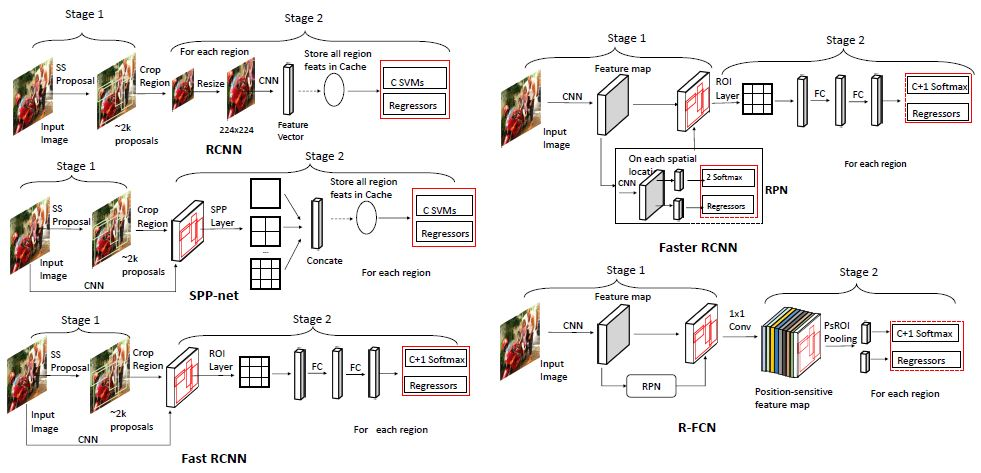

#### 3.2.2 One-stage Detectors

Two-stage 탐지기들과 다르게 One-stage 탐지기들은 별개의 후보 생성기나 후보 생성을 학습하는 과정이 존재하지 않는다. 이 탐지기들은 이미지의 모든 지역에 잠재적으로 객체들이 존재할 것으로 가정하고 각 지역을 특정 객체나 배경으로 분류한다. 

- OverFeat - Sermanent 등은 DCNN을 완전 컨볼루션 객체 탐지 안에 포함시켜 객체 탐지를 수행하는 OverFeat을 제안했다. 객체 탐지를 여러 지역 분류 문제로 볼 수 있으므로 OverFeat은 임의의 입력을 위해서 원래의 분류기를, 마지막 완전 연결계층을을 1x1 컨볼루션 층으로 보는 탐지기로 확장시켰다. 분류 네트워크는 입력의 각 지역에 객체의 존재 유무를 가리키는 예측들의 격자를 출력했다. 객체를 확인하고 나서 바운딩 박스 회귀 조정기는 분류기의 DCNN와 같은 특징들에 기반하여 예측된 지역들을 조정하는 법을 학습했다. 다양한 크기의 객체들을 탐지하기 위해서 입력 이미지는 다양한 크기로 조정되어 네트워크의 입력으로 들어갔다. 그리고 나서 여러 크기의 예측들이 합쳐졌다. OverFeat은 컨볼루션 레이어를 사용해서 각 지역들을 포개는 계산을 공유함으써 R-CNN과 비교하여 속도적인 면에서 강점을 보였다. 그리고 오직 한 번의 순전파만 있으면 됐다. 

  - 분류기와 회귀 조정기는 각자 따로 최적화 될 수 밖에 없었다. 

  

- YOLO - Redmon 등은 실시간 탐기지인 YOLO(You Only Look Once)를 개발했다. YOLO는 객체 탐지를 회귀 문제로 보고 전체 이미지를 정해진 정해진 숫자의 격자 칸으로 나누었다(7 x 7 격자 등). 각 셀은 한 개 이상의 객체들의 존재 유무를 탐지하기위한 후보로 여겨졌다.  원래의 구현에서 각 칸은 (최대) 두개 객체들의 중심점을 포함했다. 각 칸에 대해서 예측은 다음과 같은 정보로 이루어져 있었다. 그 지역에 객체가 포함되어 있는지, 바운딩 박스의 좌표 정보와 크기(넓이와 높이), 객체의 클래스 정보. 전체적인 프레임워크는 단일 네트워크로 이루어져 있고 지역 후보생성 과정을 생략함으로서 종단 간의 최적화 방법을 가능하게 했다. YOLO는 기본적으로 45 FPS의 예측을 만들어 낼 수 있었고 좀 더 단순한 중추 구조에 따라서 155 FPS의 처리 속도까지 도달했다. YOLO는 다음과 같은 문제가 있었다.

  - 주어진 한 개의 지역에 대해 최대 2개의 객체만 탐지 가능 하기 때문에 작은 객체들이나 뭉쳐 있는 객체들은 탐지 하기 어려웠다. 
  - 마지막 특징 맵만 예측에 사용되었기 때문에 다양한 크기 혹은 가로 세로 비율의 객체를 예측하기에는 적합하지 않았다. 

  

- SSD - 2016년에 Liu 등은 YOLO 한계들을 다루는 Single-Shot Multibox Detector(SSD)를 제안했다. SSD 또한 이미지를 격차 형태로 나누긴 하지만 YOLO에서 고정된 격자 칸들을 예측하는 것과는 달리 각 격자 칸에, 바운딩 박스의 출력 공간을 나누기 위한 다양한 크기와 가로 세로 비율의 앵커들의 집합이 생성된다. 각 앵커들은 회귀 조정기에 학습된 4개의 오프셋 값으로 조정되고 분류기에 의해 C+1개의 카테고리적 확률이 할당된다. SSD는 여러 특징 맵에서 객체들을 예측했는데 각 특징 맵은 그것의 수용체에 따라서 특정 크기의 객체를 탐지하는 역할을 했다. 큰 객체들을 탐지하고 수용체 영역을 늘리기 위해서 몇몇의 여분의 컨볼루션 특징 맵이 원래의 중추 아키텍처에 추가되었다.  전체 네트워크는 종단간의 훈련 중에 모든 예측 맵들의 분류 손실과 위치 손실들의 가중치 합으로 최적화 되었다. 최종 예측은 각기 다른 특징 맵들의 모든 탐지 결과를 합쳐서 생성되었다.  훈련 중의 그래디언의 많은 부분을 차지하는 부정적인 후보들을 걸러내기 위해서 강력한 부정 후보 추출(mining)이 탐지기를 훈련시키기 위해 사용되었다. 집약적인 데이터 증대도 탐지기의 정확도를 개선하기 위해 적용되었다.  SSD는 Faster R-CNN과 비교해서도 견줄만한 탐지 정확도를 달성했고 실시간에 가까운 추론 능력을 보였다. 

  

- RetinaNet - One-stage 탐기기에서는 판별하기 쉬운 부정 샘플들을 걸러내기 위한 후보 생성 과정 없을 때 생기는 전경(객체)과 배경 사이의 클래스 불균형 문제는 심각한 문제이다. Lin 등은 이런 불균형 문제를 좀 더 유연하게 대처할 수 있는 RetinaNet를 제안했다. RetinaNet은 focal loss(문제가 있어보이는 손실에 좀 더 집중하는)라고 하는, 판별하기 쉬운 부정 샘플들의 그래디언트들을 단순히 버리기 보다 억제하는 손실을 사용했다. 여기에 Feature pyramid networks로 각기 다른 레벨의 특징 맵에서 다양한 크기의 객체를 탐지했다. 여기서 제안된 focal loss는 기존의 강력한 부정 추출 전략(Hard negative mining strategy)를 압도적으로 능가했다. 

  

- YOLOv2 - Redmon 등은 실시간 추론 속도를 유지하면서 탐지 성능을 상당히 개선시킨 YOLOv2라고 하는 YOLO의 개선된 버전을 제안했다. YOLOv2는 ImageNet의 고화질 이미지들(224x224 부터 448x448 까지)로 미리 훈련된 좀 더 강력한 DCNN 중추 아키텍처를 사용했다. 그래서 이 학습된 가중치들은 미세 조정된 정보를 잡아내는데 민감했다. SSD의 앵커 전략에 영감을 받아서 YOLOv2는 세팅을 수동으로 하는 것 대신에 훈련 데이터로부터 k-means 클러스팅을 통해 더 나은 앵커 우선순위를 정의했다. 이것은 위치 측정에서 최적화의 어려움을 줄이는데 도움이 됐다. 또, Batch Normalization 계층과 여러 크기의 훈련 기술들을 추가함으로서 YOLOv2는 당시에 최상의 결과를 도출했다. 

  

- CornerNet - 이전의 접근법들은 탐지기를 훈련시키기 위해서 앵커 박스들을 수동으로 디자인하는 것을 요구했다. 나중에 몇 개의 앵커 없는 탐지기들이 개발되었는데 이 탐지기들의 목적은 객체를 앵커에 맞추기 위해 노력하기 보다 바운딩 박스의 핵심들을 예측하는데 목적을 두었다. Law와 Deng은 앵커 없는 탐지기 중 하나인 CornerNet을 제안했는데 이 탐지기는 객체를 모서리들의  쌍으로 탐지했다.  각 위치에서 특징 맵, 클래스 히트맵, 임베딩 쌍과 모서리 오프셋등을 예측했다.  클래스 히트맵들은 모서리가 될법한 확률을 계산했고 모서리 오프셋들은 모서리 위치를 회귀하는데 사용됐다. 임베딩 쌍들은 같은 객체에 속하는 모서리 쌍들을 그룹 짓는 역할을 했다. 수동으로 디자인된 앵커들에 의존하는 것 없이 CornerNet은 MSCOCO 데이터 셋에서 상당한 성능을 보여줬다. 후에 키포인트 기반의 One-stage 탐지기들의 아종이 나오기도 했다. 

  

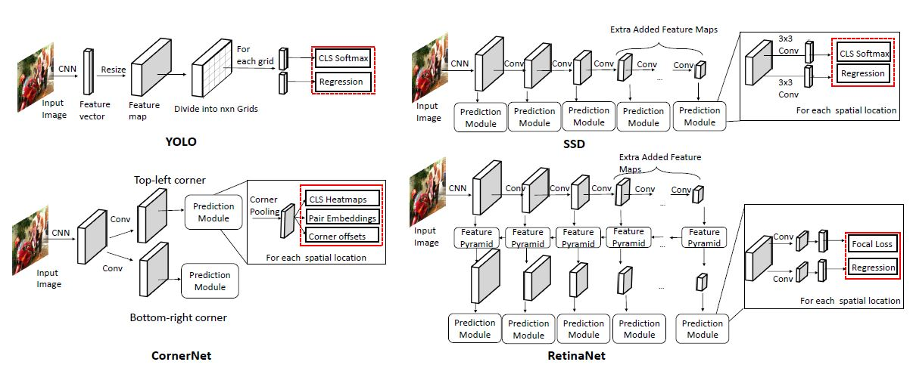

### 3.3 Backbone Architecture

#### 3.3.1 Basic Architecture of a CNN

DCNN은 보통 일련의 컨볼류션 계층, 풀링 계층, 비선형성 활성화 계층, 완전 연결 계층으로 구성된다. 컨볼루션 계층은 특징 맵을 만들어 내기 위해 이미지를 입력으로 받아 n by n 커널로 이미지 위를 빙빙돈다.  생성된 특징 맵은 멀티 채널의 이미지로 취급되고 입력 이미지에 대한 각기 다른 정보를 표현한다. 특징 맵(뉴런이라고 부르는)의 각 픽셀은 수용체 영역이라고 부르는 바로 전 맵의 인접한 뉴런들의 작은 부분에 연결된다. 특징 맵 생성 후에는 비선형성 활성화 계층이 적용된다. 풀링 계층은 컴퓨팅 코스트를 줄이고 수용체 영역을 크게 만들기 위해 수용체 영역의 신호들을 요약하는데 사용된다. DCNN 전체의 네트워크는 그래디언트 기반의 최적화 방법들(Stochastic gradient descent, Adam 등)에 의한 손실 함수에 의해 최적화 된다. 대표적인 CNN은 AlexNet으로 5개의 컨볼루션 계층과 3개의 풀링 계층 3개의 완전 연결 계층이 연결되어 있고 각 컨볼루션 계층 뒤에는 ReLU 비선형 활성화 함수 계층이 붙어 있다. 

#### 3.3.2 CNN Backbone for Object Detection

- VGG16 - AlexNet을 기반으로 개발되었다. 5개의 컨볼루션 계층으로 이루어진 그룹과 3개의 완전 연결 계층으로 구성되어 있다. 처음 2개의 그룹에는 각 2개의 컨볼루션 계층이 있고 뒤의 3개의 그룹에는 세개의 컨볼루션 계층이 있다. 각 그룹에는 최대 풀링 계층이 공간 차원을 감소시키기 위해 적용되었다. VGG16은 컨볼루션 계층을 쌓아서 네트워크의 깊이를 증가시키는 것은 모델의 표현 역량을 증가시켜 더 좋은 성능을 낼 수 있음을 보였다. 

  - 그러나 단순히 20개 컨볼루션 층을 쌓아서 모델의 깊이를 늘리는 것은 SGD 최적화로는 한계에 직면했다. 이런 모델로는 성능이 급격하게 감소하고 심지어 훈련 과정에서도 얇은 모델보다 열등했다. 

    

- ResNet - He 등은 Shortcut 연결이라는 개념을 소개하면서 최적화 어려움을 줄일 수 있는 ResNet을 제안했다. 여기서 어떤 계층은 비선형 변환 과정을 하지 않고 곧바로 다음 계층에 값을 넘길수 있었다(우리에게 암시적으로 Identity 계층을 제공). x_l은 l번째 계층의 입력 특징이고 f_l+1은 입력 x_l에 대한 연산, 예컨대 컨볼루션, 정규화, 비선형성 활성화 등을 나타낸다. f_l+1(x_l, θ)는 x_1에 대한 잔차 함수이고 어떤 깊은 계층의 특징 맵은 얇은 층의 활성화 값과 잔차 함수 값의 합으로 볼 수 있다. Shortcut 연결은 깊은 계층에서 얇은 층으로의 그래디언트를 역전파하는 고속도로를 만드는 것과 같다. 그에 따라 훈련 과정 간의 어려움이 크게 감소된다. 네트워크를 효율적으로 훈련시키는 잔차 블록과 함께 모델의 깊이는 더 깊어지는 것이 가능해졌고 이것은 매우 큰 용량의 모델을 훈련시키는 것을 가능하게 했다. 

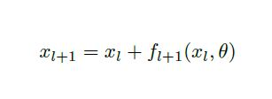

- ResNet-v2 - He 등은 Pre-activation을 적용한 ResNet의 개량 버전을 제안했다. 그들은 적절하게 Batch Normalization을 배치하면 원래의 ResNet보다 더 나은 성능을 낼 수 있음을 보였다. 이 접근법은 ResNet이 1000 개 이상의 층에서도 더 좋은 결과를 낼 수 있도록 했다. 

  - Huang 등은 ResNet이 Shortcut 연결을 통해 훈련간 어려움을 감소시킨다 할지라도 이 구조가 연산이 진행되는 계층의 이전 계층의 특징들을 충분히 이용하지 않는다고 주장했다. 그래서 얇은 층의 원래의 특징들은 element-wise 연산에서 실종되고 나중에 사용될 수 없다고 했다.

    

- DenseNet - Huang 등은 얅은 층의 특징들을 유지하고 정보 흐름을 개선하는 DenseNet을 제안했다. 이것은 다음과 같이  element-wise 대신에 전차 출력과 입력을 연결(Concatenate)함으로서 가능했다. o는 concatenation 연산을 의미한다. 

  - Chen 등은 DenseNet에서 얇은 층에서 사용되는 새로운 특징들의 대부분은 중복되고 이로 인해 높은 컴퓨팅 코스트를 초래했다고 주장했다. 

  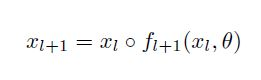

- DPN - Chen 등은 ResNet과 DenseNet의 장점을 종합한 Dual Path Network를 제안했다. 이 네트워크에서는 x_l의 채널들을 두 부분으로 나눈다. x_l_d은 밀집 연결(Dense connection) 계산에 사용되고 x_l_r은 element-wise 합에 사용되었다(서로 공유되지 않는 잔차 학습 브런치 f_l+1_d와 f_l+1_r에서). 최종 결과는 두 브런치의 출력의 연결이다.  

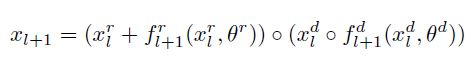

- ResNeXt - Xie 등은 ResNet을 기반으로 ResNeXt라고 하는, 경쟁력 있는 분류 정확도를 유지하면서 계산량과 메모리 사용량을 크게 줄이는 것을 제안했다. 이 네트워크는 그룹 컨볼루션 계층을 도입했는데, 이는 특징 맵 채널들을 드문드문 연결하여 계산량을 줄였다. 계산량을 원래의 ResNet 양만큼 유지할 수 있을 정도의 그룹의 숫자를 늘림으로 인해  ResNeXt는 훈련 데이터에서 더 풍부한 특징 표현을 잡아내고 중추 네트워크의 정확도를 개선했다. 

- MobileNet - Howard 등은 각 특징 맵의 채널 숫자만큼 좌표를 세팅하는 MobileNet을 개발했다. MobileNet은 분류 정확도에서 큰 손실 없이 모델 파라미터의 숫자와 계산량을 상당히 줄였다. 이 모델은 특히 모바일 플랫폼에서의 사용을 위해 디자인 되었다. 

- GoogleNet - 모델의 깊이를 증가시키는 것과 더불어 학습 역량을 개선하기 위해 모델의 넓이를 증가시키는 방법도 연구되었다. Szegedy는 주어진 계층 안에서 같은 특징 맵에 여러 크기의 컨볼루션 커널을 적용하는 Inception 모듈과 GoogleNet을 제안했다. 이런 방법으로 각기 다른 크기의 특징들을 잡아내고 이런 특징 들을 출력 특징 맵에 함께 요약했다. 이 모델의 개량 버전이 후에 컨볼루션 커널을 선택하는 다른 방법과 잔차 블록을 도입하면서 개발되었다. 

위에서 언급한 모델들은 이미지 분류를 위한 구조이고 보통 ImageNet에서 미리 훈련이 되어 있다. 이 모델들은 객체 탐지를 위한 초기화 방법으로 도입되었지만 곧바로 적용되지는 않았다. 그 이유는 분류와 탐지 작업 사이에 잠재적으로 충돌이 발생할 수 있기 때문이었다. 특히 다음과 같은 관점에서 충돌이 발생할 수 있었다. 

1. 분류 작업은 큰 수용체 영역과 공간 불변성을 유지하는 것을 필요로 했다. 따라서 여러 다운 샘플링(풀링 계층 같은) 연산이 특징 맵 해상도를 줄이기 위해 적용되었다. 이렇게 생성된 특징 맵들은 낮은 해상도와 공간적인 불별성 그리고 큰 수용체 영역을 소유했다. 그러나 탐지 작업에서는 높은 해상도의 공간 정보가 객체들의 위치를 정확하게 파악하기 위해서 필요했다. 
2. 분류 작업에서는 단일 특징 맵에서 예측을 생성했지만 탐지 작업에서는 여러 크기의 객체를 탐지하기 위해서 여러가지 표현들의 특징 맵이 필요했다. 

- DetNet - Li 등은 이 두가지 작업을 중개하면서 탐지 쪽에 무게를 두는 DetNet을 소개했다. 이 네트워크는 수용체 영역을 증가시키기 위해, 팽창된 컨볼루션의 예측을 위한 높은 해상도의 특징 맵들을 유지했다. 여기에 더해 풍부한 정보를 제공하는 여러 크기의 특징 맵들에서 객체들을 탐지했다. 또, 사이즈가 큰 분류 데이터 셋에서 미리 학습긴 했으나 네트워크 구조는 탐지를 위해 디자인 되었다.  

- Hourglass Network - 이 아키텍처는 이미지 분류를 위해 디자인 된 것은 아닌 아키텍처다.  원래는 사람의 자세 인식 작업을 위해서 만들어졌으며 일련의 hourglass 모듈과 함께 완전 컨볼루션 구조로 되어 있다. Hourglass 모듈은 처음에는 입력 이미지를 일련의 컨볼루션 계층과 풀링 계층을 통해 다운 샘플하고, 다시 그 특징 맵을 디컨볼루션 연산을 통해 업샘플링 했다. 다운 샘플링 시에 발생하는 정보 손실을 피하기 위해서 다운 샘플링과 업 샘플링 사이에 skip 연결을 사용했다. Hourglass는 지역적인 정보, 전역적인 정보 모두 잡아낼 수 있었기 때문에 객체 탐지에 매우 적합했다. 

### 3.4 Proposal Generation

후보 생성 단계는 객체 탐지 프레임워크에서 큰 역할을 한다. 이 단계에서는 객체들이 있을법한 사각형의 바운딩 박스들의 집합을 만들어 낸다. 이 후보들은 분류나 위치측정의 조정을 위해 사용된다. 주목할 만한 점은 One-stage 탐지기나 Two-stage 탐지기 모두 후보들을 생성한 다는 것이다. 주요 차이점은 Two-stage 탐지기가 전경(객체) 혹은 배경 정보 둘 중 하나의 드문드문한 후보들의 집합을 만들어낸다면 One-stage 탐지기는 각 지역을 잠재적인 후보로 가정하고 그에 따라 각 위치의 객체들의 좌표나 클래스를 측정한다는 것이다. 

#### 3.4.1 Traditional Computer Vision Methods

전통적인 컴퓨터 비전 방법으로는 후보를 저차원 레벨의 신호, 예를 들어 선, 모서리, 색깔 같은 것들에 기반하여 생산해낸다. 이 기술들은 세가지 원칙으로 카테고리화 될수 있다. 

1.  후보 상자의 객체성 점수를 계산하는 것

   

2.  원래의 이미지들에서의 super-pixels을 합치는 것(Super pixel이란 이미지 전 처리 작업에서 많이 사용하는 기법 중에 하나로 pixel들을 색 등의 저레벨 정보를 바탕으로 비슷한 것끼리 묶어서 '커다란 pixel'을 만드는 작업이다. 이 '커다란 pixel'들은 추후의 이미지 처리 과정에서 마치 하나의 pixel처럼 다루어지게 된다.)

   

3. 다양한 전경과 배경의 세그먼트들을 만들어 내는 것.

   

- 객체성 점수 기반 방법들은 각 후보 상자들안에 얼마간의 확신으로 객체가 들어 있을법한가를 예측한다. Arbelaze 등은 색깔 대조, 선 밀집도와 현저함고 같은 시각적 신호에 기반한 분류에 의해 후보들에 객체성 점수를 할당했다. Rahtu 등은 Arbelaze 등의 아이디어를 수정하여 후보 지역들의 객체성 점수의 순위를 매기는 효율적인 단계별 학습 방법을 소개했다. 

  

- Super pixel 병합은 세그멘테이션 결과로부터 만들어진 super pixel들을 병합하는 것이다. Selective Search가 이 방법 기반의 후보 생성 알고리즘이었다. 이 방법은 세그멘테이션 방법에 의해 생성된 여러 계층 구조의 세그멘트들을 계산하고, 이것들은 색깔, 지역 등의 시각적 요소들에 따라 병합되며 마지막에는 병합된 세그멘트들에 바운딩 박스를 위치 시켰다. Manen 등은 이 방법과 유사한 아이디어를 제안했다. 차이점은 병합 함수의 가중치가 학습된다는 것과 병합 과정이 랜덤이라는 것이다. 

- Seed 세그멘테이션은 여러 seed 지역들로 시작해서 각 seed에서 전경과 배경의 세그멘트들이 만들어진다. 계층적 구조의 세그멘테이션이 구축되는 것을 피하기 위해서 CPMC는 다양한 seed들로 초기화된, 겹쳐진 세그멘트들의 세트를 만든다. 각 후보 세그멘트들은 이진 세그멘테이션(전경인지 배경인지) 문제의 솔루션이다. Enreds와 Hoiem은 Selective Search와 CPMC의 아이디어를 결합했다. 이 방법은 super-pixel들로 시작해서 이것들을 새로 디자인된 특징들로 병합시킨다. 이렇게 병합된 세그멘트들은 더 큰 세그멘트들을 생성하기 위한 seed들로 사용되는데 이는 CPMP와 유사하다. 하지만 높은 질의 세그멘테이션 마스크들을 생산하는 것은 시간을 낭비하고 많은 데이터 셋에는 적용하기에 적합하지 않다. 

이런 전통적인 컴퓨터 비전 방법들의 주요 장점은 간단하다는 것이고 높은 재현율로 후보들을 만들어 낼 수 있다는 점이다. 그러나 이런 방법들은 색깔이나 선과 같은 저차원의 시각 요소에 기반을 둔다. 그래서 전체적인 탐지 파이프라인 관점에서 공동으로 최적화되기 어렵다. 그러므로 표현 학습을 개선시키기위한 대량의 데이터셋의 이점을 활용할 수 없다. MSCOCO와 같은 데이터 셋에서 전통적인 컴퓨터 비전 방법은 이런 한계 때문에 높은 질의 후보들을 생성하는데 어려움을 겪는다. 

#### 3.4.2 Anchor-based Methods

앵커 기반의 방법들은 미리 정의된 앵커를 토대로 후보들을 생산한다. Ren 등은 깊은 컨볼루션 특징 맵을 바탕으로 하는 지도학습적인 방법으로 후보들을 생성하기 위해 Region Proposal Network(RPN)을 제안했다. 네트워크는 3 x 3 크기의 컨볼루션 필터들을 사용하여 전체 특징 맵을 슬라이딩 한다. 각 위치에서 다양한 크기와 가로세로 비율의 k개의 앵커들(혹은 초기의 바운딩 박스들의 추정치들)이 고려되었는데 이 크기와 비율들은 전체 이미지 안에서 각기 다른 스케일로 객체를 매칭하는 것을 가능하게 했다. 실제 바운딩 박스 값에 따라 객체들의 위치는 앵커의 추정치를 구하기 위한 지휘 시그널을 획득하기 위해서 가장 적합한 앵커들과 매칭되었다. 각 앵커에서 256 차원의 특징 벡터들이 추출되어 두개의 병렬 브랜치로 주입되었다(분류 층, 회귀 층). 분류 브랜치가 객체성 점수를 모델링하는 역할을 했던 반면에 회귀 브랜치는 원래의 앵커 추정치로부터 바운딩 박스의 위치를 조정하기 위해서 네 개의 실수 값을 인코딩했다. 실제 값에 근거하여 분류 브랜치에서는 각 앵커가 배경인지 객체인지를 예측했다.  

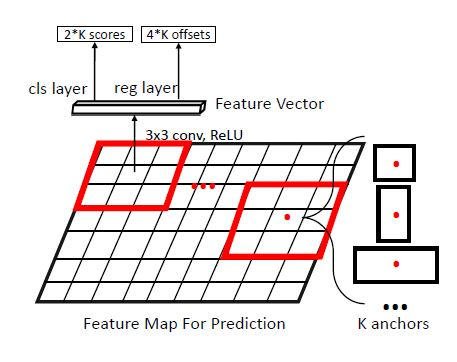

SSD에서는 객체를 매칭하기 위해서 여러 크기의 앵커들을 사용함으로써 RPN 안의 앵커들과 비슷한 아이디어를 도입했다.  주요 차이점은 SSD가 각 앵커 후보들에게 카테고리적 확률들을 할당한 반면 RPN은 먼저 앵커 후보가 전경인지 배경인지 평가하고 나서 카테고리적 분류를 수행했다는 것이다.  

좋은 성능에도 불구하고 앵커 우선순위들은 경험적인 방법(Heuristic manner)으로 여러 크기와 비율로, 수동적으로 설계되었다. 이런 설계는 최적이 아닐수도 있었고 다른 데이터 셋에는 다른 앵커 설계 전략이 필요했다. 앵커들의 설계를 개선시키기 위한 많은 노력들이 있었다. 

- S3FD - Zhang 등은 객체를 매칭하기 위해서 주의 깊게 설계된 앵커들과 SSD에 기반한 Single Shot Scale-invariant Face Detector를 제안했다. 각기 다른 특징 맵들의 효율적인 수용체 영역에 따라 각기 다른 앵커 우선순위들이 설계되었다. 
- Zhu 등은 입력 이미지 크기를 키우고 앵커 스트라이드를 줄여서 작은 객체들도 매칭하는 앵커 설계 방법을 소개했다.
- DeRPN - Xie 등은 RPN에 기반하여 앵커 박스들의 차원을 분해하는 Dimension-Decomposition Region Proposal Network를 제안했다. DeRPN은 객체들의 넓이와 높이를 독립적으로 매칭하기위한 앵커 열(string) 매커니즘을 사용했다. 이 방법은 넓은 분산의 객체들을 매칭하고 검색 공간을 줄이는데 도움을 줬다.

Ghodrati 등은 낮은 해상도의 깊은 층에서의 특징 맵에서 후보들을 예측하는 DeepProposals을 개발했다. 예측된 후보들은 좀더 알맞게 조정된 높은 해상도의 얇은 층에서의 특징 맵으로 재 투영되었다. 

Redmon 등은 k-means 클러스팅을 사용하여 트레이닝 데이터에서 우선 순위를 학습하는 앵커 우선순위를 설계했다. 

Zhang 등은 앵커들을 수동으로 2단계로 조정하는 Single-Shot Refinement Neural Network(RefineDet)을 소개했다. 

1. 첫 번째 단계에서 RefineDet은 수동으로 설계된 원래의 앵커들에 기반하여 위치 오프셋의 셋을 학습하고 이 앵커들은 학습된 오프셋들로부터 조정되었다. 
2. 새로운 위치 추정 오프셋들이 추가적인 조정을 위해 첫 번째 단계에서 조정된 앵커들을 토대로 학습되었다.

이 단계별 최적화 프레임워크는 앵커의 질을 상당히 개선시키고 데이터 주도적인 방법으로 최종 예측 정확도를 개선시켰다. 

Cai 등은 후보들을 단계적인 방법으로 조정하는, RefineDet에서의 유사한 아이디어를 차용한 Cascade R-CNN을 제안했다. 

Yang 등은 앵커들을 커스터마이징된 앵커들로부터 계산된 신경망으로 구현된 함수로서 모델링했다. 그들의 방법인 MetaAnchor는 다른 수동적인 방법들과 비교하여 종합적인 개선을 보여줬으나 여전히 커스터마이징된 앵커들은 수동으로 설계되었다.

#### 3.4.3 Key points-based Methods

- Corner-based methods - 모서리 기반 방법들은 특징 맵에서 학습한 모서리들의 쌍을 병합하여 바운딩 박스들을 예측한다.

  - Denet - Denet은 객체 탐지 문제를 확률적인 방법으로 접근했다. 특징 맵의 각 포인트에 대해 객체들의 4가지 유형의 모서리들(왼쪽 상단부터 오른쪽 하단까지)에 대한 분포를 모델링하고 바운딩 박스의 confidence 점수를 측정하기 위해서 각 객체들의 모서리들에 나이브 베이지안 분류기를 적용했다. 이 알고리즘은 앵커의 설계 과정을 없애고 높은 질의 후보들을 생산하는 방법이 되었다. 

  - ConerNet - Law와 Deng은 직접적으로 모서리들의 카테고리적 정보를 모델링하는 ConerNet을 제시했다. ConerNet은 좌상단부터 우하단까지의 정보에 새로운 특징 임베딩 방법과 같은 객체들에 속하는 키포인트들을 올바르게 매칭하기 위한 Coner pooling 계층을 적용하여 모델링했다. 

    

- Center-based methods - 중심점 기반 방법에서는 객체들의 중심이 될법한 확률이 특징맵의 각 위치에서 예측되고 그 어떤 앵커 우선위들 없이 넓이와 높이들이 곧바로 회귀를 통해 조정된다. 

  - FSAF - Zhu 등은 FPN 구조와 One-stage 탐기기들에 연결될 수 있는 Feature-selection-anchor-free 라는 프레임워크를 발표했다. FSAF에서는 온라인 특징 선택 블록이 각 레벨의 특징 피라미드에 붙어 있는 여러 중심점 기반 브랜치들을 훈련시키기위해 적용되었다. 훈련 중에 FSAF는 중심점 기반 브랜치를 훈련시키기위해서 각 객체를 가장 적합한 특징 레벨로 할당한다. 
  - Zhou 등은 FSAF와 비슷하게 FPN 구조와 단일 Hourglass network 토대의 새로운 중심점 기반 프레임워크를 제안했다. 그들은 이 중심점 기반 방법을 3D 탐지, 인간 자세 인식 같은 고수준의 문제에 적용했다. 
  - CenterNet - Duan 등은 중심점 기반 방법과 모서리 기반 방법을 결합한 새로운 아이디어를 제시했다. CenterNet은 먼저 모서리들 쌍으로 바운딩 박스들을 예측하고 분별하기 쉬운 부정적인 케이스를 제거하기 우해 초기 예측 값의 중심점 확률을 예측했다. CenterNet은 기준선들과 비교해서 확실한 개선을 보였다. 

#### 3.4.4 Other Methods

다음은 키포인트나 앵커에 토대를 두지 않지만 경쟁력을 보여준 후보 생성 알고리즘이다.

-  AZnet - Lu 등은 자동적으로 ROI에 초점을 두는 AZnet을 제안했다. AZnet은 객체들을 포함하고 있을 법한 소지역들에 대한 컴퓨팅 자원들을 감독하는 수색 전략을 도입했다. AZnet에서는 두 가지 값을 예측했다. Zoom indicator는 작은 객체들을 포함하고 있을 수도 있는 한 지역을 좀 더 나눌지 여부를 정했고 Adjacency scores는 이것의 객체성을 나타냈다. 처음에 전체 이미지로 시작해서 Zoom indicator가 충분히 작을 때까지 각 소지역들은 재귀적으로 위의 방법이 적용되어 나뉘어졌다. AZnet은 RPN은 앵커-객체 매칭 접근법과 비교하여 작고 드문 드문 있는 객체들을 매칭하는데 더 나았다.

### 3.5 Feature Representation Learning

Feature Representation Learning은 전체 탐지 프레임워크에서 매우 중요한 요소이다.  타겟 객체는 다양한 크기와 가로세로 비율로 복잡한 환경에 놓여있다. 그렇기 때문에 좋은 탐지 성능을 내기 위해서는 객체들에 내재되어 있는 차별적이고 강력한 특징들을 훈련하는 것이 필요하다.

#### 3.5.1 Multi-scale Feature Learning

Fast R-CNN, Faster R-CNN과 같이 한 계층의 특징 맵으로 객체를 탐지하는 방법은 크기와 가로 세로 비율 면에서 넓은 범위의 객체를 탐지하는데 어려움을 겪는다. DCNN은 각기 다른 크기의 정보를 캐치하는 서로 다른 계층 안의 구조적인 특징들을 학습한다. 얇은 층은 작은 수용체 영역과 높은 해상도를 가지고 공간적인 정보를 다루기 때문에 크기가 작은 객체를 탐지하는 데 적합하고 깊은 층은 큰 수용체 영역과 거치 해상도를 가지고 으미적인 정보를 다루기 때문에 변환, 조도 등에 강인하고 따라서 큰 객체를 탐지하는데 적합하다.  Dilated/atrous 컨볼루션 같은 어떤 기술들이 다운 샘플링을 피하고 깊은 층이라도 높은 해상도를 이용하기 위해서 제안되기도 했다. 그와 동시에 얅은 층에서의 충분히 크지 않은 수용체 영역에서 큰 물체를 탐지하는 것은 최선이 아니었다. 

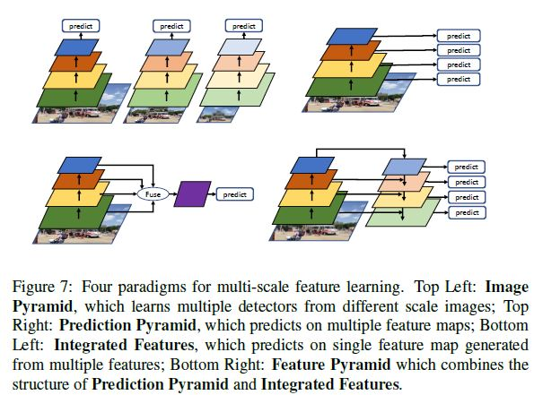

- Image Pyramid - 가장 직관적인 방법은 입력 이미지를 각기 다른 크기로 바꾸고 여러 탐지기들을 훈려시켜 각 탐지기들이 특정 범위의 크기를 담당하는 방법이다.  테스트를 진행할 때는 이미지들이 여러 탐지기들에 의해 각기 다른 크기로 조정되고 탐지 결과가 병합된다. 다만 이 방법은 계산 비용이 많이 들 수 있다. 
  - Liu 등은 가벼운 크기 인식 네트워크등을 알아 냈는데, 이미지들의 크기가 조정되어 모든 객체를 비슷한 크기로 만드는 것이었다. 그런 다음 단일 크기 탐지기가 학습을 진행 했다.
  - Singh 등은 작은 객체 탐지에 대해 여러 포괄적인 실험을 진행했다. 그들이 주장하길, 모든 크기의 객체를 다루는 단일의 크기에 크게 상관하지 않는 탐지기를 학습 시키는 것은 Image pyramids의 방식으로 크기에 의존적인 탐지기들을 학습시키는 것보다 어렵다고 했다. 그래서 그들은 여러 크기 의존적인 탐지기들이 특정 크기의 객체들을 담당하는 방식을 학습하는 Scale Normalization for Image Pyramids(SNIP) 프레임워크를 제안했다. 

- Integrated Features - 여기서는 각 계층의 특징들을 합성한 단일 특징 맵을 구축하고 최종 예측을 구축된 특징 맵에서 수행하는 것이다. 낮은 계층의 공간적인 특징들과 깊은 계층의 의미적인 특징들을 연결시켜서 만든 새로 구축된 특징들은 풍부한 정보를 포함고 있기 때문에 각기 다른 크기의 객체들을 탐지할 수 있다.  결합은 skip 연결을 통해 수행된다. Feature 정규화는 각 계층의 feature norm(feature들 사이의 유사도를 측정하는 방법(거리 같은))이 높은 분산을 가지고 있기 때문에 필요하다. 
  - ION - Bell 등은 ROI 풀링을 통해 각 계층의 지역 특징들을 잘라내어 마지막의 예측을 위해서 각기 다른 크기의 이 지역 특징들을 결합하는 Inside-Outside Network를 제안했다. 
  - HyperNet - Kong 등은 ION과 비슷한 아이디어를 차용했다. 후보를 생성하고 객체를 탐지하기 위해서 중간과 얇은 층의 특징들을 결합하여 높은 해상도의 하이퍼 특징 맵을 설계했다. 깊은 층의 특징맵들을 업 샘플링하기 위해서 디컨볼루션 계층이 사용되었고 입력 블롭들을 정규화 하기 위해서 Batch normalization 계층들이 사용되었다. 이렇게 구축된 하이퍼 특징 맵들은 암시적으로 각 계층의 문맥적인 정보를 인코딩할수 있었다. 
  - MLKP - 객체 후보의 단순한 표현들을 이용하는 대신 높은 차원의 표현을 합성하는 fine-grained(세밀하게 조깨진) 분류 알고리즘에 영감을 받아서 Wang 등은 후보 특징들의 높은 차원의 통계학적 자료들을 잡아내어 좀 더 차별적인 특징 표현들을 생산해내는 Multi-scale Location-aware Kernel Representation 프레임워크를 제안했다. 이렇게 결합된 특징 표현들은 좀 더 서술적이고 분류와 위치 추정을 위한 의미적이고 공간적인 정보를 제공한다. 

- Prediction Pyramid - Liu 등의 SSD는 각 계층의 coarse and fine(뭉텅이, 잘게 쪼개진) 특징들을 결합시킨다.  SSD에서는 객체의 특정 크기를 전담하는 각 계층들로부터 예측이 만들어진다. 
  - Yang 등도 특정 크기의 객체 후보들을 만들어내기 위해서 적절한 특징 맵들을 이용하는데 이 특징 맵들은 객체를 예측하기 위한 크기 의존적인 분류기들에 입력으로 들어간다. 특히 이 연구에서는 탐지 속도를 높이기 위해서 이른 단계에서 쉽게 제거 가능한 배경 후보들을 제거하기 위한 방법을 순차적인 제거 분류기들이 학습한다. 
  - MSCNN - Multi-scale Deep Convolutional Neural Network는 여러 특징 맵의 해상도를 개선시키기 위해서 디컨볼루션 계층을 적용하고 이렇게 조정된 특징 맵들이 예측을 위해 사용된다.
  - RFBNet - Liu 등은 Receptive field block(RFB block)을 통해 수용체 영역을 강화하고 강인함을 강화하기 위한 Receptive Field Block Net을 제안했다. RFB 블록은 Inception module과 비슷한 아이디어를 차용했는데 각기 다른 컨볼루션 커널들로 여러 브랜치에서의 수용체 영역에서 다른 크기의 특징들을 잡아내었다. 그리고 나서 이것들을 병합했다. 

- Feature Pyramid - 
  - Lin 등은 Integrated Features와 Prediction Pyramid 등의 정점을 합친 Feature Pyramid Network(FPN)을 제안했다. 이 네트워크는 크기가 변하지 않는 특징 맵들의 집합을 만들기 위해서 Top-down 형식의 lateral 연결에서 다른 특징들을 합성한다. 그리고 나서 여러 크기 의존적인 분류기들이 이런 특징 피라미드들에서 학습된다. 특별히 깊은 계층의 의미적인 정보가 풍부한 특징들이 얇은 층의 공간적인 정보가 풍부한 특징들을 강화시키기 위해 사용되었다. 이런 Top-down and lateral인 특징들은 차원을 축소시키는 작은 컨볼루션들과 함께 element-wise summation이나 concatenation으로 결합되었다. FPN은 객체 탐지와 다른 애플리케이션에서 상당한 개선성을 보여줬고 multi-scale 특징들을 학습하느데 뛰어난 결과를 보여줬다. 
  - Kong 등과 Zhang 등은 크기 불변적인 특징 맵들을 lateral 연결로 만들었다. 지역 후보들을 생산하고 카테고리 분류를 하는 FPN과는 다르게 이들의 방법은 후보 생성 단계를 생략하므로 원래의 FPN보다 효율적이다. 
  - Ren 등과 Jeong 등은 각 계층 특징들 사이의 문맥적 정보를 선택적으로 그리고 점진적으로 인코딩하는 구조를 개발했다. 
  - Super resolution tasks에 영감을 받아서 Zhou 등은 여러 탐지 크기들에서 크기 간 일관성 특성을 명시적으로 탐색하는 새로운 변환 블록을 사용하여 고 해상도 기능 맵을 개발했습니다.
  
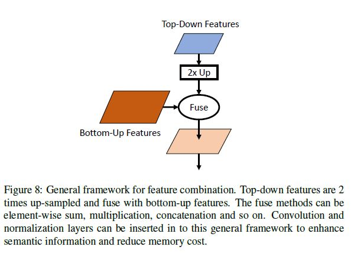

#### 3.5.2 Region Feature Encoding

Two-stage 탐지기에게 지역 특징 인코딩은 후보들에게서 특징을 추출해서 고정된 길이의 특징 벡터로 만드는 아주 중요한 단계이다.

 

- R-CNN에서 Girshick 등은 지역 후보들을 전체 이미지에서 잘라내어 이중 선형 보간법을 통해 고정된 사이즈(224 x 224)의 패치들로 조정하고 깊은 컨볼루션 특징 추출기로 보냈다. 이 방법은 고 해상도의 지역 후보들을 인코딩 했으나 컴퓨팅 비용이 비쌌다. 
- ROI Pooling layer - Girshick 등은 지역 특징들을 인코딩하기 위한 ROI Pooling 계층을 제안했다. ROI Pooling에서는 각 지역을 n x n개의 칸으로 나누고(7 x 7 기본) 순전파 과정에서 최대값 신호의 뉴런만 전파되었다. 이는 Max-pooling과 비슷하나 잠재적으로 크기가 다른 지역에도 가능하다. ROI Pooling은 다운 샘플링한 특징 맵으로부터 특징들을 뽑아내기 떄문에 작은 물체들을 다루는데 어려움을 겪었다.
- ROI Warping layer - Dai는 지역 특징들을 이중선형보간법으로 인코딩하는 ROI Warping 계층을 제안했다. DCNN에서의 다운 샘플링 연산 때문에, ROI Pooling이나 ROI Warping 계층은 해결할 수 없는 원본 이미지와 다운 샘플링된 이미지에서의 잘못 할당된 객체 위치가 있을 수 밖에 없다.
- ROI Align layer - ROI Pooling이나 ROI Warping에서 하는 것처럼 격자들의 테두리를 양자화 하는 것 대신에 He 등은 양자화 문제를 각 격자의 아주 약간 샘플링된 위치에서의 이중선형보간법으로 해결하는 ROI Align 계층을 제안했다. 
- PrROI Pooling - ROI Align에 기반하여 Jiang 등은 좌표 정보들의 그 어떤 양자화를 피하고 바운딩 박스 좌표에 대한 지속적인 그래디언트를 갖는 Precise ROI Pooling을 발표했다.
- PSROI Pooling - 다운 샘플링된 지역 특징들의 공간 정보를 강화하기 위해서 Dai 등은 다운 샘플링된 특징들의 상대적인 공간 정보들을 유지하는 Position Sensitive ROI Pooling을 제안했다. 생성된 지역 특징 맵의 각 채널은 이것의 상대적인 공간적 위치에 따른 입력 지역의 채널들의 부분집합에만 대응했다. 
- PSROI Pooling에 기초하여 Zhai 등은 부분 지역과 가로 세로 영상 비율 사이의 차이를 이용하여 강인한 지역 특징들을 학습하기 위한 feature selective networks를 발표했다. 이 네트워크는 초기의 지역 특징들을 미리 가볍게 조정하기 위해 선택적으로 모아진 부분 지역과 가로 세로 영상비 정보를 인코딩했다. 
- CoupleNet - Zhu 등은 ROI Pooling 계층과 PSROI Pooling 계층에서 생성된 출력을 결합하여 지역 특징들을 추출하는 CoupleNet을 제안했다. ROI Pooling 계층이 전역 지역 정보를 추출하는 대신 높은 폐색(객체가 많아서 예를 들어 바운딩 박스가 막 겹치는)의 객체들에는 어려움을 겪는 반면, PSROI Pooling 계층은 좀 더 지역적 정보에 집중한다. CoupleNet에서는 ROI Pooling과 PSROI Pooling에서 생성된 특징들을 원소별 합 연산을 통해 강화해서 좀 더 강력한 특징들을 만들어 낸다. 
- Dai 등은 각 격자의 오프셋을 학습하고 이것을 격자의 중심에 더하는 방식으로 할당된 ROI Pooling을 일반화하는 Deformable ROI Pooling을 제안했다. 부분 격자는 초기의 지역 특징들을 추출하기 위해서 일반적인 ROI Pooling으로 시작한다 그리고 추출된 특징들은 여분의 네트워크에 의한 오프셋 회귀를 하기 위해 사용된다.  Deformable ROI Pooling은 고정된 수용체 영역에 의해 제한되는 것 없이 자동적으로 영상 내용물을 모델링 할 수 있다. 

#### 3.5.3 Contextual Reasoning

상황 정보는 객체 탐지에 중요한 역할을 한다. 물체들은 자주 어떤 특정한 상황에 나타나는 경향이 있고 때때로는 다른 물체들과 같이 존재한다. 효율적으로 상황 정보를 사용하는 것은 작은 물체, 폐색(물체가 겹쳐서 보임)과 같은 신호가 불충분한 객체 탐지에 특히 도움이 될 수 있다. 객체들과 그들을 둘러싸고 있는 상황의 관계를 학습하는 것은 탐지기들이 시나리오를 이해하는 능력을 개선시키는데 도움이 된다. 전통적인 객체 탐지 알고리즘에서는 상황 정보를 이용하려는 몇 개의 시도가 존재했으나 딥러닝 기반의 객체 탐지에서는 상황이 광범위하게 탐색되지는 않았다. 왜냐하면 CNN이 암시적으로 계층적인 특징 표현들로부터 상황 정보를 잡아내었기 때문이다. 그럼에도 불구하고 어떤 최근의 연구에서는 여전히 상황 정보를 이용하려고 노력했다. 몇 개의 연구는 몇가지 상황에서 상황 정보가 오히려 객체 탐지 성능에 악영향을 줄 수 있음을 보여줬다. 

- Global context reasoning - 이것은 상황 정보를 전체 이미지에서 학습하는 방법을 의미한다. 이미지 안에서 특정한 지역들을 객체로 분류하려고 시도한 전통적인 탐지기들과는 다르게 여기에서는 상황 정보(이미지 안에서 ROI 외의 다른 부분의 정보)를 사용하여 ROI를 분류하려고 했다. 야구장, 야구 선수들, 야구 방망이를 보고 공을 야구공으로 분류하는 것이 그 예이다. 몇가지 대표적인 노력들에는 ION, DeepId, 개ㅓㅅㄴ된 버전의 Faster R-CNN이 있다.

  - ION에서 Bell 등은 전체 이미지의 네 방향에서의 상황 정보를 인코딩 하는 RNN을 사용했다.  
  - Ouyang 등은 객체 탐지 결과와 결합된(concatenated) 상황 정보로서 사용되는 각 이미지의 카테고리적 점수들을 학습했다.
  - He 등은 전체 이미지의 특징 임베딩을 추출하여 이것을 탐지 결과를 개선시키기위해 지역 특징들과 결합(concatenate)시켰다. 

  추가적으로 어떤 방법들은 Semantic segmentation을 통해 Global contextual information을 이용했다. 정확한 픽셀 단위의 주석 때문에 Segmentation 특직 맵들은 강력한 공간 정보를 잡아냈다. 

  - He 등과 Dai 등은 통합된 Instance segmentation 프레임워크를 학습하고 픽셀 레벨의 감독 아래 탐지기를 최적화한다. 그들은 탐지와 Segmentation 목표들을 멀티 태스크 최적화로서 공동으로 최적화 한다. Segmentation이 비록 탐지 성능을 높이는데 크게 일조하지만 픽셀 단위의 주석을 획득하는 것은 매우 비싸다. 
  - Zhao 등은 탐지기들을 Pseudo segmentation 주석으로 최적화하여 유망한 결과들을 보여줬다. 
  - Zhang 등의 작품인 Detection with Enriched Semantics(DES)는 상황 정보를 Segmentation 주석들 없이 Segmentation mask를 학습시키는데 도입했다. 이것 또한 객체 탐지와 Segmentation 목적들을 공동으로 최적화하고 원래의 특징 맵을 좀 더 차별화된 특징 맵으로 질을 높였다. 

- Region Context Reasoning - 이것은 지역들을 감싸고 있는 상황 정보를 인코딩하고 객체들과 그들의 환경 사이의 상호작용을 학습한다. 직접적으로 상황과 각기 다른 객체 관계들의 위치와 카테고리들을 모델링하는 것은 어렵다. 

  - Chen 등은 공간적 메모리 기반의 모듈을 도입한 Spatial Memory Network(SMN)을 도입했다. 공간적 메모리 모듈은 나중에 객체 관계 추론에 사용되는 의사 이미지 표현들 뒤로 객체 인스턴스들을 모음으로서 인스턴스 레벨의 문맥들을 잡아내었다. 
  - Liu 등은 scene의 상황 정보와 객체 관계들을 고려함으로서 객체 탐지를 그래프 추론 문제로 표현한 Structure Inference Net(SIN)을 제안했다. SIN에서 각 객체들은 그래프의 노드로 취급되고 각기 다른 객체들의 관계는 그래프의 엣지로서 여겨졌다. 
  - Hu 등은 외향과 이미지 상에서의 위치가 각기 다른 객체들 사이의 상호작용을 나타내는 경량 프레임워크 관계 네트워크를 제안했다. 이 프레임워크는 추가적인 주석이 필요 없었음에도 불구하고 객체 탐지 성능 향샹을 보여줬다. 
  - Hu 등의 연구에 기초하여, Gu 등은 존재하는 지역 특징 추출 방법들을 통일하는 범용적인 관점을 제안하는 완전 학습 가능한 객체 탐지기를 제안했다. 이들의 방법은 ROI pooling 방법에서 경험에 의한 선택을 제거하고 후보들 너머의 상황들을 포함한 가장 중요한 부분들을 자동적으로 선택했다. 

  그 외에 상황 정보를 인코딩하는 다른 방법은 지역 후보들을 감싸는 이미지 특징들을 더함으로서 지역 특징들을 인코딩하는 방법이 있고 많은 시도들이 이 아이디어에 기반하여 제안되었다. 

  - 지역 후보들에서의 특징들을 인코딩하는것에 더하여 Girdaris 등은 원본 객체 후보들(테두리 지역들, 중심 지역들 상황 지역들 등)의 많은 각기 다른 부분 지역들로부터 특징들을 추출했다. 그리고 이 특징들을 원본 지역 특징들과 결합(concatenate)했다.  
  - [106 - Z. Cai, Q. Fan, R. S. Feris, N. Vasconcelos, A unified multi-scale deep convolutional neural network for fast object detection, in: ECCV, 2016]은 후보의 윈도우 크기를 크기함으로서 지역 문맥들을 추출하고 이 특징들을 원본에 결합(concatenate)했다. 
  - Zeng 등은 다양한 크기의 부분지역들로부터 특징들을 뽑아내는 Gated Bi-Directional CNN(GBDNet)을 제안했다. 한 가지 주목할 점은 GBDNet이 각기 다른 지역 정보들의 전송을 컨트롤하는 gated function을 학습했다는 것인데, 그 이유는 모든 상황 정보가 탐지에 유용하지는 않기 때문이었다. 

#### 3.5.4 Deformable Feature Learning

좋은 탐지기는 유연하게 객체의 변형에 강인해야 한다. 

- 딥러닝 시대 이전에는 Deformable Part based Models(DPMs)가 객체 탐지에 성공적으로 사용되었다. DPMs는 탐지기를 유연한 객체 변환에 강인하게 만드는 (객체를) 변형시킬 수 있는 코딩 방법을 사용하여 여러 요소로 객체들을 표현했다. 

딥러닝 기반의 탐지기들이 객체의 부분들의 변형을 모델링할 수 있도록 하기 위해 많은 연구자들은 명백하게 객체 부분들을 모델링하는 탐지 프레임워크를 개발했다. 

- DeepIDNet은 각기 다른 객체 코테고리들의 변형 정보를 인코딩하는 변형 인식 풀링 계층을 개발했다. 
- Dai 등과 Zhu 등은 특징 맵의, 보통의 샘플링 위치들에서 샘플링된 정보를 증대하기 위한 여분의 위치 오프셋들을 자동으로 학습하는 변형 가능한 컨볼루션 계층을 설계했다. 

## 4. Learning Strategy

단순 이미지 분류와는 다르게 객체 탐지는 위치 추정과 분류 작업을 동시에 최적화 해야 하기 때문에 강력한 탐지기를 훈련시키는 것이 어렵다. 게다가 불균형한 데이터 샘플링, 위치추정, 훈련 간이나 테스트 상에서의 속도 문제 같이 다루어야 할 문제들이 있다. 그래서 효과적이고 효율적으로 탐지기들을 훈련시킬 수 있는 혁신적인 학습 전략들을 개발할 필요가 있다. 

### 4.1 Training Stage

객체 탐지기의 훈련 간의 학습 전략으로 Data augmentation, Imbalance sampling, Cascade learning, Localization refinement 같은 것들이 있다. 

#### 4.1.1 Data Augmentation

Data augmentation이 딥러닝 방법들에서 중요한 이유는 많은 경우에 데이터가 부족하고 더 많은 데이터가 있을수록 좋은 결과를 내기 때문이다. 객체 탐지 영역에서 훈련 데이터를 늘리고 다각적 시각적 요소를 지닌 훈련 패치들을 생산하기 위해서, Faster R-CNN 탐지기에서는 훈련 이미지를 가로로 뒤집는 방법이 사용된다. 회전, 무작위로 자르기, 확장, Color jittering 같은 더 많은 Data augmentation 전략들이 One-stage  탐지기들에 사용된다.  실제로 Data Augmentation은 탐지 정확도를 상당히 높일 수 있음을 보여줬다. 

#### 4.1.2 Imbalance Sampling

객체 탐지 영역에서 양성과 음성 샘플들의 불균형 문제는 중요한 문제다. 왜냐하면 후보로서 측정되는 대부분의 ROI는 사실 이미지의 배경이기 때문이다. 그 중에 아주 적은 수만이 양성 인스턴스(혹은 객체)이다. 이 사실은 탐지기들을 훈련 시키는 와중에 불균형의 문제를 일으킨다. 특히, 클래스 불균형과 어려움 불균형이라는 두 가지 다루어져야 할 문제들이 발생한다.  클래스 불균형 문제란 대부분의 후보들이 배경에 속하고 아주 적은 수의 후보만이 객체를 담고 있는 문제다. 이 문제로 인해 훈련 상에서 배경 후보들이 그래디언트를 지배하는 결과를 초래한다. 어려움 불균형 문제는 첫 번째 문제와 밀접한 관련이 있는데, 클래스 불균형 문제 때문에 대부분의 배경 후보들은 쉽게 분류가 가능하나 객체들은 분류하기가 어려워지는 문제이다. 

많은 전략들이 클래스 불균형 문제를 해결하기 위해서 개발되어왔다. R-CNN이나 Fast R-CNN과 같은 Two-stage 탐지기들은 많은 수의 음성 샘플들을 우선 버리고 추후의 분류 작업을 위해 2,000개의 후보들을 선별한다.

-  Fast R-CNN에서는 2K 후보들에서 음성 샘플들이 무작위로 뽑히고 클래스 불균형 문제의 부정적인 효과를 줄이기 위해서 각 미니 배치에서 양성과 음성 샘플의 갯수를 1:3 정도로 맞춘다. 무작위로 선별하는 방법이 클래스 불균형 문제를 어느 정도 해소할수는 있으나 문제는 음성 후보들의 정보를 충분히 활용할 수 없다는데에 있다. 예를 들어 어떤 음성 후보들은 이미지에 대한 풍부한 상황 정보를 담고 있을 것이고 어떤 강력한 후보들은 탐지 정확도를 개선시키는데 도움이 될 수있다. 
- 이 문제를 해결하기 위해서 Liu등은 전경(객체)과 배경 샘플의 비율은 고정시키되 모델을 업데이트 시키기에 가장 어려운 음성 후보들을 샘플링하는 강력한 음성 샘플링 전략을 제안했다. 특히 훈련 간의 분류 손실이 큰 음성 후보들을 선택했다. 

어려움 불균형 문제를 해결하기 위한 대부분의 샘플링 전략들은 주의 깊게 설계된 손실 함수에 기반한다. 객체 탐지에서 멀티 클래스 분류기는 C+1(C개의 타겟 카테고리와 배경 카테고리)개의 카테고리로 학습한다.  한 지역이 클래스 u로 레이블링 되어 있다고 가정하고 p가 C+1 클래스에 대한 개별적인 확률 분포를 출력한다고 하자(p = {p0, ..., pC}). 이때 손실 함수는 다음과 같다. 

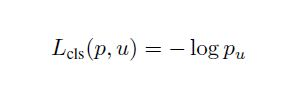

- Liu 등은 쉽게 판단될 수 있는 샘플들의 신호를 억제하는 새로운 방식의 Focal loss를 제안했다. 쉬운 샘플들을 모두 버리는 것 대신에 각 샘플에 중요도에 따른 가중치를 부여한다. 이것의 손실 값은 다음과 같이 정의한다. 

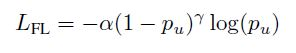

​       여기서 α와 γ는 중요성 가중치를 조절하기 위한 파라미터들이다. 쉬운 샘플들의 그래디언트 신호들을 억    압함으로서 훈련 과정에서 좀 더 어려운 후보들에 집중할 수 있도록 한다. 

- Li 등은 Focal loss와 유사한 아이디어를 차용하여 Gradient Harmonizing Mechanism(GHM)을 제안했다. GHM은 쉬운 샘플들을 억제하는 것 뿐만 아니라 이상치의 부정적인 영향도 피한다. 
- Shrivastava 등은 Online(모델을 한 번 훈련 시키고 끝이 아니라, 데이터가 더 쌓이면 지속적으로 학습) hard example mining 이라고 하는, Liu 등의 SSD의 원리와 유사하게 훈련 간에 어려운 샘플들을 자동적으로 선택하는 전략을 제안했다. Liu 등과는 다르게, Online hard example mining은 분류 정보는 무시하고 어려움 정보만 고려한다. 이는 각 미니 배치에서 전경과 배경의 비율이 고정되어 있지 않음을 의미한다. 이들은 어려운 샘플들이 분류 불균형 문제 보다는 객체 탐지 영역에서 더 중요한 역할을 한다고 주장했다. 

#### 4.1.3 Localization Refinement

객체 탐지기는 반드시 각 객체에 대해 정확한 위치 추정에 대한 예측(bbox 혹은 mask 형식)을 제공해야한다.  그래서 많은 노력들이 정확한 위치 추정을 위해서 후보 예측 단계를 조정한다. 정확한 위치 추정이 어려운 이유는 예측 값들이 객체들의 (다른 객체와 구별되는) 가장 차별적인 부분에 주로 집중하고 객체를 실제로 담고 있는 지역들이 꼭 필수적 것은 아니기 때문이다. 몇가지 시나리오에서는 탐지 알고리즘이 높은 퀄리티의 예측(높은 IoU threshold)을 만들어 내도록 하고 있다. 

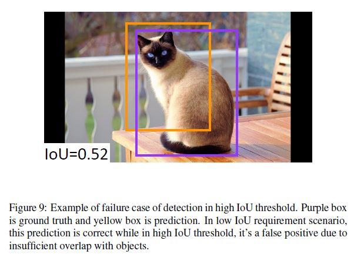

위치 추정에 관한 일반적인 접근법은 높은 퀄리티의 후보들을 만들어 내는 것이다.

R-CNN 프레임워크에서는 L-2 auxiliary 바운딩 박스 회귀기가 위치 추정을 조정하는 법을 학습하고 Fast R-CNN에서는 Smooth L1 회귀기가 종단간의 학습 간에 이런 방법을 학습한다. 

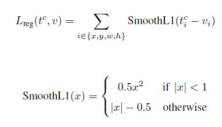

t^c = (t^c_x, t^c_y, t^c_w, t^c_h)가 각 타겟 클래스에 관하여 예측된 오프셋을 나타내고 v = (v_x, v_y, v_w, v_h)는 객체 바운딩 박스의 정답 값을 나타낸다. x, y, w, h는 각각 바운딩 박스의 중심점과 넓이와 높이를 나타낸다.

위와 같은 기본 위치 추정 조정 방법을 넘어서 어떤 방법들은 위치 추정을 좀 더 잘 조정하기 위한 여분의 모델을 학습시킨다. 

- Gidaris 등은 R-CNN이 학습된 예측 값들을 조정하기 위해 적용된 바운딩 박스 회귀 방법을 반복적으로 하는 방법을 도입했다. 여기서 예측 값은 여러번 조정된다. 
- Gidaris 등은 각 바운딩 박스의 분포를 모델링하고 학습된 예측 값을 조정하는 LocNet을 제안했다. 

이 두개의 접근법은 탐지 파이프라인에서 각 요소들을 분리시키고 공동으로 최적화되는 것을 막는다. 

몇가지 다른 노력들은 수정된 목적 함수들로 통합된 프레임워크를 설계하는데 초점을 두었다. 

- Zagoruyko 등은 MultiPath Network에서 다양한 퀄리티 측정법의 손실을 합침으로 최적화 시킨 분류기들의 앙상블을 개발했다. 각 분류기들은 특정한 IoU threshold에서 최적화 되고 최종 예측은 이 분류기들의 예측 값을 병합한다. 
- Tychsen 등은 후보들과 객체들 사이의 IoU의 finess score function을 학습시켰다. 그들이 주장하기를 현존하는 탐지기들은 최고의 예측을 찾는 것 대신에 준수한 예측을 찾는데 목적을 두므로 높은 퀄리티의 후보들과 낮은 퀄리티의 후보들이 같은 중요성을 가진다고 주장했다. Fitness-IoU는 높게 실제 영역과 오버랩된 후보들에게 더 높은 중요도를 부여한다.  이것들 또한 객체들과 예측 값의 IoU를 극대화기 위해 IoU의 상한선들의 집합에 기반한 바운딩 박스 회귀 손실을 끌어낸다. 
- CornerNet과 DeNet에 영감을 받아 Lu 등은 선형 바운딩 박스 회귀를 코너 기반 매커니즘의 코너 키포인트들을 위치 시키는 원리로 대체하는 Grid R-CNN을 제안했다. 
