# Rich feature hierarchies for accurate object detection and semantic segmentation

Ross Girshick(UC Berkeley), Jeff Donahue(UC Berkeley), Trevor Darrell(UC Berkeley), Jitendra Malik(UC Berkeley)

## Abstract

저자들이 주장하길 PASCAL VOC 데이터셋을 측정되는 객체 탐지 알고리즘의 성능은 몇 년간 발전 없이 정체 상태였다고 한다. 당시에 좋은 성능을 내는 방법들은 여러 낮은 차원의 이미지 특징들을 고차원 수준의 문맥과 연결시키는 아주 복잡한 앙상블 시스템이었다고 한다.  그래서 저자들은 보다 간단하면서도 좀 더 규모면으로 확장 가능한 알고리즘을 제안했다. VOC2012 데이터셋에서 mAP 53.3%을 달성했는데 이는 저자들이 제안한 방법 이전의 최고 성능을 보인 방법보다 30%이상 개선된 결과라고 한다. 저자들이 말하는 이 연구의 두 가지 키 포인트는 다음과 같다.

- 대용량의 CNN을, 이미지 안의 객체의 위치 추정을 하거나 픽셀 단위의 세그멘테이션을 위한 상향식의 지역 후보 생성에 적용할 수 있다는 점.
- 레이블링된 데이터가 부족할 때, 다른 작업을 위해서 훈련된 CNN을 도메인 타겟에 맞춰 Fine-tuning하고 나서 객체 탐지나 세그멘테이션 작업을 위해서 사용하면 큰 성과를 보일 수 있다는 점.

저자들은 이 연구에서 지역 후보 생성과 CNN을 결합했기 때문에 이 방법론을 R-CNN이라고 불렀다(Regions with CNN features). 

## Introduction

이 연구가 제안되었을 당시에, 시각적인 인식과 관련된 연구들은 SIFT나 HOG에 의존적이었다. 그런데 PASCAL VOC 객체 탐지 과제를 놓고 보면 2010-2012년에 눈에 띄는 성과가 없었다. 이때의 방식은 복작합 앙상블 시스템을 만들거나 이미 성공한 방법들에 약간의 변형을 가한 방법들뿐이었다. 

- SIFT - D. Lowe. Distinctive image features from scale-invariant keypoints. IJCV, 2004
- HOG - N. Dalal and B. Triggs. Histograms of oriented gradients for human detection. In CVPR, 2005
- Neocognitron - K. Fukushima. Neocognitron: A self-organizing neural network model for a mechanism of pattern recognition unaffected by shift in position. Biological cybernetics, 36(4):193–202, 1980

그러다가 다음의 연구에 기반하여

- D. E. Rumelhart, G. E. Hinton, and R. J. Williams. Learning internal representations by error propagation. Parallel Distributed Processing, 1:318–362, 1986

LeCun 등은 역전파를 통해서 SGD를 수행하는 것이 CNN을 훈련 시키는 것에 효율적이라는 것을 보여줬다. 그래서 1990년대에 많이 이용되다가 SVM이 출현하면서 이용 빈도가 쇠퇴되었다. 2012년에 Krizhevsky 등이 ILSVRC에서 매우 높은 정확도를 보이는 CNN 모델을 선보이면서 역전파를 통해 CNN을 훈련시키는 방법이 재주목을 받게 되었다(CNN에 추가적으로 ReLU, Dropout 등을 적용). 저자들은 이미지 분류 문제를 해결한 이 방법론을 어떻게 객체 탐지 문제에 적용할 것인가하는 질문에 주목했다. 특히 HOG 스러운 방법들보다 CNN을 적용한 방법들이 PASCAL VOC 객체 탐지 과제에서 더 높은 성능을 보일 수 있음을 목표로 했다. 그렇기 때문에 다음의 두 가지 문제에 집중했다고 한다.

- 딥 러닝 네트워크를 통한 이미지 안의 객체들의 위치 추정
- 적은양의 Annotated된 탐지용 데이터를 대용량의 모델에서 훈련시키는 방법

이미지 분류 문제와는 다르게 객체 탐지는 이미지 안의 객체들의 위치 추정도 해야 한다. 어떤 연구에서는 위치 추정을 회귀 문제로 보기도 했는데 Szegedy 등에 의하면 이런 접근법이 실제로는 잘 맞지 않을 수도 있다고 했다. 다른 접근 방식으로는 슬라이딩 윈도우 방식의 탐지기를 만드는 것인데 적어도 20년동안 CNN은 이런식으로 객체 탐지 분야에 적용되었다(얼굴이나 보행자 탐지에 한해서). 저자들도 원래 슬라이딩 윈도우 방식의 접근법을 고려했었는데 네트워크의 용량이 커지고 입력 이미지의 크기가 커지면서 정확한 위치 추정을 하는 것은 기술적으로 문제가 돼었다고 한다. 대신에 저자들은 CNN의 위치 추정 문제를 이미지 상의 지역을 인식하는 문제로 해결해서 객체 탐지나 시멘틱 세트멘테이션 과제에서 좋은 성과를 거두었다. 

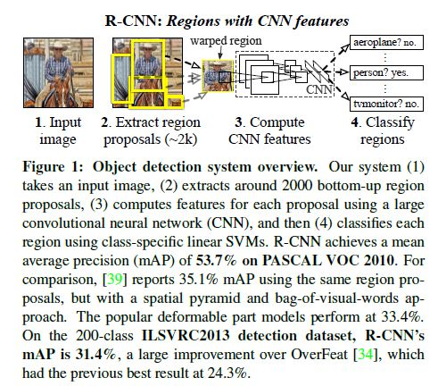

저자들은 ILSVRC2013의 클래스 200개까지 탐지 데이터셋으로 다음의 연구와 성능을 비교하여 제시했다.

- OverFeat - P. Sermanet, D. Eigen, X. Zhang, M. Mathieu, R. Fergus, and Y. LeCun. OverFeat: Integrated Recognition, Localization and Detection using Convolutional Networks. In ICLR, 2014

저자들이 집중했던 두 번째 문제는, 객체 탐지 분야에서 대용량의 CNN을 학습시킬만한 훈련 데이터가 매우 부족하다는 것이었다. 당시에 이를 해결하기 위한 전통적인 방법으로는 비지도 학습으로 일단 미리 훈련을 시키고 지도 학습 기반의 Fine-tuning을 하는 것이었다. 이 연구에서 저자들은 다른 목적으로 학습시킨(지도 학습 기반, 예를 들어서 ILSVRC 이미지 분류 데이터셋) CNN에 특정 도메인 목적에 맞는 적은 양의 데이터(PASCAL 이미지 탐지 데이터셋)로 Fine-tuning 하는 방법이, 대용량의 CNN을 상대적으로 적은 양의 데이터로 학습시키는 방법으로서 매우 효율적이라는 것을 보여줬다. 

저자들이 말하길, 이 시스템에서 클래스에 특정한 계산은 적은 양의 행렬, 벡터 곱 연산과 Greedy NMS(Non-maxtimum suppression) 뿐이라고 한다. 

저자들은 또, 시스템을 개선하기 위해서 실패한 시도들을 분석하는 것이 중요하다고 생각하여 탐지 성능을 Hoiem 등이 만들어낸 도구로 분석했다고 한다. 이 분석 방법으로 분석한 결과, 단순한 바운딩 박스 회귀 방법이, 저자들의 실패에서 주요 원인으로 여겨지던 잘못된 위치 추정을 상당하게 줄인다는 것을 확인했다. 

R-CNN이 이미지 상의 지역에 기반하여 작동하기 때문에 시멘틱 세그멘테이션 과제에도 적용될 수 있다고 하며 약간 시스템을 변형하여 PASCAL VOC 세그멘테이션 과제에서 좋은 성적을 냈다고 한다. 

## Object detection with R-CNN

이 연구에서의 객체 탐지 시스템은 크게 세 부분으로 이루어져 있다. 

- 카테고리에 상관 없이 지역 후보를 생산하는 부분. 이 후보들은 탐지기가  목적으로 하는 탐지 후보들의 집합이다.
- 각 지역마다 고정된 길이의 특징 벡터를 추출하기 위한 CNN
- 특정 클래스를 담당하는 선형 SVM들의 집합

### Module design

#### Region proposals

많은 연구에서 카테고리와 상관없는 지역 후보들을 생성하는 방법을 제안한다.

#### Feature extraction

저자들은 Krizhevsky 등에 의해 구현된 CNN의 Caffe 구현체를 사용해서 각 지역 후보에 대해 4096차원짜리 특징 벡터를 추출했다. 각 입력 이미지는 5층짜리 컨볼루션 계층과 2층짜리 완전 연결 계층으로 구성된 CNN을 227x227의 크기로 RGB 채널 별로 평균을 빼는 전처리 과정을 거치고 나서 순전파된다.  

각 지역 후보 별로 특징 벡터들을 뽑아내기 위해서 가장 먼저 할 일은 입력 이미지들을 CNN의 입력에 맞게 변환하는 것이다(CNN 아키텍처의 입력 크기는 227x227로 고정되어 있다). 임의의 모양의 지역들을 변환하기 위한 많은 변환 방법 중에서 저자들은 가장 간단한 방법을 골랐다고 한다. 지역들의 크기나 종횡비에 상관없이 후보들의 모든 픽셀은 원하는 크기에 딱 맞는 바운딩 박스로 워프(Warp)된다. 워프 하기 전에 이 딱 맞는 바운딩 박스를 팽창시켜서 워프된 입력 이미지의 문맥 정보가 담긴 p개의 픽셀이(저자들은 p=16을 선택) 더 존재하도록 했다. 

 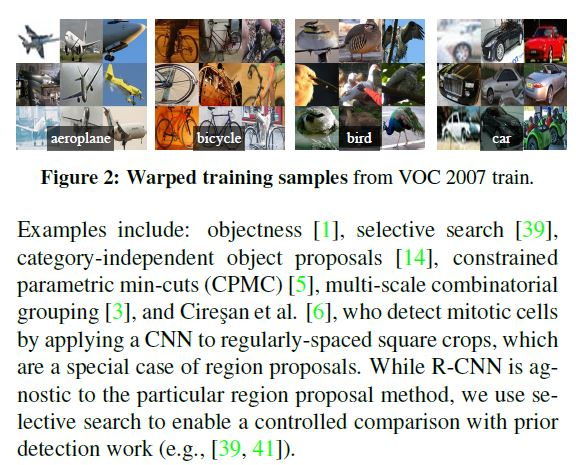

위 그림은 워프된 훈련 지역들의 예시를 보여준다. 

#### Object proposal transformations

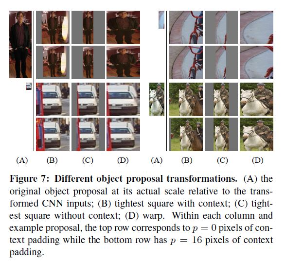

워프 방법에는 여러 가지 방법이 존재한다. 첫 번째 방법은 (B)열처럼 각 지역 후보들을 정사각 상자로 감싸고 CNN의 입력 크기에 맞게 종횡비를 유지하면서 크기를 맞추는 것이다. 또 하나의 방법은 B에서 객체의 주변을 잘라내는 방법으로 (C)열에 예시가 나와 있다. 다음으로 (D)열에는 종횡비를 유지하지 않으면서 워프 하는 방법의 예시가 나와 있다. 

각 방법에서 저자들은 원래의 지역 후보 부변에 추가적인 문맥 정보를 더하는 방법을 고려했다. 문맥 패딩 p의 양은 변환된 입력 프레임 주변의 가장 자리의 크기로 볼 수 있다. 위 그림의 예시들에서 위쪽 행은 p = 0이고 아래의 행은 p = 16일때이다. 만약에 원본 직사각형이 입력 이미지의 크기를 넘어선다면 나머지는 입력 이미지의 픽셀 평균 값으로 채워진다(CNN으로 들어가기전에는 이 값들이 빠지게 된다). p = 16일때가 p = 0 일때보다 성능이 좋았다고 한다. 

### Test-time detection

테스트 시에는 테스트 이미지에 대하여 Selective search를 수행해 약 2000개의 지역 후보들을 추출한다.  

[Arc Lab -논문 요약11 Selective Search for Object Recognition](https://arclab.tistory.com/166)

그리고 이 후보들을 워프 시킨 다음에 CNN에서 순전파 시켜서 고정된 길이의 특징 벡터를 추출해낸다. 그런 다음 각 벡터를 특정 클래스인지 아닌지 판단하도록 훈련시킨 SVM을 통해서 Scoring을 한다. 도출된 Scored 지역들에 대해서 Greedy NMS를 수행한다. 이때 학습된 한계값보다 높은 선택 영역과 IoU가 높아 겹치는 경우 이 지역들을 제거한다. 

#### Run-time analysis

이 연구에서 두 가지 특성이 탐지를 효율적으로 만든다. 

- 모든 CNN이 모든 카테고리에 공유되어 사용된다. 
- CNN을 통해 추출된 특징 벡터들이 다른 연구에 비하면 저차원이다. 

첫 번째 특성 덕분에 각 지역 후보들과 그 특징을 계산하는데 들어가는 시간이 각 클래스로 분할된다. 클래스 별로 들어가는 계산은 특징 벡터와 SVM 가중치 사이의 내적(Dot product)과 NMS에 들어가는 계산뿐이다. 실제로 한 이미지에 수행되는 모든 내적은 단일 매트릭스의 곱의 배치들로 나눠진다.  특징 행렬이 주로 2000x4096이고 SVM 가중치 행렬은 4096xN이다(여기서 n은 클래스의 숫자).

 이런 분석 결과는 R-CNN이 수천의 클래스로 확장될 수 있다는 것을 보여준다. 계산 방법이 간단하기 때문에 멀티 코어 CPU에서 이런 행렬 곱 계산이 용이하다. 또, UVA 같은 방법보다 저차원의 특징 벡터를 사용한다는 것도 이런 효율성을 만든다. 

### Training

#### Supervised pre-training

저자들은 CNN을 ILSVRC2012 이미지 분류 데이터셋으로 Pre-training했다고 한다. 왜냐하면 바운딩 박스 레이블이 이 데이터에는 없기 때문이다. Pre-training은 Caffe CNN 라이브러리를 이용해 수행되었고 Krizhevsky 등의 연구와 거의 유사한 성능을 보였다고 한다. 

#### Domain-specific fine-tuning

CNN을 탐지 목적에 맞게 조정하고 워프된 입력 이미지에 맞게 하기 위해서 CNN을 SGD으로 또 훈련시켰다. 이때 CNN을 ImageNet 1000개의 레이블 분류 문제에서 (N+1)의 분류 문제(여기서 1은 Background)로 바꾸고 무작위로 초기화 하는 것 빼고는 아키텍처 자체는 변경 시키지 않았다. VOC의 경우 N=20, ILSVRC2013의 경우 N=200이다. 지역 후보의 경우 Ground-truth 박스와 0.5 IoU인 지역 후보들을 그 클래스의 Positive, 나머지는 Negative로 설정한다. SGD는 0.001의 학습률로 시작해서(Pre-training할때보다 1/10) 미리 학습한 가중치의 정보를 최대한 손상시키지 않으면서 학습이 일어날 수 있도록 Fine-tuning 하는 것을 가능하게 한다. 각 Iteration마다 모든 클래스에 균등하게 32개의 Positive 윈도우를 샘플링하고 96개의 Background 윈도우를 샘플링해서 128의 배치 사이즈를 구성했다. 특별히 Positive 윈도우에는 좀 비중을 두었다. 왜냐하면 Background에 비해서 그 수가 극도로 적기 때문이다. 

#### Object category classifiers

만약에 차를 탐지하는 과제가 있다고 할 때, 차에 딱맞는 지역은 Positive, 차와 관련된 것이 아무것도 없는 지역은 Negative로 하는 것은 분명하다. 그런데 차가 일부 포함된 지역을 어떻게 처리할 것인가는 생각해봐야 할 문제이다. 저자들은 IoU 특정 한계값 이하의 지역들은 Negative로 설정하는 것으로 이 문제를 해결하고자 했다. 한계값은 {0, 0.1, ... 0.5}까지의 값들을 그리드 서치로 탐색해서 최적 값을 찾았는데 0.3이 최적 값으로 선정되었다. 이런 방법으로 Positive로 설정된 샘플들은 그 클래스의 Groud-truth 바운딩 박스가 된다. 

이런 과정을 거치고 나서 클래스별 SVM을 최적화 시키는데 훈련 셋이 메모리에 모두 로드 되기에는 너무 크기 때문에 저자들은 Standard hard negative mining 방법을 적용했다. Hard negative mining은 빠르게 수렴되며 모든 이미지에 한번 수행되면 mAP가 증가되는 것이 멈춘다. 

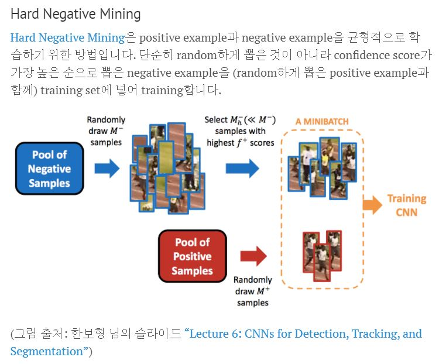

#### Positive vs Negative examples and softmax

이 연구에서는 CNN을 Fine-tuning할때 샘플들을 Positive와 Negative로 설정하는 방법과 객체 탐지용 SVM들을 훈련시킬때 설정하는 방법이 다르다. 미세 조정을 위해서는 각 지역 후보를 최대의  IoU를 가지고 있는 Ground-truth과 매칭해서 만약에 IoU가 0.5 이상이라면  그 Groud-truth 클래스의 Positive로 레이블링한다. 나머지 다른 후보들은 Background로 레이블링한다. SVM을 훈련시킬 때는 반대로 SVM을 훈련시킬 때는 Groud-truth 상자들만을 각 클래스에 대한 Positive example로 취하고 클래스의 모든 지역들과 IoU가 0.3 미만인 지역 후보들을 그 클래스에 대한 Negative로 설정한다. 0.3 IoU 이상이지만 Groud truth가 아닌 것들은 무시된다.

원래 저자들은 SVM을 ImageNet으로 Pre-trained한 CNN에서 추출한 특징들로 훈련 시키기 시작했고 그  당시에는 Fine-tuning은 고려 대상이 아니었다. 이때 저자들은 SVM을 훈련시키기위한 특정한 레이블 설정법이 저자들이 평가했던 옵션 셋 안에서(Fine-tuning을 할 때 적용했던 설정법 포함) 최적이라는 것을 발견하여 적용했다(즉 저자들이 이 연구를 할 당시에 SVM에 적용한 레이블 설정법이 Fine-tuning을 적용하기 전에는 SVM을 훈련시키위한 레이블 설정법 중 최적의 설정법이었다는 소리). Fine-tuning을 적용하고 나서 SVM을 훈련시키는데 적용한 레이블 설정법을 그대로 사용했지만 저자들이 CNN을 미세조정 할 때 적용한 레이블 설정법보다 성능이 나빴다. 

저자들이 추측하길 레이블 설정법의 이런 차이가  Fine-tuning할 때 데이터가 제한적이기 때문에 발생하는 것이었다. 저자들이 적용하는 방법은 많은 jittered 샘플(IoU 0.5이상 1이하지만 Ground truth는 아닌)을 만들어 내는데 이 샘플들이 Positive 샘플의 수를 거의 30배 만큼 확장시킨다. 이 샘플들은 전체 네트워크의 과적합을 피하는데 도움이 될 수 있으나 정확한 위치 추정을 위해 Fine-tuned 되는데는 최적은 아니었다. 

그리고 Fine-tuning 후에 SVM을 따로 훈련시키는 이유는 다음과 같다. 저자들은 Fine-tuned한 CNN의 마지막 계층에 21-way 소프트맥스 회귀 분류기를 객체 탐지기로서 사용해보는 옵션을 시도해봤다. VOC2007 데이터셋에서 시도했을때 mAP가 54.2%에서 50.9%로 떨어졌다. 성능 저하에는 여러 가지 이유가 있겠지만 저자들은 Fine-tuning 시에 적용했던 Positive example 설정법이 정확한 위치 추정을 하는데는 도움이 되지 않았고 소프트맥스 분류기가, SVM을 훈련시키는데 사용되었던 Hard negatives 의 부분 셋이 아니라 랜덤하게 선택된 Negative 샘플에서 훈련되었다는 사실을 꼽았다. 

### Results on PASCAL VOC 2010-12

저자들은 모든 선택 옵션(하이퍼 파라미터 설정 등)을 VOC 2007 데이터셋에 대해서 검증했다. VOC 2010-12 데이터셋에 대한 최종 결과에서는 CNN을 VOC 2012 훈련 셋으로 최적화 시키고 SVM 탐지기를 VOC2012 훈련+검증 셋으로 최적화시켰다. 검증 서버에는 바운딩 박스 회귀가 있는 버전과 없는 버전 두 가지 버전을 제출했다. 

 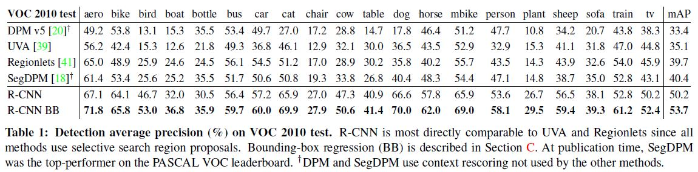

### Results on ILSVRC 2013 detection

저자들은 R-CNN을 ILSVRC2013 200 클래스 탐지 데이터셋에서 수행했는데 이때 PASCAL VOC에 사용한 하이퍼파라미터와 같은 시스템으로 수행했다. 검증 서버에 보낼 때는 위에서와 마찬가지로 바운딩 박스 회귀가 있을때와 없을 때 두 가지 버전으로 제출했다. 

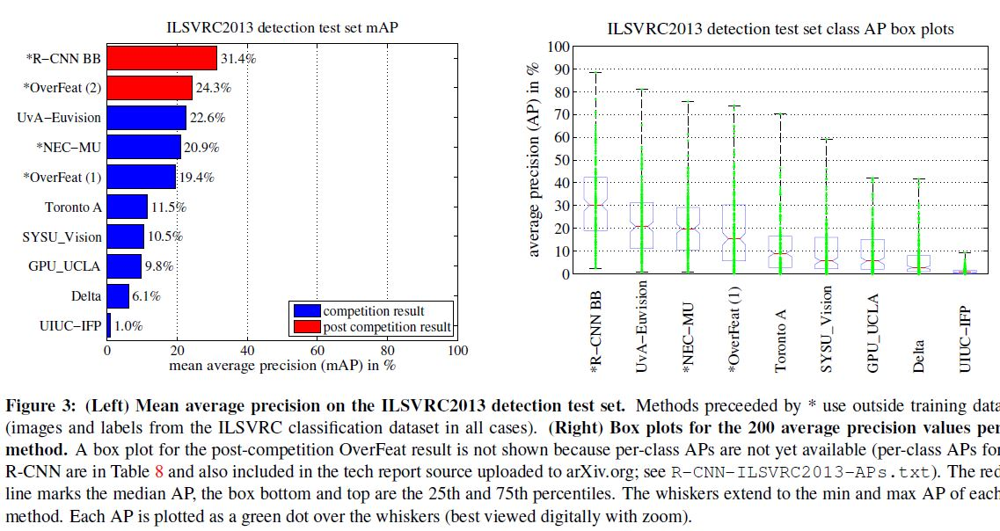

## Visualization, ablation, and modes of error

### Visualizing learned features

첫 번째 계층의 필터들을 시각화 하고 이해하는 것은 쉽다. 그러나 그 다음 계층들의 필터들을 이해하는 것은 도전적인 일이다. 저자들은 여기서 간단하면서 non-parametric하게 네트워크가 무엇을 학습하는 지를 보여주는 방법을 제시했다. 

아이디어는 네트워크의 특정 한 유닛(특징)을 골라서 그 자체가 하나의 객체 탐지기 인것처럼 사용하는 것이다. 대략 10 million 정도 되는 검증 지역 후보의 셋에 대한 그 유닛의 activation을 계산해서 지역 후보들 activation의 하향식으로 정렬하고 NMS를 수행하고 난 다음 가장 높은 지역들을 보여주는 것이다. 이 방법은 선택된 유닛이 어떤 입력에 대해 활성화 되는지 보여준다. 결과의 평균을 구하지 않는데 유닛의 각기 다른 시각 정보를 보고 불변 하는 특징에 대한 통찰을 얻기 위함이다. 

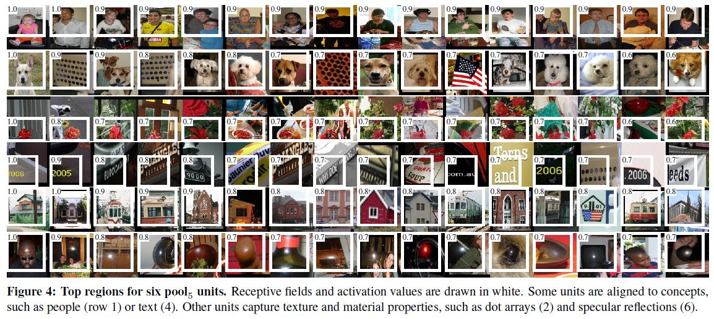

저자들은 마지막이자 5번째 컨볼루션 계층의 출력에 Max 풀링을 적용한 pool5의 유닛을 시각화 했다. pool5 계층의 특징 맵은 6x6x256=9216 차원이고 원래의 227x227 픽셀 입력에 대해서 195x195 픽셀 크기의 수용체 영역(입력단 영역) 크기를 가진다. 중앙에 있는 유닛은 영역의 거의 전체적인 부분을 보지만 모서리에 가까운 유닛은 좀 더 작으면서 clipped된(가장자리라서 영역이 잘린) 영역을 본다. 

위 그림의 각 행은, VOC 2007 훈련+검증 셋으로 Fine-tuning한 CNN의 pool5 유닛 중에 Top 16 activation을 보여준다. 이 유닛들은 네트워크가 샘플로부터 무엇을 배우는지 설명하기위해 선택되었다. 예를 들어서 두번째 행에서는 강아지 얼굴과 점들의 배열에 반응했다. 세번째 행은 붉은색 덩어리를 탐지하고 어떤 탐지기는 사람 얼굴을, 또 다른 탐지기는 글자, 창문이 달린 삼각형 형태의 구조물 같은 추상적인 패턴을 탐지하기도 한다.  네트워크는 약간의 클래스에 특화된 특징과 함께 모양, 질감, 색, 물체 특성 면에서 넓게 분포하고 있는 특징들을 결합한 것을 학습하는 것처럼 보인다. 다음 계층인 완전 연결 계층 fc5는 이런 풍부한 특징들의 복합체를 모델링할 수 있는 능력을 가진다. 

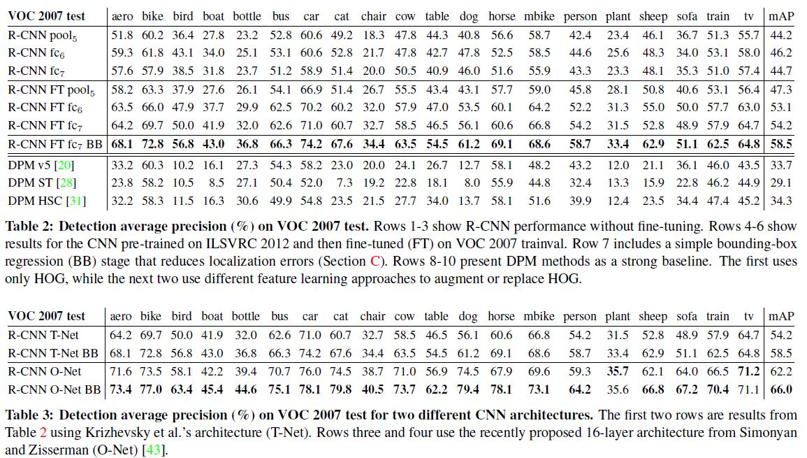

### Ablation studies

#### Performance layer-by-layer, without fine-tuning

저자들은 어떤 계층이 탐지 성능에 중요한지 알아보기 위해서 CNN의 마지막 3 계층에 대해서 VOC2007 데이터셋을 넣었을때 출력을 분석했다.완전 연결 계층 6과 7을 분석한 결과는 다음과 같다( pool5는 위에서 이미 설명). 

- fc6는 pool5에 완전하게(Dense) 연결되어 있다. 특징을 계산해내기 위해서 4096 x 9216의 가중치 행렬와 pool5의 특징맵(9216차원의 벡터로 Reshape됨)을 곱한다. 그리고 편향 벡터를 더한다.  벡터의 요소에는 ReLU가 적용된다.
- fc7은 네트워크의 마지막 계층이고 fc6의 출력과 4096 x 4096짜리 가중치 행렬을 곱하고 편향 벡터를 더해서 ReLU를 적용한다.  

먼저 Fine-tuning을 하지 않았을 때 결과를 분석했다. CNN은 PASCAL 데이터에 대한 activation이며 ILSVRC 2012에서 Pre-trained되었다. 위의 테이블2를 보면 fc7의 특징이 fc6의 특징보다 일반화 성능이 떨어지는 것을 확인할 수 있다. 이것은 CNN 파라미터의 29%에 해당하는 대략 16.8 million의 파라미터들을 mAP의 하락 걱정 없이 제거할 수 있다는 것을 의미한다. 더 놀라운 것은 fc7과 fc6을 제거하고 pool5까지만 분석했을때의 결과가 꽤 괜찮다는 것이다(pool5의 파라미터는 CNN 파라미터의 6%). 이것으로 CNN의 특징력(mAP에 영향을 주는 특징을 발견해내는 능력)은 아주 큰 완전 연결 계층들보다는 컨볼루션 계층들에서 도출된다는 것을 확인할 수 있다. 

#### Performance layer-by-layer, with fine-tuning

이번에는 Fine-tuning을 하고 난 뒤의 CNN activation의 분석 결과이다. Fine-tuning을 했을 때 mAP는 8%가량 상승했다. 이런 개선 정도는 pool5보다 fc6와 fc7에서 크게 나타났다. 이것은 ImageNet에 Pre-trained된 pool5의 특징들은 좀 더 일반적이며 Fine-tuning을 통해서는 분류기의 상위 요소들이 Domain-specific하고 non-linear한 특징들을 학습한다는 것이다. 

#### Comparison to recent feature learning methods

특징을 학습하는 방법들과 R-CNN을 비교하기 위해 여기서는 두 가지 방법을 제시했다. 

- DPM ST - J. J. Lim, C. L. Zitnick, and P. Dollar. Sketch tokens: A ´ learned mid-level representation for contour and object detection. In CVPR, 2013
- DPM HSC - X. Ren and D. Ramanan. Histograms of sparse codes for object detection. In CVPR, 2013

위의 테이블 2의 8-10행을 보면 R-CNN 계열 모델들이 위의 DPM 계열 알고리즘의 성능을 크게 넘어서는 것을 알 수 있다. 

### Network architectures

이 연구에서의 실험 결과는 대부분 Krizhevsky 등이 제시한 네트워크 아키텍처를 사용한 것인데 저자들은 네트워크 아키텍처를 선택하는 것이 R-CNN의 탐지 성능에 크게 영향을 끼친다는 것을 알아냈다. Table 3는 다음의 네트워크 아키텍처를 사용했을때의 결과를 나타낸 것이다.

- K. Simonyan and A. Zisserman. Very Deep Convolutional Networks for Large-Scale Image Recognition. arXiv preprint, arXiv:1409.1556, 2014

저자들은 OxfordNet을 O-Net으로, TorontoNet을 T-Net으로 불렀다. O-Net을 R-CNN에 적용하기 위해서 Caffe Model Zoo에서 Pre-training한 모델의 가중치를 다운 받아서 T-Net에서 했던 옵션을 적용해서 Fine-tuning 했다고 한다. 차이점은 GPU 메모리 용량에 맞추기 위해서 적은 양의 미니 배치 사이즈(24)를 적용했다는 것이다. R-CNN O-Net이 R-CNN T-Net을 mAP상으로는 압도했으나 순전파 시에 7배의 시간이 더 걸렸다고 한다. 

### Detection error analyasis

저자들은 탐지 과정의 분석을 위해서 Hoiem 등의 분석 도구를 이용했다. 그래서 R-CNN 방법론의 오류의 종류, Fine-tuning이 모델을 어떤식으로 바꾸는지, DPM과 비교해서 어떤 오류가 영향을 많이 끼치는지 등을 알아냈다. 

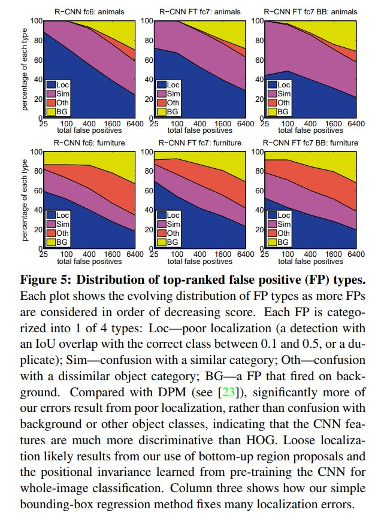

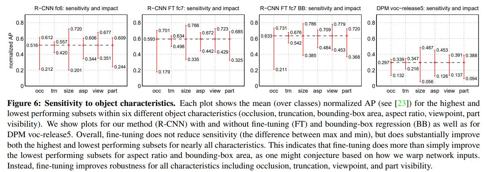

### Bounding-box regression

저자들은 오류 분석에 근거해서 위치 추정과 관련된 오류를 줄이기 위해서 간단한 바운딩 박스 회귀 방법을 고안했다. DPM에서 도입한 했던 방법으로, pool5에서 출력된 특징을 바탕으로 새로운 탐지 윈도우를 예측해서 Selective search를 수행할 때, 지역 후보를 생성하는 방식을 개선했다. Table1, 2, Figure 5에서 보여진대로 이 접근법은 많은 탐지 과정 중의 많은 잘못된 위치 추정을 바로잡았고 이를 통해 mAP가 3에서 4 정도 상승했다. 

DPM에서 썼던 방법과의 차이점은 특징을 CNN으로 계산했다는 것이다. 여기서 N개의 훈련 셋 쌍은 다음과 같이 표현된다. 

| N training pairs                                             | Proposal P                                                   | Ground-truth G                                               |
| ------------------------------------------------------------ | ------------------------------------------------------------ | ------------------------------------------------------------ |
| 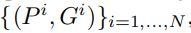 | 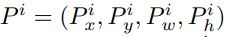 | 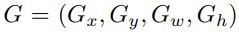 |

여기서 Px, Py, Pw, Ph는 각각 Proposal P의 중앙 x, y 좌표, 넓이, 높이이고 Gx, Gy, Gw, Gh는 Ground truth의 중앙 x, y 좌표, 넓이, 높이이다. 이 모델의 목적은 P를 G로 매핑하는 변환을 학습하는 것이다. 

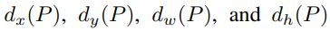

저자들은 Proposal P에 대한 값을 인자로 하는 변환을 다음과 같이 함수로 만들었다. 앞의 두 개는 Scale-invariant하게 P 박스의 중앙 좌표 값을 변환하고 뒤의 두 개는 P 박스의 넓이와 높이를 log 값으로 변환한다. 위의 개념들을 이용해서 P를 이용해서 Ground-truth의 예측 값 G^hat을 다음과 같이 나타낼 수 있다. 

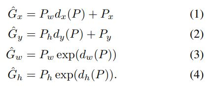

각각의 d\*(P)는 P의 pool5의 출력 특징에 대한 선형 함수로서 모델링할 수 있다. 여기서  pool5의 출력 특징을 다음과 같이 나타낸다.

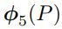

(위의 값이 각 입력 이미지 데이터에 의존성이 있다는 것은 암묵적으로 추정한다.)

따라서 d*(P)는 다음과 같이 나타낼 수 있다. 여기서 w\*는 학습이 가능한 파라미터의 벡터이다. 

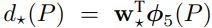

w\*는 Ridge 회귀를 통해서 최적화 할 수 있다. 

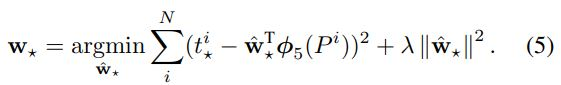

위에서 훈련셋(P,G)에 대한 타겟 t\*는 다음과 같이 나타낼 수 있다.

 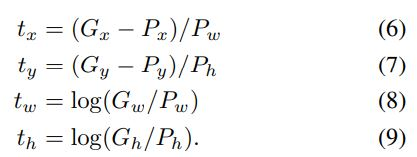

저자들은 바운딩 박스 회귀 프로세스를 구현하면서 두 가지 이슈를 발견했다. 

- 규제 정도의 중요성 - 검증 셋에 근거해서 λ를 1000으로 설정했다. 
- (P, G) 설정의 중요성 - 만약에 P가 그 어떤 G와도 가까이 있지 않다면 P를 G로 근사화 시키는 것은 애초에 말이 안되는 작업이 된다. 따라서 P가 최소 하나의 G와 가까이 있을 때 P와 G를 묶었다. 가까움의 정도는 P가 G와의 IoU가 가장 높으면서 특정 임계값보다(검증 셋을 이용하여 0.6으로 설정) 높으면 그 P를 G와 묶었다. 나머지 G와 묶이지 않는 P는 버린다. 이 과정을 각 객체 클래스마다 한 번씩 수행했는데 이는 특정 틀래스에 특화된 바운딩 박스 회귀를 훈련시키기 위함이다. 

테스트 시에는 이런 과정을 한 번씩만 수행했다. 여러번 수행할 수도 있으나 여러번 수행하는 것이 결과 개선에 효과가 없었다고 한다. 

### Qualitative results

ILSVRC2013 데이터셋에 대하여 질이 좋은 결과는 아래와 같다. 각 이미지는 val2 셋에서 무작위로 선정되었고 모든 결과는 정밀도가 0.5 이상인 것들이다. 

(본문의 Figure8,9,10,11 참조)

## The ILSVRC2013 detection dataset

ILSVRC2013 탐지 셋은 PASCAL VOC 데이터셋보다 Less homogeneous하기 때문에 어떻게 사용할것인지가 중요하다고 한다. 

### Dataset overview

ILSVRC2013 탐지 셋이 어떻게 수집되었고 annotated되었는지는 다음을 참고

- J. Deng, O. Russakovsky, J. Krause, M. Bernstein, A. C. Berg, and L. Fei-Fei. Scalable multi-label annotation. In CHI, 2014.
- H. Su, J. Deng, and L. Fei-Fei. Crowdsourcing annotations for visual object detection. In AAAI Technical Report, 4th Human Computation Workshop, 2012

val과 test 셋은 같은 이미지 분포에서 샘플링되었고 PASCAL VOC 이미지 셋과(이미지 안의 객체의 숫자, 클러터(레이더에서 지면, 해면, 빗방울 등으로부터 발생하는 불필요한 반사파에 의해 나타나는 반향(echo) 등의 반사 장애)의 정도, 객체 포즈의 변동성 등) 비슷하다. 그리고 이미지 안의 모든 객체(200 클래스)에 대해서 바운딩 박스가 레이블링되어 있다. 훈련셋은 ILSVRC2013 이미지 분류 과제의 분포를 따르며 이미지 안의 객체가 한쪽으로 치우쳐져 있는 듯 복잡하다. 이미지 안의 객체는 어노테이션이 되어 있을 수도 있고 되어 있지 않을 수 도 있다. 거기다 각 클래스마다 Negative한 이미지들이 포함되어 있는데 이는 검증 셋이 특정 클래스와 관련된 객체를 포함하고 있는지 아닌지를 수동적으로 판단하기 위해서 쓰인다. 이런 Negative한 이미지들은 이 연구에서 쓰이지 않았다. 

이런 성질 때문에 이 데이터로 R-CNN을 훈련하는데에서 저자들은 많은 옵션을 고민했다. 예를 들어서 훈련 셋은 철저하게 어노테이션하지 않았기 떄무네 Hard negative mining 하는데 사용될 수 없었다. 또 훈련 셋은 검증+테스트 셋과 다른 통계치를 보였다(다른 분포).

한 가지 방법은 검증 셋에 의존하고 몇 개의 훈련 셋을 Positive 데이터로 추가적으로 사용하는 것이다. 검증 셋을 훈련과 검증에 사용하기 위해서 같은 크기로 val1, val2로 나눴다. 몇몇 클래스는 검증 셋에 적게 나타나므로 데이터를 나눌때 균등하게 나누는것이 중요하다. 이를 위해서 먼저 숫자가 많은 클래스가 나눠지고 숫자가 적은 클래스의 이미지가 나눠졌다. 나눠질때는 검증 셋에 들어있는 클래스의 숫자를 특징으로 하는 방법으로 검증 셋을 클러스터링 하고 나서 분리할 때 균형을 개선하는 방법이 있다면 그 방법을 적용했다. 가장 불균형할때는 11%정도이고 불균형의 중위값은 4%이다.  

### Region proposals

ILSVRC2013 데이터 셋에서도 PASCAL 탐지 셋에서 적용했던 지역 후보를 생성하는 접근법을 똑같이 적용했다. 즉,  Selective search를 val1, val2, test (훈련 셋 제외)에서 수행했다. 한 가지 고려해야할 사항은 Selective search가 크기와 무관하지 않아서 많은 지역들이 이미지의 해상도에 의존적이라는 것이다. ILSVRC 이미지는 매우 작은 크기부터 어떤 몇몇의 이미지는 아주 큰 크기를 가지기 때문에 Selective search를 수행하기 전에 고정된 넓이(500 필셀)로 이미지의 크기를 조정했다. val 셋에서 Selective search를 수행했을 때, IoU가 0.5 이상 되는 지역이 평균적으로 2403로 이미지당 91.6% 정도의 재현율을 보인다. 이는 PASCAL이 거의 98%인 것과는 대조적으로 낮은 수치이다. 

### Trainging data

네트워크를 훈련시키기 위한 데이터 셋으로는 val1에서 Selective search한 결과와 Ground-truth 박스들을 포함하는 박스 관련 정보와 그에 대응하는 이미지들 그리고 ILSVRC2013의 훈련 셋에서 최대 N개까지의 클래스 당 Ground-truth 박스들(만약에 훈련 셋에서 클래스가 N개보다 적은 Ground-truth 박스를 가지고 있다면 모두 사용해서)을 묶어서 구성했다. 저자들은 이를 val1+trainN이라고 불렀다. 

훈련시키는동안 쓰이는 데이터는 R-CNN에서 세가지 처리가 필요했다.

- CNN Fine-tuning
- Detector SVM training
- Bounding-box regressor training

CNN Fine-tuning은 50k SGD의 Iteration 동안 PASACAL 데이터로 훈련시킬때와 똑같은 설정으로 val1+trainN 데이터로 수행되었다. Caffe를 이용해서 하나의 NVIDIA Tesla K20 GPU로 열 세시간동안 수행했다고 한다. SVM을 훈련시킬 때는 val1+trainN의 모든 Ground-truth 상자들은 해당하는 클래스에 대한 Positive example로서 사용되었다. Hard negative mining이 val1 데이터에서 무작위로 뽑은 5000장의 이미지 서브셋에서 수행되었다. 실험 초기에 val1의 모든 셋에서 mining negatives를 수행하는 것과 5000장의 서브셋(거의 전체의 절반)에서 mining negatives를 수행하는 것을 비교했는데, 5000장의 서브셋에서 수행하는 것이 mAP가 0.5%만 떨어지면서 SVM의 훈련 시간을 거의 반으로 줄였다.  ILSVRC2013의 훈련 셋에는 Negative 샘플을 뽑지 않았는데 앞에서 말한대로 모든 객체에 대해서 Annotation 되어 있지 않기 때문이다. 또 앞에서 말한대로 검증 셋이 특정 클래스와 관련된 객체를 포함하고 있는지 아닌지를 수동적으로 판단하기 위해서 쓰였던 Negative 이미지들 또한 사용되지 않았다. 바운딩 박스 Regressor는 val1으로 훈련되었다. 

### Validation and evalutation

저자들은 결과를 평가 서버에 제출하기 전에 실험에서 적용했던 데이터 사용 패턴과 Fine-tuning의 효과 그리고  바운딩 박스 회귀를 val2 셋으로 검증했다. 모든 하이퍼 파라미터(예를 들어 SVM의 C, 지역을 워프할 때의 패딩 픽셀 수, NMS 임계값, 바운딩 박스 회귀의 하이퍼파라미터 등)는 PASCAL에 사용했던 값을 그대로 사용했다. 비록 이 설정이 ILSVRC에 대해서 최적은 아니지만 저자들의 목적은 철저하게 데이터 셋으로 튜닝 하기전에 ILSVRC 데이터 셋에 대한 R-CNN의 결과를 만들어 내는 것이 목적이었다. val2에서 최적의 설정을 찾아낸 뒤에는 두 번 평가 서버에 결과를 제출했다. 한 번은 바운딩 박스 회귀 없이 그리고 다른 한 번은 바운딩 박스 회귀 적용했을 때이다. 이때 SVM과 바운딩 박스 회귀 훈련 셋을 각각 val+train1k, val까지 확장해서 사용했다. CNN은 Fine-tuning과 특징 계산을 다시 하는 것을 피하기 위해서 val1+train1k에서 훈련시킨 것을 사용했다. 

### Ablation study

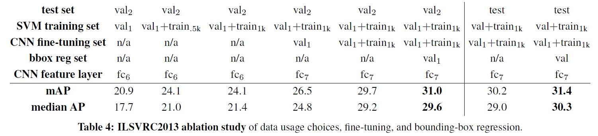

위의 테이블은 각 부분의 훈련 데이터의 양에 따른 결과를 나타낸 것이다. CNN fine-tuning set의 n/a는 ILSVRC2012 클래스 분류 데이터셋에서 Pre-trained된 상태에서 Fine-tuning을 하지 않은 상태이다. 

### Relationship to OverFeat

저자들에 의하면 OverFeat은 R-CNN의 어떤 특별 케이스라고 볼 수 있다고 한다. 만약에 Selective search에서 생성되는 지역을 Regular 정사각형 지역의 Multi-scale pyramid로 바꾸고 클래스당 바운딩 박스 회를 하나의 단일 바운딩 박스 회귀로 바꾼다면 시스템이 굉장히 유사해진다고 한다(훈련 과정에서 몇 가지 차이가 있다 - CNN의 Fine-tuning, SVM 사용 등). OverFeat은 R-CNN보다 9배 정도 속도가 빠르다고 한다. 이것은 OverFeat의 슬라이딩 윈도우가 이미지 단계에서 워프를 하지 않으므로 겹쳐지는 윈도우 사이에 쉽게 계산이 공유될 수 있다는 사실때문이다. 전체 네트워크를 임의의 입력 사이즈에 대해서 컨볼루션스러운 방법으로 프로세스를 수행한다. 

## Semantic segmentation

각 지역에 대한 분류는 Semantic segmentation에서 표준적인 기술이기 때문에, 저자들은 쉽게 R-CNN을 PASCAL VOC segmentation 과제에 적용할 수 있었다. O2P라고 하는 Second-oder pooling의 Semantic segmentation 시스템과 결과를 비교하기 위해서 저자들은 R-CNN을 O2P의 오픈 소스 프레임워크를 이용했다. O2P는 CPMC를 수행해서 각 이미지당 150의 지역 후보를 생성해내고, Support vector regression을 사용하여 각 클래스에 대한 각 지역의 퀼리티를 예측했다. 그 당시에 이 방법이 좋은 성능을 보일 수 있었던 이유는 CPMC로 생성된 지역들의 질이 좋았고 Multiple feature type의 강력한 Second-order pooling 때문이다. 

저자들은 이 과제를 수행하기 위해서 다음의 두 개의 연구 방법을 따랐다.

- P. Arbel´aez, B. Hariharan, C. Gu, S. Gupta, L. Bourdev, and J. Malik. Semantic segmentation using regions and parts. In CVPR, 2012
- J. Carreira, R. Caseiro, J. Batista, and C. Sminchisescu. Semantic segmentation with second-order pooling. In ECCV, 2012

그리고 PASCAL segmentation 훈련 셋을 다음의 방법을 통해 추가적인 Annotation을 포함할 수 있도록 했다. 

- B. Hariharan, P. Arbel´aez, L. Bourdev, S. Maji, and J. Malik. Semantic contours from inverse detectors. In ICCV, 2011

Design decision과 하이퍼파라미터는 VOC 2011 검증 셋에서 교차 검증되었고 마지막 테스트 결과는 한 번 평가되었다. 

### CNN features for segmentation

저자들은 CPMP에서 생성된 지역의 특징을 계산하기 위한 세가지 전략을 평가했다. 이 세가지 전략 모두 직사각형 윈도우를 227x227 크기의 지역으로 워프 하는 것부터 시작한다. 

첫 번째 전략(full)은 생성된 지역의 모양을 무시하고 워프된 윈도우를 입력으로 해서 CNN에서 특징 벡터를 추출한 뒤에 탐지와 관련된 작업을 수행하는 것이다. 그러나 이런 특징들은 각 지역의 직사각형이 아닌 모양은 무시한다. 

두 개의 지역이 그다지 겹치지 않으면서도 매우 유사한 바운딩 박스를 가질 수 있다. 그러므로 두 번째 전략(fg)는 지역의 전경 마스크에 대해서만 CNN의 작업을 수행해서 특징을 계산해낸다. 이때 배경은 입력 값의 평균으로 교체해서 평균을 빼는 전처리를 할 때 0이 될 수 있도록 한다. 

세번째 전략(full+fg)는 단순히 첫번째와 두 번째 전략의 특징을 Concatenate하는 것이다. 

### Results on VOC 2011 

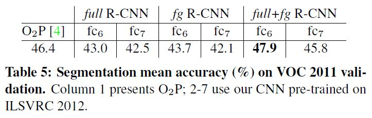

위의 테이블은 O2P와 비교하여, VOC 2011 검증 셋에서의 R-CNN의 결과를 보여준다. 참고로 R-CNN의 full+fg 특징들로 한 개의 코어에서 훈련시켰을 때 1시간이 걸렸는데 O2P 특징들로 훈련시켰을때는 10시간 이상이 걸렸다고 한다. 

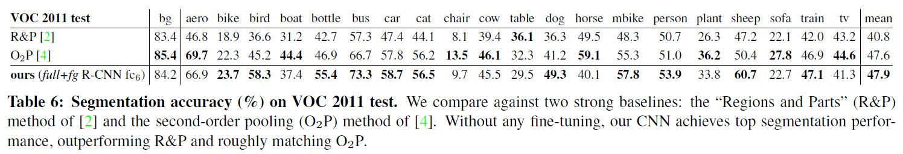

테이블 6에서는 저자들의 방법(fc6 + full + fg R-CNN)과 다른 두 개의 방법을 VOC 2011 테스트 셋에 대해서 수행했을 때 결과를 비교한 것이다. 

## Conclusion

저자들이 연구할 당시에 객체 탐지 분야의 기술들의 성과는 정체되어 있었다. 당시에 가장 좋은 성능을 보인 시스템들은 Object detectors와 Scene classifiers로 부터 여러 저차원의 이미지 특징들과 고차원의 문맥 정보를 결합한 복잡한 앙상블이었다. 이 연구에서는 간단하면서도 확장가능한 object dectection 알고리즘을 제시하는 것이었고 실제로 PASCAL VOC 2012 데이터 셋에서 가장 좋은 결과를 도출해냈다. 

이 결과는 다음의 두 가지 키 포인트 때문에 가능했다.

- 대용량의 CNN을 객체를 Localize하고 Segment하기 지역 후보에 상향식으로 적용하는 것
- 대용량의 CNN을 훈련시키기 위한 레이블링된 데이터가 적음에도 불구하고 이를 훈련시키는 방법. 저자들은 다른 목적의 과제(이미지 분류 등)의 풍부한 데이터로 네트워크를 미리 학습시킨 후에 데이터가 부족한 타겟 도메인 작업으로(여기서는 탐지) Fine-tuning 하는 것이 꽤 효과적임을 보여줬다. 

또 저자들은 이런 결과를 내는 데에 컴퓨터 비전에서의 고전적인 방법들과 딥러닝 방법들을 결합해서 사용하는 것이 중요하다고 했다. 
