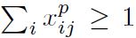

# SSD: Single Shot MultiBox Detector

Wei Liu(UNC Chapel Hill), Dragomir Anguelov(Zoox Inc.), Dumitru Erhan(Google Inc.), Christian Szegedy(Google Inc.), Scott Reed(University of Michigan, Ann-Arbor), Cheng-Yang Fu(UNC Chapel Hill), Alexander C. Berg(UNC Chapel Hill)

## Abstract

저자들이 주장하는 이 연구의 기여의 핵심 점은 단일 딥러닝 네트워크로 다양한 크기의 객체들을 탐지할 수 있는 방법을 제시했다는 것이다. 네트워크의 각 계층에서의 특징 맵을 그리드 형식으로 나누고 각 셀마다 다양한 크기와 종횡비를 갖는 Default box들을 할당해서 이 박스들로 객체에 대한 Predicted Bounding box를 도출해낸다.  그래서 네트워크는 훈련 간에, 각 Default box 안에 각 객체 카테고리에 대한 Presence scoring을 하고, 객체의 위치에 Default box들이 잘 맞도록 조정하게 된다. 특히 YOLOv1과는 다르게 각 계층 마다의 특징맵(당연히 크기가 다 다름.)에 대해서 예측 값을 도출해서 최종적으로 생성되는 결과에 합치게 된다. 이렇게 하면 다양한 크기의 객체를 탐지 하는데 용이하다. Faster R-CNN 같이 지역 후보들을 생성하고 이 지역 후보들에 대해 Scoring을 처리하는 방식이 아니고 종단 간에 특징 추출하고 결과를 도출하는 과정이 통합되어 있기 때문에 속도도 훨씬 빠르다고 한다. 

## Introduction

Two-stage 방식의 Dector들은 기본적으로 이미지 안에 객체가 들어있을만한 패치를 생성하고 그 패치에 대해서 사후 처리를 하는 방식이기 때문에 속도가 느릴수 밖에 없다. 예를 들어서 이쪽 계열에서 가장 뛰어나다고 알려진 Faster R-CNN도 7 FPS의 속도밖에 내지 못한다. 이는 실시간성이 중요한 애플리케이션이나 임베디드 시스템에는 부적절하다. 또 CNN에 적절한 패치를 생성하기 위해서 각 이미지들에 어떤 변형을 가하기도 한다. 

저자들이 제안하는 방식은 이런 과정을 없앤다. CNN의 완전 연결 계층 대신에 작은 사이즈의 필터를 가지는 여러 컨볼루션 계층을 붙인다. 각 계층의 특징 맵에 대해서 다양한 크기와 종횡비를 가지는 Default box들을 이용해서 객체가 있을법한 지역에서 클래스 Score와 바운딩 박스 Offset을 예측한다. 각 계층의 특징 맵의 크기가 다르기 때문에 각 단계에서 담당하는 객체의 크기가 다르다. 그렇기 때문에 YOLO와는 다르게 다양한 크기의 객체를 탐지하는데 더 이점이 있다. CNN을 훈련시키고 SVM을 훈련시키고 Bounding box regressor를 훈련시키는 대신에 하나의 단일 네트워크를 종단간으로 훈련시키면 되기 때문에 속도도 훨씬 빠르다. 

## The Single Shot Detector(SSD)

### Model

SSD는 기본적으로 네트워크 순전파 시에 정해진 양의 바운딩 박스 예측 값을 생성해내고 그 박스 안에서 클래스 Score를 뽑아낸후 최종 예측 값을 뽑아내기 위해서 NMS를 수행한다. CNN에서 분류를 수행하는 부분을 잘라내고 다음의 특징을 갖는, 위에서 언급한 작업을 수행하는 추가적인 컨볼루션 계층들을 덧붙인다. 

#### Multi-scale feature maps for detection

덧붙여진 컨볼루션 계층들의 특징 맵의 크기가 점점 작아지고 각 특징 맵마다 예측 값이 생성되므로 자연스럽게 다양한 크기에 대한 예측 값이 만들어지게 된다. 

#### Convolutional predictors for detection

Figure2에 나와 있는 네트워크에 추가된 상위의 컨볼루션 계층에 대해서, 각 계층에서의 특징맵의 크기가 m x n이고 p 채널 수를 가지고 있을 때, 기본적으로 적용되는, Detection과 관련된 필터는 3 x 3의 크기를 가진 p 채널의 커널이다. 입력으로 들어온 특징 맵의 각 위치에 이 커널이 적용되고 위에서 언급한 출력 값을 생성해낸다. 바운딩 박스 Offset은 특징 맵의 각 위치와 관련된 Default box와 관련된 값들이 출력되게 된다. 

#### Default boxes and aspect ratios

[Jinwon Lee, Samsung Electronics Enginner - PR-132: SSD: Single Shot MultiBox Detector]( https://www.slideshare.net/JinwonLee9/pr132-ssd-single-shot-multibox-detector)

특징 맵의 각 셀에는 Default box가 매핑되어 있다. 모델 훈련 시에는 각 Default box과 관련하여, Offset(x, y)이나 Shape(w, h)과 관련된 값을 예측한다. 또 각 박스 마다 Class score(그 클래스와 관련된 인스턴스가 존재하는지 여부의 정도)도 예측을 하게 된다. 따라서 각 셀마다 (c + 4)*#box 크기의 벡터가 생성된다. 특징 맵의 크기가 m x n이라면 최종적으로 m x n x #box(c + 4) 만큼의 아웃풋이 각 특징 맵마다 만들어 지게 된다. 위 그림은 Jinwon이라는 분이 이 부분에 대해서 설명하면서 보여주신 그림이다. 

[Deep Systems - SSD: Single Shot MultiBox Detector (How it works)](https://docs.google.com/presentation/d/1rtfeV_VmdGdZD5ObVVpPDPIODSDxKnFSU0bsN_rgZXc/pub?start=false&amp;loop=false&amp;delayms=3000&amp;slide=id.g179f601b72_0_51)

위 그림에 보면 5x5짜리의 각 셀에 3개의 Box가 할당되었다고 한다면 총 5x5x3=75개의 Default box가 존재한다. Localization과 관련된 특징 맵만 모아보면 5x5x12(3x4) 크기가 되는데 각 셀마다 3개의 박스에 대한 dx, dy, dw, dh 값을 예측하므로 5x5x4에서 4는 이 4개의 offset 값이 들어있다. Class score와 관련된 특징 맵을 모아보면 5x5x63(3x21) 크기가 되는데  각 셀마다 3개의 박스에 대한 클래스 Score를 예측하므로 5x5x21에서 21에는 Class confidence score(20class + 1 background)가 들어 있다. 

### Training

#### Matching strategy

훈련시에는 GT box에 대해서 다양한 종횡비, 스케일, 위치를 가진 Default box를 매칭해야한다. 여기서는 먼저 GT box와 가장 Jaccard overlap(IOU)가 높은 박스를 매칭한다. 그런 Default box들에 대해서 GT box 중에 Jaccard overlap이 Threshold(여기서는 0.5) 이상이라면 그 GT box와 Default box들을 매칭한다. 이렇게 함으로서 네트워크가 가장 많이 겹치는 박스 하나를 고르는 것이 아니라 여러 상자에 대한 Score를 예측하게 한다. 

#### Training objective

i번째 Default box가 카테고리 p의 j번째 GT BOX에 맞는지 여부를 가리키는 변수이다.  

위의 조건에 맞는 Default box는 1개 이상이 될 수 있다. 

N은 매칭된 Default box의 숫자이다. 만약에 매칭된 박스가 없다면 Loss도 0이 된다. L_loc(x, l, g)는 박스가 매칭되었을 때, 예측된 박스 l과 GT 박스의 파라미터 사이의 Smooth L1 Loss이다.  위애서 α는 교차 검증에 의해서 경험적으로 1로 설정되었다.

즉 예측 박스와 GT 박스의 파라미터 사이의 차이의 절대값이 1보다 작으면 0.5*차이의제곱, 1보다 크면 차이의 절대값 - 0.5가 된다. Fast-RCNN에서 한 것처럼 Default 박스 d의 중심 좌표 cx, cy 그리고 넓이 높이의 offset을 회귀 한다. 즉, 미리 정해놓은 박스를 움직이고, 넓이와 높이를 변화 시켜서 GT 박스에 맞게 한다. 

Confidence loss 같은 경우에는 Positive box(GT와 매칭된 박스)와 Negative box(Background로 매칭된 박스)에 대한 Cross entropy의 합을 나타낸다. 

#### Choosing scales and aspect ratios for default boxes

많은 연구에서 High level의 계층에서 여러 컨볼루션을 거치면서 손실된 정보를 보충하기 위해서 Low level의 정보를 이용하는데 저자들도 이 방법을 적용하기로 했다. 

네트워크의 각 계층의 특징 맵의 크기가 다르므로 저자들은 각 계층에서 특정 크기의 객체를 전담하도록 네트워크를 디자인했다. 

Default box들의 크기를 전담할 Scale은 위와 같이 계산된다. 여기서 S_min = 0.2, S_max = 0.9인데 가장 낮은 레벨 계층의 Default box들은 Scale이 원래 크기의 0.2이고 가장 높은 레벨 계층의 box들은 원래 크기의 0.9배 라는 뜻이다. m은 아웃풋을 생성하는데 관여하는 특징 맵의 수이고, k는 각 특징 맵의 순서이다. 각 Default box에 곱해지는 Scale은 특징 맵의 수에 따라서 0.2에서 0.9 사이 구간을 고르게 나누는 수로 정해진다(예를 들어서 min이 1이고 max가 10인데 10개 Scale이 필요하다면 Scale은 1, 2, 3, ..., 10).

또, Default box는 각기 다른 종횡비를 가질 수 있다. 그래서 저자들은 기본적으로 다음과 같이 Default box의 종횡 비를 설정했다. 

그리고 다음과 같이 Default box의 w, h를 계산한다. 

| 넓이                                                         | 높이                                                         |
| ------------------------------------------------------------ | ------------------------------------------------------------ |
|  |  |

예를 들어서 똑같은 Scale이라고 한다면 a_r이 1일때는 정사각형 box가 될 것이고 2라면 넓이가 높이보다 커질 것이다. 1/2라면 반대로 높이가 넓이보다 커질 것이다. 그리고 다음과 같은 Scale을 추가하는데

이때 a_r은 1로 고정이므로 스케일이 다른 정사각형 box가 2개가 된다. 따라서 기본적으로는 6개의 Default box가 특징 맵의 각 Cell마다 할당되게 된다(1(2), 2(1), ..., 1/3(1)). Default box가 4개인 특징 맵에서는 3, 1/3의 a_r을 버린다.

Default box의 중심 좌료는 다음과 같이 계산한다.

| 중심좌표                                                     | 분모                                                         | i, j                                                         |
| ------------------------------------------------------------ | ------------------------------------------------------------ | ------------------------------------------------------------ |
|  |  |  |

이때 분모는 k번째 특징 맵의 크기이고 i, j는 k번째 특징 맵에서의 각 Cell의 인덱스를 나타낸다. 

위의 Fig1을 보면 개의 GT와 매칭하는 Default box는 8x8의 특징 맵에서는 찾을 수 없다. 왜냐하면 Scale에 의해서 조정된 Default box가 개의 GT를 커버하기에는 크기가 충분히 크지 않기 때문이다. 이때 개의 위치와 관련된 Default box들은 모두 Negative로 설정된다. 

#### Hard negative mining

훈련 중에는 대부분의 Default box들은 Negative이다(각 특징 맵에서 GT와 매칭되기에는 너무 다른 스케일, 스케일은 비슷하더라도 Aspect ratio가 안 맞음). 이는 심각한 Positive와 Negative의 불균형을 야기한다. 이를 해결하기 위해서 Negative 박스들을 Confidence score의 내림차순으로 정렬하고(Negative 중에 그래도 최대한 Positive에 가까운 순으로) 그 중에서 몇 개를 골라내는데, Positive와 Negative의 숫자가 1:3이 되게 한다. 

#### Data augmentation

모델이 다양한 크기와 모양을 가진 객체를 탐지할 수 있게 하기 위해서 각 이미지에는 다음의 옵션을 랜덤하게 적용한다. 

- 그냥 전체 원본 이미지 전체를 사용한다.
- 최소 Jaccard overlap을 {0.1, 0.3, 0.5, 0.7. 0.9} 중에 하나로 설정하고 이를 충족하는 패치를 샘플링한다.
- 그냥 랜덤하게 패치를 샘플링한다.

샘플링된 패치의 크기는 원본 이미지의 [0.1, 1]이고 Aspect ratio는 1/2과 2 사이이이다. GT의 중심 값이 샘플링된 패치 안에 있다면 패치와 GT가 겹치는 부분을 주시한다. 위와 같은 샘플링 과정을 거치고 나서 각 패치들은 네트워크 입력 크기에 맞게 크기가 재조정 되고 0.5의 확률로 Horizontally flipped 된다. 거기다가 다음의 연구에서 묘사된 몇가지 Photo-metric distortion을 적용한다.

- Howard, A.G.: Some improvements on deep convolutional neural network based image classification. arXiv preprint arXiv:1312.5402 (2013)

## Experimental Results

### Base network

기본적으로 ILSVRC CLS-LOC 데이터셋에서 미리 훈련된 VGG16 네트워크를 실험에 이용한다. 완전연결계층 6, 7은 컨볼루션 계층으로 FC6과 7에서의 모델 파라미터 값을 몇개 가져와서 컨불루션 계층에 적용한다. pool5를 2x2 -s2를 3x3-s1으로 바꾸고 이때 발생하는 구멍에는 Atrous 알고리즘을 적용한다. 

[Sik-Ho Tsang - Review: SSD — Single Shot Detector (Object Detection)]( https://towardsdatascience.com/review-ssd-single-shot-detector-object-detection-851a94607d11)

FC8과 Dropout은 제거하고 다 만들어진 모델은 배치 사이즈32, 0.0005 weight decay, Learning rate 10^-3, 0.9 momentum의 SGD로 Fine-tuning한다. 각 데이터셋마다 Learning rate decay 방법은 다르다. 

### PASCAL VOC2007

SSD 모델의 성능을 자세히 이해하기 위해서 저자들은 다음 연구의 Dectction analysis tool을 사용했다.

- Glorot, X., Bengio, Y.: Understanding the difficulty of training deep feedforward neural networks. In: AISTATS. (2010)

위 그림의 위쪽을 보면 대부분의 영역이 흰색이므로 Detection이 대부분 맞는 것을 확인할 수있다. 아래쪽 행을 보면 R-CNN과 비교했을 때 Localization과 관련된 에러가 더 적은 것을 확인할 수있다. 그런데 비슷한 객체 카테고리에 대한 혼동 에러가 더 많은데(특히 Animal) 이는 여러 카테고리에 대한 Location을 공유하기 때문이다. 

위 그림의 왼쪽은 SSD의 Bounding Box와 관련된 실험 결과를 보여주는데 SSD가 바운딩 박스 크기에 민감하다는 사실을 알 수 있다. 특히 크기가 작은 객체에 대한 탐지 성능이 크기가 큰 객체에 대한 탐지 성능보다 떨어지는데 이는 작은 객체들에 대한 정보가 고차원 계층에서는 소실되었을 가능성이 크기 때문이다. 

### Model analysis

저자들은 Data augmentation을 적용했고 위의 표를 보면 이런 샘플링 방법이 mAP를 8.8% 더 개선시킬 수 있음을 확인 할 수 있다. 

