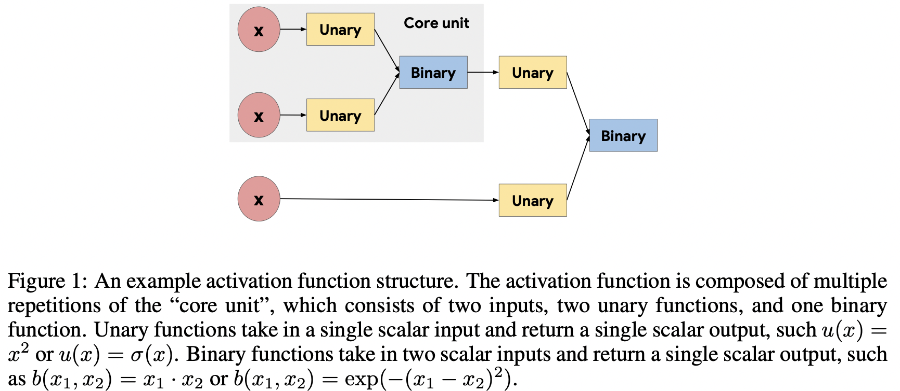
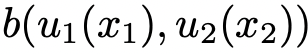
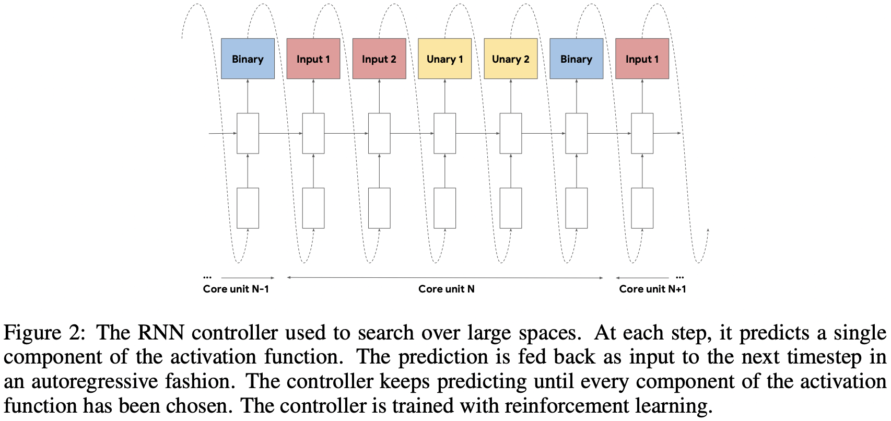
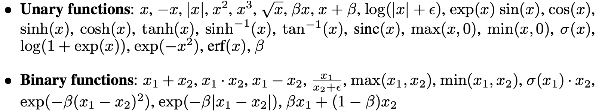
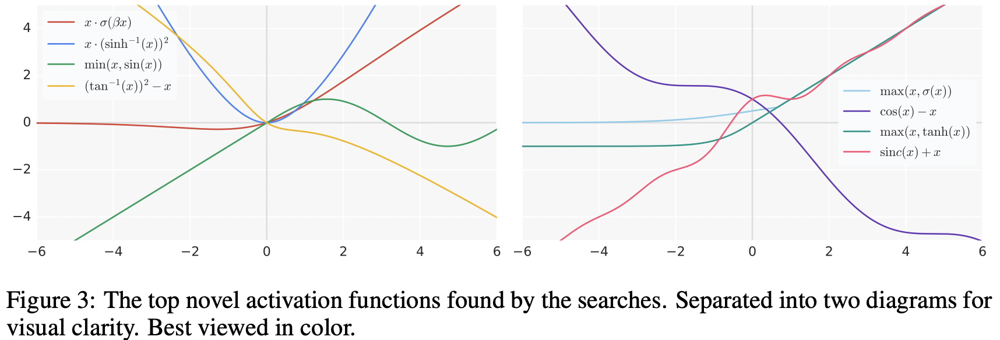
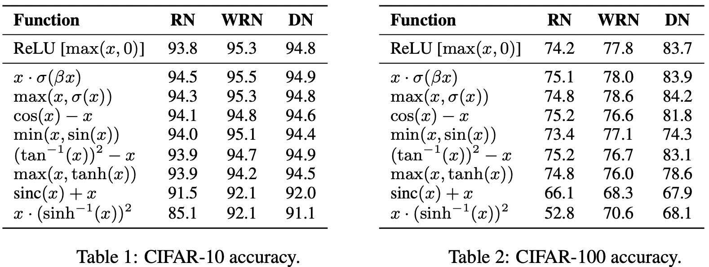

# SEARCHING FOR ACTIVATION FUNCTIONS

Prajit Ramachandran, Barret Zoph, Quoc V. Le(Google Brain)

## ABSTRACT

딥러닝 네트워크에서 어떤 Activation 함수를 사용할 것인가를 선택하는 문제는 훈련이나 훈련이 끝나고 작업의 성능에 크게 영향을 끼친다. 그동안 널리 쓰여왔던 함수는 Rectified Linear Unit이다. ReLU를 기반으로 나온 여러 연구들이 ReLU를 대체할만한 Activation 함수를 제안했으나 성능이 들쭉날쭉해서 ReLU를 대체할 수 없었다. 이 논문에서 저자들은 자동화 탐색 알고리즘으로 새로운 Activation 함수를 찾고자 했다. Exhaustive 탐색과 강화 학습 기반의 탐색을 조합해서 사용해서 저자들은 여러 새로운 Activation 함수를 발견했다. 저자들은 여기서 성능이 제일 좋은 함수로 여러 검증을 통해서 이러한 탐색 방법의 효율성을 확인했다. 저자들의 실험 결과에 따르면 Swish는 여러 데이터셋에서, 깊은 모델에서도 ReLU보다 성능이 더 좋다고 한다. 

## INTRODUCTION

보통 딥러닝 네트워크에서는 선형 변환 후에 Activation 함수가 붙는다. Activation 함수는 깊은 신경망 네트워크의 훈련을 성공시키는데 중요한 역할을 했다. 현재 가장 널리 쓰이는 Activation 함수는 ReLU이다. ReLU를 사용하면 Sigmoid나 Tanh 계열 함수를 사용하는 것보다 네트워크를 최적화 시킬때 더 쉬워지는데 그 이유는 ReLU 함수의 입력 값이 양수이면 그래디언트가 네트워크를 따라 흘러갈 수 있기 때문이다. 

많은 연구들이 ReLU를 대체하기 위한 Activation 함수를 개발하기 위해서 수행되었지만 결과적으로 ReLU를 대체하지는 못했다. ReLU는 구현하기 간편하고, 무엇보다도 안정적이라고 한다. 다른 함수들은 모델이나 데이터셋에 따라 성능 개선이 일정하지 않다. 

사람이 직접 디자인해서 Activation 함수를 찾는 것보다 자동화된 탐색 기법을 이용하여 찾는 것이 효율적이라는 것이 밝혀졌다. 예를 들어서 강화 학습 기반의 탐색으로 반복적으로 사용이 가능한 컨볼루션 Cell를 찾아내서 ImageNet Classification을 수행한 결과 사람이 직접 디자인한 모델보다 성능이 더 좋았다.

이 연구에서 저자들은 자동화된 탐색 기법을 이용하여 새로운 Activation 함수를 찾고자 했다. 저자들은 스칼라 값을 입력으로 받고 스칼라 값을 출력하는 함수를 찾기로 했다. 왜냐하면 스칼라 함수를 찾으면 네트워크 아키텍처를 변경할 필요 없이 ReLU를 대체할 수 있기 때문이다. 저자들은 여기에 Exhaustive 탐색과 강화 학습 기반의 탐색의 조합하여 사용했다. 저자들은 탐색 기법으로 스칼라 Activation 함수를 찾는 것의 효율성을 입증하기 위해서 가장 성능이 좋은 함수로 검증을 실시했다. Swish는 다음과 같다. 

여기서 β는 상수일수도 있고 학습이 가능한 파라미터일수도 있다. 

## METHODS

탐색 기법을 활용하려면 유효한 Activation 함수들이 만들어지도록 탐색 공간을 잘 디자인해야 한다. 탐색 공간을 디자인하는데 중요한 문제는 탐색 공간의 크기와 표현력 사이의 균형을 잘 잡는 것이다. 탐색 공간이 지나치게 제약되어 있으면 새로운 Activation 함수를 만들어내기 어렵고 탐색 공간이 지나치게 크면 효율적으로 탐색하기 어렵다. 두 기준 사이의 균형을 위해서 저자들은 다음의 Optimizer 탐색 공간 연구에 영감을 받아 탐색 공간을 디자인 했다. 

- Irwan Bello, Barret Zoph, Vijay Vasudevan, and Quoc V Le. Neural optimizer search with reinforcement learning. In *International Conference on Machine Learning*, pp. 459–468, 2017.

위 연구에서는 Activation 함수를 만들기 위해서 Unary나 Binary 함수를 사용했다. 

그림1과 같이 Activation 함수는 Core unit을 반복적으로 구성해서 구축한다. 형태는 다음과 같다.

Core unit은 두 개의 스칼라 값을 입력으로 받고 각 입력 값을 독립적으로 Unary 함수에 집어넣은 뒤에 각 Unary 함수의 출력(스칼라)을 결합한다. 저자들의 목적은 스칼라를 스칼라로 변환시키는 Activation 함수를 찾는것이기 때문에 Unary 함수의 입력은 계층의 Preactivation이나 Binary 함수의 출력으로 제한된다. 

주어진 탐색 공간에서 탐색 알고리즘의 목적은 Unary와 Binary 함수를 효율적으로 선택하는 방법을 찾는 것이다. 탐색 알고리즘의 선택은 탐색 공간의 크기에 달려있다. 탐색 공간이 작아서 예를 들어 하나의 Core unit만 사용할때는 전체 탐색 공간의 후보를 열거하는게 가능하다. Core unit을 여러번 반복해서 구축하면 탐색 공간은 기하급수적으로 커지고 Exhaustive 탐색이 불가능해진다. 

큰 탐색 공간에 대해서 저자들은 Figure 2와 같이 RNN controller를 사용했다. 

 

각 Timestep에서 Controller는 Activation 함수의 부분 부분을 하나씩 예측한다. 예측 값은 다음 Timestep때 Controller에게 다시 주입되고 이 과정은 Activation의 모든 부분이 예측될때까지 반복된다. 그리고 최종 예측된 String이 Activation 함수를 구축하는데 사용된다. 

한 번 탐색 알고리즘에 의해서 Activation 함수가 생성되면 Child network(후보 옵션을 고려한 상대적으로 작은 네트워크)가 이 함수를 적용해서 특정 Task에 맞게 훈련된다. 훈련 후에 Child network의 검증 정확도가 기록되고 탐색 알고리즘을 업데이트 하기위해서 사용된다. Exhaustive 탐색의 경우 검증 정확도 순으로 정렬했을때 최고의 성능을 보인 Activation 함수가 유지된다. RNN controller의 경우 Controller는 강화 학습으로, 검증 정확도를 최대화하는 방향으로 훈련된다. 이렇게 되면 Controller는 높은 검증 정확도를 보이는 Activation 함수를 만들어 내게 된다. 

하나의 Activation 함수를 평가하는 것에는 Child network를 훈련시키는 것이 필요하기 때문에 탐색은 계산적으로 부담이 될 수밖에 없다. 탐색 과정을 구축하는데 필요한 Wall clock time을 줄이기 위해서 분산 훈련 환경이 각 Child network를 병렬적으로 훈련시키기 위해서 적용된다. 이 환경에서 탐색 알고리즘은 한 배치의 후보 Activation 함수를 제안한다(각 후보는 Queue에 삽입된다). 각 Machine은 Activation 함수를 Queue에서 꺼내서 Child network를 훈련시키고 해당 Activation 함수에 대한 검증 정확도를 계산한다. 검증 정확도가 모두 집계되고 탐색 알고리즘을 업데이트하는데 사용된다. 

## SEARCH FINDINGS

저자들은 모든 탐색에 대해서 ResNet-20을 Child network 아키텍처로 해서 CIFAR-10 데이터셋으로 10K 스텝동안 훈련시켰다. 이런 제한적인 실험 환경이 실제로는 잘 맞지 않을 수 있는데 왜냐하면 가장 성능이 좋게 나온 Activation 함수가 작은 네트워크에서만 성능이 좋을 수 있기 때문이다. 그러나 저자들은 후속 실험에서, 발견된 많은 Activation 함수들이 더 큰 모델에서도 성능이 나쁘지 않다는 것을 확인했다. RNN controller는 Policy Proximal Optimization으로 훈련시켰다. 이때 성능의 변동성을 줄이기 위한 Baseline으로 Reward의 지수 이동평균을 사용했다. Activation 함수를 만들때 고려한 Unary, Binary 함수는 다음과 같다. 

β는 훈련 가능한 채널 당 부여하는 파라미터이고 σ는 Sigmoid 함수이다. 각 탐색 공간은 Activation 함수를 구축하기 위해 사용되는 Core unit의 갯수를 다르게 하고 탐색 알고리즘에서 가능한 Unary, Binary 함수를 다양하게 해서 만들어진다. 

Figure 3는 탐색에 의해서 찾은 성능이 좋은 새로운 Activation 함수를 보여준다. 저자들은 탐색에서는 다뤄지지 않은 몇가지 주목할만한 경향을 표시해놨다. 

- 복잡한 Activation 함수는 단순한 것보다 일관되게 성능이 안 놓은데 저자들이 추축하길 최적화 하기 어렵기 때문이라고 한다. 가장 성능이 좋은 함수는 1개 내지 2개의 Core unit으로 표현된다.
- 성능이 좋은 함수들의 공통점은 계층에서의 출력인 Preactivation x를 최종 Binary 함수의 입력으로 넣는것이다(b(x, g(x))). ReLU도 이런 구조를 띄는데 b(x1, x2) = max(x1, x2), g(x) = 0인 구조이다. 
- 탐색을 수행했더니 주기성을 가지는 함수를(Sin, Cos) 활용하는 Activation 함수를 찾아냈다. 가장 흔하게 주기성 함수를 사용하는 방식은 Preactivation x(혹은 선형적으로 Scaled된 x)를 더하거나 빼는 방식이었다. 
- 나눗셈을 쓰는 함수는 성능이 안 좋은 경향이 있는데 그 이유는 분모가 거의 0일때 출력값이 폭발하기 때문이다. 나눗셈은 Cosh(x)와 같이 분모가 0에서 멀어지거나, 분자가 0으로 접근할때 분모도 0으로 접근해서 출력 값이 1로 다가가는 경우에만 성능이 좋았다. 

Activation 함수는 작은 네트워크를 통해서 성능을 확인했기 때문에 큰 모델에서는 결과가 달라질수도 있다. 저자들은 각 아키텍처에서 Activation 함수를 사용했을때 성능이 좋은지를 확인하기 위해서 크기가 큰 3개의 모델에서 추가적인 실험을 수행했다. 이 3개의 모델에서 ReLU 함수를 각 Activation 함수로 바꿨다. 그 밖의 하이퍼파라미터는 동일하게 했고 5 번의 실험 결과의 Median을 계산했다. 

위의 결과가 저자들이 의도한대로 유의미하다고 하더라도 저자들은 실제 데이터셋에서도 좋은 성능을 낼 수 있을지 의문이었다. 저자들은 그래서 Swish 함수로 실험을 수행했다. 
