# Searching for MobileNetV3

Andrew Howard, Mark Sandler, Grace Chu, Liang-Chieh Chen, Bo Chen (Google AI), Mingxing Tan (Google Brain), Weijun Wang, Yukun Zhu (Google AI), Ruoming Pang, Vijay Vasudevan, Quoc V. Le (Google Brain), Hartwig Adam (Google AI)

## Abstract

이 연구에서 저자들은 Complementary 탐색 기술과 참신한 아키텍처 디자인을 조합해서 새로운 MobileNet 모델을 설계하고자 했다. MobileNetV3는 NetAdapt 알고리즘에 의해 보충되는 하드웨어 인식 NAS에 의해서 모바일 CPU에 맞게 조정되었고 그동안 없었던 아키텍처 디자인을 통해 상당히 개선되었다고 한다. 저자들의 고민은 어떻게 (사람이 하는 것이 아니고) 자동으로 탐색을 하는 알고리즘과 네트워크 디자인을 잘 조합해서, Complementary 접근 방식을 활용해서 좋은 성능을 낼 것인가 하는 데에서 시작했다. 저자들은 그래서 두 가지 버전의 MobileNet 모델을 만들었다. MobileNetV3-Large와 MobileNetV3-Small인데 모델 적용 사례가 리소스를 많이 사용할 수 있는가 없는 가에 따라 각각을 사용한다고 한다. 이 모델들은 Object Detection, Semantic Segmentation 등의 수행하고자 하는 작업에 많게 적용된다. Semantic segmentation(혹은 Dense pixel prediction)의 경우, 저자들은 새로우면서 효율적인 Segmentation decorder인 Lite Reduced Atrous Spatial Pyramid Pooling(LR-ASPP)을 제안했다. 

## Introduction

신경망 기반의 모델이 점차 많이 쓰이면서 데스크탑을 통해 서버와 통신하는 구조가 아닌 모바일을 통해서 언제 어디서든 사용할 수 있는 환경으로 바뀌고 있다. 그러면서 높은 정확도와 낮은 지연율이 중요해지고 연산량을 줄여서 배터리 수명을 늘리는게 중요해졌다. 저자들은 두 가지 버전의 MobileNet 모델을 설계해서 이런 환경에서 좋은 성능을 보이게 하는 것이 목표였다. 이 목표를 이루기 위해서 자동화된 탐색 알고리즘과 아키텍처에서의 진보를 어떻게 결합하여 효율적인 모델을 구축할 것인가를 고민했다. 모바일 환경에서 정확도와 지연율의 Trade off를 최적화하는 컴퓨터 비전 아키텍처를 개발하기 위해서 저자들은 다음 개념을 도입했다. 

- Complementary 탐색 기술
- 모바일 환경에서 실제적으로 활용 가능한 새로운 버전의 비선형성 함수들
- 새로운 네트워크 디자인
- 새로운 Segmentation decoder

## Related Work

이 연구와 관련 있는 여러 선행 연구들은 본문 참고. 

## Efficient Mobile Building Blocks

MobileNetV1은 컨볼루션 대신 Depthwise separable 컨볼루션을 도입했다. Depthwise separable 컨볼루션 Spatial filtering과 Feature generation 매커니즘을 분리했다. 그래서 두 개의 계층으로 나눠지는데 하나는 Spatial filtering을 위한 가벼운 Depthwise 컨볼루션, 다른 하나는 Feature generation을 위한 무거운 1x1 Pointwise 컨볼루션이다. 

MobileNetV2에서는 Linear bottleneck과 Inverted residual 구조를 도입했다. 이는 어떤 문제의 저 랭크(저차원 공간)의 특성을 이용하여 보다 효율적인 계층 구조를 만들기 위함이다. 이 구조는 아래 Figure 3와 같이 1x1 확장 컨볼루션 뒤에 Depthwise 컨볼루션 그리고 1x1 Project 계층이 이어지는 구조이다. 

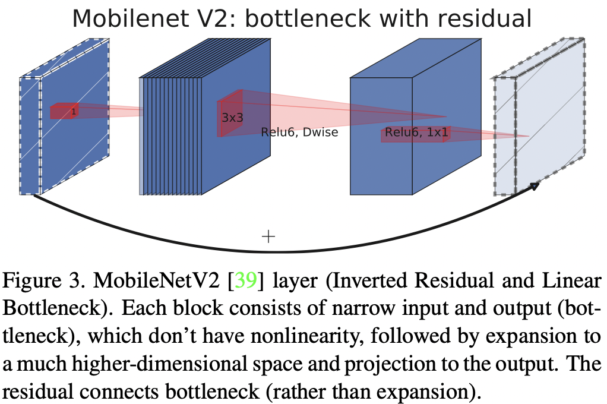

입력과 출력 계층은 만약에 같은 채널 수를 가지면 Residual connection으로 연결된다. 이 구조는 입력과 출력에서의 압축된 정보는 유지한다. 그러면서 Channel transformation 당 비선형 출력의 표현력을 증가시키기 위해서 내부적으로 Feature space를 고차원으로 확장한다. 

MNasNet은 Bottleneck 구조 안에 Squeeze and excitation에 근거한 가벼운 Attention 모듈을 도입하여 MobileNetV2 구조로 구축되었다. 알아둘 것은 Squeeze and excitation 모듈이 ResNet 기반 모듈과는 다른 위치에서 통합된다는 것이다. 이 모듈은 Expansion에서 Depthwise filter들 뒤에 위치한다. 그래서 가장 큰 특징 정보에 Attention이 적용되게 하기 위함이다(아래 Figure 4).

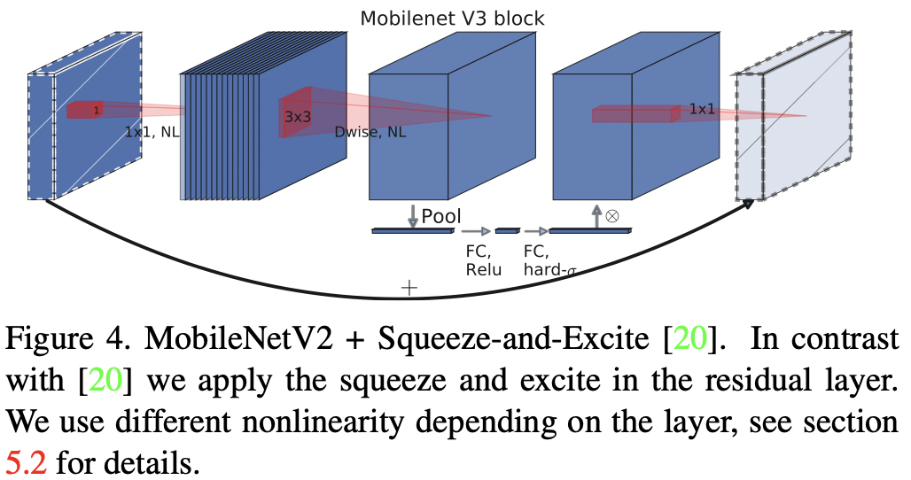

## Network Search

MobileNetV3에서 저자들은 Platform-aware NAS를 사용했다. 이는 네트워크의 각 블럭을 최적화해서 전체적으로 최적화된 네트워크를 찾기 위함이다. 그리고 나서 계층마다 최적의 필터 수를 찾기 위해서 NetAdapt 알고리즘을 사용했다. 이런 기술(NetAdapt)은 보완적이며, 주어진 하드웨어 플랫폼에서 최적의 모델을 찾기 위해서 다른 주요 개념들과 결합되어 사용될 수 있다. 

### Platform-Aware NAS for Block-wise Search

저자들은 플랫폼에 따라 신경망 아키텍처를 선택하는 접근 방식을 채택했다. 저자들은 RNN 기반의 컨트롤러를 사용하고 분해한 구조적 탐색 공간 개념을 적용했다. 저자들은 MnasNet-A1 모델을 저자들의 Large mobile model의 기초로 사용하고 NetAdapt을 적용한 뒤에 다른 최적화를 진행했다. 

그런데 저자들은 원래 연구에서의 Reward가 Small mobile 모델을 최적화 하는데는 맞지 않다는 것을 확인했다. 구체적으로 원래의 연구에서는 아래의 다목적 Reward 함수로 Pareto-optimal 솔루션에 가깝게 만드는 전략을 취한다. 

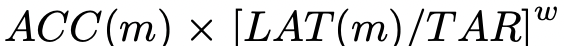

즉 대상 Latency TAR에 근거해서 각 모델 m에 대하여 Accuracy ACC(m)과 Latency LAT(m)의 균형점을 찾는 것이다. 저자들이 관측했을때 작은 모델에서는 지연율과 정확도가 급격하게 변경되었다. 그래서 저자들은 원래의 Weight factor(w = -0.07)보다 더 작은 factor w = -0.15를 적용해서 각 Latency들에 따라 크게 변하는 정확도에 어느정도 커버쳐줄 필요가 있었다. 이 Weight factor로 저자들은 처음에 시작할 모델을 찾기 위한 아키텍처 탐색을 처음부터 시작했고 NetAdapt를 적용하고 다른 최적화를 수행하여 최종적으로 MobileNetV3-Small 모델을 찾아냈다. 

### NetAdapt for Layer-wise Search

저자들이 아키텍처 탐색에 도입한 두번째 기법은 NetAdapt이다. 이 기법은 주요 기법은 아니지만 Platform-aware NAS를 보좌하는 기법이다. 이 기법은 계층들 통채로 적용되기 보다는 각 계층마다 별개로 Fine-tuning을 수행한다. 요약하자면 다음과 같은 과정으로 작업이 수행된다. 

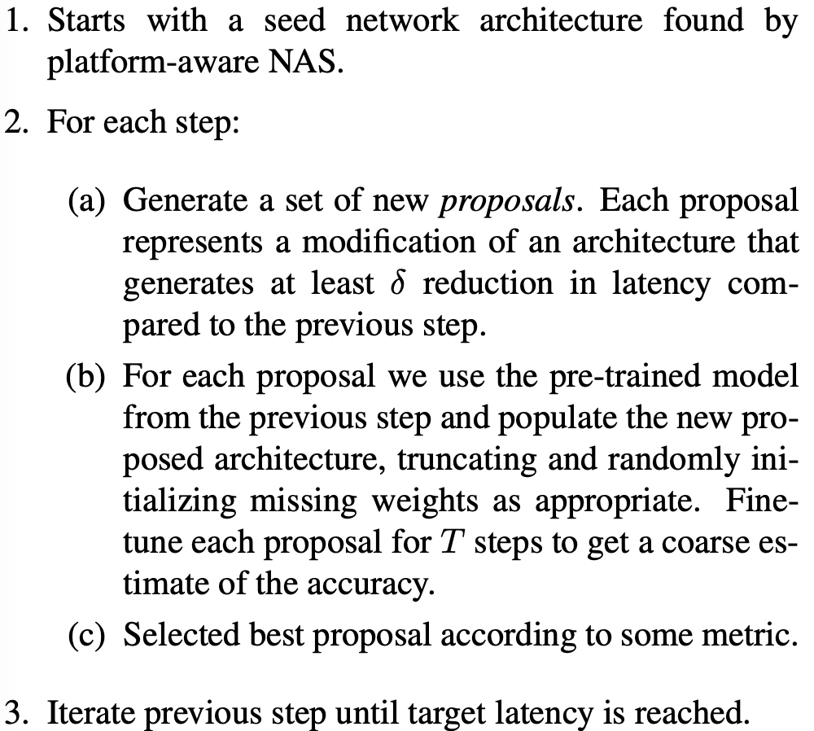

원래 연구에서 (c)의 Metric은 정확도의 변화 정도를 최소화 하게 하는 것이 목적이었다. 저자들은 이 알고리즘을 수정해서 지연율과 정확도의 변화 정도 사이의 비율을 최소화 하는 것으로 바꿨다. 이 Metric은 각 NetAdapt step 중에 생성되는 모든 Proposal에 해당하며 저자들은 여기서 다음을 최소화하는 Proposal을 고른다. 

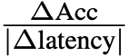

지연율의 변화량은 2(a)를 만족해야한다. 이렇게 한 이유는 직관적으로 각 Proposal들이 연관되어 있지 않기 때문에 정확도와 지연율의 Trade-off의 Curve의 경사를 최소화 하는 Proposal을(즉 변화량이 최소화하는) 고르기 위함이다. 

이 과정은 Latency가 대상 Latency에 도달할때까지 반복된다. 그리고 나서 찾은 새로운 아키텍처를 처음부터 훈련시킨다. 저자들은 MobileNetV2에 대해서 원래의 연구에서 사용했던 Proposal generator를 그대로 사용했다. 구체적으로 저자들은 다음과 같은 두 개의 종류의 Proposal을 사용했다. 

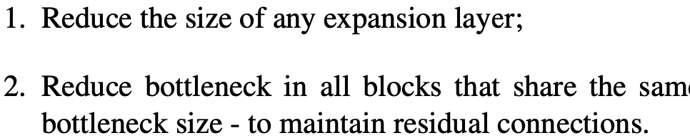

저자들의 실험에서 T=10000였고 초기의 Proposal들의 Fine-tuning의 정확도를 증가시키는 것을 찾았다. 저자들은 위의 2(a)의 값을 다음과 같이 설정했다. 여기서 L은 초기 모델의 Latency이다. 

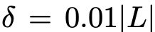

## Network Improvements

저자들은 Network Search 말고도 모델을 개선하는 여러 기법을 적용했다. 예를 들어서 네트워크의 시작과 끝에 있는 연산량이 많은 계층을 다시 디자인한다던가 새로운 비선형 함수(h-swish)를 도입한다던가 

### Redesigning  Expensive Layers

저자들은 아키텍처 탐색을 통해서 찾은 아키텍처의 첫부분과 끝부분의 계층들이 연산량이 많아서 이 부분에서 속도가 느려지는 것을 관찰했다. 그래서 정확도는 유지하면서 이 부분에서 지연율을 감소시키는 방법을 고안했다.

첫번째로 저자들은 마지막 몇 개의 계층이 최종 Feature를 만들어 내기 위해서 상호작용 하는 방식을 고쳤다. MobileNetV2 기반의 현재 모델의 Inverted bottleneck 구조에서는 1x1 컨볼루션을 최종 계층으로 사용하여 고차원 Feature 공간으로 Feature의 차원을 확장한다. 이 계층은 최종 예측을 위해서 풍부한 표현력을 증가시킨다는 면에서 중요한데 이점 때문에 추가적인 Cost가 발생한다. 

지연율을 줄이고 높은 차원의 특징을 보존하기 위해서 저자들은 이 계층을 최종 Average pooling 계층 뒤로 옮겼다. 그래서 이 최종 Feature들은 7x7 spatial 해상도로 대신에 1x1 spatial 해상도로 계산된다. 이런 디자인으로 촉발되는 결과는 Feature들의 연산량과 지연율이 거의 제로에 가깝다는 것이다. 

이런 Feature 생성 계층의 Cost가 경감되고나면 전의 Bottleneck projection 계층이 연산량을 줄일 필요가 없어진다. 그래서 전 Bottleneck 구조에서 Projection과 Filtering 계층을 제거해서 더 연산적 복잡성을 줄일수 있게 된다. 원본과 마지막 단계를 최적화한 구조는 아래 Figure 5와 같다.

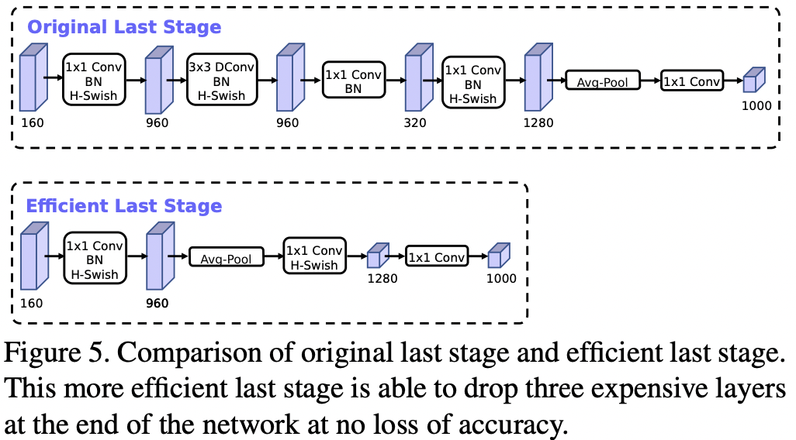

또다른 연산량이 많은 계층은 필터들의 초기 셋이다. 모바일 모델은 32개의 필터의 3x3 컨볼루션을 사용해서 Edge detection을 위한 초기 필터 셋을 구축하는 경향이 있다. 그런데 이런 필터들은 종종 거의 서로 거의 비슷한 경우가 많다. 젖자들은 실험을 통해서 필터의 숫자를 줄이고 다른 비선형 함수를 사용해서 이런 중복성을 줄이고자 했다. 저자들은 hard-swish 비선형 함수가 다른 비선형 함수와 같이 테스트 했을때 성능이 잘 나오는 것을 확인해서 이 계층들에는 hard-swish 비선형 함수를 사용하기로 했다. 저자들이 말하길 ReLU나 swish를 사용하고 32개의 필터를 사용했을때만큼의 정확도를 hard-swish를 사용해서 16개의 필터만 사용했을때 경우가 유지한다고 한다. 그러면서 2 밀리초의 시간과 10 백만의 mAdds를 줄인다고 한다. 

### Nonlinearities

ReLU의 대용으로 swish가 여러 연구에서 도입되었다. 이는 이 연구들에서 네트워크의 정확도를 개선하는 결과를 가져왔다. 이 비선형함수는 다음과 같이 정의한다. 

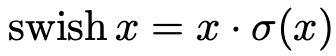

문제는 이 비선형함수가 정확도는 증가시키긴 하지만 동시에 모바일 환경 같은 임베디드 환경에서, Sigmoid 함수의 Cost가 크기 때문에 결과적으로 연산상의 Cost를 무시할 수 없는 수준이 된다. 저자들은 이를 두 가지 관점으로 다뤘다.

- 저자들은 Sigmoid 함수를 다음과 같은 개념으로 대체했다. 

  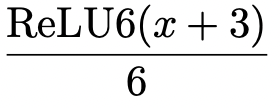

  약간의 차이는 저자들은 ReLU6를 사용했다는 것이다. 이를 통해서 hard swish는 다음과 같이 정의된다.

  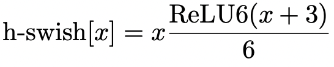

  아래 Figure 6는 Sigmoid와 swish 비선형함수의 Soft, Hard 버전을 비교한 것을 보여준다.

  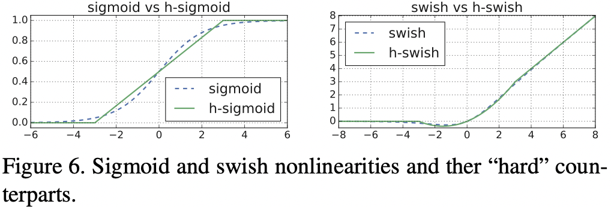

  저자들은 이 비교에서 상수는 최대한 결과가 단순하게 나올수 있도록 선택했고 원래의 Smooth 버전과 결과가 잘 매치되도록 선택했다. 이 실험에서 저자들은 Hard 버전들이 정확도면에서는 거의 차이가 없고 오히려 배치의 관점에서 여러 이점을 보임을 관측했다. 우선 ReLU6의 최적화된 구현체의 경우 사실상 거의 모든 Software와 Hardware 프레임워크에서 이용가능하다고 한다. 그리고 양자화된 모드에서는 근사화된 Sigmoid의 서로 다른 구현에 의해서 유발되는 잠재적인 Numerical precision 손실을 제거한다고 한다. 마지막으로 실제적으로 h-swish는 piece-wise 함수로서 구현되어 Memory에 접근하는 횟수를 줄이므로 지연율 Cost를 상당히 줄일 수 있다고 한다. 

- 네트워크에 적용한 비선형함수의 Cost는 네트워크가 깊어질수록 감소하는데 그 이유는 각 계층의 Activation memory가 보통 해상도가 줄어들때마다 반이 되기 때문이다. 저자들은 우연히 swish의 대부분의 이점을 깊은 계층에서만 swish를 사용하는 경우를 통해 발견하게 되었다. 그러므로 저자들은 h-swish를 모델의 반쪽(깊은쪽)에만 적용했다고 한다. Table 1과 2에 정확한 레이아웃을 나타냈다. 

  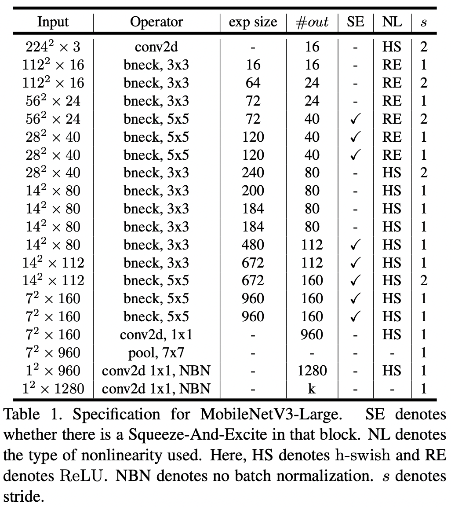

  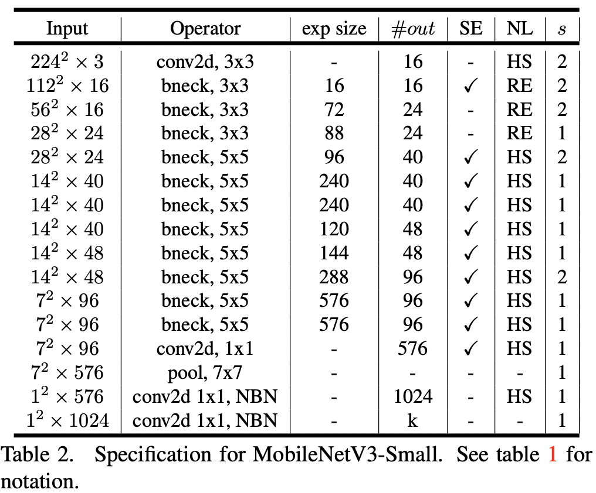

### Large squeeze-and-excite

Mnasnet에서 Squeeze-and-exicite bottleneck의 크기는 컨볼루션 Bottleneck의 크기에 상대적이다. 저자들은 이것들을 Expansion 계층의 채널 수의 1/4가 되도록 고정시켰다. 저자들은 이렇게 했을때 정확도가 올라가는 것을 확인했고 약간 파라미터 수가 증가하긴 하지만 Latency cost는 거의 차이가 없음을 확인했다.

### MobileNetV3 Definitions

MobileNetV3는 두 가지 모델로 정의된다. MobileNetV3-Large와 Small인데 이들은 각각 높은, 낮은 리소스 사용 환경을 대상으로 한다. 이 모델들은 Platform-aware NAS와 NetAdapt을 적용해서 만들어진다. Table 1과 Table 2가 이 모델들의 구체적인 구조를 나타낸다. 

## Experiments

저자들은 저자들의 모델을 Classification, Detection, Segmentation에 대해서 실험을 했다. 그리고 여러 디자인 옵션의 효율성을 검토하기 위해서 Ablation study를 진행했다. 

### Classification

Classification을 할때는 ImageNet 데이터셋을 사용했고 정확도와 지연율 그리고 연산수(MAdds)와 같은 리소스 사용 척도를 비교했다. 

#### Training  setup

훈련 간의 설정은 본문 참고. 

#### Measurement setup

지연율을 측정하기 위해서 저자들은 Google Pixel 폰을 사용했고 모든 네트워크를 TFLite Benchmark Toold을 통해서 작동시켰다. 모든 측정에는 단일 스레드의 코어를 사용했고 멀티 코어의 추론 시간은 측정하지 않았다. 왜냐하면 저자들이 생각하기에 모바일 애플리케이션에 멀티 코어 환경은 그다지 실용적이지 않기 때문이다. Figure 9에 최적화된 h-swish의 영향에 대해 나타나 있다. 

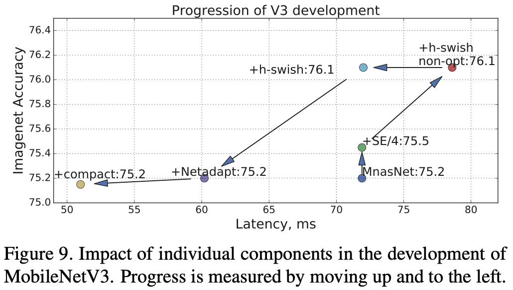

### Results

Table 3는 각기 다른 Pixel 폰에 대한 소수점 연산의 성능을 나타내고 Table 4는 최적화를 포함한 결과를 나타낸다. 

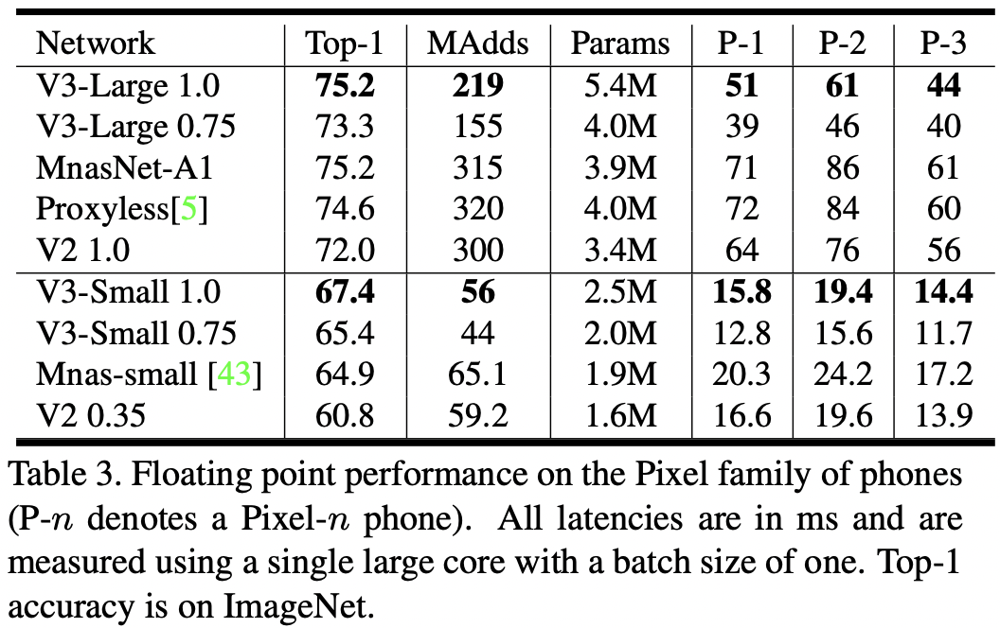

Figure 7에는 MobileNetV3의 Multiplier와 Resolution의 Trade-off의 성능을 보여준다. 

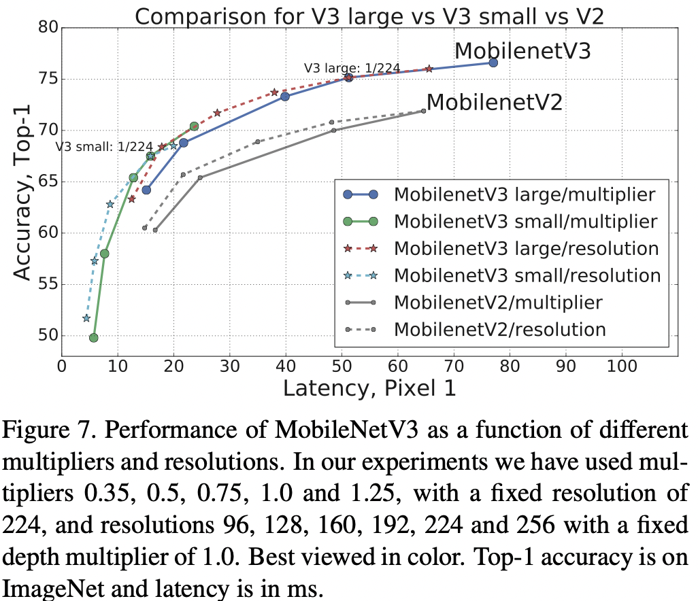

#### Ablation study

##### Impact of non-linearities

Table 5에는 h-swish 비선형함수를 어디에 삽입할 것인가에 대한 연구와 최적화된 구현을 통해서 개선했을때의 성능에 대한 연구에 대한 결과를 보여준다. 

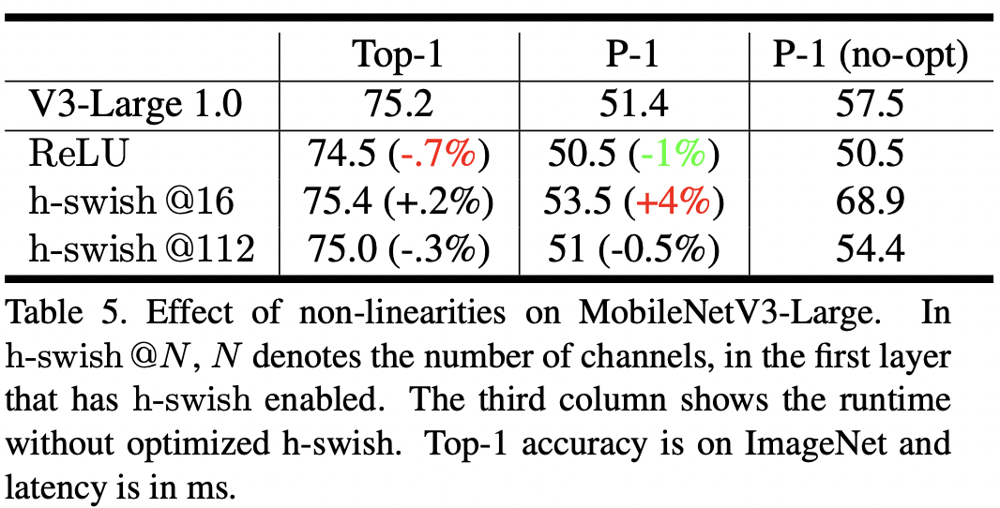

Figure 8은 가장 효율적인 비선형함수와 네트워크 너비와 관련된 성능을 보여준다. 

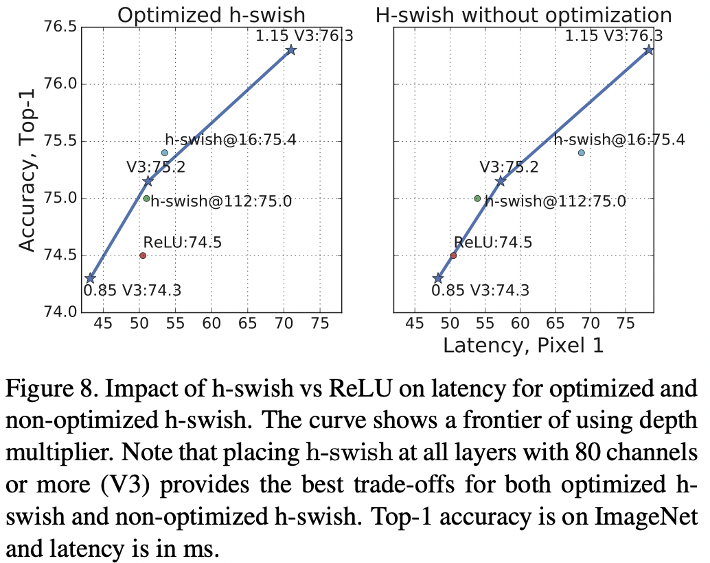

##### Imact of other components

Figure 9는 그 밖의 다른 요소를 도입했을때 지연율/정확도의 곡선이 어떻게 이동하는지를 보여준다. 

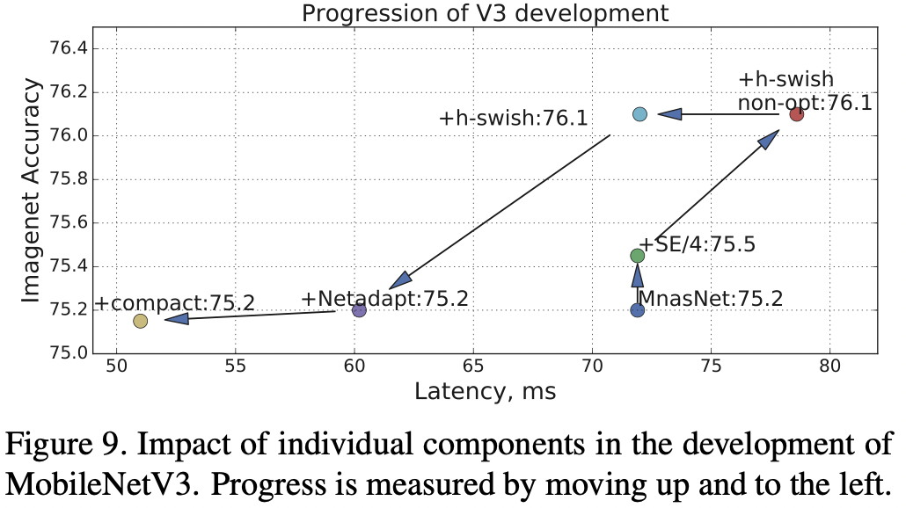

### Detection

저자들은 SSDLite에서 Backbone 네트워크를 MobileNetV3로 바꾸고 COCO 데이터셋으로 다른 네트워크와 성능을 비교했다. 

MobileNetV2를 따라서 저자들은 SSDLite의 첫번째 계층을 Backbone의 마지막 계층에 연결했다(Stride 차이 16) 그리고 두번째 계층 또한 Backbone의 마지막 계층에 연결했다(Stride 차이 32). 저자들은 이 두 Feature extractor 계층을 각각 C4, C5라고 했다. MobileNetV3-Large에 대해서는 C4는 13번째 Bottleneck 블럭의 Expansion 계층이고 MobileNetV3-Small에 대해서는 9번째 Bottleneck 블럭의 Expansion 계층이다. 두 네트워크에 대해서 C5는 Pooling 바로 직전의 계층이다. 

저자들은 추가적으로 C4, C5 사이의 Feature 계층들의 채널 수를 2배 정도 줄였다. 왜냐하면 MobileNetV3의 마지막 몇 개의 계층은 1000개의 출력에 대해 맞춰져 있기 때문에 이를 COCO의 90개의 클래스에 Trasfer하면 중복이 될 거시다. 

COCO test 셋에 대한 실험 결과는 Table 6에 나와 있다. 

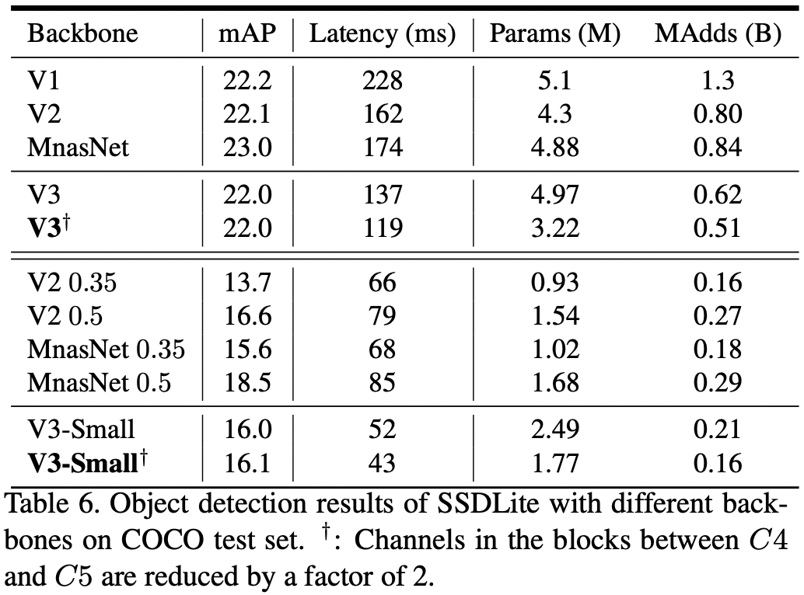

### Semantic Segmentation

저자들은 MobileNetV2와 MobileNetV3를 모바일에서의 Semantic segmentation의 Backbone 네트워크로 사용했다. 추가적으로 저자들은 두 가지 Segmentation head의 성느응ㄹ 비교했다. 하나는 R-ASPP라고 하는 것인데(Reduced design of the Atrous Spatial Pyramid Pooling module) 1x1 컨볼루션 하나와 GAP 하나로 이루어진 두 가지 브랜치만 있는 모듈이다. 여기서는 저자들은 Lite R-ASPP(LR-ASPP)라고 하는 경량의 Segmentation을 제안했다 (Figure 10).

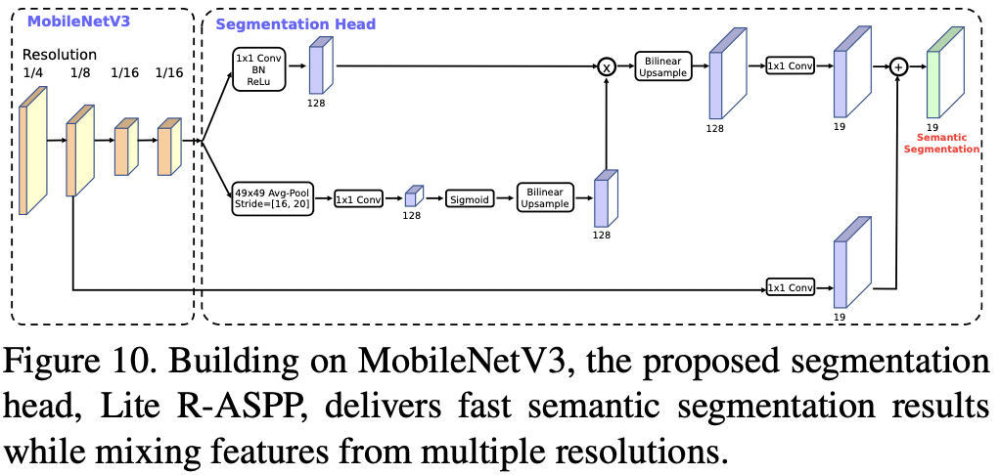 

Lite R-ASPP에서는 GAP를 Squeeze-and-Excitation 모듈과 비슷하게 배치했는데 연산량을 줄이기 위해서 큰 Stride로 설정한 큰 커널 크기를 가진 Pooling 계층과 오직 하나의 1x1 컨볼루션만 모듈에 있다. 저자들은 Dense한 Feature를 추출하기 위해서 MobileNetV3의 마지막 블럭에 Atrous 컨볼루션을 적용했고 낮은 단계 Feature에서부터 Skip connection을 추가해서 좀 더 자세한 정보를 얻고자 했다. 

저자들은 Cityscapes 데이터셋에 mIOU 척도로 실험을 수행했다(이때 잘 Annotation된 데이터셋만 사용). 모든 모델은 ImageNet에 미리 훈련시키지 않고 처음부터 훈련되었으며 단일 스케일 입력 데이터에 대해서 평가되었다. Object detection에서와 유사하게 저자들이 관측하길 큰 성능 상의 하락 없이 네트워크의 Backbone에서 마지막 블럭의 채널 숫자를 2배 줄일 수 있었다. 저자들이 추측하길 이는 Backbone의 1000개의 클래스에 대해 맞춰져 있었고 Cityscapes에는 19개의 클래스만 있기 때문에 Backbone의 몇 채널에서 중복이 있었기 때문이라고 한다. 

Table 7에 검증셋 결과가 나와 있다. 

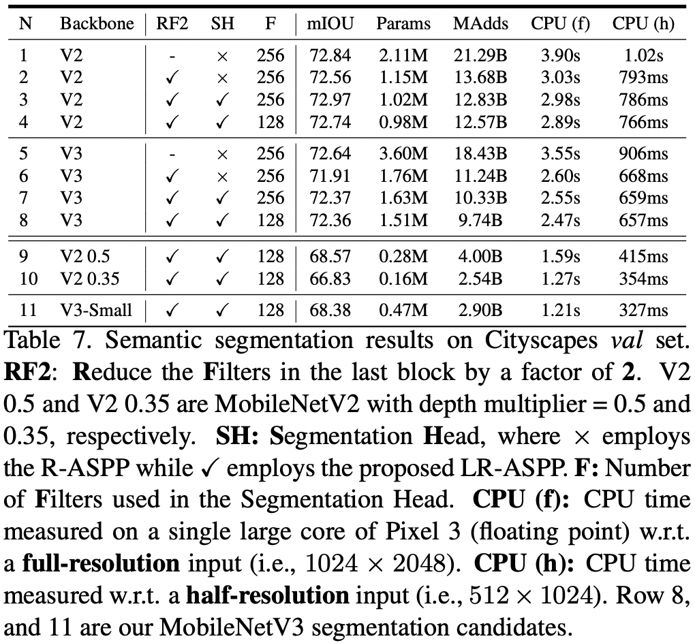

Table 8은 테스트 셋 결과가 나와 있다. 

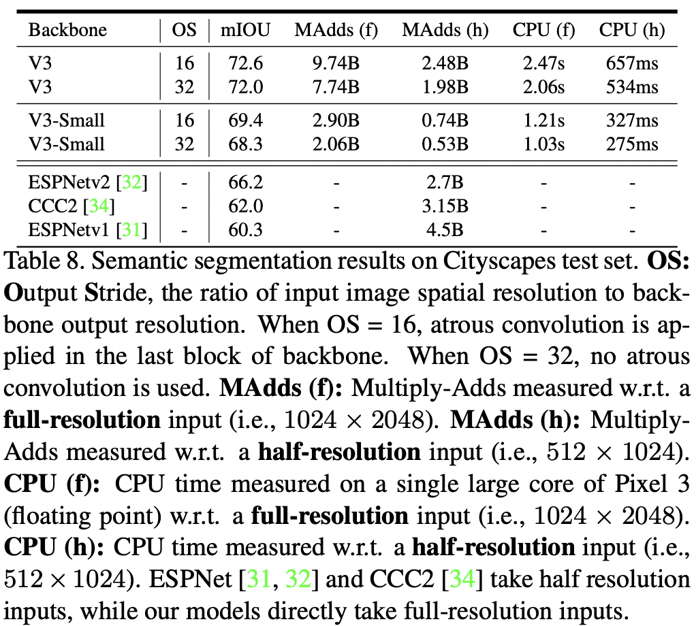

## Conclusions and future work

이 논문에서 저자들은 MobileNetV3 Large와 Small이라는 네트워크를 제안했다. 저자들은 여러 NAS 알고리즘과 네트워크 디자인 기법들을 적용해 다음 세대의 모바일 모델을 만들어냈다고 자부한다. 또 swish 같은 비선형함수를 어떻게 저자들의 모델에 맞게 조정하는가 그리고 Squeeeze and excite 모듈을 어떻게 최적화 과정 중에 적용할 것인가를 보여줬다. 또 경량의 Segmetation decoder인 LR-ASPP를 제안했다. 

## Appendix. Performance table for different resolutions and multipliers

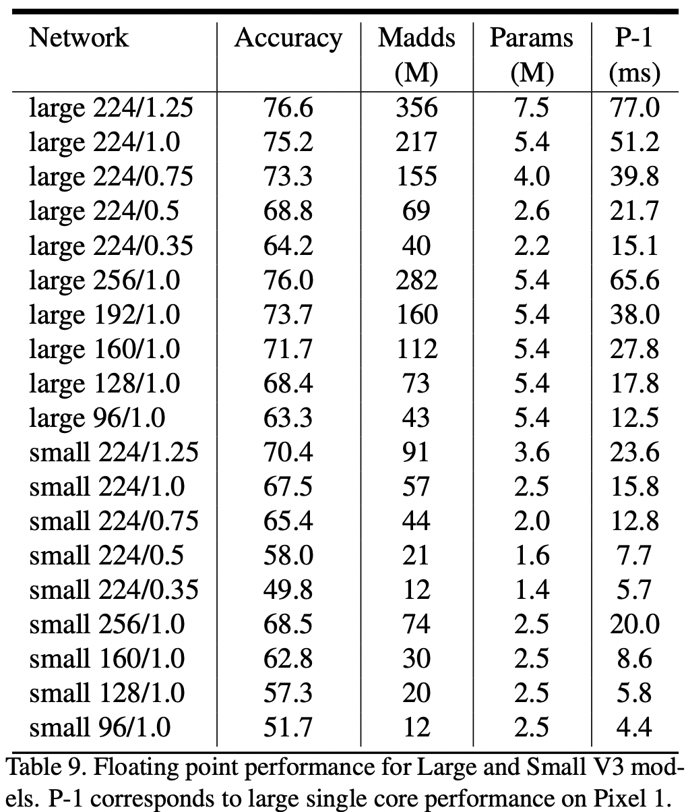

