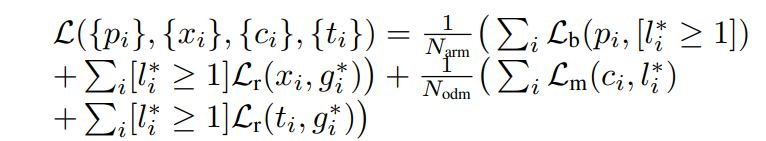
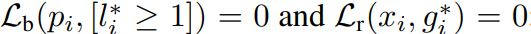
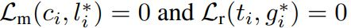

# Single-Shot Refinement Neural Network for Object Detection

Shifeng Zhang(CBSR & NLPR, Institute of Automation, Chinese Academy of Sciences, University of Chinese Academy of Sciences)

Longyin Wen(GE Global Research)

Xiao Bian(GE Global Research)

Zhen Lei(CBSR & NLPR, Institute of Automation, Chinese Academy of Sciences, University of Chinese Academy of Sciences)

Stan Z. Li(CBSR & NLPR, Institute of Automation, Chinese Academy of Sciences, University of Chinese Academy of Sciences)

## Abstract

보통 Two-stage 알고리즘들은 정확도에 강점이 있고 One-stage 알고리즘들은 효율성에 강점이 있다. 저자들은 RefineDet이라고 하는 Single-shot Detector로 정확도는 Two-stage 알고리즘보다 높으면서 One-stage의 효율성을 유지하고자 했다. 이 Detector는 네트워크 내에 두 개의 모듈로 구성되어 있다. 

- Anchor refinement module: Classifier가 답을 찾는 Search space의 크기를 줄이기 위해서 Negative anchor를 필터링하는 것. 다음 모듈이 학습을 시작할때 좀 더 잘 학습할수 있도록 위치와 크기가 어느정도 조정된 Anchor들을 제공하는 것.
- Object detection module: 위의 모듈에서 Anchor를 받아서 Bounding box regression과 Multi-class prediction을 수행한다. 

동시에 저자들은 Transfer connection block이라는 개념을 디자인해서 ARM에서 작업을 수행하고 난 뒤의 Feature들을 ODM으로 Transfer한다. Multi-task Loss function을 정의해서 전체 네트워크가 End-to-End로 학습이 가능하게 했다. 

[코드 이용](https://github.com/sfzhang15/RefineDet)

## Introduction

Object Detection Detector들은 크게 두 가지 범주로 나눌 수 있다.

- Two-stage approach: Sparse set of candidate object 박스가 먼저 생성되고 나서 그 박스들로 분류 혹은 박스 회귀가 수행된다.
- One-stage approach: 이미지 내 객체를 탐지할때 위치, 크기, 종횡비를 고려해서 Regular and dense한 샘플링으로 탐지한다. 계산적으로 효율성이 높다는 장점이 있지만(Two-stage와 다르게 Unified된 네트워크가 End-to-End로 학습됨) Two-stage에 비해서 탐지 정확도가 떨어진다는 단점이 있다. 그 이유 중 하나는 클래스 불균형 문제이다. 

클래스 불균형 문제를 해결하기 위한 시도로 객체 탐지 공간의 크기를 줄이기 위해서 컨볼루션 특징 맵에 Objectness prior constraint를 사용하기도 했고 Standard cross entropy loss를, Hard example에 더 초점을 두고 잘 분류된 example에는 비중을 줄이도록 재정의하는 방법도 있었다. 또 False positive의 수를 줄이도록 하는 Max-out labeling mechanism을 고안하기도 했다. 

저자들이 보기에 Faster R-CNN, R-FCN, FPN과 같은 Two-stage 방법들이 One-stage 방법들과 비교했을때 갖는 장점은 다음과 같다.

- 클래스 불균형 문제를 해결하기 위해서 Sampling heuristics를 Two-stage structure로 구현한다(RPN 같이 Region proposal을 생성하는 네트워크가 훈련이 가능해서 더 좋은 Region을 생성할 수 있다).
- 두 단계로 Box의 파라미터를 조정한다.
- 두 단계로 객체를 분류한다(예를 들어서 Faster R-CNN에서는 먼저 객체가 있는지 없는지를 판단하고 있다면 Multi-class classification을 수행한다).

RefineDet은 두 접근법의 장점은 계승하고 단점은 극복하기 위해서 만들어졌다. RefineDet에는 One-stage의 방법의 네트워크 내에 서로 연결되어 있는 두 가지 모듈이 있다. 하나는 Anchor refinement module(ARM)이고 다른 하나는 Object detection module(ODM)이다. 

ARM은 Classifier가 탐색하는 공간을 줄이기 위해서 Negative anchor를 없애고 ODM에게 더 나은 초기 상자를 제공하기 위해서 Anchor의 사이즈와 위치를 정밀하게 조정하는 역할을 한다. ODM은 정제된 Anchor들을 받아서 객체에 대한 Detection을 수행한다. 위의 그림 1을 보면 두 모듈은 Two-stage 구조를 모방했기 때문에 더 정확하게 탐지를 수행하면서도 One-stage 접근법의 높은 효율성을 지닌다. 거기다 Transfer connection block이라는 개념을 고안해서 ARM에서 학습한 특징들을 Transfer learning과 같이 ODM에서 사용할 수 있도록 했다. Multi-task loss 함수를 정의해서 전체 네트워크가 End-to-End로 학습이 가능하게 했다. 

## Related Work

### Classical Object Detectors

초기의 Object detection 방법들은 슬라이딩 윈도우 방식이 많았다. 이때 객체를 찾기 위해서 Hand-crafted 특징과 Dense image grid 위에 분류기를 적용했다. 

- P. A. Viola and M. J. Jones. Rapid object detection using a boosted cascade of simple features. In CVPR, pages 511–518, 2001 : Haar feature, AdaBoost
- P. F. Felzenszwalb, R. B. Girshick, D. A. McAllester, and D. Ramanan. Object detection with discriminatively trained part-based models. TPAMI, 32(9):1627–1645, 2010 : DPM

그러나 Deep convolutional 네트워크가 널리 쓰이기 시작하면서 Object Detection 분야는 CNN 기반의 방법들이 대세를 이루기 시작했다.

### Two-Stage Approach

Two-stage 방식은 크기 두 부분으로 나눠진다. 첫 번째는 ROI를 생성하는 부분(Selective search, EdgeBoxes, DeepMask, RPN)이고 두 번째 부분은 컨볼루션 네트워크로 정확한 객체의 위치를 찾고 해당 위치에 있는 객체의 클래스를 예측하는 부분이다. Two-stage 방식은 여러 Challenge에서 우수한 성능을 보인 바 있다. 그 이후로 Architecture diagram, Training strategy, Contextual reasoning, Multiple layers exploiting이라는 개념에서 이 방법들을 개선하려는 시도가 있었다. 

### One-Stage Approach

- OverFeat: P. Sermanet, D. Eigen, X. Zhang, M. Mathieu, R. Fergus, and Y. LeCun. Overfeat: Integrated recognition, localization and detection using convolutional networks. In ICLR, 2014
- YOLO: 
  - J. Redmon, S. K. Divvala, R. B. Girshick, and A. Farhadi. You only look once: Unified, real-time object detection. In CVPR, pages 779–788, 2016
  - J. Redmon and A. Farhadi. YOLO9000: better, faster, stronger. CoRR, abs/1612.08242, 2016
- SSD:
  - W. Liu, D. Anguelov, D. Erhan, C. Szegedy, S. E. Reed, C. Fu, and A. C. Berg. SSD: single shot multibox detector. In ECCV, pages 21–37, 2016
  - C. Fu, W. Liu, A. Ranga, A. Tyagi, and A. C. Berg. DSSD : Deconvolutional single shot detector. CoRR, abs/1701.06659, 2017
  - Z. Shen, Z. Liu, J. Li, Y. Jiang, Y. Chen, and X. Xue. DSOD: learning deeply supervised object detectors from scratch. In ICCV, 2017

이외에도 다음과 같이 One-stage 방식의 고질적인 문제인 클래스 불균형 문제를 해결하려는 시도가 있었다.

- T. Kong, F. Sun, A. Yao, H. Liu, M. Lu, and Y. Chen. RON: reverse connection with objectness prior networks for object detection. In CVPR, 2017
- T. Lin, P. Goyal, R. B. Girshick, K. He, and P. Dollar. Focal loss for dense object detection. In ICCV, 2017
- S. Zhang, X. Zhu, Z. Lei, H. Shi, X. Wang, and S. Z. Li. S^3 FD: Single shot scale-invariant face detector. In ICCV, 2017

## Network Architecture

전체적인 네트워크 아키텍처는 위의 Figure 1과 같다. SSD와 유사하게 RefineDet은, 고정된 숫자의 바운딩 박스와 그 박스에 각기 다른 객체의 클래스의 존재여부를 가리키는 Score를 예측하는 순전파 형식의 CNN으로 이루어져 있다. 최종 결과를 도출하기 위해서 NMS를 수행한다. 전체 네트워크는 상호 연결되어 있는 두 가지 모듈로 구성되어 있다. ARM과 ODM의 목적, 역할에 대해서는 서론을 참조. ARM은 Pretrianed된 분류 모델에서 분류를 수행하는 계층을 제거하고 추가적인 구조를 덧붙여 구축한다. ODM은 TCB의 출력 값(ARM에서의 Lateral connection+Top-down으로 획득한 학습된 Feature)으로 구축되었으며 ARM에서 제공하는 Refined anchor box를 GT에 맞게 조정한 좌표값의 Offset과 객체의 클래스에 대한 Score를 예측하는 예측 계층이 뒤에 붙는다. 정리하자면 주요 요소는 다음과 같다.

- Transfer connection block(TCB): ARM에서의 Feature를 ODM에 맞게 변경하는 역할.
- Object detection module(ODM): ARM에서 제공한 박스를 객체의 GT에 맞게 regression을 수행하고 객체의 클래스를 예측하는 역할. 
- Anchor refinement module(ARM): Negative anchor를 필터링하고 이미 잘 분류된 Easy example들을 걸러내서 클래스 불균형 문제를 해결하는 역할.

### Transfer Connection Block

TCB에서는 arm에 있는 Feature들을 ODM의 구조에 맞게 변경하는 역할을 한다. TCB는 ARM에서 Anchor와 연관되어 있는 Feature map에서만 연산을 수행한다. 또 High-level에 있는 Feature들을 전송될 Feature에 더해서 탐지 성능을 개선할 수 있도록 한다. 이때 차원을 맞추기 위해서 High-level Feature들에 Deconvolution 연산을 수행해서 연산별 덧셈을 수행한다. 그리고나서 컨볼루션 계층을 하나 추가해서 특징의 변별력을 높인다. TCB의 구조는 아래 Figure 2와 같다.

### Two-Step Cascaded Regression

당시의 One-stage 알고리즘들은 객체의 크기와 위치를 찾아내기 위해서 다양한 크기의 Feature map에서 Regression을 수행하는 One-step regression을 수행했다. 그런데 이때의 탐지 성능이 좋지 않을 때가 있는데 특히 작은 크기의 객체에 대해서 그렇다.  그래서 저자들은 Two-step cascaded regression 전략을 고안하게 되었다. ARM으로 Anchor를 조정해서 ODM에서 더 나은 초기 Anchor로 Detection을 수행할 수 있게 한 것이다. 구체적으로 Feature map을 격자 형태로 나눠서 n개의 Anchor 박스들을 각 셀과 연관 시킨다. 그렇기 때문에 각 Anchor의 초기 값은 각 셀과 연관이 있다. 기존과 같이 초기의 Anchor에서의 Offset 값으로 Refined된 Anchor의 값을 예측한다. 그리고 각 객체가 해당 Anchor에 존재하는지 여부를 가리키는 두 가지 Confidence score를 예측한다. 그렇게 각 Feature map 셀에서 n개의 Refined anchor 박스들을 만들어낸다. 

그리고 나서 Refined anchor 박스들을 ODM의, Refined anchor 박스를 만들어낸 Feature map과 같은 위치에 해당하는, Feature map으로 보낸다. ODM에서 예측하는 값은 각 Refined anchor와 관련된 4개의 Offset(중심 좌표, 너비, 높이)과 c개의 클래스 Score이다.  이렇게 Refined된 Anchor로 초기화하여 ODM에서 탐지를 수행하면 특히 작은 물체를 탐지하는데 성능이 좋다. 

### Negative Anchor Filtering

저자들은 이미 잘 분류된 Negative anchor들을 제거해서 클래스 불균형 문제를 해결하기 위해서 Negative anchor filtering 매커니즘을 고안해냈다. 만약에 훈련 과정 중에 Negative confidence가 Threshold보다 크다면 ODM에서는 그 박스를 버린다. 

## Training and Inference

### Data Augmentation

저자들은 원본 이미지를 임의로 확장시키거나 크롭하는 기법을 적용했고 아래에서 소개된 Random photometric distortion을 적용했다.

- A. G. Howard. Some improvements on deep convolutional neural network based image classification. CoRR, abs/1312.5402, 2013

또 훈련 샘플들을 Flipping 해서 새로운 이미지를 만들기도 했다. 

### Backbone Network

ILSVRC CLS-LOC 데이터셋으로 미리 훈련시킨 VGG-16, ResNet-101 네트워크를 Backbone 네트워크로 사용했다. DeepLab-LargeFOV와 유사하게 VGG-16의 fc6, fc7을, 파라미터 Subsampling을 통해서 conv_fc6, conv_fc7으로 변경했다. conv4_3과 conv_5_3이 다른 계층과 비교해서 Feature scale이 다르기 때문에 L2 normalization으로 feature norm을 scale했다. 그리고나서 scale을 역전파 동안 학습한다. 그러면서 High-level information을 Capture하고 다양한 크기에서 Object detection을 수행하기 위해서 두 개의 Convolution 계층(conv6_1, conv6_2)을 Truncated VGG-16의 끝 부분에 더했다. Truncated ResNet-101의 끝에는 Residual block(res6)을 더했다. 

### Anchors Design and Matching

다양한 크기의 Object를 다루기 위해서, 각기 다른 크기의 Anchor와 관련 있는, VGG-16, ResNet101의 Stride 8, 16, 32, 64 픽셀, 네 개의 Feature layer를 선택했다. 각 계층은 특정 Scale과 3개의 종횡비(예를 들어 0.5, 1.0, 2.0)의 Anchor를 담당했다.  훈련 시에는 Jaccard overlap에 근거해서 Anchor와 GT box를 매칭했고 그에 따라 End-to-End 방식으로 학습시켰다. 구체적으로 각 GT 박스와 가장 Overlap이 높은 Anchor를 매칭하고 나서 각 Anchor 박스 중에서 GT box와 Overlap이 0.5 이상이면 그 Anchor에 해당 GT box를 매칭시켰다. 

### Hard Negative Mining

Anchor 박스를 매칭하는 단계 후에, ARM 모듈에서 Easy negative anchor들이 걸려져도 ODM에서의 대부분의 Anchor들은 Negative이다. SSD에서와 같이 저자들은 이런 클래스 불균형 문제를 경감시키고자 Hard negative mining을 적용했다.  그래서 Loss value가 높은 순서대로 정렬해서 Positive와 Negative의 비가 1:3이 되도록 Negative example을 뽑았다. 

### Loss Function

RefineDet에서 Loss는 두 부분으로 나눠진다. ARM에서는 각 Anchor에 Binary class label(객체인지 아닌지)를 할당하고 위치와 크기를 동시에 Regression 한다. 그러고 나서 Negative confidence score가 Threshold보다 작은 Refined된 Anchor들을 ODM으로 보내 Detection을 수행한다. Loss function은 아래와 같이 정의한다. 

i는 Mini-batch에서 Anchor의 Index이고 l^*_i는 Anchor i의 GT class label이다. g^\*\_i는 Anchore i의 GT box의 Location과 크기이다.  p_i와 x_i는 ARM에서 Anchor i가 객체일 확률과 Refined된 좌표이다. c_i, t_i는 ODM에서 바운딩 박스의 좌표와 객체일 확률이다. N_arm과 N_ODM은 ARM과 ODM에서 Positive anchor의 숫자이다. L_b는 Binary classification loss로 객체인지 아닌지에 대한 Cross-entropy/log loss이다. L_m은 Multi-class classification loss로 여러 클래스에 대한 Softmax loss이다. Faster R-CNN에서와 같이 L_r에서는 Smooth L1를 사용했다. [l^\*\_i >= 1]는 Anchor가 Negative가 아닐때 1보다 크거나 같고 Negative이면 0이다. 그렇기 때문에 [l^\*\_i >= 1]L\_r은 Anchor가 Negative일때 Regression loss를 무시한다는 뜻이다. 마냑에 N_arm = 0이라면 다음이 성립한다. 

N_odm = 0이라면 다음이 성립한다. 

### Optimization

저자들은 RefineDet-VGG16에서는 conv6_1, conv_6_2의 두 개의 컨볼루션 계층을 추가할때 xavier method로 파라미터를 랜덤으로 초기화 했고 RefineDet-ResNet101에서는 res6의 Residual block을 추가할 떄는 평균 0, 표준 편차 0.01의 가우시안 분포를 따르는 랜덤 값으로 파라미터를 초기화 했다. Default 배치 사이즈는 32로 설정했고 전체 네트워크는 0.9 momentum, 0.0005 weight decay의 SGD으로 Fine-tuning했다. 초기 Learning rate는 10^-3으로 설정했다. 

### Inference

추론 시에는 ARM이 먼저 Negative confidence score가 Threshold보다 높은 Anchor를 필터링한다. 그리고 나서 남아있는 Anchor들의 크기와 위치를 조정한다. 그런 다음 ODM은 조정된 Anchor를 바아서 이미지당 400개의 높은 Confident detection을 출력한다. 마지막으로 클래스당 0.45을 jaccard overlap의 NMS을 수행해서  Top 200개의 High confident detection을 탐지 결과로 출력한다. 

