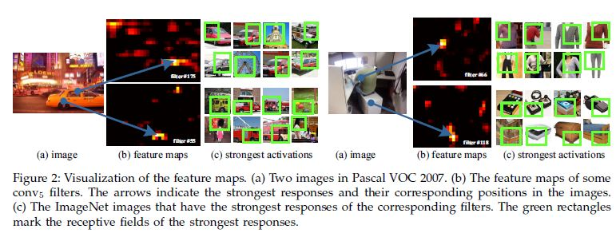
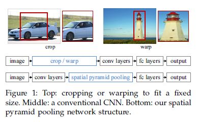
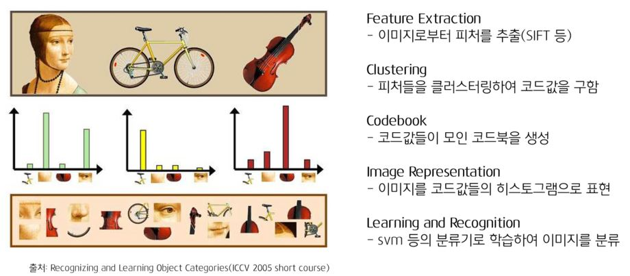
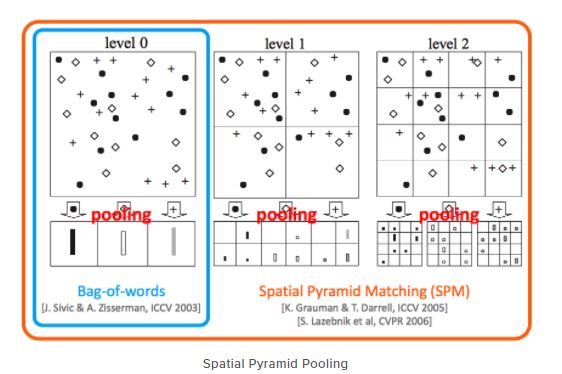

# Spatial Pyramid Pooling in Deep Convolutional Networks for Visual Recognition

Kaiming He, Jian Sun(Microsoft Research), Xiangyu Zhang(Xi’an Jiaotong University), Shaoqing Ren(University of Science and Technology of China)

## Abstract

CNN 네트워크에서는 완전 연결 계층이 고정된 크기의 입력 값을 받아야하기 때문에 CNN의 입력 값이 미리 정해져 있을 수 밖에 없다. 그렇기 때문에 입력 값의 크기에 인식의 정확도가 영향을 받을 수 밖에 없는데 저자들이 제안하는 이 방법은 입력 값에 상관 없이 동일한 크기의 특징 벡터를 완전 연결 계층에 제공할 수 있게 된다. 또, 입력 데이터를 강제로 정해진 크기에 맞추다보면 이미지 내의 객체에 대한 왜곡이 발생할 수 있는데 저자들의 방법은 그럴 필요가 없기 때문에 이미지의 크기나 객체 왜곡에 강인하다. 이는 네트워크의 백본 아카텍처에 상관 없이 이 방법을 적용했을때가 그렇지 않을때보다 성능이 좋아지게 되는 결과를 가져온다. 실제로 이 방법론으로 분류 과제에서 Fine-tuning 없이 단일의 이미지(크롭하지 않은)를 입력으로 하는 네트워크로 좋은 성적을 거두었다. 

객체 탐지 과제에서도 R-CNN에서는 입력 이미지의 각 지역 마다 CNN에서의 작업을 수행해야 하지만 저자들의 방법에서는 전체 이미지에서 한 번만 CNN에서의 작업을 수행하기 때문에 속도가 빠를 수 밖에 없다. 

## Introduction

Introduction에는 이 논문의 거진 대부분의 핵심 내용이 담겨 있다. Abstract에서 CNN 네트워크는 고정된 입력 값을 가질 수 밖에 없다고 했는데 그 이유를 좀 더 구체적으로 살펴보면 다음과 같다. CNN은 크게 이미지의 특징을 추출해내는 컨볼루션 계층과 추출된 특징으로 원하는 결과를 얻기 위한 Scoring을 하는 완전 연결 계층으로 이루어져 있다. 그런데 이 완전 연결 계층의 입력 크기는 고정되어야 한다(생각을 해보면 완전 연결 계층의 연산은 Flatten된 특징 벡터를 어떤 N차원의 벡터로 변환 시킨다. 이 과정에서 가중치 행렬은 입력 데이터의 차원 x 출력 데이터의 차원의 크기를 가지는데 입력 데이터의 차원이 달라져 버리면 이 선형 변환이 불가능해진다). 또, 컨볼루션 계층에서는 원하는 출력 데이터의 크기를 도출하기 위해서 Padding이나 Pooling 등의 연산이 가능하다. 따라서 이 완전 연결 계층 때문에 CNN 네트워크는 고정된 입력 크기를 가져야 하는 것이다.

(컨볼루션 계층의 연산 결과)

이를 해결하기 위해서 입력 이미지를 미리 정의된 크기로 자르거나 전체 이미지를 미리 정의된 크기로 바꾸는 연산을 거치게 되는데 이 과정에서 이미지 내 어떤 객체의 정보가 손실되거나 왜곡되는 부정적인 효과가 발생한다(위의 그림의 1, 2번 줄). 저자들이 제안한 방법에서는 CNN의 입력 사이즈가 고정될 필요가 없게 해서 Crop/Warp의 과정을 필요없게 하기 때문에 이런 부정적인 효과가 사라진다. 

Spatial pyramid pooling(Spatial pyramid matching)은 컴퓨터 비전 분야에서의 Bag-of-Words라고 볼 수 있다. 

[Cheon Wujin - Paper Review - Object Detection 3 (Spatial Pyramid Pooling in Deep Convolutional Networks for Visual Recognition)]( https://wujincheon.github.io/wujincheon.github.io/deep%20learning/2019/02/24/sppnet.html)

위의 과정을 아래와 같이 bin으로 나누어 연산을 수행할 수 있다.

[Lunit Tech Blog - R-CNNs Tutorial](https://blog.lunit.io/2017/06/01/r-cnns-tutorial/)

미리 만들어둔 코드 북에서 Level 0에서는 1x1 bin을 보고 특정 이미지 특징 코드가 각각 얼마씩 나타나는지 히스토그램으로 나타내고 level1에서는 특징 맵을 2x2 bin 구역으로 나누어 각 이미지 특징 코드들이 1번째 구역에서는 a만큼 나타나고 2번째 구역에서 b만큼 나타나고 하는 식으로 결과를 만들 수 있다. 이런 연산의 특징 덕분에, 이미지 내 객체에 대해 다양한 크기의 특징을 뽑아내어 완전 연결 계층에 전달하므로 네트워크의 성능이 크기에 영향을 덜 받도록 한다. 

이렇게 되면 입력 이미지의 크기에 크게 구애받지 않게 되므로 당연히 과적합 경향도 줄어들게 된다. 훈련시에는 1epoch에는 같은 모델로 180x180 이미지로 훈련하고 2epoch에서는 240x240 크기의 이미지로 훈련하는 방식으로 전체 epoch을 훈련한다. 또 이런 특징 덕분에 모델 아키텍처와 상관 없이 SPP를 적용했을 때가 그렇지 않을 때보다 성능이 더 좋다고 한다.  

객체 탐지에서 R-CNN이 약 2K개의 영역을 생성하고 각 영역에 대해서 CNN의 연산을 수행하는 것에 반해 SPP에서는 전체 사이즈의 이미지에 한번 CNN의 연산을 수행하고 마지막 컨볼루션 계층의 특징 맵에서 지역을 생성해서 SPP 연산을 수행하고 나온 출력으로 SVM 연산이나 바운딩 박스 회귀 연산을 수행하기 때문에 여러번 CNN 연산을 수행할 필요가 없으므로 R-CNN보다 전체적인 수행 시간이 훨씬 빠르다. 

