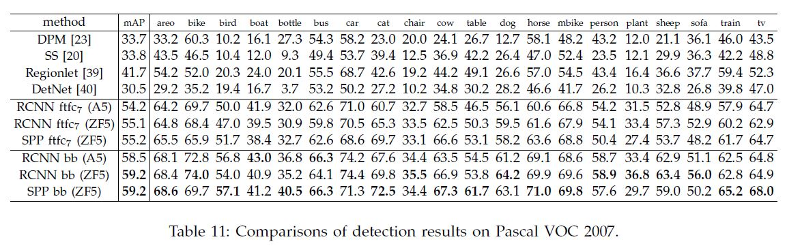

# Spatial Pyramid Pooling in Deep Convolutional Networks for Visual Recognition

Kaiming He, Jian Sun(Microsoft Research), Xiangyu Zhang(Xi’an Jiaotong University), Shaoqing Ren(University of Science and Technology of China)

## Abstract

CNN 네트워크에서는 완전 연결 계층이 고정된 크기의 입력 값을 받아야하기 때문에 CNN의 입력 값이 미리 정해져 있을 수 밖에 없다. 그렇기 때문에 입력 값의 크기에 인식의 정확도가 영향을 받을 수 밖에 없는데 저자들이 제안하는 이 방법은 입력 값에 상관 없이 동일한 크기의 특징 벡터를 완전 연결 계층에 제공할 수 있게 된다. 또, 입력 데이터를 강제로 정해진 크기에 맞추다보면 이미지 내의 객체에 대한 왜곡이 발생할 수 있는데 저자들의 방법은 그럴 필요가 없기 때문에 이미지의 크기나 객체 왜곡에 강인하다. 이는 네트워크의 백본 아카텍처에 상관 없이 이 방법을 적용했을때가 그렇지 않을때보다 성능이 좋아지게 되는 결과를 가져온다. 실제로 이 방법론으로 분류 과제에서 Fine-tuning 없이 단일의 이미지(크롭하지 않은)를 입력으로 하는 네트워크로 좋은 성적을 거두었다. 

객체 탐지 과제에서도 R-CNN에서는 입력 이미지의 각 지역 마다 CNN에서의 작업을 수행해야 하지만 저자들의 방법에서는 전체 이미지에서 한 번만 CNN에서의 작업을 수행하기 때문에 속도가 빠를 수 밖에 없다. 

## Introduction

Introduction에는 이 논문의 거진 대부분의 핵심 내용이 담겨 있다. Abstract에서 CNN 네트워크는 고정된 입력 값을 가질 수 밖에 없다고 했는데 그 이유를 좀 더 구체적으로 살펴보면 다음과 같다. CNN은 크게 이미지의 특징을 추출해내는 컨볼루션 계층과 추출된 특징으로 원하는 결과를 얻기 위한 Scoring을 하는 완전 연결 계층으로 이루어져 있다. 그런데 이 완전 연결 계층의 입력 크기는 고정되어야 한다(생각을 해보면 완전 연결 계층의 연산은 Flatten된 특징 벡터를 어떤 N차원의 벡터로 변환 시킨다. 이 과정에서 가중치 행렬은 입력 데이터의 차원 x 출력 데이터의 차원의 크기를 가지는데 입력 데이터의 차원이 달라져 버리면 이 선형 변환이 불가능해진다). 또, 컨볼루션 계층에서는 원하는 출력 데이터의 크기를 도출하기 위해서 Padding이나 Pooling 등의 연산이 가능하다. 따라서 이 완전 연결 계층 때문에 CNN 네트워크는 고정된 입력 크기를 가져야 하는 것이다.

이를 해결하기 위해서 입력 이미지를 미리 정의된 크기로 자르거나 전체 이미지를 미리 정의된 크기로 바꾸는 연산을 거치게 되는데 이 과정에서 이미지 내 어떤 객체의 정보가 손실되거나 왜곡되는 부정적인 효과가 발생한다(위의 그림의 1, 2번 줄). 저자들이 제안한 방법에서는 CNN의 입력 사이즈가 고정될 필요가 없게 해서 Crop/Warp의 과정을 필요없게 하기 때문에 이런 부정적인 효과가 사라진다. 

Spatial pyramid pooling(Spatial pyramid matching)은 컴퓨터 비전 분야에서의 Bag-of-Words라고 볼 수 있다. 

[Cheon Wujin - Paper Review - Object Detection 3 (Spatial Pyramid Pooling in Deep Convolutional Networks for Visual Recognition)]( https://wujincheon.github.io/wujincheon.github.io/deep%20learning/2019/02/24/sppnet.html)

위의 과정을 아래와 같이 bin으로 나누어 연산을 수행할 수 있다.

[Lunit Tech Blog - R-CNNs Tutorial](https://blog.lunit.io/2017/06/01/r-cnns-tutorial/)

미리 만들어둔 코드 북에서 Level 0에서는 1x1 bin을 보고 특정 이미지 특징 코드가 각각 얼마씩 나타나는지 히스토그램으로 나타내고 level1에서는 특징 맵을 2x2 bin 구역으로 나누어 각 이미지 특징 코드들이 1번째 구역에서는 a만큼 나타나고 2번째 구역에서 b만큼 나타나고 하는 식으로 결과를 만들 수 있다. 이런 연산의 특징 덕분에, 이미지 내 객체에 대해 다양한 크기의 특징을 뽑아내어 완전 연결 계층에 전달하므로 네트워크의 성능이 크기에 영향을 덜 받도록 한다. 

이렇게 되면 입력 이미지의 크기에 크게 구애받지 않게 되므로 당연히 과적합 경향도 줄어들게 된다. 훈련시에는 1epoch에는 같은 모델로 180x180 이미지로 훈련하고 2epoch에서는 240x240 크기의 이미지로 훈련하는 방식으로 전체 epoch을 훈련한다. 또 이런 특징 덕분에 모델 아키텍처와 상관 없이 SPP를 적용했을 때가 그렇지 않을 때보다 성능이 더 좋다고 한다.  

객체 탐지에서 R-CNN이 약 2K개의 영역을 생성하고 각 영역에 대해서 CNN의 연산을 수행하는 것에 반해 SPP에서는 전체 사이즈의 이미지에 한번 CNN의 연산을 수행하고 마지막 컨볼루션 계층의 특징 맵에서 지역을 생성해서 SPP 연산을 수행하고 나온 출력으로 SVM 연산이나 바운딩 박스 회귀 연산을 수행하기 때문에 여러번 CNN 연산을 수행할 필요가 없으므로 R-CNN보다 전체적인 수행 시간이 훨씬 빠르다. 

## Deep Networks with Spatial Pyramid Pooling

### Convolutional Layers and Feature Maps

컨볼루션 계층의 연산 결과. 컨불루션 연산의 결과인 특징 맵은 각 특징 맵이 강하게 반응하는 특정 특징 뿐만 아니라 이미지 공간 상에서의 위치 정보도 담고 있다. 또, 완전 연결 계층 등과 달리 입력 데이터의 크기가 고정될 필요가 없다. 

### The Spatial Pyramid Pooling Layer

컨볼루션 계층과 달리 SVM이나 Softmax를 수행하는 완전 연결 계층은 고정된 길이의 벡터가 필요한데, 이 벡터는 저자들이 말한대로 BoW 개념의 Local spatial bins를 통해 다양한 스케일에서 특징을 분석해서 이어붙인 형태로 도출될 수 있다. 특히 이 bins들은 Sliding window와 다르게 특징 맵 사이즈에 비례하여 크기가 결정되므로 필요한 개수가 입력 데이터의 사이즈와 무관하다. 위를 보면 마지막 컨볼루션 계층의 풀링 계층을 SPP로 대체한 것을 확인할 수 있다. 256은 특징 맵의 차원(개수)이고 256앞의 숫자들은 bins의 개수를 나타낸다(저자들은 Max pooling을 적용했다. 4x4크기의 필터를 가진 Max pooling 연산을 256개의 각 특징 맵에서 수행하므로 총 16x256차원의 벡터가 생성된다). 각 풀링별 결과는 Concatenate되어서 하나의 특징 벡터를 생성해낸다. 

[[Cheon Wujin - Paper Review - Object Detection 3 (Spatial Pyramid Pooling in Deep Convolutional Networks for Visual Recognition)\]( https://wujincheon.github.io/wujincheon.github.io/deep%20learning/2019/02/24/sppnet.html)]( https://wujincheon.github.io/wujincheon.github.io/deep%20learning/2019/02/24/sppnet.html)

(bins의 개수는 특징 맵의 크기에 비례한다고 했는데 위와 같이 특징맵의 크기에 따라 stride와 커널의 크기가 결정된다(후술). 예를 들어서 13x13 특징 맵에서 3x3의 9개의 bin을 생성하는 과정은 위와 같다. 이때 후술할 공식으로 커널의 크기가 5x5, stride 4가 결정된다.)

이렇게 다양한 크기의 bin으로 특징맵을 분석해 특징 벡터를 뽑아내게 되면 Finer한 정보와 Coarse한 정보를 추출하게 되므로 더 정확한 정보를 획득할 수 있게 된다. 특히 1x1 bin의 경우, Global pooling의 역할을 할 수 있다. 

### Training the Network

이론적으로는 어떤 입력 사이즈에 대해서도 모델이 훈련 가능하나 GPU를 이용하려면 입력 사이즈가 고정되어 있을 필요가 있다.

#### Single-size training

단일 크기의 이미지로 훈련하는 것을 구현하는 이유는 SPP에서의 Multi-level pooling 연산 작동 원리를 구현하기 위함이다. 여기서 구현한 방식을 확장하여 후술할 여러 크기의 이미지 훈련의 작동을 구현할 것이다. 마지막 컨볼루션 계층에서의 특징맵의 사이즈를 aXa라고 하고(예를 들어 13x13), bin의 갯수가 nXn이라고 할때(예를 들어 4x4 Max pooling) 윈도우 사이즈는 ceiling of a/n이고 stride는 floor of a/n이다. 

####  Multi-size training

여러 크기의 이미지로 모델을 훈련시키기 위해서 224x224의 이미지와 이 이미지를 180x180로 크기를 줄인 이미지를 사용했다. 180이나 240 네트워크를 같은 모델을 훈련시킨다. 훈련 방식은 한 이미지 사이즈를 한 에폭동안 훈련하고 다른 에폭은 다른 사이즈를 훈련시키는 방식으로 로테이션으로 훈련시킨다. 저자들은 성능이 수렴하는 시간이 단일 크기의 이미지로 훈련할 때 걸린 시간과 유사하다는 것을 확인했다. 훈련 시에는 이런식으로 이미지 사이즈를 나눠서 훈련시켰지만 테스트 시에는 훈련시킨 사이즈 범위 내에서 임의의 사이즈로 테스트 한다. 

## SPP-Net for Image Classification 

### Experiments on ImageNet 2012 Classification

#### Baseline Network Architectures

저자들이 SPP-Net의 효과를 검증하기 위해서 4개의  네트워크 아키텍처에 대해서 ImageNet 2012  Classification 과제로 실험을 진행했다. 이때 사용한 4개의 네트워크는 다음과 같다. 

#### Multi-level Pooling Improves Accuracy

기본 네트워크의 마지막 풀링 계층을 SPP-Layer로 바꾸고 실험을 했을 때 결과는 아래와 같다. 여기서는 {6x6, 3x3, 2,x2, 1x1}의 총 50개의 bins를 사용했다. 저자들이 주장하기를 이런 Multi-level의 Pooling이 정확도 향상에 도움이 된다고 하는데 이는 단순히 모델 파라미터가 더 많기 때문이 아니고 이미지 내의 객체의 변형이나 위치 변경에 영향을 덜 받기 때문이라고 한다(원본 이미지에 대해서 Standard 10 view - 센터, 4개의 코너, 위아래, 양옆을 크롭하여 사용). 이를 뒷받침하는 증거로 {4x4, 3x3, 2x2,x 1x1}의 30bins를 가지는 네트워크는 오히려 SPP가 없는 네트워크보다 파라미터 숫자가 적지만 50 bins일때 결과와 유사하다고 한다. 

#### Multi-size Training Improves Accuracy

Table 2에 의하면 Single-size로 훈련시킬때보다 Multi-size로 훈련시킬때가 성능이 더 좋다. Standard 10 view에 대한 예측값을 뽑아냈고,  180과 224 사이즈에서 균등하게 샘플을 뽑아서 실험을 진행했다. 

#### Full-image Representations Improves Accuracy

저자들은 모델을 훈련시킬때 정사각형 모양의 이미지로 훈련시켰더라도, 모델이 다른 종횡비의 이미지의 특징도 잘 뽑아낼 수 있다고 한다. Table2와 Table3를 보면 Multi-size로 훈련시킨 모델이 Single-size로 훈련시킨 모델보다 성능이 좋긴하나 Single-size로 훈련시킨 모델도 나름의 장점을 가지고 있다고 한다. 

- 여러 View (이미지를 크롭한)와 관계 없이 전체 이미지와 이를 Flipping시킨 이미지를, 모델을 훈련시킬때 추가하면 성능이 더 좋아진다. 
- 전체 이미지를 사용하는 것은 마찬가지로 전체 이미지를 사용하는 전통적인 방법(SIFT 등)과 어느정도 부합한다.
- 이미지 검색 같은 다른 Application에서는 전체 이미지에 대한 특징이 필요할 수 있다. 

#### Multi-view Testing on Feature Maps

SPP가 입력 이미지에 상관 없이 동일한 크기의 특징 벡터를 뽑아낼 수 있다는 유연함 덕분에 위와 같이 전체 특징 맵이 아니라 특정 Window에 있는 특징으로 동일한 크기의 특징 벡터를 뽑아낼 수 있다. 그리고 저자들은 또 다른 실험에서 기존의 Standard 10-view 테스트가 아니라 18 view 테스트(단 224 사이즈의 이미지는 제외)를 진행했다고 한다.  이때 크기는 6개의 크기에 대해({224; 256; 300; 360; 448; 560}) 실험을 했다. 그래서 18x5 + 6 = 96 View에 대해서 실험을 했는데 이 방법으로 Top5 에러율이 10.95%에서 9.36%로 감소하기도 했다. 추가적으로 Full image view 2가지(Flipping 포함)를 추가 했을때는 9.14%까지 에러율이 감소했다. 

#### Summary and Results for ILSVRC 2014

### Experiments on VOC 2007 Classification

### Experiments on Caltecth101

## SPP-Net for Object Detection

생성된 지역 약 2000개에 대해서 각각 CNN을 돌리는 R-CNN과는 달리 SPP-net은 여러 크기의 각 이미지에 대해 한 번 CNN을 돌려 특징 맵을 뽑아 낸 후에 각 Candidate window에 대해 고정된 길이의 특징 벡터를 도출해낸다. 

CNN 연산이 전체 네트워크에서 시간을 소비하는 비중이 크기 때문에 R-CNN보다 훨씬 빠르게 Object-Detection을 수행할 수 있다고 한다. 

### Detection Algorithm

Candidate Windows를 생성하는 방법은 각 이미지에 대해서 Fast Selective search를 수행해서 2,000개의 Windows를 생성해낸다. 각 Candidate Windows에 대해서 4-level Spatial pyramid를 적용한다(1x1, 2x2, 3x3, 6x6으로 총 50 bins). 그래서 12,800 차원의 벡터가 만들어진다(256x50). 이 벡터들이 완전 연결 계층의 입력으로 들어가고 그래서 나온 결과로 각 카테고리에 대한 이진 SVM classifier를 훈련시킨다. SVM을 훈련시킬 때는 Ground-truth windows들을 Positive로, Positive window와 최대 30%로 겹치는 window는 Negative로 설정한다. Negative 샘플 중에서 다른 Negative 샘플과 70% 겹치는 window가 있다면 제거한다. 이렇게 만들어진 Negative 샘플에 대해 Hard negative mining을 수행한다. 이 과정은 1번 반복되는데 20 카테고리에 대해 SVM들을 훈련시키는데 1시간 정도 걸렸다고 한다. 테스트 시에는 훈련된 SVM 분류기들이 각 Candidate windows에 대해서 Scoring을 하는데 Scoring한 window들에 대해서 Non-maximum suppression(Threshold 0.3)을 수행한다. 

저자들은 또, CNN에서 완전 연결 계층에 대해서만 Fine-tuning을 진행했다. Fine-tuning 동안에 Positive 샘플은 Ground-truth windows와 0.5\~1만큼 겹치는 샘플을, Negative 샘플은 0.1\~0.5미만으로 겹치는 샘플로 설정했다. 

그리고 바운딩 박스 회귀도 수행했다. 회귀를 위해 사용된 특징은 마지막 컨볼루션 계층에서 도출된 특징들이고 회귀가 수행되는 windows들은 Groud-truth window와 적어도 0.5이상 겹치는 windows들이다.  

저자들은 Candidate windows를 생성할 때 속도면에서 Selective search보다 EdgeBoxes가 더 빠를 수 있음을 시사했다. 

### Detection Results

(위에서 1-sc는 단일 스케일, 5-sc는 5개의 스케일을 의미한다.)

### Model Combination for Detection

앙상블 같은 Model combination 기법들은 테스트 성능을 더 높이기도 한다. 저자들도 Detection에서의 Model combination을 시도했다. 두 가지 모델이 있을때, 각 모델의 결과로 테스트 이미지의 각 Candidate windows에 대해 Scoring을 하고 NMS을 두 결과에 대해서 수행한다. 

### ILSVRC 2014 Detection

## Conclusion

SPP-layer를 통해서 입력 크기나 종횡비에 상관 없이 모델을 훈련시키는 방법을 제시함으로서 정확도와 속도 측면에서 기존의 방법보다 성능이 좋은 새로운 방법을 제시하고자 함.

