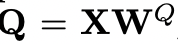

# Transformers in Vision: A Survey

Salman Khan, Muzammal Naseer, Munawar Hayat, Syed Waqas Zamir, Fahad Shahbaz Khan, and Mubarak Shah

## Abstract

NLP에서 좋은 성능을 보여준 Transformer를 Vision에 적용하려는 시도가 많이 일어나고 있다. Transformer가 가장 눈에 띄는 장점은 입력 시퀀스 요소 간의 (거리가 멀리 떨어져 있는) 의존성을 모델링 할 수 있다는 점 그리고 RNN 계열 알고리즘과는 다르게 병렬 처리가 가능하다는 점이다. 또 컨볼루션 네트워크와는 디자인 상에서 최소한의 Inductive biase만을 요구한다(특정 Task를 수행하는 모델을 만들기 위해서 미리 모델에 걸어둔 제약사항 혹은 설정). 게다가 Transformer에서는 Multiple modality(이미지, 비디오, 텍스트, 음성 등의 각기 다른 성질을 가진 데이터를 같이 처리하는 방식)를 지원하고 매우 큰 네트워크와 엄청난 양의 데이터셋에서도 좋은 성능을 보여준 바 있다. 저자들이 말하는 이 논문의 목적은 Vision 분야에 적용한 Transformer 모델에 대한 포괄적인 개요를 제공하는 것이다. 먼저 Transformer 모델에서의 필수 개념(Self-attention, Large-scale pre-training, Bidirectional feature encoding 등)을 설명하고 여러 Vision Task(Image classification, Object Detection 등)에 적용한 유명한 Transformer 모델 사례에 대해서 소개한다. 이때 아키텍처 디자인이나 실험 값 분석을 통해서 각 기술의 상대적인 장점과 단점을 비교한다. 마지막으로 미래에 수행할만한 작업에 대한 방향성을 제시한다. 

## Introduction	

Transformer 모델 중 유명한 모델에는 BERT(Bidirectional Encoder Representations from Transformer), GPT(Generative Pre-trained Transformer), RoBERTa(Robustly Optimized BERT Pre-training), T5(Text-to-Text Transformer)가 있다. Transformer 모델의 영향력이 커지는 데에는 아주 큰 용량의 모델까지의 네트워크를 확장할 수 있다는 데에 있다. 

이렇게 NLP에서 Transformer가 하나의 돌파구가 되자 이를 Vision에서도 적용하려는 움직임이 일어났다(Figure 1).

 

그러나 이미지 데이터는 NLP에서의 데이터와 다른 구조를 가지고 있기 때문에(공간적, 시간적 특성) 이를 고려한 새로운 네트워크 디자인이나 훈련 방법이 필요하다. 결과적으로 여러 Vision Task 영역에서 Transformer를 적용한 연구들이 발표되었다. 이 논문 저자들이 말하는 이 논문의 목적은 이런 연구들에 대해서 소개하는 것이다. 

Transformer 아키텍처는 Self-attention이라는 개념에 근거하고 있는데 이 개념은 시퀀스 요소 간의 관계성에 대해서 학습하는 것이다. RNN에서는 각 요소들을 재귀적으로 처리(앞의 데이터 처리 후 뒤의 데이터 처리)하고 짧은 거리의 Context만 고려할 수 있다면 Transformer에서는 이론적으로 전체 거리의 Context를 고려하는 것이 가능하다. 그래서 아주 긴 거리의 요소 간의 관계성을 학습시킬 수 있고 쉽게 병렬 처리가 가능하다. 

Transformer 모델의 중요한 특징 중 하나는 매우 큰 용량의 모델까지 확장 가능하다는 것과 대용량 데이터를 처리할 수 있다는 것이다. Transformer는 CNN이나 RNN과 비교했을때 어떤 문제 구조에 대한 최소한의 지식만을 필요로 하기 때문에 레이블링 되지 않은 대용량 데이터로 Pre-training이 가능하다. 여기서 Pre-training에서는 수동적으로 Anntotaion을 하는 것을 하지 않아도 되서 불필요한 인력 낭비를 하지 않아도 되고, 또 대용량의 데이터로 학습 시키기 때문에 주어진 데이터 요소의 관계성과 관련된 풍부하고, 일반적이며 특징적인 정보를 인코딩 할 수 있게된다. 이런 일련의 작업 후에 타겟 데이터 셋으로 Fine-tuning하여 원하는 결과를 얻을 수 있다. 

저자들은 네트워크 디자인들을 체계적으로 분류하고 각 방법들의 장점과 단점을 표기했다. 

## Foundations

Transformer 모델 계열이 발전 하는데 두 가지 개념이 핵심 역할을 했다. 

- Self-attention: 시퀀스 요소들 간의 의존성이나 긴 거리의 정보를 잡아내는 기법
- Pre-training: (Un)supervised한 방법으로 (Un)labelled된 대용량 데이터로 미리 모델을 학습 시키고 대상 데이터셋으로 Fine-tuning시키는 기법

### Self-Attention

시퀀스의 각 아이템에 대해서 Self-attention 매커니즘으로 각 아이템이 다른 아이템과 얼마나 관련성이 있는지를 측정한다(예를 들어서 한 단어가 문장 안의 다른 단어와 같이 나와야 하는지 여부 등). 기본적으로 Self-attention 계층에서는 전체 입력 시퀀스에서 전역적으로 정보를 모아 시퀀스의 각 요소(가중치 행렬)를 업데이트 한다.

예를 들어서 한 시퀀스의 n개의 Entity들이 있다고 가정하자((x1, x2, ..., xn), 이때 X ∈ R^(n x d)이고 d는 각 Entity를 표현하기 위한 임베딩 차원이다). 이때 Self-attention의 목적은 전역적 컨텍스트 정보 관점에서 모든 n개의 Entity에 대해서 각 Entity를 인코딩해서 상호 간의 어떤 작용을 하는지 캡처하는 것이다. 이때 이 작업은 다음의 세 개의 학습이 가능한 행렬로 Transformation을 수행하여 이뤄진다. 

| Queries                                                      | Keys                                                         | Values                                                       |
| ------------------------------------------------------------ | ------------------------------------------------------------ | ------------------------------------------------------------ |
|  |  |  |

먼저 입력 시퀀스 X를 각 가중치 행렬에 투영시켜서 세 가지 행렬 결과 값을 얻는다. 

그리고 나서 다음과 같은 출력 Z는

다음과 같이 계산해서 얻는다. 

과정을 그림으로 표현하여 아래와 같다. 

#### Masked Self-Attention

원래의 Self-attetion 계층에서는 모든 Entity에 대해 관련성을 조사한다. 그런데 시퀀스에서 한 Entity의 다음 Entity를 예측하도록 훈련된 경우에는 Decoder에서 기준이 되는 Entity 다음 순서의 모든 Entity를 조사하는 것을 못하도록 마스킹 한다. 이걸 수행하는 방법은 단순히 상삼각행렬 M(M ∈ R^(n x n))과의 요소별 곱셈(Hadamard 곱)을 통해서 수행하면 된다. 

이렇게 하면 기준 Entity의 다음 Entity를 예측하면서 미래 Entity의 Attention score를 모두 0으로 만들 수 있다. 

#### Multi-Head Attention

시퀀스 안의 각기 다른 요소들 사이의 여러 복잡한 관계성을 캡슐화 하기 위해서 Multi-head attention 이라는 매커니즘을 적용한다. 이 매커니즘은 여러 Self-attention 블럭으로 구성되어 있다. 각 블럭에는 저마다의 Query, Key, Value 가중치 행렬이 있다. 입력 X에 대해서 Multi-head attention의 h개의 Self-attention 블럭의 출력들을 Concatenation 해서 하나의 단일 행렬로 만든다. 

그리고 나서 다음과 같은 행렬로 투영시킨다. 

전체 과정은 아래 그림과 같다. 

Self-attention과 Convolution의 가장 큰 차이점은 Self-attention이 학습이 끝난 모델에 대해서도 동적으로 들어오는 데이터에 따라 가중치가 변함에 반해 Convolution은 학습이 끝난 모델은 가중치가 변하지 않는다는 점이다. 이렇게 되면 어떤 특이성을 가진 입력 데이터에 대해서 Self-attention이 Convolution보다 더 잘 대응할 수 있게 된다. 

### (Un)Supervised Pre-training

Self-attention 기반의 Transformer 모델들은 보통 2단계로 훈련이 진행된다. 먼저 지도 학습 혹은 비지도 학습적인 양상으로 큰 데이터셋에서 Pre-training을 수행한다. 그 후에 타겟 데이터셋으로 Fine-tuning한다. Pre-training 후에 Fine-tuning 하는 방식의 모델 정확도가 더 높은 것으로 실험을 통해 입증 된 바 있다.

그런데 많은 양의 데이터에 대해서 수동적으로 레이블링 하는 것은 번거로우므로 Self-supervised 학습이 Pre-training 단계에 적용된다. Self-supervised 학습 덕분에 매우 큰 네트워크에서 학습하는 것도 가능할 정도로 Self-supervised 기반의 Pre-training 단계가 Transformer 모델의 확장성과 일반화에 큰 영향을 끼친다. SSL의 기본적인 아이디어는 빈칸을 채우는 것이다. 예를 들어, 이미지 내에 어떤 폐색된 객체를 예측하는 시도를 하고자 할 때 Temporal video sequences에서 과거와 현재의 프레임으로 유추하여 예측하는 일이 있고, 또한 입력에 적용된 회전 각도라던지 이미지 패치의 순서를 어떻게 바꿨는지, 무채색 이미지의 색을 유추한다던지 하는 일이 있다. 

Self-supervised 제약을 적용하는 다른 방법은 Constrastive 학습이다. 이 경우에는 어떤 이미지로 두 가지 타입의 이미지를 만들어 내기 위해 Nuisance transformation이 쓰인다. 그 다음에 모델은 Nuisance transformation에 Invariant하도록 훈련되고 Semantic 레이블을 변경하는 변화 정도를 최소화 하도록 모델링 하는 쪽으로 강화된다. 

Self-supervised 학습이 유망한 이뉴는 Annotated 되지 않은 많은 양의 데이터로 학습을 할 수 있기 때문이다. SSL 기반의 Pre-training 단계에서 모델은 Pretext task(입력 데이터에 적용된 어떤 기법들)을 알아내는 것을 통해 데이터에 있는 유의미한 표현을 학습하는 법을 배운다. Pretext task를 위한 가짜 레이블이 데이터 특성과 작업 특성에 따라 자동적으로 부여된다. 그러므로 Pretext task를 잘 정의하는 것이 SSL에서는 매우 중요하다. 현재까지의 SSL은 Pretext task에 따라 다름과 같이 묶을 수 있다고 한다.

- Generative approach - 이미지나 비디오를 합성하는 합성하는 것, 예를 들어서 Masked image modeling, Image colorization, Image super_resolution, Image in-painting, GAN 기반의 방법들이 있다. 
- Context-based method - 이미지 패치나 비디오 프레임 같의 관계성을 이용하는 것, 예를 들어서 이미지 패치들에 대한 Jigsaw 퍼즐 풀기, Masked object classification, Rotation 같은 기하학적 변환 예측하기, Video 프레임의 시간적 순서 확인하기가 있다. 
- Cross-modal method - 여러 데이터 양상에 의존하는 것, 예를 들어서 텍스트와 이미지, 오디오와 비디오, RGB와 Flow 등 두 가지 양상의 데이터의 관련성을 확인 하는 것들이 있다. 

### Transformer Model

위의 그림은 Transformer 모델의 아키텍처를 보여준다. 아키텍처는 Encoder-decoder 구조로 이뤄져 있다. Encoder는 6개의 동일한 블럭으로 궁성되어 있고 각 블럭은 두 개의 서브 계층으로 이뤄져 있다(Multi-head self-attention 네트워크, Position-wise fully connected feed-forward 네트워크). 각 블럭 뒤에는 Layer normalization과 Residual connection이 있다. 컨볼루션 네트워크에서는 Feature aggregation과 Transformation(컨볼루션 작업 후에 Non-linearity 작업을 수행하므로)이 동시에 수행되지만 Transformer 네트워크에서는 분리되어 있다. Self-attention 계층에서는 Aggregation만 수행하고 Feed-forward 계층에서는 Transformation을 수행한다. Encoder와 유사하게 Decoder도 6개의 동일한 블럭으로 구성되어 있다. 각 Decoder 블럭은 세 개의 서브 계층으로 구성되어 있는데 첫 두 계층은 Encoder와 비슷하고 세 번째 계층은 그 계층과 매칭되는 Encoder 블럭의 출력에 대해 Multi-head attention을 수행한다. 

원래 Transformer 모델은 기계 번역 작어을 위해 훈련되었다. Encoder의 입력은 어떤 언어의 문장 내의 단어들이다. Positional encoding은 문장 안에서 각 단어의 상대적인 위치를 파악하기 위해 입력 시퀀스에 더해진다. Positional encoding도 입력 차원과 같이 512 차원이다. 그리고 미리 정해진 값을 사용하거나 학습 될 수 있다(Sine, cosine function). Auto-regressive 모델이 되기 위해서 Transformer의 Decoder는 문장에서 다음 간어를 출력하 위해서 바로 전에 예측을 사용한다. 그러므로 Decoder는 Encoder에서도 데이터를 입력으로 받고 바로 전의 예측 값을 입력으로 받는다. Residual connection을 적용하기 위해서 모든 계층의 출력 차원은 동일하다. 

### Bidirectional Representations

원래 Transformer에서는 훈련 시에 현재 기준 왼쪽에 있는 단어들만 사용할 수 있었다. 그러나 이것 때문에 성능 상의 제약이 있을 수 밖에 없었는데 대부분의 언어에서는 현재 기준 왼쪽과 오른쪽의 문맥적 정보가 모두 중요하기 때문이다. BERT는 단어의 왼쪽과 오른쪽 문맥 정보를 동시에 인코딩 하는 것을 제안했다. 그래서 텍스트 데이터의 Feature representation을 학습하는 것을 개선시켰다(비지도적인 양상으로). Bidirectional 훈련이 가능하려면 기본적으로 두 가지 Pretext task가 필요하다. 하나는 Masked language model이고 다른 하나는 Next sentence prediction이다. 모델은 비지도적인 양상으로 이 두 가지 Pretext task로 Pre-training하고 나서 Fine-tuning 된다. 이렇게 하기 위해서 Pre-trained된 모델에 추가적인 출력 모듈을 추가해서 End-to-End로 Fine-tuning한다. 

기본 BERT 모델의 아키텍처는 원래 Transformer 모델에 근거하고 GPT와 유사하다. 원래의 Transformer와 비교했을때 차이는 BERT 모델은 Encoder만 사용한다는 것이다. 이에 반해 GPT는 Decoder만 사용한다. BERT가 가장 크게 기여한 바는 Pretext task 정의이다. 이는 비지도적인 방식의 Bidirectional feature encoding을 가능하게 했다. 이를 위해서 BERT는 두 가지 전략을 제안했다. 

- Masked Language Model(MLM) - 미리 설정해 논 비율의 단어를 문장에서 마스킹 해 놓고 모델은 Cross-entropy loss를 고려하여 이 마스킹된 단어를 예측하도록 훈련된다. 마스킹된 단어를 예측하면서 모델은 Bidirectional context를 포함하는 방법을 학습하낟.
- Next Sentence Prediction(NSP) - 주어진 한 쌍의 문장에 대해서 모델은 Binary 레이블을 예측한다. 예를 들어서 그 쌍이 원래의 문서에서 유효한가 아닌가. 이를 위한 훈련 데이터는 그 어떤 Text corpus에서도 쉽게 만들어 낼 수 있다. A와 B라는 문장 쌍이 만들어져서 NSP는 문장 간의 관계를 잡아내는 모델을 생성하는 것을 가능하게 한다.  

