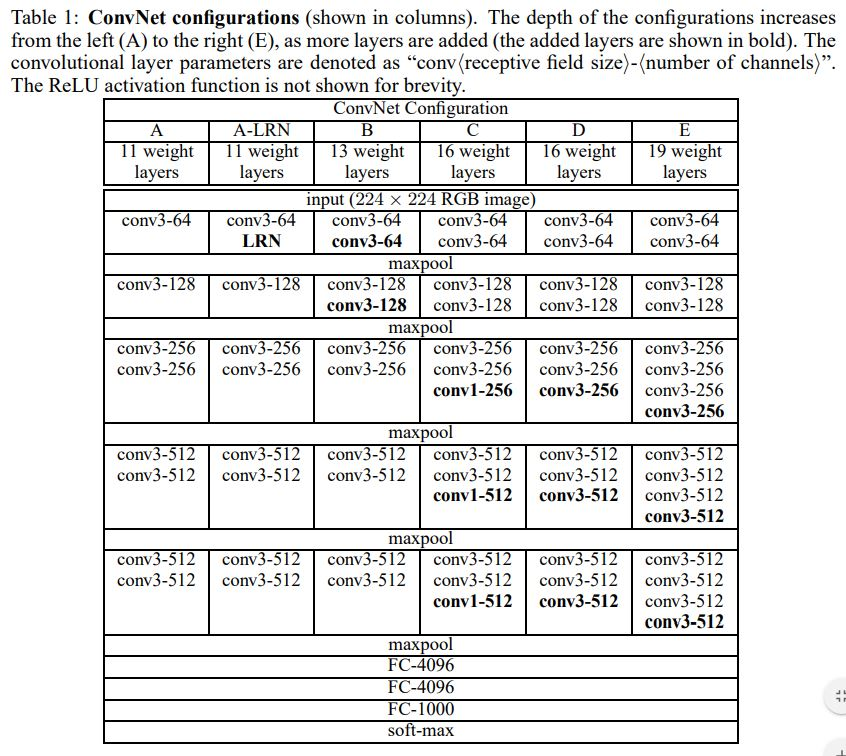
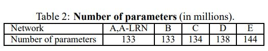
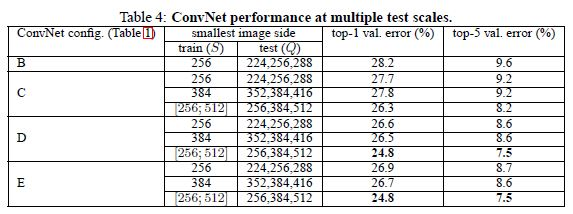
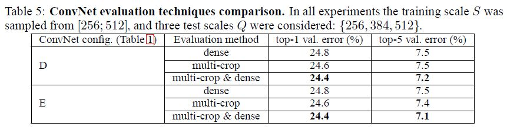
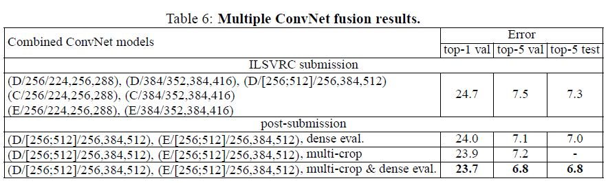
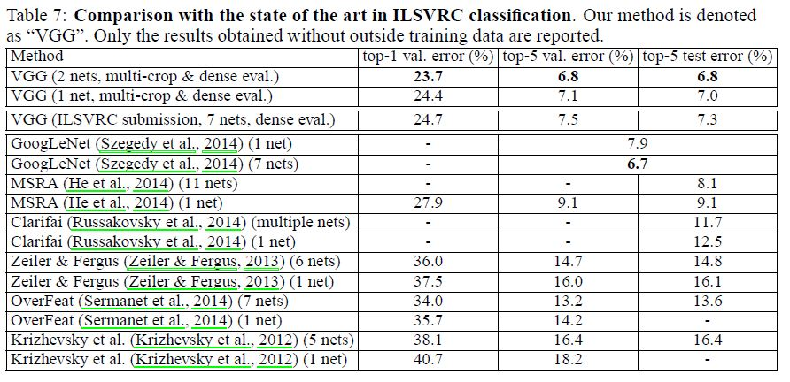

# Very Deep Convolutional Networks for Large-Scale Image Recognition

Karen Simonyan(Visual Geometry Group, Department of Engineering Science, University of Oxford),

Andrew Zisserman(Visual Geometry Group, Department of Engineering Science, University of Oxford)

## Abstract

저자들이 말하는 연구 목적은 큰 크기의 이미지 인식에서의 정확도와 CNN의 깊이의 연관성이다. 이를 위해서 16-19층의 네트워크와 작은 크기의 컨볼루션 필터(3x3)를 사용했다고 한다. 

## Introduction

당시에 여러 CNN 관련 알고리즘이나 연구들이 좋은 성과를 거둔 이유로 저자들은 ImageNet과 같은 대용량 데이터셋과 GPU, 분산 클러스터링같은 높은 성능의 컴퓨팅 시스템을 들었다. 특히 ILSVRC에서는 층이 깊은 비전 관련 아키텍처들이 활약을 했다고 한다. 

Krizhevsky 등의 CNN이 주목을 받으면서 원본 아키텍처를 더 발전시키려는 노력이 있었다. 2013 ILSVRC에서는 첫번째 컨볼루션 계층의 필터 사이즈와 스트라이드를 작게 하는 시도가 최고의 성능을 보여줬다. 또 다른 종류의 시도로는, 여러 크기의 이미지 전체를 훈련과 테스트 시에 다루기는 방법도 있었다. 이 연구에서 저자들은 깊이에 주목했는데 작은 크기의 필터 사이즈 덕분에 깊이를 늘리는 것이 가능했다고 한다. 

## Convnet Configurations

CNN의 깊이에 따른 효과를 보기 위해서 Ciresan 등의 연구와 Krizhevsky 등의 연구에서 적용했던 설정을 그대로 차용했다고 한다. 

### Architecture

훈련간에 입력은 224x224 크기의 RGB이미지이고 데이터 전처리는 각 RGB 픽셀 값의 평균을 뺀 것 밖에 없다. 필터 사이즈는 3x3이다. 1x1 필터도 사용했는데 비선형을 추가하고 입력 이미지의 채널 수를 바꾸기 위한 용도로 사용했다(입력 이미지에 대한 선형 변환으로 볼 수 있음). 스트라이드는 컨볼루션 연산이 끝나고도 해상도가 유지될 수 있도록 설정되었다(3x3에서는 1). 어떤 컨볼루션 계층 뒤에는 2x2 윈도우 사이즈의 스트라이드 2의 Max 풀링 계층이 추가되었다. 

컨볼루션 계층 뒤에는 3개의 Fc가 붙는다. 처음 2개 계층은 4096의 채널을 갖고 마지막에는 ILSVRC 분류 레이블이 1000개이므로 1000개의 채널을 갖는다. 최종 계층은 Soft max 계층이다. 

모든 히든 계층에는 ReLU 활성화 함수가 적용되었고 LRN(Local Response Normalization)은 사용되지 않았다. 왜냐하면 저자들이 관찰했을때, LRN은 성능을 개선시키기는 커녕, 메모리나 시간 등의 리소스만 소비했기 때문이다. 이때 LRN의 설정은 Krizhevsky 등의 연구를 따랐다. 

### Configurations

이 연구에서 평가된 CNN 아키텍처와 설정은 아래와 같다. 기본적인 설정은 위에서 설명한 설정을 따르되, 차이점은 계층의 숫자이다. 컨볼루션 계층의 채널 수는 64부터 시작해서 512가 될 때까지 Max 풀링 계층을 지날때마다 2배씩 증가한다.

아래 테이블은 각 설정의 모델 파라미터 숫자를 나타낸 것인데 깊이가 깊어짐에도 불구하고 다른 연구에서의 얇고 큰 CNN보다 파라미터 숫자가 적은 것을 확인할 수 있다. 

### Discussion

이 연구에서는 다른 연구들과 달리 Receptive field의 사이즈(필터 크기)를 작은 것을 여러번 사용하여 상대적으로 크기가 큰 Receptive field를 한 번 한 것과 동일한 결과를 갖는데 이렇게 했을 때의 이점은 다음과 같다. 작은 필터 사이즈를 통과 시키고 활성화 함수를 통과시킴으로서 한 번 할 때마다 더 많은 비선형성을 부과하여 결정함수가 더 변별력을 갖게 한다. 또 모델 파라미터 수가 줄어 드는데 7x7 1개 짜리 필터에 필요한 파라미터는 49C^2이고 3x3 3개짜리 필터에 필요한 파라미터는 3*(9C^2) = 27C^2이다. 이것은 7x7짜리 필터를 3x3 필터 3개로  Decomposition해서 규제를 적용하는 것과 같은 효과를 낸다. 

1x1 컨볼루션은 Receptive field에 영향을 끼치지 않으면서 비선형성을 추가하는 방법이다(입력과 출력의 채널 숫자가 같다 하더라도). Network In Network에서도 이 개념이 적용된 바 있다. 

## Classification Framework

### Training

저자들이 말하길 이 연구에서 CNN은 대체로 Krizhevsky 등의 연구 방식을 따른다고 한다(여러 크기의 입력 이미지에서 입력 이미지의 크롭을 샘플링 하는 방법을 빼고). 즉, (모멘텀을 적용하여)미니 배치 경사 하강법을 사용한 다항 로지스틱 회귀 목적 함수를 최적화하여 훈련이 이루어진다고 한다. 배치 사이즈는 256, 모멘텀은 0.9이다. 규제는 Weight decay(L2 패널티, 값은 5*10^-4)와 처음 두 개의 Fc에 적용된 드롭 아웃(비율 0.5)이 적용되었다. Lr은 10^-2로 초기화 되어 검증 셋 정확도가 개선되지 않을 때마다 10배씩 감소하는데 총 3번 감소되었고 370K의 Iteration(74 에포크)동안 훈련이 진행되었다고 한다. 저자들이 추측하길 Krizhevsky 등의 연구보다 모델 파라미터도 많고 깊이가 깊음에도 불구하고 더 적은 에포크에 모델 성능이 수렴한 이유는 두 가지가 있다.

- 더 깊은 깊이와 작은 필터 사이즈에 의한 암묵적인 규제
- 특정 계층에서 적용된 미리 학습된 가중치

네트워크의 가중치를 초기화 하는 방법은 중요한데 잘못 초기화하면 경사 하강의 불안정성 때문에 학습이 교착 상태에 빠질 수 있기 때문이다. 이를 위해서 저자들은 Configuration A(이하 net A)를 먼저 학습시켰다. net A의 depth가 얕아서 Random 값으로 초기화 시킨 상태에서 학습 시키기에 충분하기 때문이다. 그리고 나서 나머지 Configuration에서 처음 네 개의 컨볼루션 계층과 마지막 3개의 완전 연결 계층의 가중치를 net A의 가중치로 초기화 하고 이 계층들에 대해서는 훈련할 동안 Lr을 고정시키고 대신 가중치를 조정할 수 있게 했다. 나머지 계층은 평균이 0이고 분산이 10^-2인 정규 분포를 따르는 랜덤 값으로 초기화 했다. 편향 값은 0으로 초기화 했다. 논문을 제출하고 나서 저자들이 알아낸 점은 Glorot & Bengio의 연구에서 적용했던 방법을 적용하여 랜덤 값으로 초기화하면 미리 훈련시킨 가중치 값으로 초기화할 필요가 없다는 점이다. 

224x224 크기의 입력 이미지를 획득하기 위해서 크기가 재조정된 훈련 이미지에서 랜덤하게 크롭한 샘플을 사용한다(SGD Iteration 당 이미지 하나에서 한 번의 크롭). 그리고 훈련 셋의 양을 더 늘리기 위해서 크롭한 샘플에 랜덤하게 횡으로 뒤집기와 랜덤하게 RGB 값 Shift가 적용된다. 

### Training image size

S를 정방 사이즈로 재조정된 훈련 이미지의 작은 쪽의 길이라고 한다면 크롭 사이즈가 224로 고정되어 있으므로 S는 224보다 작은 값을 가질 수 없다. S = 224라고 한다면 작은쪽의 길이가 224인 이미지의 224x224 부분을 크롭하는 것이고 224다 크다면 객체가 담겨 있을 법한 혹은 객체의 부분이 담겨 있을 법한 부분을 224x224만큼 크롭한다. 

S를 셋팅할 때 저자들은 두 가지 관점에서 접근했다. 하나는 S를 고정시키는 것으로 이는 단일 크기의 훈련을 진행하는 것에 해당한다. 이 연구에서는 S = 256 혹은 384 크기로 설정하여 평가를 진행했다. S = 384일 경우, 훈련 속도를 증가시키기 위해서 256일때를 훈련시키고 난 후의 가중치로 384일 때를 초기화했다. 그리고 나서 Lr을 10^-3으로 초기화 했다. 

두번째 관점은 S를 여러 크기의 이미지에 대해서 훈련을 할 수 있게 설정하는 것이다. S는 [S_min, S_max] 사이의 값으로 랜덤하게 설정된다(이 연구에서는 256과 512 사이). 이렇게 되면 이미지 안의 객체가 각기 다른 크기를 갖게 되는 것이고 Scale jittering으로 인한 훈련 셋의 증가라고 볼 수 있으므로 단일 모델이 여러 크기의 객체를 인식하도록 훈련되는 것과 같다. 속도 향상을 위해서, 각기 다른 크기의 이미지로 훈련하는 모델들의 모든 계층을 같은 설정으로 미세 조정한다. 미세 조정 전에 모든 모델은 S = 384에서 미리 훈련된다. 

### Testing

테스트 시에는 이미지가 S와 같이 이미지의 작은 쪽의 길이로 재조정된다. 이하 Q로 표기한다. Q는 S와 똑같을 필요는 없다. 네트워크의 상층부의 완전 연결 계층은 완전 컨볼루션 계층으로 대체된다. 첫 번째 컨볼루션 계층의 필터는 7x7, 나머지 2개의 계층은 1x1이다. 크기를 조정한 이미지가 네트워크를 거치게 되면, 채널 수(=클래스 숫자)만큼 Class score 맵이 나오게 되는데 입력 이미지의 크기에 따라 다양한 해상도를 가지게 된다. 최종적으로 벡터를 생성하기 위해서 이 Class score 맵들은 sum-pooled averaged(Gap를 말하는 듯)된다. 또, 데스트 셋을 횡으로 뒤집어서 데이터 어그멘테이션을 실시했다. 마지막에 soft-max 연산을 거치고 나서 averaged 되고 나면 이미지에 대한 최종 스코어를 얻게 된다. 

완전 컨볼루션 계층은 전체 이미지에 대해 컨볼루션 연산을 진행하기 때문에 이미지를 크롭할 필요가 없다. 완전 연결 계층을 크롭에 적용할 경우, 크롭된 이미지에 zero 패딩을 적용하는 반면 완전 연결 계층에서는 이웃 픽셀과 관련된 값으로 패딩을 한다. 따라서 완전 연결 계층의 Receptive field가 커지게 되어 Context를 더 잘 캐치할 수도 있다. 그런데 저자들은 실제로는, 이런 가능성을 믿고 크롭에 시간을 더 투자하는 것에 의구심을 가졌다. 

### Implementation details

저자들이 구축한 네트워크는 C++ Caffe toolbox를 사용하여 만들어지기는 했으나 상당 부분 수정이 있었다고 한다. 이를 통해서 훈련과 평가를 여러 GPU를 사용하여 진행할 수 있었고 여러 크기의 크롭되지 않은 이미지로 훈련과 평가를 할 수 있었다. 훈련 시에 이미지들이 각 GPU로 나눠 들어가 처리되고 각 GPU에서 계산되는 배치 경사 하강의 평균을 구해서 전체 배치에 대한 경사 하강을 구했다. 경사 하강 시에는 GPU 간의 처리가 동기화 되었기 때문에 결과적으로 하나의 GPU에서 훈련 했을 때랑 같은 결과를 얻게 된다. 

## Classification experiments

### Dataset

저자들의 네트워크는 ILSVRC-2012 데이터 셋에서 평가되었다. 이 데이터셋은 1000개의 클래스를 가진다. 훈련 셋(1.3M)과 검증 셋(50K), 테스트 셋(레이블이 없는 100K)로 나눠지고 Metric은 Top-1, Top-5 Error rate이다. 

대부분의 실험에서 검증 셋을 테스트 셋으로 사용했고 특정 실험 결과는 테스트 셋으로 평가되어 VGG 팀이라는 이름으로 ILSVRC-2014 대회에 제출되었다. 

### Single scale evaluation

Configuration에서 제시한 각 모델은 먼저 단일 크기의 이미지에서 평가 되었다. 테스트 이미지 크기는 S가 고정일 때는 Q=S이고 S ∈ [Smin, Smax] 일때는 Q = 0.5(Smin + Smax)이다.   

저자들이 여기서 얻은 첫 번째 통찰은 LRN이 A 설정에서 정확도 향상에 아무런 도움이 되지 않았다는 것이다. 그래서 나머지 설정에서는 LRN을 적용하지 않았다.

두번째로 CNN의 깊이가 깊어질수록 분류 에러율이 감소 했다는 것이다. 주목만한 점은 같은 깊이라도 설정 C(1x1 컨볼루션 계층을 세 개 포함하는)가 설정 D(전체 네트워크에 3x3 필터를 사용하는)보다 성능이 낮다는 것이다. 이것은 비선형성을 추가 하는 것이 도움이 되긴 하지만(C가 B보다 성능이 더 좋으므로) Spatial context를 캐치하기 위해서는 Non-trivial한 Receptive field를 사용하는 것이 중요하다는 것을 의미한다(D의 성능이 C보다 나으므로).또 B에서 여러 3x3 필터를 하나의 5x5의 필터로 교체한 버전을 원래 B와 비교했는데 에러율이 7% 더 높았다. 이것은 저자들이 예측한대로 1개의 큰 Receptive field보다 작은 Receptive field를 여러 층으로 구성하는 것이 더 성능이 좋다는 것을 증명한다. 

마지막으로 S ∈ [256; 512]으로 이미지의 크기를 조정하는 것이 S = 256 or S = 384와 같이 하나의 크기로 고정하는 것보다 성능이 더 좋았다. 

### Multi-scale evaluation

단일 크기의 이미지에서 평가하고 나서 Scale jittering을 테스트 시에 적용해서 결과를 측정했다. S가 고정되어 있을 때는 Q = {S − 32, S, S + 32}이고, S ∈ [Smin; Smax]일 때 Q = {Smin, 0.5(Smin + Smax), Smax}이다. 결과적으로 Scale jittering이 더 좋은 성능을 내는 것으로 밝혀졌다.

### Multi-crop evaluation

Testing 섹션에서 언급한 두 가지 접근 법(완전 연결 계층 vs 완전 컨볼루션 계층)을 비교했을 때, 완전 연결 계층과 이미지 크롭을 사용하는 것이 성능이 약간 더 좋긴 했으나 두 가지 접근 법을 섞어서 쓰는 방법이 개별적인 방법의 성능을 압도했다. 저자들이 추측하길 이것은 Testing 섹션에서 언급한 것처럼 두 가지 접근법의 처리 방식이 다르기 때문일 것이라고 한다. 

### Convnet fusion

이 실험에서 저자들은 여러 모델의 softmax계층을 통과한 결과를 평균을 내어 결과를 도출했다. ILSVRC에는 단일 스케일 네트워크나 Multi 스케일 모델(모든 계층 보다는 Fc만 미세조정)만을 훈련시켰다. 가장 성능이 좋은 Multi 스케일 모델 2개의 앙상블에 Dense evaluation이나 Multi-crop evaluation을 사용한 것이 7개의 네트워크의 앙상블 결과보다 좋다는 것을 확인했다. 

### Comparison with the state of the art

## Conclusion

저자들은 이 연구에서 깊은 컨볼루션 네트워크가 큰 사이즈의 이미지 분류 작업에서 좋은 성능을 보일 수 있음을 입증했다.
