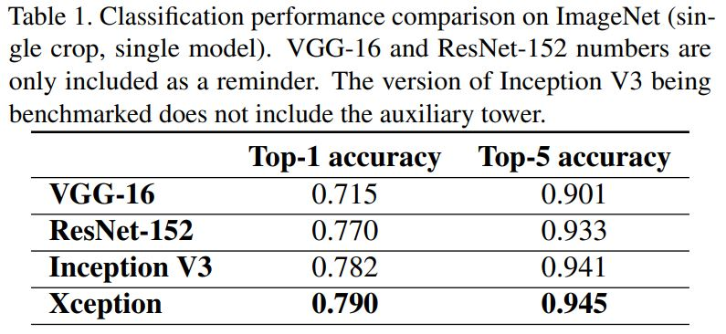

# Xception: Deep Learning with Depthwise Separable Convolutions

François Chollet(Google, Inc.)

## Abstract

저자들은 보통의 컨볼루션과 Depthwise separable convolution(Depthwise convolution 후에 Pointwise convolution) 사이쯤에 있는 CNN에서의 Inception module을 해석했다. 저자들이 발표한 용량이 가벼운 Depthwise separable convolution의 경우 극단적인 수의 계층들의 집합이 횡으로 연결되어 있는 Inception module로 이해할 수 있다. 저자들은 이를 통해 DCNN에서 Inception module을 Depthwise separable convolution으로 바꾸는 새로운 형태의 아키텍처를 제시할 수 있었다. 저자들은 이 논문에서 Xception이라고 이름 붙인 이 아키텍처가 ImageNet 데이터셋에서 Inception V3의 성능을 경미하게 웃돌고 17,000 클래스의 350 백만 장의 대용량 데이터셋에서는 크게 앞지르는 것을 확인했다. 그러면서 Xception이 Inception V3와 용량이 같기 때문에 모델의 용량이 증가해서 성능이 좋은 것이 아니라 어떻게 모델 파라미터를 효율적으로 사용했는가 덕분에 성능이 더 좋은 것이라고 한다. 

## Introduction

컴퓨터 비전에서 CNN은 마스터 알고리즘처럼 등장해왔다. 그리고 이 CNN을 어떻게 조직할 것인가로 연구자들이 고심해왔다. 

- LeNet-style: Y. LeCun, L. Jackel, L. Bottou, C. Cortes, J. S. Denker, H. Drucker, I. Guyon, U. Muller, E. Sackinger, P. Simard, et al. Learning algorithms for classification: A comparison on handwritten digit recognition. Neural networks: the statistical mechanics perspective, 261:276, 1995.
- AlexNet: A. Krizhevsky, I. Sutskever, and G. E. Hinton. Imagenet classification with deep convolutional neural networks. In Advances in neural information processing systems, pages 1097–1105, 2012.
- Zeiler and Fergus: M. D. Zeiler and R. Fergus. Visualizing and understanding convolutional networks. In Computer Vision–ECCV 2014, pages 818–833. Springer, 2014.
- VGG: K. Simonyan and A. Zisserman. Very deep convolutional networks for large-scale image recognition. arXiv preprint arXiv:1409.1556, 2014.
- Inception V1: C. Szegedy, W. Liu, Y. Jia, P. Sermanet, S. Reed, D. Anguelov, D. Erhan, V. Vanhoucke, and A. Rabinovich. Going deeper with convolutions. In Proceedings of the IEEE Conference on Computer Vision and Pattern Recognition, pages 1–9, 2015.
- Inception V2: S. Ioffe and C. Szegedy. Batch normalization: Accelerating deep network training by reducing internal covariate shift. In Proceedings of The 32nd International Conference on Machine Learning, pages 448–456, 2015.
- Inception V3: C. Szegedy, V. Vanhoucke, S. Ioffe, J. Shlens, and Z. Wojna. Rethinking the inception architecture for computer vision. arXiv preprint arXiv:1512.00567, 2015.
- Inception-ResNet: C. Szegedy, S. Ioffe, and V. Vanhoucke. Inception-v4, inception-resnet and the impact of residual connections on learning. arXiv preprint arXiv:1602.07261, 2016.
- Network-In-Network: M. Lin, Q. Chen, and S. Yan. Network in network. arXiv preprint arXiv:1312.4400, 2013.

데이터와 관련된 논문

- ImageNet: O. Russakovsky, J. Deng, H. Su, J. Krause, S. Satheesh, S. Ma, Z. Huang, A. Karpathy, A. Khosla, M. Bernstein, et al. Imagenet large scale visual recognition challenge. 2014.
- JFT: G. Hinton, O. Vinyals, and J. Dean. Distilling the knowledge in a neural network, 2015.

Inception 스타일의 기본적인 빌딩 블록은 Inception module이고 몇 가지 서로 다른 구현체가 존재한다. 

 Figure 1은 Inception V3에서 볼 수 있는 전형적인 Inception module의 구조이다. Inception model은 이 module을 쌓은 것으로 볼 수 있다. 이 생각은  VGG에서 단순한 컨볼루션 계층을 쌓아간다는 아이디어에서 착안했다. Inception module이 일반적인 컨볼루션과 비슷하지만(둘 다 이미지의 특징을 뽑아낸다) 전자가 경험적으로 봤을 때 좀 더 적은 파라미터로 더 풍부한 특징을 뽑아 낼 수 있는 것으로 보였다. 

### The Inception hypothesis

컨볼루션 계층은 필터를 3D 공간(2개의 Spatial dimentions(Width, Height)와 Channel dimension)에서 학습시키려고 한다. 그래서 하나의 컨볼루션 커널은 Cross-channel correlations을 출력으로 매핑하는 것과 Spatial correlations을 출력으로 매핑하는 작업을 동시에 진행한다. 

Inception modlue에 내재되어 있는 아이디어는 Cross-channel correlations와 Spatial correlations를 독립적으로 살펴보도록 명시적으로 과정을 나누는 것이다. 구체적으로 보통의 Inception module은 먼저 1x1 컨볼루션의 Pointwise 컨볼루션을 통해 Cross-channel correlations을 살펴본다. 그리고 원래 공간보다 크기가 더 작은 독립적인 공간 그룹으로 관련 있는 입력 데이터 부분을 매핑한다. 그리고 나서 3x3이나 5x5 같은 보통의 컨볼루션 연산으로 이 3D 공간을 매핑한다 (Figure 1 참조).  Inception의 근본적인 가정은 Cross-channel correlations와 Spatial correlations을 동시에 매핑하는 것이 좋지 않기 때문에 Decoupling 하는 것이 좋다는 것이다. 

저자들에 의하면 위와 같이, 3x3처럼 한 가지 사이즈의 컨볼루션 연산만 진행하고 Pooling 계층을 포함하지 않는 단순한 Inception module의 경우 아래와 같이, 하나의 많은 output channel 수를 가진 1x1 컨볼루션 연산을 수행한 뒤에 각각 겹치는 부분이 없는 Spatial 컨볼루션을 수행하는 모듈로 재구성될수 있다고 한다. 

저자들이 궁금했던 건 위와 같은 구조가 원래의 Inception module과 달리 Cross-channel correlations와 Spatial correlations를 각각 매핑하여 더 강력한 성능을 내는가였다. 

### The continuum between convolutions and separable convolutions

극단적으로 저자들의 가설에서 매 Output channel마다 Spatial correlations를 매핑하는 구조가 위 그림의 구조이다 (Extreme version of Inception module). 저자들은 이런 Extreme한 구조가 거의 Depthwise separable convolution(Separable convolution)과 동일하다고 주장한다.  

이런 Separable convolution은 입력 데이터의 각 채널마다 독립적으로 수행되는 Spatial convolution인 Depthwise convolution, 그리고 뒤에,  Depthwise convolution 수행 후에 새로운 Channel 공간으로 데이터를 Projection하는 1x1 Convoltion인 Pointwise convolution으로 구성되어 있다. 

Extreme한 버전의 Incetipn과 Depthwise separable convolution의 두 가지 사소한 차이점은 아래와 같다. 

- 연산 순서: Depthwise separable convolution의 경우 채널 별 Spatial convolution을 수행하고 나서 Pointwise convolution을 수행하는데 반해 Extreme은 Pointwise convolution을 먼저 수행한다.
- 첫 번째 연산 수행 후에 비선형성의 존재 유무: Extreme은 첫 번째 연산 수행 후에 ReLU 비선형성이 추가되지만 Depthwise의 경우 보통 비선형성이 추가되지 않는다.  

저자들이 주장하길 첫 번째 차이는 그다지 중요하지 않고 두 번째 차이가 큰 영향을 줄 수 있다고 한다.

또 저자들은 원래의 Inception module과 Depthwise separable convolutions 사이에 중간 형태의 Inception module도 가능하다고 한다. 이때 각각의 경우의 차이를 만들어내는 매개변수는 Spatial convolution를 적용하는 독립적인 Channel-space segment의 수이다. 원래의 Inception module과 Depthwise separable convolutions 사이에는 이산적인 스펙트럼이 존재한다. Inception module은 이 스펙트럼의 한 극단이고 Single-segment의 경우에 해당한다(Figure 1). Depthwise separable convolutions는 다른 극단이고 채널당 하나의 Segement이 존재한다(Figure 4). 그 사이에 수백개의 Channel을 3, 4개의 Segment 그룹으로 나누는 Inception module이 존재한다 (Figure 3). 

저자들은 이런 현상을 관찰하고 Inception계의 아키텍처에서 Inception module을 Depthwise separable convolution으로 교체하면 성능이 좋아질수 있다는 생각을 하게 되었다. 

## Prior work

이 연구 결과는 다음의 선행 연구에 크게 영향을 받았다고 한다.

- VGG16 - 도식적으로 저자들이 제안하는 아키텍처와 유사하다.
- 채널 별로 수행하고 난 다음에 공간 별로 연속적으로 수행하는, 컨볼루션을 여러 브랜치로 나누는 것의 이점을 입증한 Inception 아키텍처 계열의 네트워크들.
- Depthwise separable convolution - 이 연구에 지대한 영향을 끼쳤다고 한다. 2012년부터 공간적인 Separable convolutions은 사용되어왔지만 Depthwise 버전은 이 연구가 수행될 당시에 멀지 않은 시간부터 사용되었다고 한다. Laurent Sifre가 2013년 Google Brain에서 인턴을 하고 있을때 개발했다고 한다. AlexNet에 적용하여 정확도는 조금 향상되었지만 성능 수렴 속도나 모델 사이즈를 크게 줄이는데에는 크게 일조했다고 한다. 그의 연구는 Sifre and Mallat의 transformation-invariant scattering에 관한 선행 연구에서 영감을 받았다고 한다. Depthwise separable convolution은 이후에 Inception V1과 V2의 첫번째 계층으로 사용되었다. Google에서 Andrew Howard가 Depthwise separable convolution을 사용한 효율적인 mobile 모델인 MobileNet을 발표했다. 

- Residual connection - Xception 아키텍처에 광범위하게 사용된다. 

## The Xception architecture

저자들은 Depthwise separable convolution 계층에 완전히 근거한 CNN 아키텍처를 제안했다. 그들은 CNN의 Feature map들의 Cross-channel correlation과 Spatial correlation의 매핑을 완전히 분리 할 수 있다는 가설을 세웠다. 그래서 그들은 Extreme Inception의 줄임말인 Xception으로 그들의 아키텍처의 이름을 붙였다. 

전체적인 구조는 위의 Figure5와 같다. Xception 아키텍처는 36개의 컨볼루션 계층이 있는데 네트워크의 Feature extraction을 담당하는 base이다. 저자들은 Image classification에 대해서 성능에 대한 조사를 했기 때문에 Base CNN 후에 Logistic regression 계층을 붙였다고 한다. 선택적으로 실험 단계에서 Logistic regression 전에 완전 연결 계층들이 삽입 될 수 있다(밑에 Figure 7, 8). 36개의 컨볼루션 계층은 14개의 Module로 구성되어 있고 처음과 마지막 Module을 제외한 나머지는 Linear residual connection이 적용된다. 

요약하자면 Xception 아키텍처는 Residual connection으로 연결되어 있는 Depthwise separable convolution 게층들의 Linear stack이다. 

## Experimental evaluation

저자들은 Xceptin과 Inception V3을 비교했다. 두 아키텍처는 거의 같은 수의 모델 파라미터를 가지기 때문에 용량이 비슷하다고 할 수 있다. 따라서 어떤 성능 상의 차이가 존재한다면 네트워크 용량의 차이라고 할 수 없다. 저자들은 먼저 ImageNet으로 단순 분류를 실시했고 17,000 클래스의 JFT 데이터셋으로는 객체 탐지를 실시했다. 

### The JFT dataset

JFT 데이터셋은 Goole의 내부 데이터셋으로 Hinton 등의 연구에서 처음 소개되었다. 데이터는 350 백만의 고해상도 이미지이며 17,000 여 클래스로 나눠지는 객체들이 Annotation되어 있다. JFT 데이터셋으로 훈련된 모델을 평가하기 위해서 FastEval14k 데이터셋으로 성능 평가를 했다. 

FastEval14k는 6,000개의 클래스로 나눠지는 객체들이 조밀하게 붙어 있는 14,000 이미지이다(이미지당 평균적으로 36.5의 객체가 존재). 이 데이터셋으로 성능이 가장 잘 나온 100개의 예측 값의 mAP를 구해서 성능을 평가했고 이 예측 값에 자주 나오는 클래스에 대해서는 좀 더 비중을 뒀다. 클래스는 Social meida 이미지에 있는 클래스이다. 이런 방법이 중요한 이유는 Google에서 서비스나 제품을 만들때 중요한 의미를 가지기 때문이다. 

### Optimization configuration

ImageNet: SGD, Momentum 0.9, Initial learning rate 0.045, Learning rate decay of rate 0.94 every 2 epochs

JFT: RMSprop, Momentum 0.9, Initial learning rate 0.001, Learning rate decay of rate 0.9 every 3,000,000 samples

모든 모델은 추론 시에 Polyak averaging을 사용해서 평가되었다. 

### Regularization configuration

Weight decay: Inception V3 모델은 Weight decay (L2 regularization) rate 4e-5를 적용했는데 이는 ImageNet에서의 성능을 위해 최대한 최적화 시킨 것이다. 그런데 Xception은 이 rate가 맞지 않아서 1e-5로 설정했다. Weight decay에 대해서는 엄밀한 연구를 하지 않았으며 ImageNet과 JFT 실험에서 동일하게 적용했다. 

Dropout: ImageNet에 대해서는 Logistic regression 계층 전에 0.5 rate의 Dropout을 적용했고 JFT에 대해서는 적용하지 않았다. JFT는 데이터셋의 크기가 크기 때문에 과적합 하려는 경향이 적었다. 

Auxiliary loss tower: Inception v3 아키텍처에서는 추가적인 Regularization 매커니즘 역할을 하는 추가적인 Loss tower를 네트워크 초반부에 더해서 Classification 손실이 역전파 할 수 있게 할 수 있다. 단순명료함을 위해서 이 연구에서는 추가하지 않았다. 

### Training infrastureture

ImageNet 실험에서는 Parallelism + synchronous gradient descent를 적용했고 JFT 실험에서는 Asynchronous gradient descent를 적용해서 훈련 속도를 높였다. JFT 모델의 성능을 끝까지 수렴시키려면 시간이 오래 걸리기 때문에 그렇게 하지 않았다. 

### Comparison with Inception V3

#### Classification performance

모든 평가는 Single model에서 입력 이미지들의 Single crop으로 수행되었다. ImageNet 결과는 테스트 셋보다는 검증 셋에서 수행한 결과이다(ILSVRC 2012의 검증셋 중에서 블랙리스트에 있지 않은 이미지). JFT 결과는 완전한 성능 수렴보다는 30 백만의 Iteration을 수행한 결과이다. JFT의 경우 완전 연결 계층이 없는 버전과 Logistic regression 계층 전에 4096개의 Unit을 가진 두 개의 완전 연결 계층이 있는 버전에서 실험을 수행했다. 

ImageNet에서는 Xception이 Inception v3보다 좋은 성능을 보였다. JFT 데이터셋에서는 FastEval14k mAP@100 Metric으로 상대적으로 4.3%의 개선을 보였다. Xception 아키텍처가 ImageNet보다 JFT 데이터셋에서 더 큰 성능 향상을 보인 이유를 저자들은 Inception v3의 경우 ImageNet에 맞게 디자인을 맞췄기 때문이라고 생각했다.  

| ImageNet                                                     | JFT                                                          |
| ------------------------------------------------------------ | ------------------------------------------------------------ |
|  |  |
|  |  |

#### Size and speed

Table3에서 저자들은 Inception V3와 Xception의 크기와 속도를 비교했다. 두 아키텍처는 거의 같은 사이즈(3.5% 이내로)를 가지는데 Xception이 약간 더 느리다. 저자들은 Xception의 정확도 측면에서의 성능 개선이 추가적인 모델 용량이 아니라 모델 파라미터를 어떻게 효율적으로 사용했는가 때문이라고 주장한다. 
