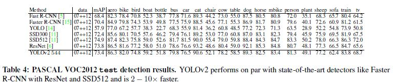

# YOLO9000: Better, Faster, Stronger

Joseph Redmon(University of Washington, Allen Institute for AI),

Ali Farhadi(University of Washington, Allen Institute for AI)

## 0. Abstract 

YOLO9000은 9000개 이상의 카테고리를 분류할 수 있는 실시간 객체 탐식 시스템이다. YOLO보다 개선된 모델 훈련 방법을 사용하여 좀더 다양한 객체 사이즈를 다룰 수 있게 되었다. 그래서 PASCAL VOC, COCO 데이터셋에서 좋은 성적을 내었는데 VOC 2007에서는 67 FPS의 속도로 76.8 mAP의 성능을 내었다.  또한 객체 탐지와 분류를 동시에 진행할 수 있는 방법을 제시했다. COCO 데이터셋과 ImageNet 데이터셋을 동시에 사용하는 방법을 제시했고 심지어 객체 탐지를 위한 Label이 부여되지 않은 객체들의 위치를 예측하기도 했다. 이런 접근 방법을 ImageNet 데이터로 검증했는데 200개의 클래스 중에 44개만 탐지에 대한 Label이 있는데도 불구하고 19.7 mAP의 성능을 달성했다. 

## 1. Introduction

범용 목적의 객체 인식은 빠르고 정확하며 여러 범주의 객체를 인식할 수 있어야 하는데 신경망 네트워크 등장으로 이게 가능해졌다. 그러나 아직도 대부분의 방법들이 작은 크기의 객체를 탐지하는데 어려움을 겪는다. 

객체 분류나 다른 작업에 비해 객체 탐지에서의 데이터 셋은 상당히 제한적이다. 객체 탐지의 성능을 올리기 위해서 많은 데이터가 필요한데, 분류 등의 다른 작업에 필요한 데이터와 달리 객체 탐지에서의 레이블링이 쉽지 않다. 

이 논문에서 제시한 방법을 사용하면, 원래 가지고 있던 분류 데이터를 객체 탐지 기능을 훈련시키는데 사용할 수 있게 된다. 또 객체 분류에 사용된 데이터를 단어들의 계층적인 구조로 보고 각기 다른 방식으로 레이블링 되어 있는 데이터를 합쳐서 객체 분류를 위해 사용할 수 있게 한다. 

객체 탐지와 분류를 유기적으로 훈련시키는 방법을 제시한다. 탐지 기능을 훈련시키위해 레이블링된 데이터로 정확하게 객체의 위치를 추정하는 법을 학습시키는데 중점을 두면서도 강력하고 넓은 카테고리를 다룰 수 있도록 분류 기능도 학습시킨다. 

9000개이상의 다른 객체를 탐지하고 분류하기 위해서 먼저 기본 YOLO 시스템을 개선하여 YOLOv2를 만들어 내었다. 그런 다음 위에서 언급한 방법들을 이용하여 ImageNet과 COCO에서의 데이터셋으로 학습시킨다. 

## 2. Better

YOLO는 Fast R-CNN에 비하여 Localization 에러율이 더크고 Region-based 방법들보다 낮은 Recall의 성능을 보였다. 따라서 분류 정확도를 유지하면서 두 문제를 해결하는데 초점을 뒀다. 

컴퓨터 비전에서는 일반적으로 성능을 올리기 위해서 더 넓고 깊은 네트워크를 사용하거나 여러 모델의 앙상블 기법을 사용한다. 이에 반해 YOLOv2에서는 자체 네트워크를 Scale up하기 보다는 다음에 나오는 아이디어를 적용해 원래의 YOLO를 개선시키고자 했다. 

- Batch Normalization - BN을 사용함으로서 다른 Regularization 기법을 사용하지 않고도 (정확도나 손실 그래프의) 수렴에서 큰 개선이 이루어졌다. 모든 컨볼루션 계층에 BN을 적용한 YOLOv2에서는 mAP가 2% 상승했다. 결과적으로 Dropout 같은 다른 Regularization 기법들을 제거할 수 있었다. (데이터의 미니 배치마다 Normalize 하는 것.)

​     

- High Resolution Classifier - 대부분의 탐지 방법들은 ImageNet에서 미리 학습된 가중치를 이용한다. 특히 AlexNet을 Backbone으로 적용하여 최대 256 x 256의 이미지를 입력으로 사용한다. YOLOv1도 224 x 224 크기로 학습을 시작하다가 탐지 기능을 학습하기 위해서 448 해상도로 바꾸고 이에 따라 모델을 조정한다. YOLOv2에서는 네트워크가 높은 해상도에 걸맞게 필터를 조절할 수 있도록 10 에포크동안 448 x 448 크기의 ImageNet 데이터로 Fine-Tuning을 실시한다. 그리고 나서 탐지 기능을 잘 할 수 있도록 튜닝하는데 이런 방법으로 4%의 mAP 상승 효과를 보았다. 

- Convolutional With Anchor Boxes - YOLOv1에서 본래 컨볼루션 특징 추출기 위에 있는 완전 연결 계층에서 직접적으로 바운딩 박스의 좌표를 예측했다면 Fast R-CNN은 Hand-picked priors(미리 사람이 정해둔 앵커 박스)를 사용하여 바운딩 박스를 예측했다. (앵커 박스란 모델이 훈련 초기에 바운딩 박스조정을 잘 할 수 있도록 미리 정의해둔 가이드 박스라고 할 수 있다.)

  

  완전 컨볼루션 계층으로 이루어진 RPN(Region Proposal Network)에서는 앵커 박스의 Offsets과 Confidence를 예측했다. 예측을 하는 계층이 컨볼루션 계층이기 때문에 특징 맵의 모든 위치에서 Offset을 예측할 수 있다. 이렇게 Offset을 예측하는 것은 탐지 문제를 더 쉽게 만들고 모델이 더 쉽게 학습할 수 있도록 한다. 이런 이유로 YOLOv2에서 완전 연결 계층을 제거하고 앵커박스 개념을 도입했다. 그리고 단 하나의 격자 셀이 이미지 중앙에 올 수 있도록 448 x 448에서 416 x 416으로 입력 이미지의 해상도를 바꿨다. 보통 크기가 큰 객체는 이미지의 중앙에 오는 경우가 많은데 이럴 경우 중앙에 4개의 격자 셀이 있는 것보다 단 하나의 격자 셀이 있을 때 예측하기 더 쉽다.  YOLO는 32배수로 다운샘플링을 진행했기 때문에 최종 출력 특징 맵의 크기는 (416 / 32 = 13) 13 x 13이다. 

  또 다음과 같이 앵커박스마다 클래스와 객체성에 대한 예측을 하도록 매커니즘을 변경했다. 객체성 예측은 정답 박스와 예측 박스 간의 IOU를 측정하고 클래스 예측은 주어진 객체에 대한 조건부 확률을 예측한다. 

   

  앵커 박스를 사용하면서 이미지당 98개의 박스를 예측하던 것을 천 개까지 예측이 가능해졌다. 69.5mAP의 81% Recall에서 69.2 mAP의 88% Recall로 성능이 변화했는데 mAP가 조금 하락하긴 했지만 Recall 수치가 증가했다는 것은 모델이 더 개선할 여지가 있다는 뜻이었다. 

- Dimension Clusters - 앵커박스 개념을 YOLO에 적용하면서 두가지 문제에 직면했다. 그중 첫번째는 Box dimension(앵커 박스 갯수)을 사람이 골라야 한다는 것이었다. 네트워크가 바운딩 박스를 훈련간에 잘 조정하기는 하나 사람이 먼저 앵커 박스를 정해줬을때 네트워크가 좋은 탐지 예측을 하는데 도움이 됐다. 좋은 앵커박스를 사람이 고르기 보다는 자동으로 하기 위해서 훈련 셋의 바운딩 박스에 k-means 클러스터링을 적용했다. 그런데 k-means에서 Euclidean distance를 그대로 사용한다면 큰 상자는 큰 에러를 작은 상자는 작은 에러를 발생시킬 것이다. 이 논문에서 원하는 바는 박스의 크기와 상관 없이 IOU 수치가 큰 박스들을 예측하는 것이므로 Distance metric을 새롭게 정의했다. 

  

  k-means를 위의 metric을 통해서 돌렸을 때 k 값과 평균 IOU값의 관계를 그래프로 그리면 다음과 같다. k값을 올리면 더 많은 앵커 박스가 생성되어 전체 평균 IOU가 당연히 상승하겠지만 그만큼 모델의 복잡도가 증가하게 된다. 여기서는 k=5일 때가 가장 이상적이라고 판단했다. k-means를 통해서 생성한 앵커 박스와 사람이 지정한 앵커 박스는 차이가 있는데 k-means는 (가로)넓고 (세로)짧은 박스보다는 좁고 긴 박스를 선호했다. 

   

  사람이 고른 앵커박스와 클러스터링으로 만들어진 앵커박스로 평균 IOU를 비교한 테이블이 다음과 같다.  IOU를 Metric으로 하는 클러스링을 했을 때 결과가 더 좋은 것을 확인할 수 있다.

  

- Direct location prediction - 앵커박스를 사람이 골라야 한다는 이슈와 더불이 YOLO에 앵커 박스를 적용했을 때 발생하는 두번째 이슈는 모델의 불안정성, 특히 초기의 불안정성이었다. 대분분의 불안정성은 (x, y) 좌표(바운딩 박스의 중심점)를 예측하기 떄문에 발생한다. 예를 들어서 RPN의 경우 t_x, t_y라는 값을 예측하여 (x, y) 좌표를 보정한다. 

  

  t_x = 1이면 앵커 박스의 넓이 만큼 오른쪽으로 이동시키고 -1이면 반대다. 이런 계산법은 제한이 없기 때문에 어떤 위치가 박스를 예측하는가에 상관없이 앵커 박스가 이미지의 어떤 부분에든 닿을 수 있다. 랜덤으로 모델의 가중치를 초기화하면 의미있는 오프셋을 예측하는 것을 안정화시키는데 긴 시간이 걸린다. 이 논문에서는 격자 셀의 위치에 관련시켜 상자의 위치 좌표를 예측하도록 했다. 로지스틱 활성화 함수를 적용하여 예측 값이 0과 1 사이의 값이 되도록 했다. 실제 값도 0과 1사이의 값이 된다.  출력 특징 맵의 각 셀에서 네트워크가 5개의 바운딩 박스를 예측하고 각 바운딩 박스 당 5개의 좌표 값을 예측한다(tx, ty, tw, th, to).

  

  위와 같이 위치 예측을 RPN 등과 달리 어느정도 제한시킴으로 인해  모델 파라미터를 학습 시키기는 더 쉬워졌고 이는 네트워크를 더 안정화시켰다. Dimension clusters와 위의 방법을 적용해서 5% mAP의 성능 향상을 가져왔다.  

  

- Fine-Grained Features - YOLOv2에서는 13 x 13 크기의 출력 특징 맵에서 탐지에 관한 예측을 수행한다. 큰 객체는 상관 없지만 크기가 작은 객체의 위치를 예측하는데에 Fine-Grained 특징을 사용하는게 도움이 되었다. Fast R-CNN과 SSD는 Proposal networks를 통해 다양한 특징 맵에서 각기 다른 해상도를 얻고자 했다. YOLOv2에서는 단순히 최종 출력 전에 Passthrough 계층을 넣어 특징 26 x 26 크기의 특징 맵을 concatenate했다. 26  x 26 x 512의 특징맵을 13 x 13 x 2048로 바꾸기 위해서 다음과 같은 연산을 진행했다. 

  

  이 아이디어로 1%만큼 모델 성능이 향상되었다. 

- Multi-Scale Training - 원래의 YOLO는 448 x 448 크기의 입력 이미지로 훈련을 진행했는데 앵커 박스를 도입하면서 416 x 416 크기로 바꿨다. 그런데 모델에 오직 컨볼루션과 풀링 계층만 있기 때문에 자유자재로 입력 해상도의 변경이 가능했다. YOLOv2에서는 각자 다른 크기의 이미지를 감당할 수 있는 모델을 만들고자 했다.  10에폭마다 32배수의 입력 이미지 크기를 선택하여 네트워크를 바꿔가며 훈련을 진행했다(최소 320, 최대 608). 이런 아이디어가 네트워크를 다양한 입력 크기에 대해서 예측을 잘 할 수 있도록 만들었다. 작은 해상도에서는 가볍고 빠르면서 꽤 정확한 탐지기가 훈련 되었다. 288 사이즈에서는 90FPS의 속도로 Fast R-CNN과 비슷한 mAP를 보였다. 높은 해상도에서는 VOC 2007 데이터셋 기준 78.6 mAP의 정확도를 보였고 조금 느리지만 그래도 여전히 실시간에 걸맞는 속도를 보였다. 

  

  

- Further Experiments 

  

  

## 3. Faster

로보틱스나 자율 주행차 같은 분야에서는 낮은 예측 지연율이 필요하다. YOLOv2에서도 이에 초점을 맞춰 애초부터 빠르고 정확한 성능을 보이는 모델을 만들도록 디자인되었다. 

대부분의 탐지 프레임워크들이 특징 추출하는데 VGG16에 의존을 많이 했다. VGG16은 분류쪽에서 강력하고 정확하기는 하나 필수불가결적으로 복잡했다. 224 크기의 이미지 하나가 네트워크를 통과하는데 30.69 x 10억의 소수점 연산이 필요했다. 

YOLO 프레임워크에서는 GoogleNet 아키텍처에 근거해서 자체 제작한 네트워크 구조를 사용했는데 같은 크기의 이미지 하나가 통과하는데 8.52 x 10억의 소수점 연산만이 필요 했기 때문에 Single-crop, Top 5 기준으로 VGG16보다 2%의 mAP 하락이 있었다.

- Darknet-19 - Darknet-19는 이미지 한장을 처리하는데 5.58 x 10억의 연산이 필요하고, ImageNet 데이터 기준 Top-1에서는 72.9%, Top-5에서는 91.2%의 성능을 달성했다. 

  

  마지막을 보면 1 x 1 필터의 컨볼루션을 사용하여 특징맵의 차원을 축소하고 GAP(Global Average Pooling)을 적용했다. 또 BN을 사용하여 훈련을 안정화시키고 정확도나 손실의 수렴을 빠르게 하며 모델을 규제했다. 

- Training for classification - 탐지 기능 훈련을 위해서는 마지막 컨볼루션 계층을 없애고 3 x 3 x 1024의 컨볼루션 계층을 더하고  1 x 1 x (탐지에 필요한 출력숫자)의 컨볼루션 계층을 더했다. VOC 데이터셋에서 5개의 박스의 5개의 좌표 값과 박스당 20개의 클래스 확률을 예측했기 때문에 (5 x (5 + 20)) 125개의 필터가 필요했다(1 x 1 x (탐지에 필요한 출력숫자 = 125)). 또 3 x 3 x 512 컨볼루션 계층부터 끝에서 두 번째 컨볼루션 계층까지 Passthrough 계층을 추가해서 Fine-grained 특징을 마지막 계층이 획득할 수 있도록 했다. 훈련 처음 시작부터 160 에포크 동안 훈련했고 10^-3의 학습률로 시작해서 60, 90 에포크에서 각각 10으로 나눈 학습률로 학습을 진행했다. Weight decay를 0.0005로, Momentum를 0.9로 설정했다. 데이터 어그멘테이션은 YOLOv1과 SSD에서 적용한 기법을 적용했고, COCO와 VOC 데이터셋에 동일한 훈련 환경 설정을 적용했다. 0

## 4. Stronger 

YOLOv2에서 훈련 시에 탐지와 분류를 위한 데이터셋을 섞어서 사용했다. 탐지를 위한 데이터셋이 입력으로 들어오면 YOLOv2의 모든 손실 함수에 기반하여 역전파가 진행되었고 분류를 위한 데이터셋이 입력으로 들어오면 분류와 관련된  손실에 기반하여 역전파가 진행되었다. 문제는 탐지를 위한 데이터셋이 "개", "고양이" 같이 추상적이고 일반적이었다면 분류를 위한 데이터셋은 좀 더 자세하고 깊었다는 것이었다. ImageNet 데이터셋의 경우, “Norfolk terrier”, “Yorkshire terrier”, “Bedlington terrier”를 포함 개에만 100종이상이 포함되어 있었다. 따라서 이런 두 종류의 데이터셋을 합칠 수 있는 적절한 방법이 필요했다. 대부분의 경우 클래스들이 상호 배타적이라는 가정 하에 마지막 출력 층에서 모든 클래스들의 확률 분포를 계산하기 위해서 Softmax를 사용했다. 이런 접근법은 서로 다른 데이터셋을 합치는 문제가 되는데, 예를 들어 "Norfolk terrier"와 "dog"은 완전히 서로 상호 배타적이지는 않기 때문이다. 여기서는 상호 배타적이지 않다고 가정한 데이터셋을 합쳐서 사용하는 Multi-label 모델을 사용했다. 

- Hierarchical classification - ImageNet의 레이블은 WordNet이라고 하는 언어 데이터베이스에서 레이블 정보를 가져왔다. WordNet은 어떤 언어들의 개념과 언어들 사이의 어떤 연관성이 있는지를 구조화했다. 예를 들어서 “Norfolk terrier”, “Yorkshire terrier”은 “terrier”의 하위어이고  “terrier”는 “hunting dog”의 하위어이며 hunting dog”은 “dog”에 포함된다. “dog”은 “canine”의 하위어이다. 이전의 분류에 관한 연구나 접근법들은 모든 레이블이 수평적 구조를 가지고 있다고 가정했으나 YOLOv2에서 데이터셋을 합치는데에는 이런 조직적인 구조 개념이 필요했다. 단 WordNet의 경우 언어 사이의 관계가 단방향 그래프라면 이 논문에서는 문제를 간단히 하기 위해서 ImageNet의 데이터들로 계층적 트리 구조를 만들었다. 트리를 만들기 위해서 ImageNet의 레이블과 그 상위 개념들을 WordNet에 찾아보고 트리에 추가했다. 루트 노드를 "Physical object"로 했고, 먼저 루트 노드에 이르기까지 경로가 하나밖에 없는 개념들을 트리에 추가했다. 경로가 두 개 이상인 개념들은 트리의 용량을 최소한으로 증가시키는 경로로 추가했다.  이렇게 만들어진 최종 결과를 WordTree라고 이름 붙였다. WordTree에서 분류를 수행하기 위해서, 어떤 synset(여러 다른 노드들이 혼합되어 있는)의 경우 그 하위어와 관련된 모든 조건부 확률을 계산했다. 예를 들어서 "terrier" 노드 같은 경우 다음과 같다.

  

  어떤 레이블의 확률을 알고 싶다면 단순히 그 레이블부터 루트 노드에 이르기까지 조건부 확률을 곱하면 된다. "Norfolk terrier"의 경우는 다음과 같다. 

  

  분류 예측을 위해서 이 논문에서는 모든 이미지에 객체가 포함되어 있다고 가정했으므로 Pr(physical object)는 1이다. 

  이런 접근 법을 검증하기 위해서 Darknet-19 모델을 Backbone으로 하여 ImageNet의 1,000개의 레이블을 WordTree로 구축하여 훈련을 진행했다. 1,000개의 레이블(Leaf 노드)을 트리에 넣기 위해서 중간 노드를 삽입하다보니 레이블 공간이 1,000에서 1,369로 늘어났다. “Norfolk terrier” 레이블을 모델에서 전파 시키기 위해서 그 상위 개념들인 “dog”,  “mammal” 등도 같이 전파시켰다. 이런식으로 1369 크기의 벡터에서 조건부 확률을 계산했고 모든 Synset에 대해서는 Softmax 연산을 진행했다. 

  

  이렇게 모델을 훈련하고 평가했을 때 71.9%의 Top-1 정확도, 90.4%의 Top-5 정확도를 달성했다. 369개의 추가적인 레이블을 더하고 모델로 하여금 트리 구조를 예측하게 했음에도 불구하고 정확도가 약간 감소했다. 이런 방법으로 분류를 진행하는 것은 추가적인 이점도 있는데, 새롭거나 완전히 파악이 안되는 객체 카테고리에 대해서도 봐줄만한 정도만으로 정확도가 감소한다. 예를 들어 어떤 이미지에 개가 있는데 어떤 종인지는 불확실한 경우, 개에는 High confidence, 그 하위 개념들은 Lower confidences가 도출될 것이다. 

  탐지 기능을 훈련시키기 위해서는 모든 이미지에 객체가 있다고 가정하는 것 대신에 YOLOv2의 객체성(어떤 지역에 객체가 있을법한 확률)을 예측하는 예측기가 Pr(physical object) 값을 제공했다. 탐지기가 바운딩 박스와 확률들의 트리를 예측해내고 모든 분기에서 미리 설정한 Threshold를 넘는 것 중에Highest confidence를 보이는 경로를 따라 내려가서 그 클래스를 예측결과로 했다. 

  

- Dataset combination with WordTree - 

  

- Joint classification and detection - WordTree를 적용하여 분류와 탐지를 동시에 할 수 있는 모델을 훈련시킬수 있게 되었다. COCO 탐지 데이터셋과 ImageNet 데이터 중 상위 9000개의 클래스 데이터셋을 결합하여 WordTree를 만들고 아주 큰 크기의 탐지기를 훈련시켰다. 훈련을 하고 나서 평가하기 위해서 훈련 때 포함되어 있지 않았던 ImageNet 탐지 대회의 데이터셋을 평가용 데이터로 사용했다. ImageNet의 데이터양이 COCO보다 훨씬 많기 때문에 전체 데이터를 4:1 정도로 구성했다. 이 데이터셋으로 YOLO9000을 훈련시켰는데 YOLOv2 아키텍쳐를 사용했지만, 출력 크기를 제한하기 위해서 미리 정의한 앵커박스의 갯수를 5개에서 3개로 줄였다. 모델이 탐지용 이미지가 입력으로 들어오면 정상적으로 원래의 손실을 기반으로 역전파를 진행하지만 분류용 이미지가 입력으로 들어오면 들어온 분류 레이블 레벨 이상의 노드까지만 역전파를 진행했다. 예를 들어서 "dog"이 들어오면 그 하위어인 “German
  Shepherd”, “Golden Retriever”에는 에러를 할당했는데 "dog" 수준의 레이블에서는 더 자세한 정보가 들어 있지 않기 때문이다. 분류용 이미지가 들어오면 분류와 관련된 손실만 역전파 시켜야 하는데 이를 위해서 단순히 그 클래스를 가장 높은 확률로 보는 바운딩 박스를 찾고 이를 예측된 트리에서 손실을 계산했다. 또한 예측 바운딩 박스가 최소한 0.3 IOU로 실제 박스와 영역이 겹칠 것으로 예상하고 객체성 손실도 이 추정에 기반하여 역전파했다. 이런 Joint learning을 통해서 YOLO9000은 COCO 탐지 데이터셋에서 객체의 위치를 찾는 법을 학습하고 ImageNet 데이터셋에서 물체의 다양한 클래스를 맞추는 법을 학습했다. YOLO9000을 탐지용 ImageNet 데이터셋으로 평가했다. 이 데이터셋은 COCO 데이터셋과는 오직 44개의 카테고리만 공유하는 것으로 YOLO9000이 대다수의 테스트 데이터 중에서 분류용 데이터만 봤다는 것을 의미한다. YOLO9000은 전체적으로 19.7mAP의 성능을 보였고 전혀 보지 못한 156개의 클래스 객체에 대해서는 16.0mAP를 달성했다. DPM보다는 성능이 좋고, 9000개의 클래스 객체를 동시에 실시간으로 탐지할 수 있다. 새로운 동물 종에 대해서는 성능이 좋으나 의류나 장비 같은 전혀 새로운 카테고리에 대해서는 그리 좋지 못했다. 동물 종에 대해서 성능이 좋은 이유는 COCO 데이터셋에서 객체성 예측이 잘 일반화되었기 때문이다. 반대로 의류나 사람 같은 타입의 객체의 바운딩 박스 레이블은 COCO에 없기 때문에 "sunglasses", “swimming trunks” 같은 레이블은 탐지하는데 어려움을 겪는다. 

## 5. Conclusion

정리하자면 YOLOv2는 빠르며 다양한 크기의 이미지에 대해서 동작이 가능하다. YOLO9000은 탐지와 분류를 동시에 최적화하면서 9000개이상의 객체 카테고리를 탐지할 수 있는 실시간 프레임워크이다. 다양한 곳에서 데이터를 모아 사용하기 위해서 WordTree 개념을 적용했고 실제로 ImageNet과 COCO 데이터셋을 결합해 사용했다. 또 탐지와 분류 사이의 데이터 불균형 문제를 해결하고자 했다.  

