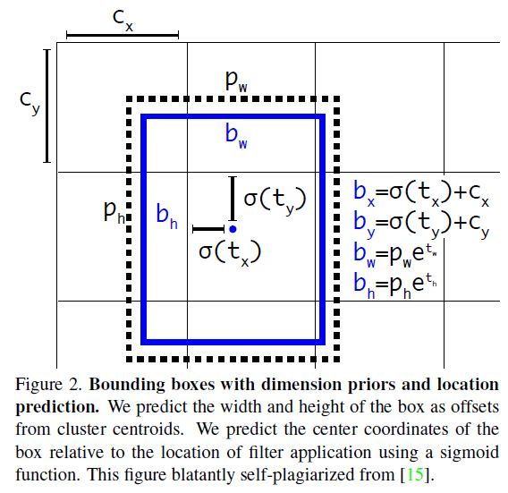
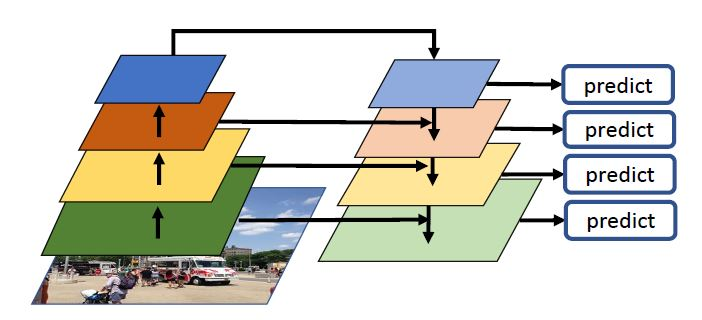
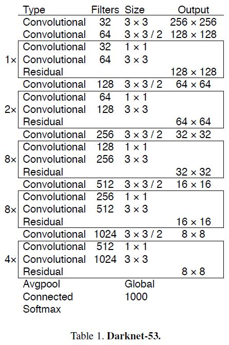
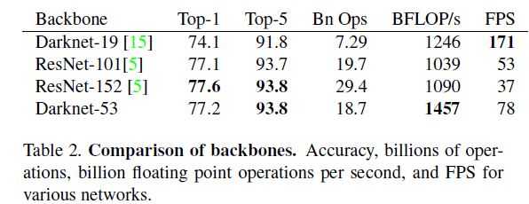
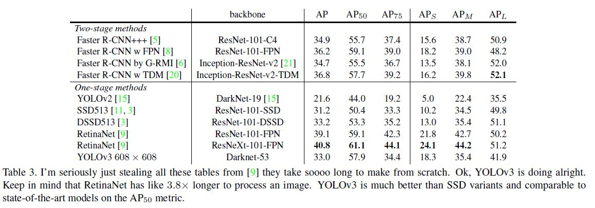
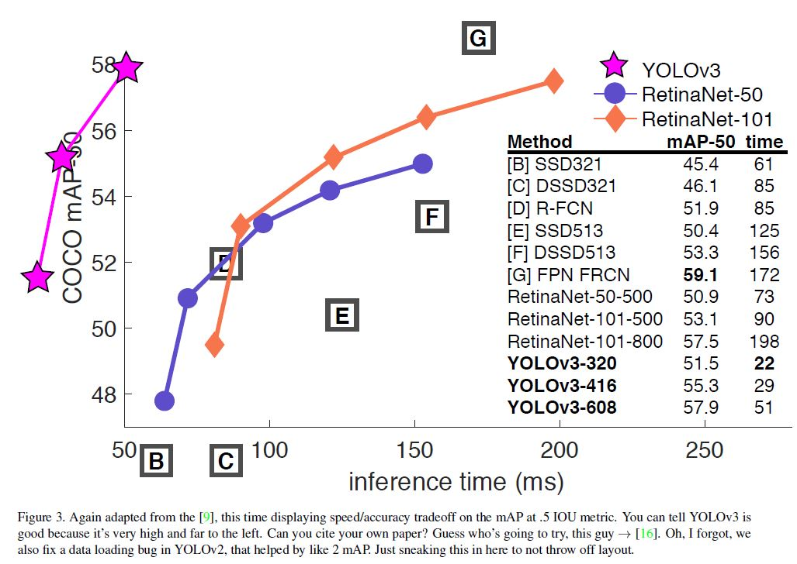
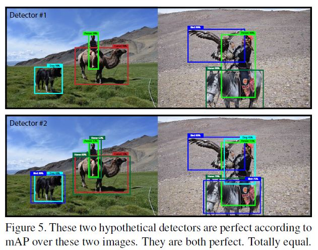

# YOLOv3: An Incremental Improvement

Joseph Redmon, Ali Farhadi(University of Washington)

## Abstract

YOLOv3는 사실 정식 Paper보다는 Tech REPORT에 가깝다. 본인들도 서론에서 그 점을 인정했다. 그래프로 싣은 것도 엄밀하지는 않고 본문 내용도 구어체를 써가며 전개했다. YOLO는 전체적으로 속도를 강점으로 삼는다. 예를 들어서 이번 YOLOv3에서는 320 x 320의 이미지에 대해서 28.2 mAP의 2ms라고 하는데 SSD와 정확도가 비슷하지만 속도는 3배 더 빠르다고 주장하고 있다. COCO의 평가기준에 의문을 제기하며 기존의 IOU Threshold .5 이상에서 평가했을 때 57.9 AP의 정확도와 51ms의 속도를 보인다고 하면서 57.5 AP의 198ms의 RetinaNet과 견줄만하다고 말했다(Titan X GPU). 

[YOLO: Real-Time Object Detection 소스코드](https://pjreddie.com/darknet/yolo/)

## Introduction

YOLOv3가 v2보다 개선된 점은 몇가지 기술적인 부분뿐이다. 여기서는 어떤 부분을 어떻게 개선했는지를 설명하고 시도는 했으나 잘 안됐던 부분도 소개했다.

## The Deal

YOLO에서 도입한 아이디어는 이곳저곳에서 가져와서 적용했다고 한다. 그리고 분류 Backbone 네트워크도 기존의 Darknet보다 더 나은 네트워크를 사용했다고 한다. 

### Bounding Box Prediction

기본적으로 YOLO9000에서의 방법을 따르기 때문에 큰 차이는 없다. Dimension cluster를 통해서 앵커 박스를 선택하고 아래와 같이 바운딩 박스의 높이, 넓이, 중심좌표를 구하기 위한 tw, th, tx, ty 값을 계산한다.

 

다만 손실 값을 구하는 과정이 좀 달라졌는데 훈련 중에 t_prediction - t_ground_truth의 L2 손실 값을 이용해서 경사 하강을 진행한다.  두 값은 위의 방정식을 역으로 하면 구할 수 있다. Objectness score(객체가 그 바운딩 박스에 있을 법한 정도)는 로지스틱 회귀 방법으로 예측을 하는데, 어떤 Prior(클러스터를 통해 미리 구해둔 K개의 바운딩 박스)가 다른 어떤 Prior보다 Ground truth와 많이 겹친다면 이 Prior에서의 Objectness score는 1이 된다. 다른 Prior 중에서 Threshold 이상으로 Ground truth가 겹친다고 하더라도 이 예측은 무시한다. 각각의 객체에 하나의 Prior를 할당하는 것 치고는 Threshold 값을 0.5 정도로 비교적 낮게 잡았다. 위에서 언급한 어떤 객체에 책임이 있지 않는 Prior 같은 경우에 손실을 계산할 때 Objectness score에서만 손실에 관여하고 좌표나 클래스 분류쪽는 관여하지 않는다. 

### Class Prediction

전 버전에서 Softmax를 사용하던 것과는 다르게 여기서는 Binary cross-entropy 손실을 사용하여 독립적인 로지스틱 분류기를 훈련시켜 클래스를 예측했다. Open Images Dataset 같이 한 바운딩 박스 내에 여러개의 클래스가 있는 경우가 있는데, 예를 들어 Woman과 Person 클래스는 완전히 상호 배타적이지는 않다. Softmax는 바운딩 박스가 정확히 한 개의 객체의 클래스만 담고 있는 것을 전제로 하기 때문에 다중레이블 분류에는 적합하지 않기 때문이다. 

### Prediction Across Scales

YOLOv3에서는 다음과 같이 3가지 다른 크기의  Feature map에서 박스를 예측한다.

이것은 아래와 같은 Feature Pyramid Network와 유사한 개념이다.

FPN에서는 각 단계마다 생성되는 특징맵을 Upsampling하여 이전 단계의 특징맵과 Concatenation을 하고 나서 예측을 진행하는데 YOLOv3에서 3가지 다른 크기의 특징맵에서 예측을 하는 방법과 동일하다.  또 기존의 특징 추출 네트워크에 여분의 컨볼루션 계층을 추가하는데 이 여분의 컨볼루션 계층이 바운딩 박스에 관한 정보(x, y, w, h), Objectness score, 클래스 확률 정보를 담고 있는 3차원 배열을 예측하게 된다. COCO에서는 80개의 클래스에 대해 예측을 진행하기 때문에 텐서(다배열)의 크기가 N x N(그리드 셀 숫자) x [3(스케일 숫자) x (4(x, y, w, h) + 1(Objectness score + 80(클래스 확률)))] 크기의 텐서가 예측 값으로 출력된다. 위의 그림처럼 한 Scale의 출력 특징맵에 대하여 그 특징맵을 Upsampling하여 그 단계의 계층보다 2 단계 전의 계층에서 추출된 특징맵을 Concatenation한다. 이렇게 하면 비교적 전 단계의 특징맵에서는 Finer-grained information(해상도가 좋아서 좀 더 세세한 정보)을, Upsampled된 특징맵에서는 Meaningful semantic information(좀 더 추상화된 상황  정보)을 얻을 수 있게 된다. 이렇게 결합한 특징맵을 바로 전에서 언급한, 추가된 여분의 컨볼루션 계층들이 처리하여 결과값을 출력한다. YOLOv3에서는 또 k-means 클러스터링으로 9개의 클래스터를 선택해서 각 Scale에 3개씩 할당한다. COCO에서는 (10x13), (16x30), (33x23), (30x61), (62x45), (59x
119), (116x90), (156x198), (373x326)의 Prior들이 사용되었다. 

### Feature Extractor

v3에서 사용된 새로운 특징 추출기는 v2에서 사용된 Darknet-19와 ResNet에서 사용된 Residual(shortcut) connection을 결합한 새로운 네트워크다. 기본적으로 1 x 1 필터와 3 x 3필터 사이즈를 가지는 컨볼루션 블럭과 Residual connection 개념을 도입해서 계층을 쌓았는데 최종적으로 53개의 컨볼루션 계층이 들어가게 되어 DarkNet-53이라고 이름 붙였다. 

(BFLOPs(Billion FLoating point Operations Per Second)란 초당 계산되는 부동소수점 연산량이다.)

각 테스트는 동일하게 환경에서 256 x 256의 이미지 사이즈로 테스트 되었고 Titan x GPU로 실행되었다.  Darknet-53의 BFLOP/s가 큰 이유는 GPU 활용을 잘 할수 있도록 설계되었기 때문이라고 한다. 저자가 말하길 ResNet은 계층수가 너무 많아 비효율적이라고 한다. 

### Training

특별히 훈련 동안에 Hard negative mining(클래스별 데이터의 숫자의 불균형 떄문에 발생하는 문제를 해결하기 위한 방법으로, Hard negative라고 하는 판별하기 쉽지 않은 False positive를 잘 판별하게 하기 위해서 그와 관련된 패치를 추가해서 이런 종류의 False positive를 잘 분간할 수 있도록 하는 방법)없이 전체 이미지를 사용했고 Multi-scale training과 Data augmentation, Batch normalization 같은 기법을 사용했다고 한다. 

## How We Do

COCO의 평가 기준(.5 Threshold부터 .95까지 점차 .5씩 Threshold 값을 높여가며 AP를 측정하여 평균을 내는 방법)으로 봤을 때는 성능이 그리 좋지 못하지만 기존의 .5 Threshold의 평가 기준으로는 높은 성능을 보였다고 한다. 다만 완벽하게 IOU가 높은 바운딩 박스를 예측하는 것에는 어려움을 겪는다고 한다. 그리고 기존의 버전들이 작은 물체를 찾는 것에 어려움을 겪었다면 v3에서는 반대로 중간이나 큰 사이즈보다 작은 사이즈의 객체를 잘 찾는다고 한다. 

## Things We Tried That Didn't Work

시도는 했으나 잘 먹히지 않았던 아이디어는 다음과 같은 것들이 있다.

- Anchor box x, y offset predictions - 선형 회귀 활성화 함수를 사용하여 박스들의 x, y 오프셋을 직접 예측하는 방법을 사용해봤지만 오히려 모델 훈련간의 안정성을 떨어트리기만 했다고 한다. 
- Linear x, y predictions instead of logistic - 로지스틱 회귀 말고 선형 회귀로 x, y 오프셋을 예측하는 방법을 사용해봤으나 오히려 mAP가 떨어졌다고 한다.
- Focal loss - (예를 들어서 배경이라는 클래스가 있다면 이 클래스의 데이터는 다른 클래스보다 숫자가 많을 것이고 배경은 잘 분류하지만 정작 객체의 클래스는 잘 분류하지 못할 것이다. 이런 배경 클래스의 데이터를 모두 버리는 것 대신에 가중치를 부여하여 손실 값을 계산할 때 중요도를 낮춘다) 이 기법을 사용했을때도 mAP가 하락했는데 저자는 YOLO가 이미 Objectness score와 Conditional class probability를 계산하기 때문에 Focal loss에서 해결하려는 문제를 애초에 반영하고 있기 때문이 아닌가 하고 추측하고 있다. 
- Dual IOU threshold and truth assignment - Fast R-CNN의 경우, 2가지 Threshold를 사용한다. IOU > .7 이상인 경우 Positive, IOU < .3 이하인 경우 Negative, .3에서 .7인 경우 모두 무시한다. 역시 YOLO에서는 만족할만한 결과를 보여주지는 않았다고 한다. 

## What This All Means

저자는 COCO의 평가 기준을 여기서 강하게 비판하고 있다. 사람의 경우도 .3 - .5 IOU의 차이를 잘 구분하지 못한다고 하면서 아래의 그림을 제시했다. 

위 그림에 따르면 밑과 위의 결과는 동일한 결과가 된다. 