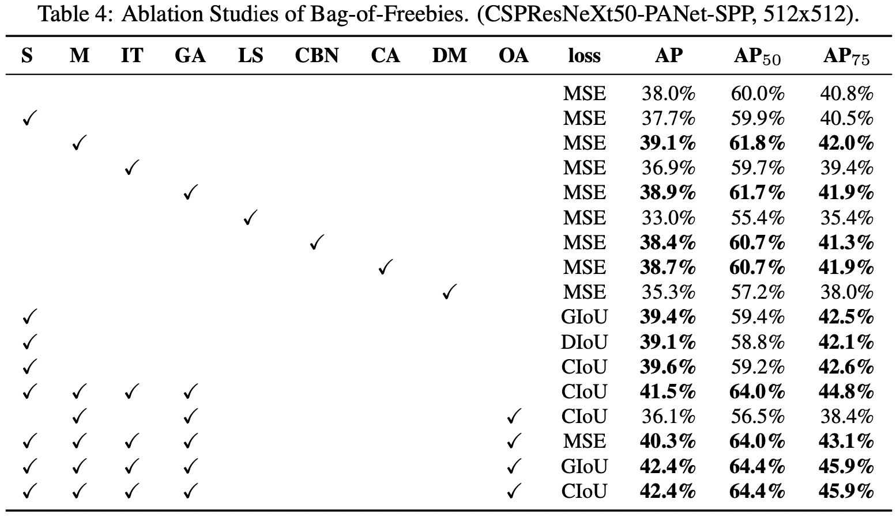

# YOLOv4: Optimal Speed and Accuracy of Object Detection

Alexey Bochkovskiy, 

Chien-Yao Wang(Institute of Information Science Academia Sinica, Taiwan),

Hong-Yuan Mark Liao(Institute of Information Science Academia Sinica, Taiwan)

## Abstract

CNN 모델의 정확도를 향상시키기위한 많은 방법들이 있지만, 대용량 데이터에서 이런 방법들의 조합을 테스트 해보는 것과 결과의 이론적 타당성이 필요하다. 실제로 몇가지 방법들은 특정 모델에서만 예외적으로 성능이 잘 나오거나 특정 문제에서만 성능이 잘 나오기도 하고 작은 용량의 데이터셋에서만 성능이 잘 나오기도 한다. 이와 반대로 Batch-nomalization, Residual-connection과 같은 몇가지 방법들은 다수의 모델이나 Task 그리고 데이터셋에서도 잘 적용될 수 있다. 저자들은 이런 기법들 중에 Weighted-Residual-Connection(WRC), Cross-Stage-Partial-connections(CSP), Cross mini-Batch Normalization(CmBN), Self-adversarial-training(SAT), Mish-activation에 관심을 보였다. 이 뿐만 아니라 Mosaic data augmentation, DropBlock regularization, CIoU loss 등에도 관심을 보였다. YOLOv4는 새로운 이론이나 기법을 연구하고 제시하기 보다는 YOLOv3에 여러 기법을 적용해서 성능을 알아본 Technical Report에 가깝다. 

## Introduction

많은 CNN 기반 Object Detection 모델들은 추천 시스템에 적용될 수 있다. 예를 들어서 비어 있는 주차장 자리를 찾는 모델은 느리지만 정확하다. 이에 반해 자동차 충돌을 경고하는 모델은 빠르지만 상대적으로 덜 정확하다. 실시간 Object Detection 모델의 정확도를 개선하게 되면 단지 힌트나 조언을 제공하는 수준에서 벗어나 인간의 개입을 줄이면서 독자적으로 어떤 프로세스를 관리하는 시스템에도 쓰일 수 있다. 통상적으로 GPU에서 실시간 Object Detector를 구동시키면 가용할만한 Cost로 많은 곳에서 모델을 쓸 수 있다. 그러나 많은 모델들이 실시간으로 동작하기는 어렵고 많은 미니 배치 사이즈로 훈련시키려면 많은 수의 GPU를 필요로 한다. 저자들은 GPU 하나에서 훈련시키고 실시간으로 동작할 수 있는 모델을 만들고자 했다. 

저자들이 말하는 이 연구의 주요 목표는 실제 Production system에서 빠르게 동작하는 Object Detection 모델을 디자인하고 병렬 컴퓨팅 연산을 최적화 하는 것이다. Figure 1과 같은 YOLO 모델을 한 대의 GPU로 훈련시킬 수 있는 방법을 고안하는 것이다. 

저자들이 말하는 이 연구의 기여하는 바는 다음과 같다. 

- 1080Ti나 2080Ti 하나의 GPU 정도만 사용해도 강력하고 효율적인 Object Detection 모델을 만드는 방법 제시
- Detection 모델을 훈련 시키는 동안 그 동안 알려져 있던 Bag-of-Freebies나 Bag-of-Specials 기법들의 영향력을 조사
- CBN, PAN, SAM과 같은 방법들을 단일 GPU에서 훈련시킬 수 있도록 변경

## Related work

### Object detection models

Object detection 네트워크는 보통 두 부분으로 나뉜다. 한 부분은 ImageNet에서 미리 훈련시킨 Backbone이고 다른 한 부분은 객체를 둘러싼 바운딩 박스와 관련된 값과 객체의 클래스를 예측하는 Head이다. 

- GPU platform backbone: VGG, ResNet, ResNeXt, DenseNet
- CPU platform backbone: SqueezeNet, MobileNet, ShuffleNet 

Head와 관련해서는 One-stage, Two-stage detector로 두 가지 범주로 나눌 수 있다. 가장 많이 알려져 있는 Two-stage detector는 R-CNN 계열로 Fast R-CNN, Faster R-CNN, R-FCN, Libra R-CNN을 포함한다. Anchor 없이 동작하는 Two-stage detector로는 RepPoints가 있다. One-stgae detector에서 유명한 것은 YOLO, SSD, RetinaNet이 있다. 또한 Anchor 없이 동작하는 One-stage detector로는 CenterNet, CornerNet, FCOS이 있다. 

Backbone과 Head 사이에 몇 가지 계층을 집어넣어 Detector를 발전시키기도 했다. 이 계층들의 역할은 주로 각기 다른 Stage에서 Feature map을 모으는 것이다. 저자들은 이 계층들을 Detector의 Neck이라고 부불렀다. Neck들은 주로 몇몇의 Bottom-up 경로와 Top-down 경로로 구성되었다. 이런 매커니즘이 결합된 네트워크로는 Feature Pyramid Network(FPN), Path Aggregation Network(PAN), BiFPN, NAS-FPN이 있다. 

위와 같은 관점 말고도 어떤 연구자들은 아예 Object detection을 위한 새로운 Backbone을 쌓는데 중점을 두거나(DetNet, DetNAS) 모델 전체를 새로 쌓는데 중점을 주었다(SpineNet, HitDector)

요약하자면 보통의 Object detector는 다음과 같이 구성되어 있다. 

### Bag of freebies

보통 Object detector 알고리즘은 실질적으로 사용되기 전에 구축되고 훈련된다. 그래서 연구자들은 ';' 훈련 방법으로 추론 Cost는 늘리지 않으면서 정확도가 높은 모델을 개발하려고 한다. 저자들은 이런 훈련 전략이나 훈련 Cost만 영향을 끼치는 방법을 Bag of freebies라고 불렀다. 이 Bog of freebies에 포함되는 기법 중 하나가 Data augmentation이다. Data augmentation은 입력 이미지의 변동성을 증가시켜서 모델이 다양한 환경에서 획득된 이미지에 대해 작업을 잘 수행할 수 있도록 하는 것이 목적이다. 

몇몇 연구자들은 객체의 Occlusion 문제를 다루기 위해서 Data augmentation을 사용했다. 예를 들어서 Random erase, CutOut, hide-and-seek, grid mask, Dropout, DropConnedt, DropBlock, MixUp, CutMix, style transfer GAN 등이 있다. 

또 어떤 연구에서는 Bag of freebies 기법들을 데이터셋에서 Semantic distribution적으로 편향을 보이는 문제에 적용하기도 했다. 예를 들어서 클래스 불균형 문제에서는 Hard negative example mining, Online hard example mining이 Two-stage object detection 계열에 적용되었다. 

그러나 이런 Example mining 기법들은 One-stage 계열에는 쓰일 수 없다. 왜냐하면 Two-stage 계열과는 달리 이미지 내 모든 지역들을 다 살펴보기 때문이다. Lin등은 Focal loss를 제안해서 데이터 클래스 간의 불균형 문제를 해결하고자 했다. 

다른 중요한 이슈는 각 카테고리 간의 연관 정도를 원-핫 방식으로 표현하기 어렵다는 것이다. 특히 레이블링을 수행할때 이런 방식이 자주 쓰인다. Label smoothing이나 Islam 등의 연구가 이를 다룬다. 

저자들이 소개하는 마지막 Bag of freebies는 Bounding box regression의 Objective function이다. 보통의 BBox regression의 경우 BBox의 중심 좌표, 너비, 높이 값을 직접 예측하거나 이 값들의 Offset을 regression으로 알아내는 방식으로 진행되는데 문제는 이 값들을 따로 따로 regression을 수행하기 때문에 객체 자체의 통합성에 대해서는 고려하지 않는다는 점이다. 이를 극복하기 위해서 몇 연구들은 IoU loss라는 개념을 제안했다. GIoU loss, DIoU, CIoU을 참고. 

### Bag of specials

저자들은 추론 Cost를 약간 증가시키면서 모델의 정확도를 상당히 개선시키는 Plugin 모듈이나 후처리 방법을 Bag of spcials라고 불렀다. 여기에는 모델 안의 어떤 속성을 강화시키는 모듈이 포함되는데 예를 들어 Receptive field의 크기를 키우거나 Attention mechanism을 도입하거나 Feature integration capability를 강화시키는 것들이 있다. Post-processing은 모델 예측 결과를 보여주는 것과 관련있는 방법이다. 

Receptive field를 키우는 것과 관련된 모듈은 SPP, ASPP, RFB가 있다. 

Object Detection에서 적용되는 Attention module은 크게 Channel-wise attention, Point-wise attention로 나눌 수 있는데 각각의 대표 기법으로는 Squeeze-and-Excitation(SE), Spatial Attention Module(SAM)이 있다. 

Feature integration에 관해서는 Skip connection, Hyper-column, FPN, SFAM, ASFF, BiFPN이 있다.

딥러닝 분야에서 어떤 연구자들은 좋은 성능을 내는데 도움이 되는 Activation function을 찾는데 초점을 뒀다. 여기에는 ReLU, LReLU, PReLU, ReLU6, Scaled Exponential Linear Unit(SELU), Swish, Hard-Swish, Mish가 있다. 

딥러닝 기반의 Object detection에서 주로 쓰이는 Post-processing 기법은 NMS이다. Girshick등이 제안한 Greedy NMS, Soft NMS, DIoU NMS이 있다. Anchor가 없는 Object detection에서는 Post-processing 기법이 적용되지 않는다.  

## Methodology

본 연구의 기본 목적은 낮은 연산량보다는 실제 Production 시스템에서 빠르게 동작하는 모델을 만드는데 이를 병렬 컴퓨팅을 최적화 하는 것으로 달성하는 것이다. 저자들은 두 가지 실시간 모델 옵션을 고려했다. 

- GPU에 관해서는 컨볼루션 그룹을 적게 사용(1-8 그룹): CSPResNeXt50/CSPDarknet53
- VPU에 관해서는 그룹 컨볼부션을 사용하되 Squeeze-and-excitement 블럭을 사용하는 것을 삼감: EfficientNet-lite/MixNet/GhostNet/MobileNetV3

### Selection of architecture

이 연구의 목표는 다음의 요소들의 최적의 균형점을 찾는 것이다. 네트워크 입력 해상도, 컨볼루션 계층의 숫자, 파라미터 숫자(필터 크기의 제곱 * 필터의 숫자 * 채널/그룹 숫자), 출력 계층의 숫자(필터의 숫자). 예를 들어서 CSPResNext50은 CSPDarknet53보다 ImageNet 데이터셋에서의 Classification에서 더 좋은 성능을 보이고 반대의 경우 MS COCO 데이터셋에서 Object detection에서 더 좋은 성능을 보인다. 

그 다음 목표는 Receptive field의 크기를 넓히기 위한 추가적인 블럭을 선택하는 것과 각기 다른 Detector 단계에 대해서 각기 다른 Backbone 단계에서의 파라미터를 집계하기 위한 최적의 방법을 선택하는 것이다(FPN, PAN, ASFF, BiFPN).

Classification에서의 최적의 모델이 꼭 Object detection에서 최적이라는 법은 없다. Classifier와는 대조적으로 Detector는 다음을 요구한다. 

- 높은 네트워크 입력 크기(해상도) - 다양한 크기의 작은 객체를 탐지하기 위해서
- 더 많은 계층 수 - 더 넓은 Receptive field가 증가된 네트워크 입력 크기를 커버하기 위해서
- 더 많은 파라미터 수 - 이미지 내에 각기 다른 크기의 여러 객체를 탐지하기 위해서

이론적으로 생각하자면 더 넓은 Receptive field 크기(3x3 이상의 컨볼루션 계층)와 더 많은 수의 파라미터를 가진 모델이 Backbone으로 선택되어야 할 것처럼 보인다. 

각각 다른 크기의 Receptive field의 영향력을 요약하자면 아래와 같다.

- 객체 크기 - 모델이 객체 전체를 볼 수 있게 함.
- 네트워크 크기 - 모델이 객체 주변의 Context 정보를 볼 수 있게 함.
- 네트워크 크기를 넘었을때 - 이미지 포인트와 최종 Activation 사이의 연결 경로 숫자를 증가시킴.

저자들은 CSPDarknet53위에 SPP 블럭을 더했다. 이 모델은 Receptive field의 크기를 상당히 증가시키고가장 중요한 Context feature를 분리시키면서도 네트워크 작동 속도를 거의 감소시키지 않는다. 저자들은 Backbone에서의 각 Feature들을 모으는 방법으로 PANet을 적용했다(YOLOv3로 FPN을 적용한 것과는 대조적으로).

그래서 YOLOv4의 아키텍처는 다음과 같다. CSPDarknet53 Backbone, SPP 모듈, PANet path-aggregation neck, YOLOv3 head

저자들은 Cross-GPU Batch normalization(CGBN 혹은 SyncBN) 이나 특별히 고가의 장비를 사용하지 않았는데 그 이유는 저자들의 목적이 누구나 GTX 1080Ti 혹은 RTX 2080Ti 같은 장비로 저자들의 방법을 구현할 수 있게 하는 것이기 때문이다. 

### Selection of BoF and BoS 

Object Detection 훈련 과정에서 성능을 높이기 위해서 보통 다음과 같은 기법들을 적용한다. 

#### 

PReLU 그리고 SELU는 훈련시키기 어렵기 때문에, ReLU6는 양자화 네트워크에 특화되어있기 때문에 저자들은 이 Activation들은 위의 리스트에서 제거했다. Regularization에서는 DropBlock 논문을 발표한 저자들이 논문에서 다른 기법들과 본인들의 기법을 비교해서 우위에 있다는 것을 발표했다. 그래서 저자들은 DropBlock을 저자들의 Regularization으로 채택했다. Normalization에서 대해서는 하나의 GPU 만을 사용하기 때문에 SyncBN은 고려하지 않았다. 

### Additional improvements

하나의 GPU에서 훈련시키기 적합한 모델을 디자인 하기 위해서 저자들은 추가적인 디자인 옵션을 적용했다. 

- 새로운 Data augmentation 기법인 Mosaic과 Self-Adversarial Training(SAT)
- Genetic 알고리즘을 적용하여 최적의 하이퍼 파라미터 선택
- 몇 가지 기법들을 저자들의 목적에 맞게 변경 - 변경된 SAM, PAN, Cross mini-Batch Normalization

Mosaic은 4개의 훈련 이미지를 섞는 방식의 새로운 Data augementation 기법이다. 4개의 서로 다른 Context 정보를 가진 이미지가 섞이기 때문에 객체를 찾는 것을 이 Context를 고려하지 않고 수행할 수 있게 된다. 게다가 각 계층의 BN에서 4개의 다른 이미지로부터 Activation 통계값을 계산한다. 이것은 큰 미니 배치 사이즈의 필요성을 둔화시킨다. 

Self-Adversarial Training(SAT)는 2번째 순전파 단계에서 작동하는 새로운 Data augmentation 기법이다. 1번째 순전파-역전파 단계에서 네트워크는 네트워크의 가중치 대신에 원본 이미지를 수정해버린다. 이는 네트워크가 스스로에게 Adversarial attack을 가하는 셈인데 원본 이미지를 수정함으로써 입력 이미지 내에 찾고자 하는 대상이 없는 것처럼 결과를 만든다. 두 번째 단계에서는 네트워크가 이 수정된 이미지를 원래의 방법대로 찾는 방식으로 훈련이 수행된다. 

CmBN은 CBN의 수정된 버전으로 아래 그림과 같다. 

이 방법을 적용하면 단일의 하나의 배치 안에서의 여러 미니 배치들 사이의 통계값만 모은다. 

저자들은 SAM을 Spatial-wise attention에서 Point-wise attention으로 바꿈으로서 수정했고 PAN에서의 Shortcut connection을 모두 Concatenation으로 교체했다. 이는 아래의 Figure 5, 6와 같다. 

### YOLOv4

종합적으로 YOLOv4라고 하는 것은 다음과 같다.

## Experiments

저자들은 훈련을 개선시키는 여러 기술들을 Classification은 ImageNet 데이터셋으로, Detection은 MS COCO 데이터 셋으로 (정확도 면에서) 검증했다.

### Experimental setup

Classification과 Detection에 관한 셋팅은 본문 참고.

### Influence of different features on Classifier training

먼저 저자들은 Classification 훈련에 적용되는 여러 기법들의 영향력을 알아봤다. 구첵적으로 Class label smoothing, 아래 그림과 같은 여러 Data augmentation 기법들 그리고 여러 Activation function들의 영향력을 알아봤다. 

실험 결과 아래 테이블과 같이 여러 기법들을 도입했을때 Classification 정확도가 증가했다. 

결과적으로 Classification을 위한 BoF Backbone에서는 다음과 같은 기법들을 포함한다. CutMix, Mosaic data augmentation, Class label smoothing. 여기에 Mish activation을 옵션으로 한다.

### Influence of different features on Detector training

Detection 훈련 정확도와 관련된 BoF 기법들에 대한 실험 결과는 Table 4와 같다. 저자들은 FPS에는 영향을 끼치지 않으면서 Detection 정확도를 개선시키는 여러 BoF 기법들을 적용해봤다. 

- S: Grid에 민감한 식인 bx = σ(tx)  + cx, by = σ(ty) + cy를 제거했다. 그렇기 때문에 극도로 높은 tx 절대값이 cx나 cx+1 값에 근접하는 bx 값을 위해 필요하게 되었다. 저자들은 이 문제를 해결하기 위해서 시그모이드 값이 1.0을 넘어서는 값을 곱했다. 그래서 객체가 탐지될수 없는 Grid의 영향을 제거했다. 
- M: Mosaic data augmentation: 훈련 간에 하나의 이미지 보다는 4개의 이미지를 Mosaic 처리해서 사용했다. 
- IT: 특정 GT와 IoU값이 Threshold보다 넘는 여러 Anchor들을 사용했다.
- GA: 전체 시간의 첫 10% 정도를 최적의 네트워크 훈련 하이퍼파라미터를 유전 알고리즘을 적용하여 찾아냈다.
- LS: Sigmmoid activation에 Class label smoothing을 적용했다. 
- CBN: 하나의 단일한 미니 배치 단위의 통계값을 모으기 보다는 전체 배치의 통계값을 모으기 위해서 Cross mini-Batch Normalization을 사용했다.
- DM: Random training shapes을 사용해서 작은 해상도의 이미지로 훈련 하는 중에 자동적으로 mini-batch 크기가 증가되도록 했다.
- OA: 512x512짜리 해상도의 이미지로 훈련시키기 위해서 이에 최적화된 Anchor를 사용했다. 
- GIoU, CIoU, DIoU, MSE: 바운딩 박스 회귀를 위해서 서로 다른 Loss 알고리즘을 적용했다. 

BoS-Detector와 관련되 실험 결과는 Table 5와 같다. 저자들의 실험에서는 SPP, PAN, SAM을 적용했을때 성능이 제일 좋았다.

### Influence of different backbones and pre-trained weightings on Detector training

Detection에서 여러 Backbone 모델에 대한 영향력을 실험한 결과는 Table 6와 같다. 저자들이 실험을 통해서 알아낸 것은 Classification의 최상 조건이 꼭 Detection에서 최상의 결과를 만들어 내지는 않는다는 점이다.

먼저 CSPResNeXt-50 모델이 CSPDarknet53 모델과 비교했을때 Classification에서는 더 나은 성능을 보였지만 반대로 Object detection에서는 성능이 상대적으로 안 좋았다. 

다음으로 CSPResNeXt50 Classification 모델에 BoF와 Mish를 적용했을때 훈련 정확도가 개선되었지만 Classification으로 훈련시킨 가중치로 Detection에 적용했을때 정확도는 오히려 떨어졌다. 그러나 CSPDarknet53 모델은 두 Task에서 정확도가 올라갔다. 이 결과로 CSPDarknet53이 Detection에서는 더 안정적이라고 저자들은 결론지었다. 

### Influence of different mini-batch size on Detector for training

저자들은 마지막으로 Mini-batch 크기를 다르게 했을 결과를 비교했다. 

저자들이 알아낸 사실은 BoF와 BoS 훈련 기법들을 적용하고나서 Mini-batch 크기는 거의 Detector의 성능에는 영향을 끼치지 않는다는 사실이다. 저자들은 이 사실이 BoF, BoS를 도입하면 굳이 비싼 고가의 GPU를 훈련에 사용할 필요가 없다는 것을 보여준다고 주장한다. 다른 말로 보편적으로 사용하는 GPU로 누구나 좋은 성능을 가진 모델을 만들어 낼 수 있다고 한다. 

## Results

Figure 8은 여러 Object detection과의 성능 비교를 한 것이다. (본문 참고)

## Conclusions

저자들은 보편적으로 사용되는 GPU에서 충분히 빠르고 정확한 Object detection 모델을 만들어 낼 수 있음을 보여줬다고 주장한다. 

